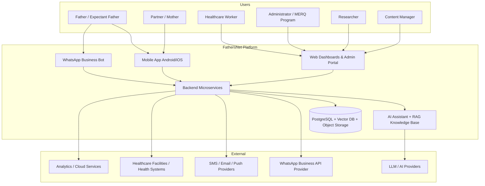
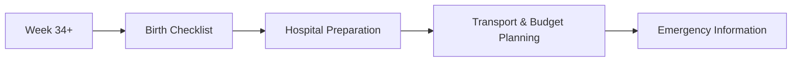
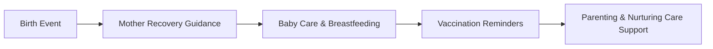
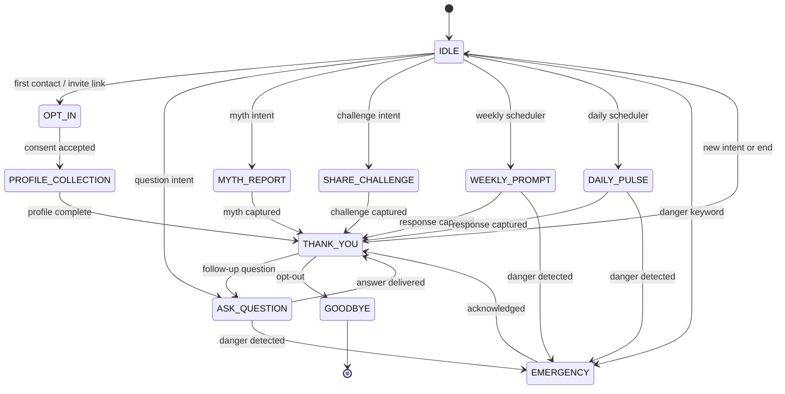
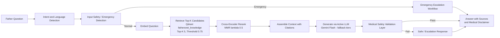
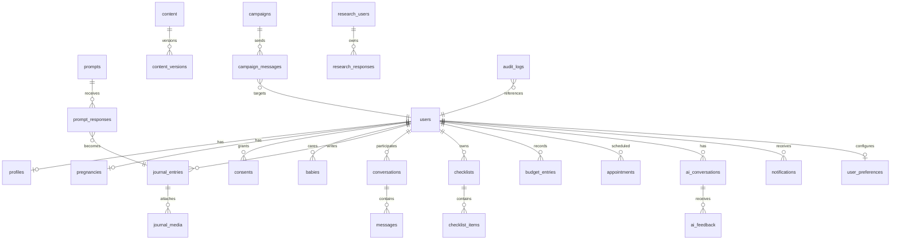
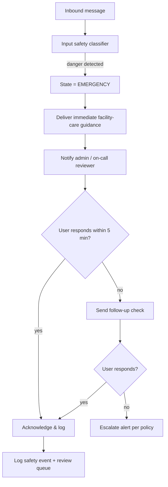
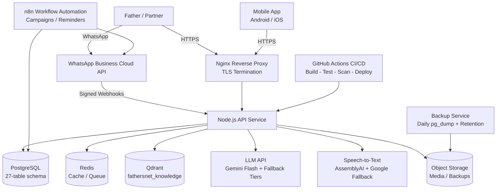

# FathersNet (Ayay) Complete Software Requirements Specification

**Document Title:** FathersNet (Ayay) — Complete Software Requirements Specification and Technical System Specification

**Document Identifier:** FN-SRS-001

**Version:** 2.0

**Date Generated:** 2026-08-04

**Status:** Approved for Development Baseline

**Owner:** MERQ (Maternal, Reproductive & Quality of Care) / Ayay App Program

---

# 1. Document Overview

## 1.1 Purpose

This document is the complete, self-contained Software Requirements Specification (SRS) and Technical System Specification for **FathersNet**, a digital fatherhood and family-health ecosystem whose working brand name is **Ayay**. It consolidates every business requirement, user requirement, functional requirement, non-functional requirement, architectural decision, integration specification, security control, database design, deployment model, testing strategy, and operational policy for the platform into a single authoritative reference.

This document is written so that it may be handed to any engineer, product manager, healthcare partner, government agency, NGO, researcher, investor, or security reviewer without requiring access to any other project file. All requirements, decisions, workflows, configurations, and specifications are defined directly in this document.

## 1.2 Scope

The platform enables expectant and new fathers to become active, informed, and confident partners throughout pregnancy, labor and birth, and early childhood. The in-scope system includes:

- A mobile application (Android-first, iOS supported).
- A WhatsApp conversational channel with an automated engagement bot.
- A web administration portal with dashboards, content management, campaign management, and research tools.
- An AI assistant grounded in an approved knowledge base using Retrieval-Augmented Generation (RAG).
- A research and evidence-generation platform with anonymized data collection and analytics.
- Educational content, reminder systems, a personal father diary, and birth-preparation tooling (checklists and budget tracking).

Out-of-scope items (community forum, healthcare interoperability, payments, wearables, multi-country expansion) are documented as explicitly deferred phases in Section 2.8.2.

## 1.3 Audience

This document serves:

| Audience                 | Primary Use                                                                          |
| ------------------------ | ------------------------------------------------------------------------------------ |
| Software engineers       | Implementation of API, database, mobile, WhatsApp, AI, and infrastructure components |
| Product managers         | Requirements baseline, prioritization, roadmap decisions                             |
| Healthcare organizations | Clinical safety review, content validation, integration planning                     |
| Government partners      | Digital-health program review, regulatory alignment                                  |
| NGOs                     | Program planning, funding decisions, impact assessment                               |
| Researchers              | Research design, ethics review, dataset and publication processes                    |
| Investors                | Feasibility, cost model, KPIs, risk assessment                                       |
| Security reviewers       | Threat model, security controls, compliance readiness                                |

## 1.4 Document Structure

| #   | Section                                        | Content                                                                                                               |
| --- | ---------------------------------------------- | --------------------------------------------------------------------------------------------------------------------- |
| 1   | Document Overview                              | Purpose, scope, audience, conventions, assumptions                                                                    |
| 2   | System Vision and Objectives                   | Product definition, goals, scope, metrics                                                                             |
| 3   | Stakeholders                                   | Stakeholder register and personas                                                                                     |
| 4   | Functional Requirements                        | Full functional requirements (FR-001…FR-170)                                                                          |
| 5   | Non-Functional Requirements                    | Performance, availability, security, usability (NFR-001…NFR-050)                                                      |
| 6   | User Journeys                                  | End-to-end journey maps and flows                                                                                     |
| 7   | WhatsApp Conversational Platform Specification | State machine, templates, webhooks, media, messaging controls                                                         |
| 8   | Mobile Application Specification               | Hospital bag, budget tracker, partner sync, offline, reminders                                                        |
| 9   | AI Assistant and RAG Specification             | Ingestion, vector store, retrieval, system prompt, emergency handling, voice, model fallback                          |
| 10  | Research Platform Specification                | Data collection, theme extraction, research schema                                                                    |
| 11  | Admin Dashboard Specification                  | Dashboard views and management functions                                                                              |
| 12  | API Specification                              | Full API contracts for all service groups                                                                             |
| 13  | Database Specification                         | ER diagram, 27 tables, SQL                                                                                            |
| 14  | Security and Privacy Specification             | Threat model, encryption, access control, data protection                                                             |
| 15  | Architecture Specification                     | System architecture, ADRs, authentication, AI governance                                                              |
| 16  | Deployment Specification                       | Docker Compose, CI/CD, scalability                                                                                    |
| 17  | Testing Specification                          | Unit, integration, E2E, test data                                                                                     |
| 18  | Monitoring and Operations                      | Observability, support, maintenance                                                                                   |
| 19  | Disaster Recovery                              | Backup, RPO/RTO, restore                                                                                              |
| 20  | Appendices                                     | Glossary, traceability, cost model, roadmap, team, KPIs, risk register, compliance, content strategy, product roadmap |

## 1.5 Conventions & Requirement Identifiers

Every requirement carries a globally unique identifier used for traceability, testing, and change management.

| Prefix    | Domain                        | Format                |
| --------- | ----------------------------- | --------------------- |
| `FR-###`  | Functional Requirement        | `FR-001`, `FR-002`, … |
| `NFR-###` | Non-Functional Requirement    | `NFR-001`, …          |
| `OR-###`  | Operational Requirement       | `OR-001`, …           |
| `QR-###`  | Quality / Testing Requirement | `QR-001`, …           |
| `US-###`  | User Story                    | `US-001`, …           |
| `UC-###`  | Use Case                      | `UC-001`, …           |
| `PD-###`  | Product Definition Statement  | `PD-001`, …           |
| `UR-###`  | User Requirement              | `UR-001`, …           |
| `AR-###`  | Architecture Requirement      | `AR-001`, …           |
| `ADR-###` | Architecture Decision Record  | `ADR-001`, …          |

## 1.6 Priority Definitions (MoSCoW)

| Priority            | Label        | Meaning                                                            |
| ------------------- | ------------ | ------------------------------------------------------------------ |
| **Must Have (M)**   | Critical     | Required for MVP / pilot launch. Absence blocks launch.            |
| **Should Have (S)** | High         | Important for pilot success; included where feasible.              |
| **Could Have (C)**  | Nice-to-have | Desirable within 12 months; deferred if resources are constrained. |
| **Won't Have (W)**  | Deferred     | Deliberately out of scope for the pilot; planned for later phases. |

## 1.7 Status Definitions

| Status          | Meaning                             |
| --------------- | ----------------------------------- |
| Proposed        | Drafted; not yet approved           |
| Approved        | Baselined; approved for development |
| In Development  | Being implemented                   |
| In Verification | Being tested / validated            |
| Deferred        | Moved to a later phase              |

## 1.8 Classification of Content

Throughout this document, every statement is classified so that readers can distinguish binding business requirements from engineering recommendations and environment-dependent values.

### 1.8.1 Confirmed Requirements

Statements of what the system **must provide** from a business, healthcare, user, or operational perspective. These are binding and must be satisfied.

_Example:_ "The system shall provide WhatsApp-based father engagement."

### 1.8.2 Recommended Reference Architecture

Technical implementation approaches that satisfy one or more confirmed requirements. They are **recommendations** and may be replaced after engineering evaluation with an equivalent that still satisfies the confirmed requirement.

_Example:_ "Recommended implementation: Qdrant vector database with PostgreSQL backend."

### 1.8.3 Configurable Parameters

Values that may change depending on deployment environment, cost constraints, or platform terms. Every configurable value is explicitly marked **configurable** and is assigned a sensible default for the pilot.

_Example:_ "AI model timeout: configurable, default 5 seconds."

Classification labels used inline: **(Confirmed)**, **(Recommended)**, **(Configurable)**.

## 1.9 Assumptions and Constraints

Where information was not explicitly defined, it is documented here rather than invented. Each item is classified.

### Assumptions

| #    | Assumption                                                                                                                                                                                                                                                                                                          | Classification |
| ---- | ------------------------------------------------------------------------------------------------------------------------------------------------------------------------------------------------------------------------------------------------------------------------------------------------------------------- | -------------- |
| A-01 | The pilot operates in Ethiopia with English and Amharic as the initial languages.                                                                                                                                                                                                                                   | Confirmed      |
| A-02 | A meaningful proportion of pilot fathers access the service through WhatsApp and/or low- to mid-range Android devices; connectivity may be intermittent.                                                                                                                                                            | Confirmed      |
| A-03 | An approved large-language-model provider and a WhatsApp Business API provider are available within cost constraints.                                                                                                                                                                                               | Confirmed      |
| A-04 | The authoritative, clinician-reviewed business content (welcome message; pregnancy journey including antenatal-care visits and appointment schedule; labor and birth guidance; first-years postnatal care) remains the primary knowledge foundation and is version-controlled and clinically reviewed when updated. | Confirmed      |
| A-05 | Pilot enrollment is targeted at a founding cohort of expectant fathers; the number is configurable and is not a guaranteed commitment.                                                                                                                                                                              | Configurable   |
| A-06 | A meaningful share of fathers can use voice notes and low-literacy-friendly interaction patterns.                                                                                                                                                                                                                   | Confirmed      |
| A-07 | Cost control on AI token usage and messaging volume is a program priority.                                                                                                                                                                                                                                          | Confirmed      |

### Dependencies

| #    | Dependency                                                                        | Classification |
| ---- | --------------------------------------------------------------------------------- | -------------- |
| D-01 | WhatsApp Business API availability and policy acceptance in the Ethiopian market. | Confirmed      |
| D-02 | LLM and embedding provider availability, cost, and compliance.                    | Confirmed      |
| D-03 | Cloud platform regional availability (compute, database, storage).                | Confirmed      |
| D-04 | Clinical/medical review of content and AI responses.                              | Confirmed      |
| D-05 | Research ethics approval for research data use.                                   | Confirmed      |
| D-06 | Voice transcription and translation service availability for English and Amharic. | Recommended    |

### Constraints

| #    | Constraint                                                                               | Classification |
| ---- | ---------------------------------------------------------------------------------------- | -------------- |
| C-01 | Healthcare safety: the AI must not diagnose, prescribe, or replace healthcare providers. | Confirmed      |
| C-02 | Privacy-by-design and data minimization are mandatory.                                   | Confirmed      |
| C-03 | Cost control on AI tokens and messaging volume.                                          | Confirmed      |
| C-04 | Accessibility for low-literacy and first-time smartphone users.                          | Confirmed      |
| C-05 | Offline-first behavior for low-connectivity environments for defined content.            | Confirmed      |
| C-06 | WhatsApp Business Platform policy compliance (consent, templates, opt-in, no spam).      | Confirmed      |
| C-07 | Research data must be anonymized/pseudonymized and subject to research consent.          | Confirmed      |

## 1.10 Healthcare Claims Policy

This document does **not** claim compliance with or certification under any specific healthcare regulation (for example, HIPAA, GDPR, or any national healthcare certification) unless such certification is explicitly confirmed by the governing program. Where regulatory alignment is intended, the wording used is **"designed to support alignment with applicable regulations."** All health-related content and AI outputs are subject to clinical review, and all emergency handling routes to facility-based care.

## 1.11 Accuracy and Uncertainty Management

Where exact information is unavailable, this document does not fabricate implementation details. Items are labeled **Recommended Reference Architecture** or **Configurable Parameters** with reasonable defaults, and uncertainty is preserved rather than inventing facts. Costs, timelines, staffing, and KPIs are reference models and are never presented as guaranteed commitments.

---

# 2. System Vision and Objectives

## 2.1 Product Overview

FathersNet (working brand name: **Ayay**) is a digital fatherhood and family-health ecosystem that empowers expectant and new fathers to become active, informed, and confident partners throughout pregnancy, labor and birth, and early childhood. It is being developed under the **MERQ (Maternal, Reproductive & Quality of Care)** program and is designed for Ethiopian and, later, regional and global communities.

The platform combines a mobile application, a WhatsApp conversational channel, a web administration/analytics portal, an AI fatherhood assistant, educational content, reminder systems, a personal father diary, birth-preparation tools, community features (later phases), and a research/evidence-generation platform.

## 2.2 System Context Diagram



## 2.3 Vision

**PD-001 — Vision Statement (Must Have).** To improve maternal, newborn, and child health by actively involving fathers throughout pregnancy, labor, postpartum, and early childhood through evidence-based digital guidance, reminders, AI assistance, education, and community support.

## 2.4 Mission

**PD-002 — Mission Statement (Must Have).** To provide every expectant and new father with a trusted digital companion that delivers culturally appropriate, medically responsible, and practically actionable support — enabling him to show up, be present, and take an active role in his family's health journey.

## 2.5 Problem Statement

**PD-003 — Problem Statement (Must Have).** In many communities — including Ethiopia — fathers are often excluded from or under-supported during the pregnancy, birth, and early-parenting journey, even though their involvement measurably improves maternal, newborn, and child health outcomes. Fathers face a combination of:

1. **Lack of father-centric knowledge** — education is designed for mothers, leaving fathers unsure how to help.
2. **Misinformation and cultural myths** — unverified advice and traditional beliefs (e.g., pregnancy myths) can lead to harmful practices or delayed care.
3. **Emotional and practical unpreparedness** — fathers are not coached on labor support, birth preparedness, budgeting, or postnatal care.
4. **Low engagement with health facilities** — fathers do not accompany partners to antenatal-care visits or learn danger signs.
5. **Limited evidence** — there is little structured research on father engagement in digital health in the target context.

FathersNet addresses these problems through accessible mobile and WhatsApp experiences, a grounded AI assistant, education derived from the authoritative program guide, reminders, journaling, birth-preparation tooling, community (later phases), and a research platform that turns real father experiences into evidence.

## 2.6 Goals & Objectives

| ID         | Objective                                                | Measurable Success Indicator                                                                                     | Priority    |
| ---------- | -------------------------------------------------------- | ---------------------------------------------------------------------------------------------------------------- | ----------- |
| **PD-004** | Increase father involvement in pregnancy support         | ≥ 60% of enrolled fathers complete at least one partner-support action per week during pilot                     | Must Have   |
| **PD-005** | Improve father knowledge and confidence                  | Demonstrated pre/post knowledge improvement in pilot assessments                                                 | Must Have   |
| **PD-006** | Reduce misinformation exposure                           | AI myth-handling and FAQ coverage of top reported myths                                                          | Must Have   |
| **PD-007** | Support antenatal-care attendance and birth preparedness | Antenatal-support and birth-preparation checklist completion tracked per father                                  | Must Have   |
| **PD-008** | Capture authentic father experiences for research        | Structured collection of journals, weekly prompts, voice notes, and myth reports from the founding-father cohort | Must Have   |
| **PD-009** | Generate research-grade evidence                         | Anonymized datasets, dashboards, impact reports, and publication workflow                                        | Should Have |
| **PD-010** | Build a scalable national digital fatherhood platform    | Architecture ready for regional and national expansion (pilot → regional → national)                             | Should Have |

## 2.7 Program & Business Context

- **Owning Organization:** MERQ (Maternal, Reproductive & Quality of Care program) — the entity sponsoring and operating the FathersNet / Ayay initiative.
- **Program Anchor:** The initiative is driven by program leadership with a founding cohort of expectant fathers as the pilot (pilot size configurable).
- **Product Branding:** FathersNet (working name Ayay); the WhatsApp bot persona is referenced as **"Ayay"**.
- **Relationship to the Authoritative Guide:** The program maintains a clinician-reviewed business guide (_FathersNet: Your Guide to Supporting Your Family_) as the primary knowledge foundation. All educational content, AI grounding, reminder content, and danger-sign workflows must trace to this guide and to subsequently approved content.
- **Pilot Scale:** A founding cohort of expectant fathers (configurable), designed to scale to thousands and eventually millions of users.
- **Operating Environment:** Ethiopia first, with regional expansion (East Africa) and international fatherhood initiatives in later phases. Connectivity, literacy, language, and device diversity are first-class design constraints.

## 2.8 Product Scope

### 2.8.1 In Scope (MVP + Pilot)

The minimum viable product (MVP) must support the pilot and includes at minimum:

| #   | Capability Area                      | MVP Inclusions                                                                                                                                   |
| --- | ------------------------------------ | ------------------------------------------------------------------------------------------------------------------------------------------------ |
| 1   | **Father Registration**              | Phone signup, profile creation, consent collection, pregnancy information capture                                                                |
| 2   | **WhatsApp Enrollment & Engagement** | Invite link, opt-in flow, welcome flow, weekly father prompts, daily pulse, myth collection, voice notes, photo submissions, broadcast campaigns |
| 3   | **Pregnancy Journey**                | Week-by-week tracking, milestones, educational cards, father support actions                                                                     |
| 4   | **Father Diary / Journal**           | Text entries, voice notes, photos, reflection prompts, private by default                                                                        |
| 5   | **AI Assistant (basic)**             | FAQ answering, pregnancy guidance, father support, emergency guidance, grounded in approved knowledge via RAG                                    |
| 6   | **Reminders & Notifications**        | Antenatal-care visits, birth preparation, vaccinations, postnatal checks, weekly prompts, push + WhatsApp                                        |
| 7   | **Admin Dashboard**                  | User monitoring, journal review, consent status, basic analytics, content/CMS, WhatsApp campaign management                                      |
| 8   | **Education & Content**              | Articles, videos, audio, checklists, hospital bag + shopping list, budget tracker, offline downloads                                             |
| 9   | **Analytics & Research Foundation**  | Dashboards, KPIs, anonymous research datasets, impact reports                                                                                    |
| 10  | **Localization (English + Amharic)** | Language preference, localized content, Amharic support                                                                                          |

### 2.8.2 Out of Scope (MVP) — Deferred

| #   | Capability Area                                       | Notes                                       |
| --- | ----------------------------------------------------- | ------------------------------------------- |
| 1   | Advanced community forum & mentorship ecosystem       | Later phases (community launches in phases) |
| 2   | Healthcare provider / EHR interoperability (FHIR/HL7) | Future integration; design-ready only       |
| 3   | Payments / mobile money / subscriptions               | Readiness architecture only                 |
| 4   | Wearable / telehealth integration                     | Future expansion                            |
| 5   | National / regional multi-country expansion           | Later roadmap phases                        |
| 6   | Advanced predictive analytics / ML models             | Future; foundation pipelines only           |

## 2.9 Value Proposition

**PD-011 — Value Proposition (Must Have).** FathersNet gives fathers a _companion, not a chore_: it meets him where he is (WhatsApp or app), speaks his language, respects his culture, teaches him exactly what to do at each stage, reminds him when it matters, records his journey for his family and for research, and escalates emergencies — while protecting his privacy.

## 2.10 Success Metrics

| Dimension           | Metrics                                                                                              |
| ------------------- | ---------------------------------------------------------------------------------------------------- |
| **User**            | Registered fathers, active users (daily/weekly), retention, journal completion, satisfaction         |
| **Engagement**      | Weekly participation, WhatsApp response rate, AI usage, content consumption, checklist completion    |
| **Health Behavior** | Antenatal-support actions, birth-preparation completion, postnatal engagement, danger-sign awareness |
| **Research**        | Journal entries, themes identified, insights generated, reports delivered                            |
| **Technical**       | Availability, response times, API reliability, offline sync success                                  |
| **AI**              | Answer accuracy, safety events, hallucination rate, knowledge coverage, user feedback                |
| **Program**         | Pilot enrollment, impact reports, publication readiness                                              |

## 2.11 Regulatory, Ethical & Standards Landscape

The system is designed to support alignment with the following frameworks (see Section 14 and Section 20 Appendix H for detail):

| Domain             | Framework / Standard                                                                                                                 |
| ------------------ | ------------------------------------------------------------------------------------------------------------------------------------ |
| Web accessibility  | WCAG 2.1 (AA target), POUR principles                                                                                                |
| API definition     | REST, OpenAPI 3.x, JSON, HTTPS                                                                                                       |
| Data protection    | Privacy-by-design, consent lifecycle, data minimization, anonymization/pseudonymization                                              |
| Health data        | Healthcare data protection principles; research ethics (informed consent, ethics review, voluntary participation, withdrawal rights) |
| Research           | Research governance committee, M&E framework, publication policy                                                                     |
| Security           | Defense-in-depth, least privilege, STRIDE threat modeling, OWASP application-security practices                                      |
| Financial (future) | Payment security, consumer protection, financial reporting (when payments activate)                                                  |
| Digital health     | Digital health standards alignment; future FHIR/HL7 interoperability readiness                                                       |

---

# 3. Stakeholders

## 3.1 Stakeholder Register

| Stakeholder                                | Interest                                             | Influence              |
| ------------------------------------------ | ---------------------------------------------------- | ---------------------- |
| MERQ Program Leadership                    | Program outcomes, funding, partnerships, impact      | High                   |
| Program Champion / Medical Director        | Clinical safety, research integrity, father outreach | High                   |
| Expectant Fathers & Families               | Usability, trust, value                              | High (design partners) |
| Healthcare Facilities & Workers            | Workflow fit, safety, workload impact                | Medium–High            |
| Research & Academic Partners               | Data access, ethics, publications                    | Medium                 |
| Engineering / Product Teams                | Deliverability, maintainability, security            | High                   |
| Funders / NGOs / Government Programs       | Evidence of impact, cost, compliance                 | Medium                 |
| Technology Providers (WhatsApp, cloud, AI) | Service reliability, cost, compliance                | Medium                 |

## 3.2 Target Users & Personas (Summary)

| Persona                                | Role                                   | Primary Needs                                                                        |
| -------------------------------------- | -------------------------------------- | ------------------------------------------------------------------------------------ |
| **Expectant Father** (primary)         | Learner, supporter, planner, journaler | Pregnancy guidance, reminders, AI help, birth preparation, emotional support         |
| **Partner / Mother**                   | Co-journey participant                 | Shared milestones, partner sync, communication, reassurance                          |
| **Healthcare Worker**                  | Educator, reviewer, safety backstop    | Father engagement tools, content review, referral workflows, monitoring              |
| **Program Administrator / MERQ Staff** | Operator                               | Dashboards, user management, campaigns, reports, consent oversight                   |
| **Researcher**                         | Evidence generator                     | Anonymized datasets, analytics, impact studies, publication workflow                 |
| **Content Manager**                    | Content owner                          | CMS, translation workflow, approval, versioning                                      |
| **AI Operations Admin**                | AI supervisor                          | Prompt management, conversation review, safety monitoring, knowledge base management |
| **Support Agent**                      | Helpdesk                               | User issue resolution, FAQ knowledge base                                            |

## 3.3 Detailed Personas

### Persona 1 — Expectant Father (Primary)

| Attribute   | Description                                                                                                                                                  |
| ----------- | ------------------------------------------------------------------------------------------------------------------------------------------------------------ |
| Profile     | Ethiopian man, ~22–40 years old; first-time or experienced father; may be low- to mid-digital-literacy                                                       |
| Device      | Shared or personal low- to mid-range Android phone; possibly WhatsApp-only user                                                                              |
| Goals       | Understand pregnancy, support his partner, prepare for birth, be a good father, record his experience                                                        |
| Pain Points | Unfamiliar medical terms; exclusion from "mother-focused" advice; myths and pressure from family/community; anxiety; cost of birth preparation; lack of time |
| Needs       | Simple language, voice and visual content, week-by-week guidance, reminders, affordable preparation checklists, privacy                                      |
| Success     | Feels informed, confident, and useful; actively attends/supports antenatal care; has a birth plan and hospital bag                                           |

### Persona 2 — Partner / Mother

| Attribute   | Description                                                                                         |
| ----------- | --------------------------------------------------------------------------------------------------- |
| Profile     | Pregnant or new mother; partner of the enrolled father                                              |
| Goals       | Shared journey, partner involvement, reassurance, reduced burden                                    |
| Needs       | Partner sync of milestones and checklists, shared journal, notification sharing, family preparation |
| Pain Points | Feeling unsupported; fathers not knowing how to help; communication gaps                            |

### Persona 3 — Healthcare Worker (Doctor / Midwife / Nurse / Health Worker)

| Attribute   | Description                                                                                                               |
| ----------- | ------------------------------------------------------------------------------------------------------------------------- |
| Profile     | Works at health facility; time-constrained; may be community-based                                                        |
| Goals       | Improve father engagement, reinforce antenatal-care messages, catch danger signs, support referrals                       |
| Needs       | Provider portal, review of father questions, referral workflows, content review, safety monitoring, offline support tools |
| Pain Points | Heavy caseload, limited digital tools, need for quick reliable information                                                |

### Persona 4 — Program Administrator (MERQ Staff)

| Attribute | Description                                                                                                    |
| --------- | -------------------------------------------------------------------------------------------------------------- |
| Profile   | Program manager or coordinator                                                                                 |
| Goals     | Operate the pilot, enroll the founding cohort, monitor engagement, run campaigns, report to leadership/funders |
| Needs     | Executive dashboard, user management, WhatsApp campaign manager, reports/export, consent oversight             |

### Persona 5 — Researcher

| Attribute | Description                                                                                                           |
| --------- | --------------------------------------------------------------------------------------------------------------------- |
| Profile   | Public health researcher / M&E specialist                                                                             |
| Goals     | Analyze father experiences, measure impact, publish                                                                   |
| Needs     | Anonymized datasets, research dashboards (themes, sentiment, myths), export workflow with approval, ethics compliance |

### Persona 6 — Content Manager & Medical Reviewer

| Attribute | Description                                                                         |
| --------- | ----------------------------------------------------------------------------------- |
| Profile   | Content owner and/or clinical reviewer                                              |
| Goals     | Keep knowledge base accurate, current, localized                                    |
| Needs     | CMS with review/approval workflow, versioning, translation pipeline, medical review |

### Persona 7 — AI Operations Administrator & Support Agent

| Attribute | Description                                                                                              |
| --------- | -------------------------------------------------------------------------------------------------------- |
| Profile   | AI admin or support staff                                                                                |
| Goals     | Ensure AI safety and quality; resolve user issues                                                        |
| Needs     | AI monitoring dashboard, conversation review, prompt management, safety alerts, help-desk knowledge base |

# 4. Functional Requirements

> All functional requirements are expressed in tables with columns **ID · Requirement · Priority · Acceptance Criteria**. Priorities follow MoSCoW (Section 1.6). Statuses default to **Approved** for Must/Should-Have requirements and **Proposed** for Could-Have/Deferred items. Every requirement is self-contained and carries no external references.

## 4.1 Onboarding, Registration & Consent Management

| ID         | Requirement                                                                                                                                                                                                                                        | Priority    | Acceptance Criteria                                                                                                                                                                        |
| ---------- | -------------------------------------------------------------------------------------------------------------------------------------------------------------------------------------------------------------------------------------------------- | ----------- | ------------------------------------------------------------------------------------------------------------------------------------------------------------------------------------------ |
| **FR-001** | The system shall support father registration through at least two entry channels: (a) WhatsApp invitation link / QR code, and (b) native mobile application signup.                                                                                | Must Have   | Given an invitation link, when a father opens it, then WhatsApp opens with a pre-filled message ("Hi Ayay, I want to join the Founding Fathers project") and the registration flow begins. |
| **FR-002** | The system shall capture, store, and validate the following profile fields: father name, phone number, country, region, preferred language, age group, partner's expected delivery date (EDD) or last menstrual period (LMP), and pregnancy stage. | Must Have   | Given a new registration, when the father submits the profile, then all required fields are validated, the pregnancy week is computed, and a verified user record is created.              |
| **FR-003** | The system shall present a plain-language Terms & Privacy consent statement at registration, require explicit acceptance, and record the consent version, timestamp, and user identity.                                                            | Must Have   | Given a new user, when consent is accepted, then a versioned, timestamped consent record is persisted and the enrollment cannot complete without it.                                       |
| **FR-004** | The system shall allow a user to withdraw consent at any time, and upon withdrawal shall restrict all non-essential processing while preserving audit records required by law.                                                                     | Must Have   | Given a consented user, when they withdraw consent, then data processing for research stops, the withdrawal is timestamped, and essential audit records are retained.                      |
| **FR-005** | The system shall support a verification step for the user's phone number via OTP (one-time password) before the account is activated.                                                                                                              | Must Have   | Given a submitted phone number, when the OTP is entered correctly, then the account is activated; invalid attempts are rate-limited.                                                       |
| **FR-006** | The system shall support re-onboarding and profile editing, including updating EDD/LMP (with re-computation of pregnancy week) and language preference.                                                                                            | Must Have   | Given an enrolled father, when he edits his pregnancy start date, then all journey content and reminder schedules recalculate from the new date.                                           |
| **FR-007** | The system shall support account deletion (right-to-erasure), including a documented deletion workflow, grace period, and confirmation, in line with consent rules.                                                                                | Must Have   | Given a user requesting deletion, when the request is confirmed, then personal information is removed from active systems within the defined SLA and a deletion record is created.         |
| **FR-008** | The system shall support single sign-on or identity reuse so that the same user can access both the WhatsApp channel and the mobile/web app with one identity.                                                                                     | Should Have | Given an existing WhatsApp-enrolled user, when they open the mobile app, then their identity and journey data are linked without re-registration.                                          |
| **FR-009** | The system shall issue a unique, non-guessable user identifier (UUID) for every enrolled father, used internally for all data references.                                                                                                          | Must Have   | Given any created profile, when the record is persisted, then a UUID is generated and phone numbers are never used as primary keys.                                                        |
| **FR-010** | The system shall support referral / cohort tagging so the program can attribute enrollment to a campaign or invitation source for monitoring and evaluation purposes.                                                                              | Should Have | Given a registration, when an invitation source token is present, then it is recorded on the profile and reportable.                                                                       |

## 4.2 WhatsApp Channel & Conversational Engagement

| ID         | Requirement                                                                                                                                                                                                                           | Priority    | Acceptance Criteria                                                                                                                                                    |
| ---------- | ------------------------------------------------------------------------------------------------------------------------------------------------------------------------------------------------------------------------------------- | ----------- | ---------------------------------------------------------------------------------------------------------------------------------------------------------------------- |
| **FR-011** | The system shall integrate with a WhatsApp Business API provider and expose a managed message gateway.                                                                                                                                | Must Have   | Given a configured provider, when a father sends a message, then it is received, acknowledged, and routed to the conversation engine.                                  |
| **FR-012** | The system shall deliver a welcome experience on first contact, including: welcome message, project explanation, consent request, language selection, and basic profile collection.                                                   | Must Have   | Given a first inbound message, when the flow starts, then the welcome message with consent and language selection is delivered before profile collection.              |
| **FR-013** | The system shall present quick-reply buttons for the following intents: Report a Myth, Share a Challenge, Ask a Question, Daily Journal, and Emergency Help.                                                                          | Must Have   | Given an active conversation, when quick replies are rendered, then all five intent buttons are available and route to the correct sub-flow.                           |
| **FR-014** | The system shall operate a scheduled weekly fatherhood prompt engine that segments users by pregnancy week and delivers the correct templated prompt.                                                                                 | Must Have   | Given enrolled fathers, when the weekly schedule fires, then each father receives the prompt matching his pregnancy week.                                              |
| **FR-015** | The system shall operate a daily pulse micro-journaling engine with rotating question categories: Financial & Logistics, Myth Collection, Clinic Experience, and Father Support Actions.                                              | Must Have   | Given a daily pulse slot, when it fires, then a category-appropriate question is delivered and the response is captured with its category.                             |
| **FR-016** | The system shall operate a weekly legacy prompt delivered every Sunday so fathers can write letters to their future child.                                                                                                            | Must Have   | Given every Sunday, when the legacy prompt fires, then all eligible fathers receive it and responses are stored as journal entries.                                    |
| **FR-017** | The system shall support an opt-in confirmation flow so that WhatsApp broadcast messaging only ever reaches users who have explicitly opted in and consent is re-confirmed on request.                                                | Must Have   | Given a user without recorded consent, when a broadcast is scheduled, then that user is excluded and no template message is sent.                                      |
| **FR-018** | The system shall support voice-note intake: receive WhatsApp audio, store the audio securely, transcribe to text, and persist both transcription and audio metadata.                                                                  | Must Have   | Given an incoming voice note, when processing completes, then the audio is stored, transcribed, and available for AI analysis and journal storage.                     |
| **FR-019** | The system shall support photo submissions via WhatsApp (e.g., hospital bag preparation, baby preparation, documents) with secure object storage and access control.                                                                  | Must Have   | Given a photo submission, when it is uploaded, then it is stored in object storage, scanned for safety/type, and associated with the user record under access control. |
| **FR-020** | The system shall route message intents to a conversation flow engine that handles invalid or unsupported messages with helpful fallback responses.                                                                                    | Must Have   | Given an unrecognized message, when the flow engine receives it, then a clarifying fallback message is returned and the error is logged.                               |
| **FR-021** | The system shall implement error handling for message delivery failures, API failures, unsupported media, and timeouts with retry logic and operator alerting.                                                                        | Must Have   | Given a delivery failure, when it occurs, then retries are attempted per policy and a monitoring alert is raised after the configured number of failures.              |
| **FR-022** | The system shall never expose a father's phone number to other users in any broadcast, group, or report.                                                                                                                              | Must Have   | Given any broadcast or administrative view, when recipients are listed, then phone numbers are masked or hidden per role.                                              |
| **FR-023** | The system shall maintain a full conversation log per user with message timestamps, types, and media references, protected by access control.                                                                                         | Must Have   | Given a conversation, when messages are exchanged, then each is logged with metadata and is accessible only to authorized roles.                                       |
| **FR-024** | The system shall support multilingual conversational handling for English and Amharic, including template localization and intent handling in both languages.                                                                         | Must Have   | Given an Amharic message, when the conversation engine processes it, then intent detection and responses are handled in Amharic.                                       |
| **FR-025** | The system shall detect emergency language (e.g., bleeding, severe pain, loss of consciousness, danger signs) in WhatsApp messages and immediately respond with urgent facility-care guidance and healthcare-facility recommendation. | Must Have   | Given a message containing a danger keyword, when detected, then the emergency response flow triggers before normal answering.                                         |
| **FR-026** | The system shall support interactive myth-report flow: capture the myth text, store it, and categorize it with AI for research and myth-response generation.                                                                          | Must Have   | Given a "Report a Myth" intent, when the user submits a myth, then it is stored and categorized for research and future content.                                       |
| **FR-027** | The system shall support a "Share a Challenge" flow that captures the father's challenge, tags it with category and pregnancy week, and makes it available (anonymized) for research themes.                                          | Must Have   | Given a "Share a Challenge" intent, when the user submits, then the challenge is categorized and anonymized for research.                                              |
| **FR-028** | The system shall support conversation state persistence so that multi-step flows (consent, registration, myth reporting) survive interruptions.                                                                                       | Should Have | Given an interrupted flow, when the user returns, then the flow resumes at the last completed step.                                                                    |
| **FR-029** | The system shall support message scheduling windows and quiet hours to avoid messaging at unreasonable local times, configurable per region.                                                                                          | Should Have | Given a scheduled message, when the local delivery time falls outside configured quiet hours, then delivery is deferred to the next allowed slot.                      |
| **FR-030** | The system shall expose WhatsApp analytics metrics: enrollment, active fathers, response rate, prompt engagement, voice submissions, and question categories.                                                                         | Must Have   | Given the analytics pipeline, when metrics are computed, then the dashboard reflects near-real-time enrollment and engagement figures.                                 |

## 4.3 Pregnancy Journey & Personalization

| ID         | Requirement                                                                                                                                                                  | Priority    | Acceptance Criteria                                                                                                                                |
| ---------- | ---------------------------------------------------------------------------------------------------------------------------------------------------------------------------- | ----------- | -------------------------------------------------------------------------------------------------------------------------------------------------- |
| **FR-031** | The system shall compute and maintain pregnancy week from EDD or LMP and update it automatically as time advances.                                                           | Must Have   | Given a profile with EDD, when the current date changes, then the pregnancy week and trimester are always current.                                 |
| **FR-032** | The system shall deliver week-by-week educational content aligned to the father's pregnancy week, including baby development, partner support actions, and myth-of-the-week. | Must Have   | Given a father at week N, when content is rendered, then the content for week N is shown with the relevant support actions.                        |
| **FR-033** | The system shall track pregnancy milestones (e.g., first antenatal-care visit, first trimester end, viability week, birth) and notify the father around each milestone.      | Must Have   | Given an upcoming milestone, when the milestone date approaches, then a reminder is scheduled and the milestone is shown in the journey timeline.  |
| **FR-034** | The system shall present a journey timeline/dashboard summarizing the father's current week, upcoming milestones, pending actions, and recent journal activity.              | Must Have   | Given a logged-in father, when the dashboard is rendered, then it shows week, milestones, and pending actions from authoritative data.             |
| **FR-035** | The system shall recommend father support actions each week (e.g., accompany partner to antenatal care, prepare a meal, arrange transport) and track completion.             | Must Have   | Given a weekly recommendation, when the father completes it, then completion is recorded and reflected in engagement metrics.                      |
| **FR-036** | The system shall support trimester transition messaging so content and tone adapt to first, second, and third trimester.                                                     | Should Have | Given a trimester change, when it occurs, then the journey content set switches to the new trimester.                                              |
| **FR-037** | The system shall compute and display the expected delivery date countdown and key milestone dates derived from the pregnancy start date.                                     | Must Have   | Given a computed EDD, when displayed, then the countdown and milestone dates are correct to the day.                                               |
| **FR-038** | The system shall persist user-selected preferences (language, channel, notification frequency, content categories) and apply them across all surfaces.                       | Must Have   | Given updated preferences, when applied, then all channels (app, WhatsApp) respect them.                                                           |
| **FR-039** | The system shall support the option to enter a partner's involvement (shared journey) so milestones and checklists can be shared.                                            | Should Have | Given a partner link request, when accepted, then milestones and selected checklists are shared between the two accounts.                          |
| **FR-040** | The system shall surface a father's pregnancy journey data to authorized healthcare workers with explicit consent for care coordination.                                     | Should Have | Given an enrolled father with consent, when a healthcare worker queries the provider portal, then the father's relevant journey data is displayed. |

## 4.4 Reminders & Notifications

| ID         | Requirement                                                                                                                                                 | Priority    | Acceptance Criteria                                                                                                                           |
| ---------- | ----------------------------------------------------------------------------------------------------------------------------------------------------------- | ----------- | --------------------------------------------------------------------------------------------------------------------------------------------- |
| **FR-041** | The system shall generate and deliver reminders for antenatal-care appointments, vaccination schedules, postnatal checks, and birth-preparation milestones. | Must Have   | Given a scheduled appointment, when the reminder fires, then the father receives it on his chosen channel with the appointment details.       |
| **FR-042** | The system shall deliver reminders through at least: push notification (mobile app), WhatsApp message, and (optionally) SMS/email fallback.                 | Must Have   | Given a reminder, when delivered, then at least one channel is reached and delivery status is recorded.                                       |
| **FR-043** | The system shall allow the father to configure reminder timing (lead time) and quiet hours per reminder type.                                               | Should Have | Given user settings, when a reminder is created, then it is scheduled according to the user's lead-time and quiet-hour preferences.           |
| **FR-044** | The system shall support one-time and recurring reminder templates (e.g., weekly prompt, daily pulse, vaccination series).                                  | Must Have   | Given a recurrence rule, when the scheduler runs, then reminders are generated on the defined cadence.                                        |
| **FR-045** | The system shall track reminder delivery and acknowledgement status and surface failures to the admin dashboard.                                            | Should Have | Given a delivered reminder, when the user acknowledges it, then the acknowledgement is recorded; undelivered items are listed in admin views. |
| **FR-046** | The system shall send critical/emergency notifications with higher priority and immediate delivery, bypassing quiet hours.                                  | Must Have   | Given a critical reminder (e.g., danger-sign response), when triggered, then it is delivered immediately regardless of quiet hours.           |
| **FR-047** | The system shall support reminder content localization so all reminder templates are available in English and Amharic.                                      | Must Have   | Given a localized reminder, when rendered, then content matches the user's language preference.                                               |
| **FR-048** | The system shall prevent duplicate reminder delivery when the same event is scheduled on multiple channels.                                                 | Should Have | Given a multi-channel reminder, when delivered, then the user receives one logical reminder with a preferred channel, not duplicates.         |
| **FR-049** | The system shall allow administrators to define and edit reminder templates through an admin interface with review/approval workflow.                       | Should Have | Given a template edit, when approved by a reviewer, then the new version becomes active and versioned.                                        |
| **FR-050** | The system shall record reminder analytics (delivered, opened, acknowledged, ignored) for engagement reporting.                                             | Should Have | Given the analytics pipeline, when processed, then reminder performance is reportable.                                                        |

## 4.5 Father Diary / Journal & Voice Notes

| ID         | Requirement                                                                                                                                                              | Priority    | Acceptance Criteria                                                                                                                      |
| ---------- | ------------------------------------------------------------------------------------------------------------------------------------------------------------------------ | ----------- | ---------------------------------------------------------------------------------------------------------------------------------------- |
| **FR-051** | The system shall support journal entries in text, voice note, and photo formats, and display them in a chronological timeline.                                           | Must Have   | Given a father's journal, when entries are added, then they appear in the timeline with type badges and date.                            |
| **FR-052** | The system shall keep journal entries private by default, visible only to the father unless he explicitly shares them (e.g., with his partner).                          | Must Have   | Given a journal entry, when created, then it is private by default and only shared through explicit action.                              |
| **FR-053** | The system shall support journal reflection prompts (e.g., daily pulse, weekly legacy prompt, weekly fatherhood prompt) that auto-create journal entries from responses. | Must Have   | Given a prompt response, when recorded, then it is stored as a journal entry linked to the originating prompt.                           |
| **FR-054** | The system shall provide the weekly legacy prompt functionality so fathers can write letters to their future child, stored privately.                                    | Must Have   | Given a legacy letter, when submitted, then it is stored securely and privately with its week context.                                   |
| **FR-055** | The system shall enable voice-note transcription for journal entries and make the transcription searchable.                                                              | Must Have   | Given a voice journal entry, when transcribed, then the text is searchable and attached to the entry.                                    |
| **FR-056** | The system shall tag journal entries with metadata (week, category, mood, topic) extracted by AI for research aggregation.                                               | Must Have   | Given a journal entry, when processed, then AI-derived tags are attached and reviewable by administrators.                               |
| **FR-057** | The system shall support journal export by the user in a portable format (e.g., PDF/JSON) for personal records.                                                          | Must Have   | Given a user request, when export is confirmed, then a portable file containing his journal entries is generated and delivered securely. |
| **FR-058** | The system shall provide an admin journal-review interface that displays flagged or shared entries for safety review while respecting consent.                           | Should Have | Given a flagged entry, when an authorized reviewer opens it, then it is displayed with context and review actions.                       |

## 4.6 AI Assistant, RAG Knowledge Base & AI Operations

| ID         | Requirement                                                                                                                                                                           | Priority    | Acceptance Criteria                                                                                                                            |
| ---------- | ------------------------------------------------------------------------------------------------------------------------------------------------------------------------------------- | ----------- | ---------------------------------------------------------------------------------------------------------------------------------------------- |
| **FR-059** | The system shall provide an AI assistant available on WhatsApp and in the mobile app that answers father questions grounded in the approved knowledge base.                           | Must Have   | Given a user question, when submitted on either channel, then a grounded answer is returned referencing the knowledge base.                    |
| **FR-060** | The system shall implement retrieval-augmented generation (RAG): chunked knowledge ingestion, vector embeddings, semantic retrieval, and source-cited generation.                     | Must Have   | Given a user question, when the pipeline runs, then retrieval returns the most relevant approved chunks and the answer cites them.             |
| **FR-061** | The system shall restrict AI grounding to a curated, approved knowledge base and the assistant shall not answer from unverified general knowledge for health topics.                  | Must Have   | Given a health-related question, when answered, then the answer is grounded only in approved knowledge and otherwise declines with a referral. |
| **FR-062** | The system shall perform safety classification of every inbound question and outbound answer, flagging medical emergencies and high-risk content before delivery.                     | Must Have   | Given any AI exchange, when safety classification runs, then flagged items are handled by the safety layer before the user sees a response.    |
| **FR-063** | The system shall respond to emergency keywords (bleeding, fits, unconsciousness, severe pain, danger signs) with urgent facility-care guidance and shall never diagnose or prescribe. | Must Have   | Given a danger-sign message, when detected, then the response instructs immediate facility contact and includes no diagnosis.                  |
| **FR-064** | The system shall detect language and intent (English/Amharic, question/emergency/myth/challenge/journal) on inbound messages.                                                         | Must Have   | Given an inbound message, when processed, then language and intent are classified correctly before routing.                                    |
| **FR-065** | The system shall support a medical safety layer that validates AI responses against safety rules before delivery and escalates uncertain cases.                                       | Must Have   | Given a generated answer, when it enters the safety layer, then it passes safety rules or is revised/escalated before delivery.                |
| **FR-066** | The system shall support an AI feedback loop: capture user feedback (thumbs up/down, helpful/not helpful) on AI answers and route low-rated answers for review.                       | Should Have | Given AI feedback, when captured, then it is stored and low-rated answers surface in the AI admin queue.                                       |
| **FR-067** | The system shall provide an AI operations dashboard for administrators to review conversations, safety flags, prompts, model versions, and knowledge coverage.                        | Should Have | Given an authorized AI admin, when the dashboard opens, then conversation review, safety alerts, and prompt management views are available.    |
| **FR-068** | The system shall support prompt management with versioning and approval so prompt changes are auditable and reversible.                                                               | Should Have | Given a prompt edit, when published, then the new version is approved, versioned, and the previous version is recoverable.                     |
| **FR-069** | The system shall maintain an audit trail of AI interactions (prompt, response, model, version, timestamps, safety flags) for governance.                                              | Must Have   | Given any AI interaction, when completed, then a governance audit record is persisted.                                                         |
| **FR-070** | The system shall support knowledge-base management: add, review, approve, version, translate, and retire knowledge documents used for RAG.                                            | Must Have   | Given a new knowledge document, when submitted, then it is reviewed, approved, versioned, and indexed before becoming retrievable.             |
| **FR-071** | The system shall support AI hallucination and accuracy monitoring with sampling and scoring of answers against ground truth.                                                          | Should Have | Given a sample of answers, when evaluated, then accuracy/hallucination metrics are computed and reported.                                      |
| **FR-072** | The system shall implement model selection and fallback so that provider outages or cost limits switch to an alternate approved model.                                                | Should Have | Given a provider outage, when detected, then traffic fails over to an approved alternate model without user-visible failure.                   |
| **FR-073** | The system shall never send personal health data to AI providers without anonymization/pseudonymization and data-processing agreements.                                               | Must Have   | Given AI processing, when data is sent to a provider, then identifiers are removed and a data-processing agreement is in place.                |
| **FR-074** | The system shall support a "knowledge gap" capture so unanswerable questions are recorded for content teams.                                                                          | Should Have | Given an unanswerable question, when detected, then it is logged as a knowledge gap and surfaced in admin views.                               |
| **FR-075** | The system shall support fine-tuning preparation: an annotated dataset pipeline derived from approved Q&A pairs for future model tuning.                                              | Could Have  | Given approved Q&A pairs, when the pipeline runs, then a versioned training dataset is produced without personal information.                  |

## 4.7 Educational Content & Content Management

| ID         | Requirement                                                                                                                                                             | Priority    | Acceptance Criteria                                                                                                                          |
| ---------- | ----------------------------------------------------------------------------------------------------------------------------------------------------------------------- | ----------- | -------------------------------------------------------------------------------------------------------------------------------------------- |
| **FR-076** | The system shall provide a content library covering pregnancy, labor and birth, and first years (postnatal), derived from the authoritative guide and approved content. | Must Have   | Given the content library, when a user browses, then articles, videos, audio, and checklists are available across the three journey phases.  |
| **FR-077** | The system shall support content types: articles, videos, audio/voice guidance, infographics, checklists, and FAQ entries.                                              | Must Have   | Given any content type, when published, then it renders correctly in app and is available offline when downloaded.                           |
| **FR-078** | The system shall provide a content management system (CMS) with a review/approval workflow, versioning, scheduling, and audit history.                                  | Must Have   | Given a content draft, when submitted, then it must be reviewed and approved before it is visible to users or the AI knowledge base.         |
| **FR-079** | The system shall support content localization/translation workflow for English and Amharic, with translation review and parity checks.                                  | Must Have   | Given an English article, when translation is requested, then an Amharic version is produced, reviewed, and versioned in parallel.           |
| **FR-080** | The system shall support content expiry/archiving so outdated or superseded content is removed from active surfaces and AI grounding.                                   | Should Have | Given expired content, when detected, then it is archived and removed from retrieval within the defined SLA.                                 |
| **FR-081** | The system shall support medical review tagging so content authored without clinical review is flagged until approved.                                                  | Must Have   | Given unpublished content, when it is medical in nature, then it carries a "pending medical review" flag and is not published until cleared. |
| **FR-082** | The system shall support embedding of educational content into the WhatsApp channel as short messages with optional links back to app content.                          | Should Have | Given an educational topic, when shared via WhatsApp, then a concise digest with a deep link is delivered.                                   |
| **FR-083** | The system shall support content search across the library by topic, week, keyword, and language.                                                                       | Should Have | Given a search query, when executed, then relevant approved content is returned ranked by relevance and language.                            |
| **FR-084** | The system shall track content consumption analytics (views, completions, favorites) per user, aggregated for research.                                                 | Should Have | Given content interactions, when recorded, then consumption analytics are reportable in aggregate.                                           |
| **FR-085** | The system shall support content quality ratings by users and route low-rated content for review.                                                                       | Could Have  | Given a low content rating, when threshold is met, then the item enters a review queue.                                                      |

## 4.8 Birth Preparation, Checklists & Budget

| ID         | Requirement                                                                                                                                                               | Priority    | Acceptance Criteria                                                                                                                   |
| ---------- | ------------------------------------------------------------------------------------------------------------------------------------------------------------------------- | ----------- | ------------------------------------------------------------------------------------------------------------------------------------- |
| **FR-086** | The system shall provide a Hospital Preparation module with hospital checklist, hospital-bag checklist, shopping list, transport plan, and emergency contacts.            | Must Have   | Given a father at week 34+ (or anytime), when he opens the module, then all preparation lists are available and editable.             |
| **FR-087** | The system shall link shopping-list items to a budget tracker where the father can record planned and actual costs.                                                       | Must Have   | Given shopping items, when costs are entered, then the budget tracker sums planned/actual totals and shows variance.                  |
| **FR-088** | The system shall track checklist completion progress and display it in the journey dashboard.                                                                             | Must Have   | Given checklist items, when marked complete, then progress percentage updates and is visible in the journey view.                     |
| **FR-089** | The system shall support offline availability of the birth-preparation module and emergency guidance.                                                                     | Must Have   | Given a cached preparation module, when offline, then checklists and emergency information remain usable and sync on reconnect.       |
| **FR-090** | The system shall support document management for pregnancy/birth documents (e.g., antenatal card photo, referral letters) with secure storage and access control.         | Could Have  | Given a document upload, when stored, then it is encrypted, access-controlled, and retained per policy.                               |
| **FR-091** | The system shall provide birth-preparedness reminders tied to checklist gaps (e.g., uncompleted items, missing transport plan) from week 34 onward.                       | Should Have | Given a gap, when the reminder schedule runs, then the father receives a nudge to complete the missing preparation item.              |
| **FR-092** | The system shall present danger-sign education content (e.g., bleeding, severe headache, reduced fetal movement) in the preparation module with an emergency action card. | Must Have   | Given the danger-sign content, when accessed, then the warning signs and immediate actions are displayed in plain language and audio. |
| **FR-093** | The system shall support a birth-plan summary that consolidates preferences (facility, transport, support person) for reference at delivery.                              | Could Have  | Given a saved birth plan, when requested, then a shareable/printable summary is generated.                                            |

## 4.9 Admin Portal, Dashboards & User Management

| ID         | Requirement                                                                                                                                                                             | Priority    | Acceptance Criteria                                                                                                                                |
| ---------- | --------------------------------------------------------------------------------------------------------------------------------------------------------------------------------------- | ----------- | -------------------------------------------------------------------------------------------------------------------------------------------------- |
| **FR-094** | The system shall provide a web admin portal with role-based access control (RBAC) for administrators, researchers, content managers, AI admins, healthcare workers, and support agents. | Must Have   | Given a user role, when logging in, then only the views and actions permitted for that role are visible and enforceable server-side.               |
| **FR-095** | The system shall provide an executive dashboard showing father count, pregnancy-week distribution, active users, enrollment trends, and regional breakdown.                             | Must Have   | Given a dashboard request, when rendered, then the KPIs are computed from live data and displayed.                                                 |
| **FR-096** | The system shall provide a user-management interface to view, search, and (subject to policy) edit user profiles, consent status, and account status.                                   | Must Have   | Given authorized admin access, when a user is searched, then profile, consent, and status are shown with policy-compliant actions.                 |
| **FR-097** | The system shall support admin review queues for flagged content (journal entries, AI answers, myths, challenges) with approve/escalate/dismiss actions.                                | Should Have | Given a flagged item, when a reviewer acts, then the outcome is recorded in the audit trail and applied.                                           |
| **FR-098** | The system shall provide an audit-log view that records who did what, when, and on which record for admin and data actions.                                                             | Must Have   | Given any administrative action, when performed, then an immutable audit entry is created and viewable by auditors.                                |
| **FR-099** | The system shall support export of operational reports (CSV/PDF) covering enrollment, engagement, campaigns, and research dashboards.                                                   | Should Have | Given a report request, when authorized, then the report is generated and delivered without exposing personal information beyond role permissions. |
| **FR-100** | The system shall support consent management views showing current consent status, version, and withdrawal history per user.                                                             | Must Have   | Given a consent query, when rendered, then status, version, and history are displayed for authorized staff.                                        |
| **FR-101** | The system shall support multi-factor authentication (MFA) for administrator and privileged accounts.                                                                                   | Must Have   | Given a privileged login, when attempted, then MFA is enforced before access is granted.                                                           |
| **FR-102** | The system shall provide session management with expiration, revocation, and concurrent-session control for admin accounts.                                                             | Should Have | Given a session, when expired or revoked, then access terminates and the user must re-authenticate.                                                |
| **FR-103** | The system shall support admin notification preferences so staff receive alerts for key events (enrollment thresholds, safety flags, system incidents).                                 | Should Have | Given a configured alert, when the trigger occurs, then the designated staff channel is notified.                                                  |
| **FR-104** | The system shall provide a support-agent interface with user lookup, issue history, and a searchable help-desk knowledge base.                                                          | Should Have | Given a support ticket, when the agent searches, then related user history and KB articles are returned.                                           |
| **FR-105** | The system shall support data-retention configuration per data class with automated purging per policy.                                                                                 | Must Have   | Given retention rules, when the retention job runs, then expired data is purged and the purge is audited.                                          |
| **FR-106** | The system shall support granular RBAC so that no single role can both author and approve medical content or research exports.                                                          | Must Have   | Given role assignments, when a conflicting action is attempted, then the system blocks it (segregation of duties).                                 |

## 4.10 Campaigns & Broadcast Management

| ID         | Requirement                                                                                                                                      | Priority    | Acceptance Criteria                                                                                                                   |
| ---------- | ------------------------------------------------------------------------------------------------------------------------------------------------ | ----------- | ------------------------------------------------------------------------------------------------------------------------------------- |
| **FR-107** | The system shall support campaign creation with audience segmentation (pregnancy week, region, language, cohort, consent status) and scheduling. | Must Have   | Given a campaign definition, when saved, then it targets only eligible, opted-in segments at the scheduled time.                      |
| **FR-108** | The system shall enforce template approval before WhatsApp broadcast delivery (platform template pre-approval and internal review).              | Must Have   | Given an unapproved template, when a campaign is scheduled, then delivery is blocked until approval is recorded.                      |
| **FR-109** | The system shall support campaign monitoring with delivery, read, reply, and opt-out metrics per campaign.                                       | Must Have   | Given a delivered campaign, when analytics run, then per-campaign metrics are available on the dashboard.                             |
| **FR-110** | The system shall support campaign A/B variants for message testing with response comparison.                                                     | Could Have  | Given an A/B campaign, when variants are delivered, then response metrics per variant are compared.                                   |
| **FR-111** | The system shall support campaign scheduling limits and rate throttling to avoid messaging fatigue and platform limits.                          | Should Have | Given a campaign, when scheduled, then per-user messaging frequency caps are enforced.                                                |
| **FR-112** | The system shall support broadcast opt-out handling so users can unsubscribe and are removed from all future broadcasts.                         | Must Have   | Given an opt-out message, when processed, then the user is removed from broadcast audiences immediately and future sends are blocked. |

## 4.11 Analytics, Research & Evidence Generation

| ID         | Requirement                                                                                                                                                                         | Priority    | Acceptance Criteria                                                                                                          |
| ---------- | ----------------------------------------------------------------------------------------------------------------------------------------------------------------------------------- | ----------- | ---------------------------------------------------------------------------------------------------------------------------- |
| **FR-113** | The system shall collect structured research data (journal responses, prompts, myths, challenges, voice transcriptions, engagement events) in a research-ready schema.              | Must Have   | Given source events, when the pipeline runs, then they are transformed into anonymized research records.                     |
| **FR-114** | The system shall perform AI theme and topic extraction across journal entries, myths, and challenges for research dashboards.                                                       | Must Have   | Given a text corpus, when theme extraction runs, then themes/topics are produced and reviewable.                             |
| **FR-115** | The system shall provide research dashboards for father experiences: common myths, challenges, sentiment, themes, and engagement by week.                                           | Must Have   | Given dashboard access, when rendered, then research views show aggregated themes and patterns without personal information. |
| **FR-116** | The system shall support anonymized dataset export with ethics/approval gate, de-identification, aggregation, and full audit logging.                                               | Must Have   | Given an export request, when approved, then only anonymized in-scope data is exported and the export is audited.            |
| **FR-117** | The system shall support the research consent model: separate consent for participation, research data use, and media use, each independently revocable.                            | Must Have   | Given a research consent decision, when recorded, then research use is governed by the specific consent granted.             |
| **FR-118** | The system shall compute program KPIs and impact metrics (enrollment, active fathers, engagement, knowledge-improvement proxies, birth-preparedness completion) for impact reports. | Must Have   | Given KPI definitions, when computed, then monthly/quarterly impact reports are generated.                                   |
| **FR-119** | The system shall support de-identification (pseudonymization) of research data at the point of collection for downstream analytics.                                                 | Must Have   | Given collected research data, when stored for research, then direct identifiers are pseudonymized or removed.               |
| **FR-120** | The system shall support pre/post assessment delivery to measure father knowledge and confidence changes.                                                                           | Should Have | Given an assessment cycle, when scheduled, then pre/post assessments are delivered and scored for impact analysis.           |
| **FR-121** | The system shall support publication-ready outputs (figures, summary tables, methodology notes) derived from approved research datasets.                                            | Could Have  | Given an approved dataset, when a publication package is requested, then charts and summary tables are generated.            |
| **FR-122** | The system shall enforce research governance workflows: research request → ethics check → data access approval → export → audit.                                                    | Must Have   | Given a research request, when submitted, then it follows the governance workflow before any data access is granted.         |

## 4.12 Privacy, Security & Data Protection Controls

| ID         | Requirement                                                                                                                                                                   | Priority    | Acceptance Criteria                                                                                                             |
| ---------- | ----------------------------------------------------------------------------------------------------------------------------------------------------------------------------- | ----------- | ------------------------------------------------------------------------------------------------------------------------------- |
| **FR-123** | The system shall encrypt data in transit (TLS 1.2+) and at rest (encryption keys managed via a key management service) for all personal and health data.                      | Must Have   | Given data at rest or in transit, when accessed, then encryption is verified end-to-end.                                        |
| **FR-124** | The system shall apply data minimization: collect only the minimum fields required for the defined purposes.                                                                  | Must Have   | Given a data-collection form, when reviewed, then no field exceeds the approved collection purpose.                             |
| **FR-125** | The system shall implement a consent lifecycle covering capture, versioning, re-consent, withdrawal, and proof of consent.                                                    | Must Have   | Given a consent record, when queried, then its lifecycle state and history are complete and auditable.                          |
| **FR-126** | The system shall implement role-based and attribute-based access control enforced server-side on all data endpoints.                                                          | Must Have   | Given a data request, when authorization is checked, then access is denied for unauthorized roles.                              |
| **FR-127** | The system shall log all access to personal and health data with identity, timestamp, reason, and result.                                                                     | Must Have   | Given access to sensitive data, when performed, then an access-log entry is created.                                            |
| **FR-128** | The system shall support data subject rights: access, rectification, erasure, portability, and restriction, through self-service or support.                                  | Must Have   | Given a data-subject request, when processed, then the right is honored within the defined SLA.                                 |
| **FR-129** | The system shall implement application-security controls (OWASP-aligned): input validation, output encoding, rate limiting, secure session handling, and dependency scanning. | Must Have   | Given the application attack surface, when scanned/tested, then critical and high-severity findings are zero at release.        |
| **FR-130** | The system shall perform threat modeling (STRIDE) and security testing (SAST/DAST, penetration testing) before release and on significant changes.                            | Must Have   | Given a release, when security testing runs, then findings are triaged and high-severity issues are resolved before production. |
| **FR-131** | The system shall support incident response: security incident logging, alerting, containment, notification, and post-incident review.                                         | Must Have   | Given a security incident, when detected, then the incident-response runbook executes with defined roles and notifications.     |
| **FR-132** | The system shall support data-protection impact assessment artifacts and maintain an up-to-date record of processing activities.                                              | Should Have | Given a new processing activity, when introduced, then a DPIA is completed and recorded before go-live.                         |

## 4.13 Accessibility, Offline-First & Localization

| ID         | Requirement                                                                                                                                                                   | Priority    | Acceptance Criteria                                                                                                       |
| ---------- | ----------------------------------------------------------------------------------------------------------------------------------------------------------------------------- | ----------- | ------------------------------------------------------------------------------------------------------------------------- |
| **FR-133** | The system shall support voice-first interaction: voice notes for input and spoken/audio guidance for key content.                                                            | Must Have   | Given a voice-enabled surface, when the user speaks, then input is captured and audio guidance is available.              |
| **FR-134** | The system shall support low-literacy users through icons, images, short messages, audio content, and minimal text.                                                           | Must Have   | Given a low-literacy user flow, when rendered, then icons/images and audio reduce dependence on reading.                  |
| **FR-135** | The system shall provide core emergency and danger-sign content offline (pre-cached) so it works without connectivity.                                                        | Must Have   | Given no connectivity, when emergency content is accessed, then it renders from the local cache.                          |
| **FR-136** | The system shall support offline journaling and checklist use with queued sync when connectivity returns.                                                                     | Must Have   | Given offline activity, when connectivity returns, then queued entries and changes sync without data loss or duplication. |
| **FR-137** | The system shall support low-bandwidth optimization: compressed media, progressive loading, and data-saving modes.                                                            | Should Have | Given a low-bandwidth connection, when content loads, then it is delivered in compressed form with acceptable size.       |
| **FR-138** | The system shall support localization for English and Amharic (UI, content, WhatsApp templates, notifications, AI system prompts) with a framework for adding more languages. | Must Have   | Given a language switch, when applied, then all supported surfaces render in the chosen language.                         |
| **FR-139** | The system shall support RTL and non-Latin script rendering where required for future languages.                                                                              | Could Have  | Given an RTL/non-Latin locale, when enabled, then text renders and lays out correctly.                                    |
| **FR-140** | The system shall meet WCAG 2.1 AA for web/admin interfaces, including keyboard navigation, screen-reader support, and color contrast.                                         | Must Have   | Given a web interface, when audited, then WCAG 2.1 AA criteria pass for the defined scope.                                |
| **FR-141** | The system shall support assistive-technology compatibility for the mobile app (TalkBack/VoiceOver, dynamic type).                                                            | Should Have | Given assistive technology enabled, when the app is used, then core flows are operable.                                   |
| **FR-142** | The system shall support culturally appropriate content and imagery, including Amharic voice/audio content for key guidance.                                                  | Should Have | Given localized content, when reviewed, then it is culturally adapted and medically reviewed before release.              |

## 4.14 Community & Partner Features (Deferred to Later Phases)

| ID         | Requirement                                                                                                                           | Priority                 | Acceptance Criteria                                                                                              |
| ---------- | ------------------------------------------------------------------------------------------------------------------------------------- | ------------------------ | ---------------------------------------------------------------------------------------------------------------- |
| **FR-143** | The system shall support moderated father community groups (topic-based) with participant limits, moderation tools, and safety rules. | Won't Have (later phase) | Given a later-phase release, when groups launch, then moderation and safety controls are in place.               |
| **FR-144** | The system shall support mentorship pairing between experienced and new fathers.                                                      | Won't Have (later phase) | Given mentor matching, when activated, then matching follows eligibility and safety criteria.                    |
| **FR-145** | The system shall support community engagement features (discussion, reactions, shared learning) that feed anonymized research themes. | Won't Have (later phase) | Given community activity, when analyzed, then only consented, anonymized contributions enter research pipelines. |
| **FR-146** | The system shall support partner-to-partner milestone sharing and shared checklists.                                                  | Should Have              | Given a shared link, when accepted, then both partners see shared milestones and checklists.                     |
| **FR-147** | The system shall support community safety reporting and blocking controls once community features are active.                         | Won't Have (later phase) | Given a community report, when submitted, then moderators can act and the reporter is acknowledged.              |
| **FR-148** | The system shall support offline community digest (cached highlights) for low-connectivity users once community features are active.  | Won't Have (later phase) | Given a digest, when cached, then it is viewable offline and refreshes when online.                              |

## 4.15 Integration & External Services

| ID         | Requirement                                                                                                                                          | Priority         | Acceptance Criteria                                                                                           |
| ---------- | ---------------------------------------------------------------------------------------------------------------------------------------------------- | ---------------- | ------------------------------------------------------------------------------------------------------------- |
| **FR-149** | The system shall integrate with a WhatsApp Business API provider through an abstraction layer that supports provider switching.                      | Must Have        | Given a provider change, when configured, then messaging continues with minimal operational disruption.       |
| **FR-150** | The system shall integrate with cloud object storage for media (voice notes, photos) with access control and retention.                              | Must Have        | Given media storage, when uploaded, then it is stored, encrypted, access-controlled, and retained per policy. |
| **FR-151** | The system shall integrate with an LLM/embedding provider for AI assistant and transcription, with a data-processing agreement and pseudonymization. | Must Have        | Given AI provider use, when invoked, then data handling complies with privacy rules and provider terms.       |
| **FR-152** | The system shall integrate with notification providers (push, SMS, email) with failover between channels.                                            | Must Have        | Given a primary channel failure, when detected, then a configured fallback channel is used.                   |
| **FR-153** | The system shall expose a REST/OpenAPI API for integrations and support webhook-based events.                                                        | Should Have      | Given an authorized integration, when it calls the API, then it is authenticated and rate-limited.            |
| **FR-154** | The system shall design for future FHIR/HL7 interoperability (healthcare EHR integration) without activating it in the MVP.                          | Won't Have (MVP) | Given a future EHR connector, when enabled, then it follows interoperability and consent standards.           |
| **FR-155** | The system shall support analytics/observability integration (metrics, logs, traces) to a central monitoring platform.                               | Must Have        | Given system operations, when they emit telemetry, then metrics, logs, and traces are collected centrally.    |

## 4.16 Financial / Payment Readiness (Design Only in MVP)

| ID         | Requirement                                                                                                                                        | Priority         | Acceptance Criteria                                                                                      |
| ---------- | -------------------------------------------------------------------------------------------------------------------------------------------------- | ---------------- | -------------------------------------------------------------------------------------------------------- |
| **FR-156** | The system shall design payment/mobile-money readiness (secure transaction handling, provider abstraction) without activating payments in the MVP. | Won't Have (MVP) | Given a future payment launch, when activated, then it is compliant, consented, and provider-abstracted. |
| **FR-157** | The system shall support financial-literacy content for fathers (budgeting for birth, savings, transport costs) in the education library.          | Should Have      | Given financial content, when published, then it is approved, localized, and available offline.          |
| **FR-158** | The system shall design for consumer-protection and financial-reporting requirements if payments are introduced.                                   | Won't Have (MVP) | Given payment activation, when configured, then consumer-protection and reporting controls are enabled.  |

## 4.17 Backend, Data, Automation & Observability

| ID         | Requirement                                                                                                                                                                                                                           | Priority    | Acceptance Criteria                                                                                                    |
| ---------- | ------------------------------------------------------------------------------------------------------------------------------------------------------------------------------------------------------------------------------------- | ----------- | ---------------------------------------------------------------------------------------------------------------------- |
| **FR-159** | The system shall implement a microservices backend with an API gateway, authentication service, user service, pregnancy engine, reminder engine, WhatsApp service, and AI orchestration service.                                      | Must Have   | Given the backend, when services run, then each is independently deployable and communicates via defined contracts.    |
| **FR-160** | The system shall use an event-driven architecture with a message queue/bus for decoupled processing (messaging, notifications, research ingestion).                                                                                   | Must Have   | Given an event, when published, then downstream consumers process it asynchronously without blocking the request path. |
| **FR-161** | The system shall implement idempotency for message delivery and data ingestion to prevent duplicate processing.                                                                                                                       | Must Have   | Given a retried event, when processed, then it produces no duplicate records or messages.                              |
| **FR-162** | The system shall maintain the canonical data model (users, profiles, consent, journeys, journal, prompts, responses, campaigns, content, research) in a relational database with a vector store for RAG and object storage for media. | Must Have   | Given the data model, when persisted, then all entities and their relationships are consistent and queryable.          |
| **FR-163** | The system shall implement a background scheduler for prompts, reminders, campaigns, and data jobs with failure handling and observability.                                                                                           | Must Have   | Given a scheduled job, when it fails, then it is retried per policy and surfaced in monitoring.                        |
| **FR-164** | The system shall implement data migration, import/export, and versioned schema-migration tooling.                                                                                                                                     | Must Have   | Given a schema change, when deployed, then migrations run automatically and are reversible/audited.                    |
| **FR-165** | The system shall implement backup, disaster recovery, and business-continuity controls with defined RPO/RTO per data class.                                                                                                           | Must Have   | Given a disaster scenario, when recovery is tested, then RPO/RTO targets are met.                                      |
| **FR-166** | The system shall implement centralized logging, tracing, metrics, and alerting across all services with defined alert rules.                                                                                                          | Must Have   | Given an incident, when it occurs, then it is observable and alerts fire within the defined threshold.                 |
| **FR-167** | The system shall support CI/CD pipelines with automated build, test, security scan, and deploy for each environment.                                                                                                                  | Must Have   | Given a commit, when the pipeline runs, then automated tests and scans gate promotion to production.                   |
| **FR-168** | The system shall implement feature flags and canary/rolling deployment strategies for low-risk releases.                                                                                                                              | Should Have | Given a release, when deployed, then canary/rollback is supported with minimal user impact.                            |
| **FR-169** | The system shall implement rate limiting and quota management at the API gateway and message gateway.                                                                                                                                 | Must Have   | Given excessive traffic, when detected, then requests/messages are throttled or queued per policy.                     |
| **FR-170** | The system shall maintain technical and user documentation (runbooks, API docs, admin guides, training materials) in the repository.                                                                                                  | Should Have | Given a component change, when released, then its documentation is updated in the same change set.                     |

# 5. Non-Functional Requirements

> Each requirement carries a unique `NFR-###` identifier, a MoSCoW priority, and an acceptance/test criterion. Targets are given for the pilot with noted growth paths. Values expressed as targets are **configurable** and marked as such.

## 5.1 Performance & Scalability

| ID          | Requirement                                                                                                                                                                                                   | Priority    | Acceptance Criteria                                                                                                                               |
| ----------- | ------------------------------------------------------------------------------------------------------------------------------------------------------------------------------------------------------------- | ----------- | ------------------------------------------------------------------------------------------------------------------------------------------------- |
| **NFR-001** | The system shall support at least 500 concurrent active fathers during the pilot, scaling to thousands and eventually millions of users without architectural redesign. **(Configurable target)**             | Must Have   | Given a load test at the configured concurrency, when system metrics are measured, then response-time targets are met and no errors are recorded. |
| **NFR-002** | The mobile/web API shall respond with a median latency ≤ 500 ms and p95 ≤ 2 s for interactive requests (excluding AI generation and large media). **(Configurable targets)**                                  | Must Have   | Given standard interactive traffic, when latency is measured over a 30-day window, then median ≤ 500 ms and p95 ≤ 2 s.                            |
| **NFR-003** | WhatsApp message handling shall acknowledge inbound messages within the provider timeout and process within 5 s median (excluding AI and transcription which may be asynchronous). **(Configurable targets)** | Must Have   | Given an inbound WhatsApp message, when processed, then acknowledgement is timely and processing meets the median target.                         |
| **NFR-004** | The system shall support asynchronous processing for voice transcription, AI generation, theme extraction, and research ingestion so they do not block interactive flows.                                     | Must Have   | Given a long-running job, when queued, then the user receives a success/queued response immediately and completion is signaled asynchronously.    |
| **NFR-005** | The system shall handle batch broadcast of the full pilot cohort within defined delivery windows and scale to larger recipient counts in later phases. **(Configurable)**                                     | Must Have   | Given a broadcast of the pilot cohort, when delivered, then all succeed within the campaign window and platform rate limits are respected.        |
| **NFR-006** | The system shall support horizontal scaling of stateless services and event consumers.                                                                                                                        | Must Have   | Given increased load, when consumers are scaled out, then throughput increases without data inconsistency.                                        |
| **NFR-007** | The system shall maintain predictable database query performance at pilot scale with appropriate indexing and query limits.                                                                                   | Must Have   | Given pilot-scale data, when monitored, then slow-query count stays below the defined threshold and hot queries meet latency targets.             |
| **NFR-008** | The system shall degrade gracefully under overload (throttling, queueing, reduced AI usage) rather than failing wholesale.                                                                                    | Should Have | Given overload conditions, when triggered, then graceful-degradation policies activate with operator visibility.                                  |
| **NFR-009** | AI response generation shall complete within 10 s for typical answers, with queued/async handling for long generations. **(Configurable target)**                                                             | Should Have | Given a typical AI query, when generated, then completion within 10 s median and the user is kept informed of progress.                           |

## 5.2 Availability & Reliability

| ID          | Requirement                                                                                                                                                            | Priority  | Acceptance Criteria                                                                                                                      |
| ----------- | ---------------------------------------------------------------------------------------------------------------------------------------------------------------------- | --------- | ---------------------------------------------------------------------------------------------------------------------------------------- |
| **NFR-010** | The system shall target 99.9% monthly availability for core user-facing services during the pilot (measured on eligible minutes). **(Configurable target)**            | Must Have | Given a 30-day monitoring window, when availability is computed, then core services meet the target (≤ ~43 min downtime/month at 99.9%). |
| **NFR-011** | Critical services (authentication, WhatsApp gateway, reminder engine, AI safety layer) shall be architected with redundancy (multi-zone readiness, failover).          | Must Have | Given a zone failure, when failover is exercised, then critical services recover within the defined RTO without data loss.               |
| **NFR-012** | The system shall achieve Recovery Point Objective (RPO) of ≤ 15 minutes and Recovery Time Objective (RTO) of ≤ 4 hours for production data. **(Configurable targets)** | Must Have | Given a disaster-recovery test, when measured, then RPO/RTO targets are met and documented.                                              |
| **NFR-013** | The system shall support automated health checks, self-healing restarts, and liveness/readiness probes for all services.                                               | Must Have | Given an unhealthy instance, when detected, then it is restarted/replaced automatically and routed out.                                  |
| **NFR-014** | The system shall implement automated backup verification (restore tests) on a scheduled basis for databases, object storage, and configuration.                        | Must Have | Given a backup, when restore-tested, then restoration is verified and documented per schedule.                                           |
| **NFR-015** | The system shall be resilient to third-party outages (WhatsApp provider, LLM provider) with fallback and degradation behavior.                                         | Must Have | Given a third-party outage, when detected, then users receive graceful messages and affected functions degrade per plan.                 |

## 5.3 Security

| ID          | Requirement                                                                                                                                                                                      | Priority    | Acceptance Criteria                                                                                                                |
| ----------- | ------------------------------------------------------------------------------------------------------------------------------------------------------------------------------------------------ | ----------- | ---------------------------------------------------------------------------------------------------------------------------------- |
| **NFR-016** | The system shall comply with OWASP Application Security Verification Standard (ASVS) at the level appropriate to a health-adjacent platform, with zero critical/high vulnerabilities at release. | Must Have   | Given an application-security assessment, when executed, then no critical or high-severity findings remain open at release.        |
| **NFR-017** | The system shall implement defense-in-depth: network isolation, least privilege, secrets management, and regular security patching.                                                              | Must Have   | Given the production environment, when audited, then defense-in-depth controls are present and verified.                           |
| **NFR-018** | All authentication shall use secure standards (OAuth 2.0 / OpenID Connect, strong password hashing, MFA for admins, short-lived sessions).                                                       | Must Have   | Given an authentication flow, when tested, then password storage, token handling, and session controls meet the defined standards. |
| **NFR-019** | The system shall implement STRIDE threat modeling and periodic penetration testing (at least annually and before major releases).                                                                | Must Have   | Given a threat-model review, when performed, then identified risks are documented, prioritized, and remediated per policy.         |
| **NFR-020** | The system shall protect against top web/messaging attack classes: injection, cross-site scripting, CSRF, SSRF, insecure deserialization, and abuse/rate-limit bypass.                           | Must Have   | Given a security test suite, when run, then the listed attack classes are covered and passing.                                     |
| **NFR-021** | Personal and health data shall be encrypted at rest with managed keys and in transit with TLS 1.2+ (1.3 preferred).                                                                              | Must Have   | Given a data-at-rest or in-transit check, when verified, then encryption is confirmed for all relevant stores and channels.        |
| **NFR-022** | The system shall implement secrets management with rotation, and never store credentials in source control, images, or logs.                                                                     | Must Have   | Given a secrets audit, when performed, then no secrets are present in code, images, config, or logs, and rotation is scheduled.    |
| **NFR-023** | The system shall implement audit logging that is tamper-evident and retained per policy for security and compliance.                                                                             | Must Have   | Given an audit event, when reviewed, then it is complete, immutable, and retained for the defined period.                          |
| **NFR-024** | The system shall support secure data deletion (including media) with verifiable erasure where required.                                                                                          | Should Have | Given a deletion request, when executed, then data and copies are deleted/erased within the defined SLA and verified.              |

## 5.4 Privacy & Data Protection

| ID          | Requirement                                                                                                                               | Priority    | Acceptance Criteria                                                                                                           |
| ----------- | ----------------------------------------------------------------------------------------------------------------------------------------- | ----------- | ----------------------------------------------------------------------------------------------------------------------------- |
| **NFR-025** | The system shall implement privacy-by-design and data-minimization principles across all features.                                        | Must Have   | Given a design review, when assessed, then data collection is minimized and privacy controls are default-enabled.             |
| **NFR-026** | The system shall support data-subject rights processing (access, rectification, erasure, portability, restriction) within defined SLAs.   | Must Have   | Given a subject-rights request, when processed, then it is fulfilled within the SLA and logged.                               |
| **NFR-027** | Research data shall be pseudonymized at collection and de-identified before analytic use and export.                                      | Must Have   | Given research data, when analyzed or exported, then direct identifiers are removed and linkage keys are access-controlled.   |
| **NFR-028** | The system shall maintain a data-processing register and a data-protection impact assessment for high-risk processing.                    | Should Have | Given the processing register, when updated, then all processing activities are documented with lawful bases.                 |
| **NFR-029** | Third-party processors (WhatsApp, LLM, cloud) shall have data-processing agreements, and data transfers shall comply with applicable law. | Must Have   | Given a third-party processor, when onboarded, then a data-processing agreement is executed and documented before data flows. |

## 5.5 Usability, Accessibility & Localization

| ID          | Requirement                                                                                                                                         | Priority    | Acceptance Criteria                                                                                                            |
| ----------- | --------------------------------------------------------------------------------------------------------------------------------------------------- | ----------- | ------------------------------------------------------------------------------------------------------------------------------ |
| **NFR-030** | The user experience shall be usable by first-time smartphone users and low-literacy users.                                                          | Must Have   | Given a usability study with target users, when tested, then task success ≥ 80% and self-reported confidence improves.         |
| **NFR-031** | The web/admin interfaces shall meet WCAG 2.1 AA accessibility standards.                                                                            | Must Have   | Given an automated + manual accessibility audit, when performed, then WCAG 2.1 AA success criteria pass for the defined scope. |
| **NFR-032** | The mobile app shall support assistive technology (TalkBack/VoiceOver) and dynamic type scaling.                                                    | Should Have | Given assistive technology enabled, when the app is used, then core flows are fully operable.                                  |
| **NFR-033** | All user-facing content and interactions shall be available in English and Amharic, with a translation framework for additional languages.          | Must Have   | Given a UI/content audit, when reviewed, then all supported locales render fully in the selected language.                     |
| **NFR-034** | Message lengths, tones, and content shall be appropriate for low-connectivity, high-context communication contexts (short, plain, audio-supported). | Should Have | Given a content-style review, when assessed, then messages conform to the plain-language/voice-first guidelines.               |
| **NFR-035** | The system shall support offline-first behavior for defined content and features.                                                                   | Must Have   | Given offline usage, when tested, then cached features work and sync completes without loss.                                   |

## 5.6 Operability, Maintainability & Portability

| ID          | Requirement                                                                                                                         | Priority    | Acceptance Criteria                                                                                                   |
| ----------- | ----------------------------------------------------------------------------------------------------------------------------------- | ----------- | --------------------------------------------------------------------------------------------------------------------- |
| **NFR-036** | The system shall be deployable on a cloud platform with Infrastructure-as-Code and reproducible environments (dev/staging/prod).    | Must Have   | Given a provisioning run, when executed, then environments are created reproducibly from code.                        |
| **NFR-037** | The system shall provide centralized observability: logs, metrics, traces, and dashboards with defined alert rules.                 | Must Have   | Given an operational event, when observed, then it is discoverable in the central tooling within the defined latency. |
| **NFR-038** | The system shall support zero-downtime deployments for core services and automated rollback.                                        | Should Have | Given a deployment, when performed, then no user-facing downtime occurs and rollback is automated.                    |
| **NFR-039** | Codebases and services shall be maintainable: documented, linted, tested, and version-controlled with a defined branch/PR workflow. | Must Have   | Given a code review, when performed, then the code meets the defined quality gates (lint, tests, coverage floor).     |
| **NFR-040** | The system shall follow API versioning and backward-compatible change policies for external integrations.                           | Should Have | Given an API change, when released, then it is versioned and consumers are given the defined deprecation window.      |

## 5.7 Compliance & Standards

| ID          | Requirement                                                                                                                                                                                          | Priority         | Acceptance Criteria                                                                                            |
| ----------- | ---------------------------------------------------------------------------------------------------------------------------------------------------------------------------------------------------- | ---------------- | -------------------------------------------------------------------------------------------------------------- |
| **NFR-041** | The system shall operate within the applicable healthcare, data-protection, and digital-health regulatory landscape of the operating countries (Ethiopia first), seeking legal review before launch. | Must Have        | Given a compliance review, when conducted, then obligations are documented and controls mapped.                |
| **NFR-042** | Research activities shall comply with research ethics standards: informed consent, ethics review, voluntary participation, and withdrawal rights.                                                    | Must Have        | Given a research activity, when launched, then it has ethics approval and compliant consent in place.          |
| **NFR-043** | The system shall comply with accessibility standards (WCAG) and, where applicable, digital-government and telecom guidelines in the operating region.                                                | Should Have      | Given an audit, when conducted, then the relevant standards are met and documented.                            |
| **NFR-044** | WhatsApp usage shall comply with WhatsApp Business Platform policy: consent, opt-in, template approval, and no spam.                                                                                 | Must Have        | Given a WhatsApp operation, when audited, then it complies with platform policy and template requirements.     |
| **NFR-045** | The system shall align with future interoperability standards (FHIR/HL7) at the architecture level, ready to enable when adopted.                                                                    | Won't Have (MVP) | Given a future interoperability enablement, when implemented, then it follows the standards and consent rules. |

## 5.8 AI Quality & Safety (Non-Functional)

| ID          | Requirement                                                                                                                                                | Priority    | Acceptance Criteria                                                                                                              |
| ----------- | ---------------------------------------------------------------------------------------------------------------------------------------------------------- | ----------- | -------------------------------------------------------------------------------------------------------------------------------- |
| **NFR-046** | The AI assistant shall never provide diagnoses, prescriptions, or substitute for professional care, enforced by the medical safety layer.                  | Must Have   | Given any AI exchange, when assessed, then no output contains diagnosis/prescription and disclaimers are present where relevant. |
| **NFR-047** | The AI assistant shall maintain a documented answer-accuracy target (e.g., ≥ 90% on an approved evaluation set) with monitoring. **(Configurable target)** | Should Have | Given the evaluation set, when scored, then the accuracy target is met and drift is reported.                                    |
| **NFR-048** | AI answers shall cite sources from the approved knowledge base, and responses without retrieval support shall be clearly framed or declined.               | Must Have   | Given a sampled answer, when reviewed, then it cites approved sources or appropriately declines.                                 |
| **NFR-049** | The system shall enforce AI governance: model registry, prompt versioning, audit logs, bias/fairness review, and human oversight.                          | Must Have   | Given an AI governance review, when performed, then the registry, versioning, audits, and oversight are in place.                |
| **NFR-050** | The system shall monitor hallucination/accuracy metrics and safety-event counts with alerting on defined thresholds.                                       | Should Have | Given monitoring data, when thresholds are exceeded, then alerts are raised to the AI operations team.                           |

## 5.9 Configurable Capacity Targets

The following capacity targets are **configurable deployment targets**, not fixed commitments. They are the reference defaults for the pilot and are expected to be reviewed as the program scales.

| Target                            | Reference Default (Configurable)                          |
| --------------------------------- | --------------------------------------------------------- |
| Number of registered fathers      | 500+ founding cohort; growth to thousands                 |
| Concurrent WhatsApp conversations | 500 concurrent; scaling to thousands                      |
| Daily AI interactions             | 5,000 per day at pilot; scaling with cohort               |
| Research dataset growth           | ~50 records per active father per month                   |
| Media storage growth              | ~5 MB per voice note / ~2 MB per photo (post-compression) |
| Push/WhatsApp outbound per day    | ~10,000 messages at pilot scale                           |

---

# 6. User Journeys

## 6.1 User Stories

> Each story is given in the format _As a… I want… so that…_. Priorities are MoSCoW. Acceptance criteria follow Given/When/Then.

| ID         | Story                                                                                                                                                                                   | Priority    |
| ---------- | --------------------------------------------------------------------------------------------------------------------------------------------------------------------------------------- | ----------- |
| **US-001** | As an **expectant father**, I want to register using my phone number and a simple flow, so that I can join the program even if I am new to smartphones.                                 | Must Have   |
| **US-002** | As an **expectant father**, I want to provide my partner's expected delivery date or last menstrual period, so that the app can calculate my pregnancy week and personalize my journey. | Must Have   |
| **US-003** | As an **expectant father**, I want to receive weekly fatherhood prompts on WhatsApp, so that I am consistently engaged and my experiences are captured for research.                    | Must Have   |
| **US-004** | As an **expectant father**, I want to record voice notes, so that I can journal even if I struggle with typing.                                                                         | Must Have   |
| **US-005** | As an **expectant father**, I want to ask the AI assistant questions and get grounded, safe answers, so that I can act confidently and never be misled.                                 | Must Have   |
| **US-006** | As an **expectant father**, I want reminders for antenatal-care visits and vaccinations, so that we never miss a critical appointment.                                                  | Must Have   |
| **US-007** | As an **expectant father**, I want a hospital bag checklist linked to a shopping list and budget tracker, so that I can prepare for birth without overspending.                         | Must Have   |
| **US-008** | As an **expectant father**, I want to report a pregnancy myth I heard, so that the community learns and dangerous misinformation is addressed.                                          | Must Have   |
| **US-009** | As an **expectant father**, I want emergency danger-sign guidance to work offline, so that I can act fast even without internet.                                                        | Must Have   |
| **US-010** | As an **expectant father**, I want the app in Amharic, so that I fully understand the health information.                                                                               | Must Have   |
| **US-011** | As a **partner**, I want to sync milestones and a shared checklist with my partner, so that we prepare together.                                                                        | Should Have |
| **US-012** | As a **healthcare worker**, I want to review father questions and provide guidance, so that fathers receive accurate clinical support.                                                  | Should Have |
| **US-013** | As an **administrator**, I want to see an executive dashboard, so that I can monitor the pilot at a glance.                                                                             | Must Have   |
| **US-014** | As an **administrator**, I want to create and schedule WhatsApp campaigns, so that I can broadcast safely and measure response.                                                         | Must Have   |
| **US-015** | As a **researcher**, I want anonymized, approved datasets and dashboards, so that I can generate evidence without exposing identity.                                                    | Must Have   |
| **US-016** | As a **content manager**, I want a review-and-approve publishing workflow, so that only clinically validated content reaches users and AI.                                              | Must Have   |
| **US-017** | As an **AI administrator**, I want to review AI conversations and safety flags, so that I can correct issues quickly.                                                                   | Should Have |
| **US-018** | As an **expectant father**, I want to control my consent and privacy settings and export/delete my data, so that I remain in control of my information.                                 | Must Have   |
| **US-019** | As a **support agent**, I want a searchable knowledge base, so that I can resolve common issues quickly.                                                                                | Should Have |
| **US-020** | As a **founder/funder**, I want monthly and quarterly impact reports, so that I can see progress and fund responsibly.                                                                  | Should Have |

## 6.2 Use Cases

### UC-001 — Father Registration & Consent

| Field               | Value                                                                                                                                                                                                                                                                                                                                                                                                  |
| ------------------- | ------------------------------------------------------------------------------------------------------------------------------------------------------------------------------------------------------------------------------------------------------------------------------------------------------------------------------------------------------------------------------------------------------ |
| Actor               | Expectant father                                                                                                                                                                                                                                                                                                                                                                                       |
| Precondition        | Has an invitation (link/QR) or discovers app/WhatsApp bot                                                                                                                                                                                                                                                                                                                                              |
| Main Flow           | 1. Opens WhatsApp invitation or app. 2. Initiates "Hi Ayay, I want to join the Founding Fathers project." 3. Receives welcome message. 4. Accepts terms & privacy consent (recorded with version + timestamp). 5. Selects language. 6. Provides name, phone, region, age group. 7. Provides partner pregnancy information (EDD or LMP). 8. Enrollment complete; dashboard/personalized journey begins. |
| Alternative Flow    | User requests account deletion or withdraws consent at any step → record withdrawal, restrict processing.                                                                                                                                                                                                                                                                                              |
| Postcondition       | Verified user record with consent history; personalized pregnancy week computed.                                                                                                                                                                                                                                                                                                                       |
| Acceptance Criteria | Given a new father with a valid phone number, when he completes the flow, then his profile, consent record, and pregnancy start date are persisted and his dashboard is personalized.                                                                                                                                                                                                                  |

### UC-002 — Weekly Fatherhood Prompt & Response Collection

| Field               | Value                                                                                                                                                                                                                                                          |
| ------------------- | -------------------------------------------------------------------------------------------------------------------------------------------------------------------------------------------------------------------------------------------------------------- |
| Actor               | Expectant father (via WhatsApp/app)                                                                                                                                                                                                                            |
| Main Flow           | 1. Scheduler selects segment by pregnancy week. 2. Sends weekly prompt (e.g., Week 24 myth prompt; Sunday legacy prompt). 3. Father replies by text, quick reply button, or voice note. 4. Response is stored, categorized by AI, and anonymized for research. |
| Postcondition       | Response recorded; theme extraction queued; engagement metric updated.                                                                                                                                                                                         |
| Acceptance Criteria | Given an enrolled father at a specific pregnancy week, when the weekly prompt fires, then the correct templated prompt is delivered and the reply is captured with correct segmentation.                                                                       |

### UC-003 — AI Question Answering with Safety Escalation

| Field               | Value                                                                                                                                                                                                                                                                                                                                                                   |
| ------------------- | ----------------------------------------------------------------------------------------------------------------------------------------------------------------------------------------------------------------------------------------------------------------------------------------------------------------------------------------------------------------------- |
| Actor               | Expectant father / partner                                                                                                                                                                                                                                                                                                                                              |
| Main Flow           | 1. User asks a question (text/voice). 2. Intent + language detection. 3. Safety classification. 4. RAG retrieval from approved knowledge. 5. LLM generates grounded response. 6. Medical safety layer validates. 7. Response delivered with sources & disclaimers as needed. 8. If emergency detected → immediate facility-care guidance; human escalation if required. |
| Postcondition       | Response logged; knowledge gap/feedback captured; safety events flagged.                                                                                                                                                                                                                                                                                                |
| Acceptance Criteria | Given a medically critical keyword (bleeding, fits, unconsciousness), when the user asks, then the AI responds with urgent facility guidance and never diagnoses.                                                                                                                                                                                                       |

### UC-004 — Birth Preparation Checklist & Budget Tracking

| Field               | Value                                                                                                                                                                                                                                                                |
| ------------------- | -------------------------------------------------------------------------------------------------------------------------------------------------------------------------------------------------------------------------------------------------------------------- |
| Actor               | Expectant father                                                                                                                                                                                                                                                     |
| Main Flow           | 1. At week 34+ (or anytime) opens Hospital Preparation. 2. Reviews hospital checklist, hospital bag + shopping list, budget tracker, transport plan, emergency contacts, backup person. 3. Completes items; budget tracked. 4. Progress synced and shown in journey. |
| Postcondition       | Checklist progress persisted; completion metric recorded.                                                                                                                                                                                                            |
| Acceptance Criteria | Given a father at week 34+, when he opens Hospital Preparation, then checklist, shopping list, and budget tracker are available offline and sync when online.                                                                                                        |

### UC-005 — Research Data Export (Anonymized)

| Field               | Value                                                                                                                                                                                                                   |
| ------------------- | ----------------------------------------------------------------------------------------------------------------------------------------------------------------------------------------------------------------------- |
| Actor               | Researcher                                                                                                                                                                                                              |
| Main Flow           | 1. Researcher requests dataset via Research Dashboard. 2. Governance/ethics approval checked. 3. System de-identifies and aggregates data. 4. Secure, logged export created. 5. Researcher analyzes; reports generated. |
| Postcondition       | Export audited; no personal information included.                                                                                                                                                                       |
| Acceptance Criteria | Given an approved researcher, when a dataset export is requested, then only anonymized, approved-scope data is delivered and the action is audited.                                                                     |

## 6.3 User Journey Maps

### Journey 1 — Father Registration → Personalized Dashboard


### Journey 2 — Daily Father Experience


### Journey 3 — Birth Preparation (Week 34+)



### Journey 4 — Postpartum Support



## 6.4 User Requirements (Grouped)

### UR-001 — Onboarding & Registration

| ID           | Requirement                                                                 | Priority  |
| ------------ | --------------------------------------------------------------------------- | --------- |
| **UR-001.1** | Support registration via WhatsApp invite link and mobile app.               | Must Have |
| **UR-001.2** | Collect name, phone, country, region, language, age group.                  | Must Have |
| **UR-001.3** | Capture pregnancy start (EDD or LMP) to compute pregnancy week.             | Must Have |
| **UR-001.4** | Capture explicit, versioned consent with timestamps and withdrawal support. | Must Have |

### UR-002 — Personalization

| ID           | Requirement                                                         | Priority    |
| ------------ | ------------------------------------------------------------------- | ----------- |
| **UR-002.1** | Deliver content, reminders, and AI context based on pregnancy week. | Must Have   |
| **UR-002.2** | Honor language preference (English/Amharic, more later).            | Must Have   |
| **UR-002.3** | Remember conversation history and user goals in AI context.         | Should Have |

### UR-003 — Trust & Safety

| ID           | Requirement                                                       | Priority  |
| ------------ | ----------------------------------------------------------------- | --------- |
| **UR-003.1** | Provide clear consent and privacy explanations in plain language. | Must Have |
| **UR-003.2** | Offer data export and account deletion.                           | Must Have |
| **UR-003.3** | Escalate emergencies to facility care promptly.                   | Must Have |

### UR-004 — Accessibility & Inclusion

| ID           | Requirement                                                           | Priority  |
| ------------ | --------------------------------------------------------------------- | --------- |
| **UR-004.1** | Support voice-first interaction (voice notes, spoken guidance).       | Must Have |
| **UR-004.2** | Support low-literacy users with icons, images, short messages, audio. | Must Have |
| **UR-004.3** | Support offline use of emergency and education content.               | Must Have |

## 6.5 Detailed End-to-End Journeys

### 6.5.1 Father Registration Journey

```
Download app / WhatsApp entry
→ Phone verification (OTP)
→ Consent acceptance
→ Profile creation
→ Pregnancy information (EDD/LMP)
→ First engagement (welcome content + first action)
```

### 6.5.2 Weekly Engagement Journey

```
Weekly message delivered
→ User response (text / voice / photo)
→ AI assistance (optional follow-up)
→ Reflection storage (journal entry, private)
→ Progress update (journey timeline + research pipeline)
```

### 6.5.3 Emergency Journey

```
Emergency keyword detected
→ Immediate warning response delivered
→ Healthcare facility recommendation
→ Admin notification (safety event)
→ Follow-up monitoring (e.g., 5-minute follow-up if no response)
```

# 7. WhatsApp Conversational Platform Specification

## 7.1 Platform Overview

**Confirmed Requirements.** WhatsApp is the primary conversational channel connecting FathersNet with fathers using a familiar, accessible, low-barrier communication platform. The system shall support registration, consent, personalized pregnancy guidance, experience sharing, voice notes and photo submissions, question answering, research participation, and AI-powered support entirely through WhatsApp.

**Recommended Reference Architecture.** The messaging layer shall integrate with a WhatsApp Business API provider behind a provider-abstraction layer so the provider can be switched without changing downstream services. Candidate providers:

| Provider                         | Notes                                                                          |
| -------------------------------- | ------------------------------------------------------------------------------ |
| Meta WhatsApp Business Cloud API | First-party provider; strong template/policy tooling; per-conversation pricing |
| Twilio WhatsApp API              | Developer-friendly; good observability; flexible pricing                       |
| WATI                             | Low-code campaign tools; good for non-technical operators                      |
| 360Dialog                        | Africa-focused Business Solution Provider; strong local support                |

Selection criteria (configurable weights): cost, scalability, developer flexibility, automation capability, and availability in the African/Ethiopian market.

## 7.2 WhatsApp Conversation State Machine

### 7.2.1 State Definitions

| Field             | Definition                                                             |
| ----------------- | ---------------------------------------------------------------------- |
| Purpose           | The goal the state serves in the conversation                          |
| Entry trigger     | Event or message that moves the conversation into the state            |
| Entry actions     | System actions executed immediately on entry                           |
| User interactions | The messages/buttons the user can send while in the state              |
| Exit conditions   | Condition(s) that move the conversation out of the state               |
| Next states       | Allowed transitions on exit                                            |
| Timeout behavior  | Action taken if the user does not respond within the configured window |
| Error recovery    | Behavior when processing fails while in the state                      |
| Logging           | What must be recorded for audit/analytics                              |

### 7.2.2 State-by-State Specification

| State                  | Purpose                                                             | Entry Trigger                                                   | Entry Actions                                                         | User Interactions                                             | Exit Conditions                              | Next States                                                                                                   | Timeout Behavior                                                                 | Error Recovery                                                       | Logging                                                      |
| ---------------------- | ------------------------------------------------------------------- | --------------------------------------------------------------- | --------------------------------------------------------------------- | ------------------------------------------------------------- | -------------------------------------------- | ------------------------------------------------------------------------------------------------------------- | -------------------------------------------------------------------------------- | -------------------------------------------------------------------- | ------------------------------------------------------------ |
| **IDLE**               | Default resting state awaiting user input                           | Any inbound message not matched to an active flow               | Load user profile and conversation context                            | Free text, voice note, or quick reply                         | User sends a recognizable intent             | OPT_IN, PROFILE_COLLECTION, WEEKLY_PROMPT, DAILY_PULSE, MYTH_REPORT, SHARE_CHALLENGE, ASK_QUESTION, EMERGENCY | None (remains IDLE)                                                              | Fallback message for unrecognized input; log and return to IDLE      | Message logged; intent classification logged                 |
| **OPT_IN**             | Obtain explicit WhatsApp opt-in consent                             | First contact; user taps invitation link; or re-consent request | Send welcome + privacy + consent request; record language selection   | Reply consent (yes/accept), choose language, or ask questions | User explicitly accepts consent              | PROFILE_COLLECTION                                                                                            | If no response in 24h, close and return to IDLE; user can restart                | Re-send consent message with clear options; log failure              | Consent version, timestamp, language logged                  |
| **PROFILE_COLLECTION** | Collect registration profile fields                                 | Consent accepted                                                | Send field-by-field prompts (name, phone, region, age group, EDD/LMP) | Reply with requested field values; edit/back option           | All required fields validated                | WEEKLY_PROMPT (first prompt scheduled), THANK_YOU                                                             | 15-minute per-field timeout with gentle nudge; 24h total timeout returns to IDLE | Validate each field; on invalid input re-ask that field with example | Each field collection logged; completed profile event logged |
| **WEEKLY_PROMPT**      | Deliver the scheduled weekly fatherhood prompt and capture response | Scheduler fires per pregnancy-week segmentation                 | Send weekly prompt template; enable response options                  | Reply text, voice note, photo, or select quick reply          | Response captured and stored                 | IDLE, THANK_YOU, EMERGENCY                                                                                    | 7-day window; reminder at 48h if unanswered                                      | Retry delivery per policy; store partial responses                   | Prompt delivery, response, category logged                   |
| **DAILY_PULSE**        | Deliver the daily micro-journaling question                         | Scheduler fires per daily pulse slot                            | Rotate category (financial, myth, clinic, support); send question     | Reply text, voice note, or skip                               | Response captured and stored, or user skips  | IDLE, THANK_YOU, EMERGENCY                                                                                    | 24h window; no reminder                                                          | Retry per policy                                                     | Category, response, pregnancy week logged                    |
| **MYTH_REPORT**        | Capture a reported pregnancy myth                                   | User selects "Report a Myth"                                    | Prompt for the myth text                                              | Reply myth text or voice note                                 | Myth captured and categorized by AI          | THANK_YOU, IDLE                                                                                               | 15-minute timeout returning to IDLE                                              | Re-ask if empty; log failure                                         | Myth text, category, week logged                             |
| **SHARE_CHALLENGE**    | Capture a challenge the father faces                                | User selects "Share a Challenge"                                | Prompt for the challenge                                              | Reply challenge text or voice note                            | Challenge captured and categorized           | THANK_YOU, IDLE                                                                                               | 15-minute timeout returning to IDLE                                              | Re-ask if empty; log failure                                         | Challenge text, category, week logged                        |
| **ASK_QUESTION**       | Route a father question to the AI assistant                         | User selects "Ask a Question" or sends a question               | Detect intent/language; run safety classification                     | Send question text or voice note                              | Answer delivered or escalation triggered     | IDLE, THANK_YOU, EMERGENCY                                                                                    | 30-second AI timeout; inform user if processing                                  | Fallback model; log AI failure                                       | Question, answer, sources, safety flags logged               |
| **EMERGENCY**          | Handle a detected emergency with urgency                            | Danger keyword detected in any state                            | Send immediate warning + facility-care guidance; notify admin         | Reply acknowledgement; ask for status update                  | User acknowledges, or follow-up completed    | THANK_YOU, IDLE                                                                                               | 5-minute follow-up if no user response; repeated check per policy                | Always route to facility guidance; never diagnose                    | Emergency event, response, admin notification logged         |
| **THANK_YOU**          | Acknowledge a completed interaction                                 | Any flow completes successfully                                 | Send thank-you/encouragement message; offer next action               | Reply, ask next question, or exit                             | User sends a new intent or ends conversation | IDLE, ASK_QUESTION, MYTH_REPORT, SHARE_CHALLENGE                                                              | None                                                                             | None                                                                 | Completion event logged                                      |
| **GOODBYE**            | Gracefully end the conversation / handle opt-out                    | User opts out, deletes account, or sends goodbye                | Send confirmation; update consent/opt-out status                      | Confirm opt-out                                               | Opt-out recorded                             | IDLE (no further messages per policy)                                                                         | None                                                                             | Confirm opt-out status                                               | Opt-out event, timestamp logged                              |

### 7.2.3 State Machine Diagram



### 7.2.4 Conversation Timeouts (Configurable Parameters)

| Parameter                          | Default (Configurable)                        |
| ---------------------------------- | --------------------------------------------- |
| IDLE inactivity no-op              | None (remains IDLE)                           |
| OPT_IN consent wait                | 24 hours                                      |
| PROFILE_COLLECTION per-field wait  | 15 minutes (nudge), 24 hours (abandon → IDLE) |
| MYTH_REPORT / SHARE_CHALLENGE wait | 15 minutes                                    |
| ASK_QUESTION AI generation timeout | 30 seconds (then fallback)                    |
| EMERGENCY follow-up                | 5 minutes after no user response              |
| WEEKLY_PROMPT answer window        | 7 days (reminder at 48 hours)                 |
| DAILY_PULSE answer window          | 24 hours                                      |

## 7.3 WhatsApp Message Templates

> All templates are **configurable content** owned by the content team and subject to clinical review where health-related. English and Amharic versions must both be maintained. Outbound template messages require WhatsApp platform approval before first send.

### 7.3.1 Welcome Messages

**English:**

> Welcome to FathersNet (Ayay) 👋 I'm here to walk this journey with you.
> This project supports fathers like you through pregnancy, birth, and early fatherhood.
> You'll get weekly tips, a daily question, and someone to ask when you're unsure.
> Your participation also helps fathers across Ethiopia through research.
> Reply **YES** to accept the Terms & Privacy Policy and join the Founding Fathers project.

**Amharic (reference translation):**

> እንኳን ወደ FathersNet (Ayay) በደህና መጡ 👋 በዚህ ጉዞ አብራችሁ እጓዛለሁ።
> ይህ ፕሮጀክት አባቶችን በእርግዝና፣ በወሊድና በአዲስ አባትነት ይደግፋል።
> ሳምንታዊ ምክሮች፣ ዕለታዊ ጥያቄና የሚያጠይቁት ነገር ይኖራል።
> ተሳትፎዎ በኢትዮጵያ ላሉ አባቶች ምርምር ይረዳል።
> ውሎችንና የግላዊነት ፖሊሲን ለመቀበል **አዎ** ብለው ይመልሱ።

### 7.3.2 Consent and Opt-in Messages

**Privacy Explanation (English):**

> Your privacy matters. We collect only what we need to support you: your name, phone number, and pregnancy information. Your journal and voice notes stay private. Data shared for research is anonymized — your name and phone number are removed. You can withdraw consent or delete your account at any time.

**Privacy Explanation (Amharic — reference):**

> ግላዊነትዎ አስፈላጊ ነው። ስምዎን፣ ስልክ ቁጥርዎንና የእርግዝና መረጃዎን ብቻ እንሰበስባለን። ማስታወሻዎችዎ የግል ናቸው። ለምርምር የሚጋራው መረጃ ስምና ስልክ ቁጥር ሳይኖረው (ማንነት ተደብቆ) ይደረጋል። በማንኛውም ጊዜ ፈቃድዎን መሻር ወይም መለያዎን መሰረዝ ይችላሉ።

**Terms Acceptance Prompt:**

> Do you accept the FathersNet Terms & Privacy Policy? Reply **YES** to accept, or **NO** to decline.

**Confirmation Response:**

> Thank you! ✅ Your consent has been recorded on [date]. You are now part of the Founding Fathers project. Let's begin.

**Opt-out Confirmation:**

> We're sorry to see you go. Your opt-out has been recorded and you will no longer receive messages. You can rejoin at any time. Take care of your family. ❤️

### 7.3.3 Weekly Prompts (Week 1–40)

> Format per week: **Father message** · **Recommended action** · **Response option**. Messages are supportive, father-focused, and clinically reviewed. Week numbers refer to pregnancy weeks computed from EDD/LMP.

| Week | Father Message                                                            | Recommended Action                               | Response Option                                                |
| ---- | ------------------------------------------------------------------------- | ------------------------------------------------ | -------------------------------------------------------------- |
| 1    | "You're the first chapter of your child's story. Welcome to the journey." | Talk with your partner about how she is feeling. | Share one word for how you feel today.                         |
| 2    | "Small actions matter. A calm presence is a powerful gift."               | Help with one household task today.              | What is one thing you did today to support her?                |
| 3    | "This is the start of your child's first home — her body."                | Learn one pregnancy fact from the app.           | What surprised you this week?                                  |
| 4    | "Baby is about the size of a poppy seed. Your care grows too."            | Plan a quiet evening with your partner.          | Reply a heart 💚 if you talked with her today.                 |
| 5    | "Early pregnancy can be tiring. Your patience is medicine."               | Offer rest and reassurance.                      | Share one way you comforted her this week.                     |
| 6    | "Myths travel fast. You can be the voice of accurate care."               | Ask your partner's clinic about appointments.    | Did you hear any pregnancy myth this week? Reply and share it. |
| 7    | "Your words shape the home your baby enters."                             | Write a short note of encouragement.             | Send a voice note of encouragement to your partner.            |
| 8    | "Money questions are real. Planning early calms nerves."                  | Save even a small amount this week.              | What is one hidden cost you discovered this week?              |
| 9    | "Many fathers feel unsure. You're not alone."                             | Share a question with the AI assistant.          | Ask Ayay any question you've been wondering about.             |
| 10   | "First trimester check-ups matter."                                       | Plan to accompany her to the next visit.         | How did you help prepare for the clinic visit?                 |
| 11   | "Support comes in small daily acts."                                      | Make her favorite meal or tea today.             | What did you do for her today?                                 |
| 12   | "Your child can hear your voice soon."                                    | Read or talk to the baby belly.                  | What did you say to your baby today?                           |
| 13   | "First trimester milestone reached. Well done, father."                   | Celebrate your journey together.                 | Reply a celebration emoji 🎉 to mark the milestone.            |
| 14   | "Second trimester — energy returns, planning begins."                     | Discuss birth preferences with your partner.     | What is one hope you have for the birth?                       |
| 15   | "Fathers make great birth partners."                                      | Ask about birth partner roles at the clinic.     | What is one question you want to ask at the clinic?            |
| 16   | "Your baby is moving — feel and notice together."                         | Sit with her and notice movement.                | Describe a moment you shared this week.                        |
| 17   | "Nutrition supports both mother and baby."                                | Help prepare healthy food this week.             | What healthy meal did you help make?                           |
| 18   | "Rest is part of care."                                                   | Encourage her to rest; take on her errands.      | What one task did you take off her plate?                      |
| 19   | "Talk about money and plans early."                                       | Review the birth budget together.                | What financial step did you take this week?                    |
| 20   | "Halfway there. Your involvement makes a difference."                     | Schedule the next antenatal visit.               | Did you book the next clinic visit? Yes/No.                    |
| 21   | "Baby can hear and respond to your voice."                                | Sing or talk to the belly each evening.          | What did your baby seem to "do" this week?                     |
| 22   | "Learn the danger signs — know when to act fast."                         | Review emergency guidance in the app.            | Which danger sign did you learn today?                         |
| 23   | "Your partner's comfort is your priority."                                | Ask what makes her comfortable right now.        | What does she need most this week?                             |
| 24   | "Myth week! Help others by reporting what you hear."                      | Report any myth you heard this week.             | What was the strangest myth you heard this week?               |
| 25   | "Preparation is protection."                                              | Start the hospital bag checklist.                | Did you start the hospital bag? Yes/No.                        |
| 26   | "Every visit builds a safer birth."                                       | Plan transport to the clinic.                    | How will you travel to the clinic?                             |
| 27   | "Third trimester — the final stretch begins."                             | Review the birth plan together.                  | What is one item on your birth plan?                           |
| 28   | "Your presence at the clinic matters."                                    | Attend the next visit together.                  | How did you feel during the clinic visit?                      |
| 29   | "Hospital bags and documents — get them ready."                           | Check documents: ID, ANC card, birth plan.       | What documents have you prepared?                              |
| 30   | "Rest now so you're strong for birth."                                    | Take time to rest this week.                     | What did you do to recharge today?                             |
| 31   | "Talk about the birth plan with her."                                     | Confirm preferences with your partner.           | What birth preference did you discuss?                         |
| 32   | "Know the route, have the plan, pack the bag."                            | Finalize transport and emergency contacts.       | Who is your backup support person?                             |
| 33   | "Emotions are high — be the calm."                                        | Reassure her and stay near.                      | How are you supporting her this week?                          |
| 34   | "Birth could come soon. Keep the bag ready."                              | Finish the hospital bag checklist.               | Which hospital bag items are still missing?                    |
| 35   | "Learn what happens during labor — you'll be ready."                      | Read the labor and birth guide.                  | What did you learn about labor today?                          |
| 36   | "Your role in labor: advocate, support, reassure."                        | Practice comfort techniques together.            | What comfort technique will you use?                           |
| 37   | "Full-term weeks are close. Stay prepared and calm."                      | Confirm the hospital contact and route.          | Do you have the hospital number saved? Yes/No.                 |
| 38   | "Any day now. Keep essentials within reach."                              | Pack phone chargers and snacks.                  | What is in your "last-minute" bag?                             |
| 39   | "You've prepared. Trust your team and your plan."                         | Review the plan once more, gently.               | What is one thing you're ready for?                            |
| 40   | "Baby's arrival is near. You are ready, father."                          | Rest, stay close, be present.                    | Send a message of love to your baby.                           |

### 7.3.4 Daily Pulse System

The daily pulse is a micro-journaling engine that rotates across four categories. Templates are configurable content.

| Category                  | Example Questions                                                                                                       |
| ------------------------- | ----------------------------------------------------------------------------------------------------------------------- |
| **Financial & Logistics** | "What is one hidden cost of pregnancy you discovered today?" · "What financial preparation have you made for the baby?" |
| **Myth Collection**       | "What pregnancy myth have you heard recently?" · "Did someone share traditional advice with you today?"                 |
| **Clinic Experience**     | "How did you feel during your ANC visit?" · "Did healthcare workers acknowledge your presence?"                         |
| **Support Actions**       | "What is one thing you did today to support your partner?"                                                              |

Rotation rule (configurable): one category per day, cycling Financial → Myth → Clinic → Support, with the weekly legacy prompt on Sundays.

### 7.3.5 Weekly Legacy Prompt

**Template (English):**

> If your child could read this 20 years from now, what would you want them to know about how you prepared for their arrival this week? Take a moment to write a letter to your future child.

**Delivery timing (configurable):** every Sunday, during quiet-hour-safe local time.

**Storage rules:** responses are stored as private journal entries (type = legacy) in the father's journal; they are never published or shared without explicit user consent.

**Privacy rules:** legacy letters are personal content; they are excluded from research aggregation unless the user opts into research media/letter use under separate research consent. Access is restricted to the user (and authorized support with documented reason).

## 7.4 WhatsApp Technical Implementation

### 7.4.1 Webhook Specification

**Confirmed Requirements.** The system shall expose a webhook that receives inbound WhatsApp messages and validates every request cryptographically before processing.

**Recommended implementation endpoints:**

| Endpoint             | Method | Purpose                                                   |
| -------------------- | ------ | --------------------------------------------------------- |
| `/webhooks/whatsapp` | GET    | Provider verification handshake (echo challenge token)    |
| `/webhooks/whatsapp` | POST   | Receive inbound messages, statuses, and delivery receipts |

**GET verification flow (Meta Cloud API style):**

1. Provider sends `hub.mode=subscribe`, `hub.verify_token`, `hub.challenge`.
2. Server compares `hub.verify_token` against the configured token (constant-time comparison).
3. If valid, respond `200` with `hub.challenge` as the plain-text body; otherwise `403`.

**POST validation flow:**

1. Read `X-Hub-Signature-256` header (`sha256=<hex>`).
2. Compute HMAC-SHA256 of the raw request body using the configured app secret.
3. Compare signatures using a constant-time comparison function.
4. On mismatch, reject with `401` and log a security event.
5. On match, acknowledge with `200` quickly, then process asynchronously (queue).
6. Parse the payload, extract sender phone, message type (text/audio/image), and message ID.

**Error handling:** invalid JSON → `400`; signature mismatch → `401`; unhandled error → log and `500` with retry policy; duplicate message IDs are deduplicated via idempotency keys.

### 7.4.2 Media Processing

#### Voice Notes

**Supported formats (Recommended):** AAC, OGG, MP3 (as delivered by WhatsApp; provider media API may return these or audio/opus).
**Maximum size (Configurable):** 16 MB (must be rejected above this with a helpful message).
**Storage path design (Recommended):** `s3://<bucket>/media/voice/<anonymized_user_id>/<message_id>.<ext>` — media is stored by internal identifiers, never by phone number.
**Encryption:** encrypted at rest (managed keys) and in transit (TLS). Access-controlled via signed, expiring URLs.
**Processing workflow:**

1. Receive message with media ID.
2. Download media from provider via authenticated media API.
3. Validate type, size, and scan for malware.
4. Store original audio in object storage.
5. Enqueue transcription (primary: AssemblyAI; fallback: Google Speech-to-Text; languages: English, Amharic).
6. Persist transcription + timestamp metadata, link to journal/conversation.
7. Run AI theme extraction for research (anonymized).

#### Photos

**Supported formats (Recommended):** JPG, PNG.
**Compression:** compress to a maximum dimension and quality (configurable, e.g., max 1600px, JPEG quality 80) before storage to control bandwidth and storage cost.
**Storage:** `s3://<bucket>/media/photo/<anonymized_user_id>/<message_id>.<ext>` with encryption and access control.
**Access control:** only the owner and explicitly authorized roles (support with documented reason) can access; signed expiring URLs for app delivery.
**Processing:** type/scan check, compression, optional AI tagging (e.g., "hospital bag", "document") with consent-aware use.

### 7.4.3 Messaging Controls

**Rate limits (Configurable):**

- Per-user outbound messages: cap per day (e.g., 3–5 non-interactive messages/day) to avoid fatigue.
- Broadcast throughput: respect provider throughput limits (e.g., messages per second) with a queue and throttle.
- OTP attempts: max 5 per phone number per 15 minutes.

**Retry strategy (Recommended):**

- Delivery failures: exponential backoff with jitter (e.g., 1 min → 2 min → 4 min, max 5 attempts), then alert.
- 24-hour window expiry: if a user session window closes, outbound messages require an approved template.
- Provider API failures: failover to a backup connection/credential if configured; otherwise queue and alert.

**24-hour messaging window:** Standard WhatsApp business conversations allow free-form messaging within 24 hours of the user's last message. Outside the window, only approved templates may be sent. The conversation engine must enforce this rule.

**Template approval workflow (Recommended):**

1. Author drafts template in the admin campaign tool.
2. Internal clinical/content review (if health-related).
3. Submit to WhatsApp Business Manager for platform approval.
4. On approval, template is available for outbound use; on rejection, revise and resubmit.
5. All template versions tracked; usage metrics reported.

**Meta Business Manager workflow (Recommended):**

- Register the WhatsApp Business account, display name, and profile.
- Complete business verification and number registration.
- Configure webhook, app secret, and access tokens.
- Manage template library, quality rating, and number health.
- Compliance: maintain opt-in records, honor opt-outs, and comply with policy.

# 8. Mobile Application Specification

## 8.1 Overview

**Confirmed Requirements.** The mobile application (Android-first, iOS supported) is the primary self-service surface for fathers who prefer an app over WhatsApp. It must provide the pregnancy journey, father diary (text/voice/photo), educational content, hospital bag checklist, budget tracker, appointment reminders, partner synchronization, and offline-first behavior.

**Recommended Reference Architecture.** A cross-platform mobile framework (e.g., React Native or Flutter) consuming the backend REST APIs, with encrypted local storage and a local-first sync engine. Distribution via Google Play and App Store, with APK sideload support where stores are inaccessible.

## 8.2 Hospital Bag Checklist

**Confirmed Requirements.** The app shall provide a configurable hospital bag checklist covering the categories and items below. Items are defaults that the program content team may edit; fathers may add custom items.

**Documents:**

- ID Card
- ANC (Antenatal Care) Card
- Birth Plan
- Insurance Card
- Hospital Registration Form
- Test Results

**Mother Items:**

- Nightgown
- Slippers
- Underwear
- Robe
- Nursing Bra
- Breast Pads
- Maternity Pads

**Baby Items:**

- Onesies
- Swaddle blankets
- Diapers
- Baby hat
- Socks
- Baby blanket

**Hygiene:**

- Soap
- Towels
- Washcloth
- Toothbrush
- Toothpaste
- Comb

**Extras:**

- Phone charger
- Power bank
- Snacks
- Water bottle
- Cash

**Functional rules:**

- Items are grouped by category with completion toggles.
- Progress is computed per category and overall.
- Completed items persist and sync (offline-aware).
- Fathers can add custom items and notes.

## 8.3 Budget Tracker

**Confirmed Requirements.** The app shall provide a budget tracker for birth preparation expenses.

**Categories (configurable defaults):** Transport, Medical, Baby Items, Food, Clothing, Equipment, Emergency Fund, Other.

**Entry schema (Recommended/Confirmed fields):**

| Field          | Type            | Notes                                                    |
| -------------- | --------------- | -------------------------------------------------------- |
| category       | text            | One of the configured categories                         |
| item_name      | text            | Required                                                 |
| planned_amount | decimal         | Planned budget for the item                              |
| actual_amount  | decimal         | Actual spent (optional until recorded)                   |
| date           | date            | Date of planned/spent entry                              |
| notes          | text            | Optional free text                                       |
| receipt_image  | media reference | Optional photo of the receipt (stored in object storage) |

**Calculations (Confirmed):**

- Total planned = sum of `planned_amount`
- Total actual = sum of `actual_amount`
- Variance = total planned − total actual
- Remaining budget = configured budget cap − total actual (cap is configurable; defaults to a program-suggested reference amount)

## 8.4 Partner Synchronization

**Confirmed Requirements.** The system shall support linking a father's account with his partner's account so milestones, checklists, and (opt-in) journal entries can be shared.

| Feature                   | Requirement                                                               |
| ------------------------- | ------------------------------------------------------------------------- |
| Shared journal            | Optional, opt-in; both partners may view and add entries                  |
| Shared checklist          | Hospital bag / birth prep checklists visible to both                      |
| Shared milestones         | Journey milestones synchronized to both accounts                          |
| WebSocket synchronization | Real-time updates to linked accounts when both are online                 |
| Conflict resolution       | Last-write-wins with per-field timestamps; edits merged at field level    |
| Offline synchronization   | Queued local changes sync to the server and then propagate to the partner |

**Security rules:** partner linking requires mutual acceptance; either partner may unlink at any time; unlinking does not delete data but stops sharing.

## 8.5 Offline Mode

**Recommended Reference Architecture (with Confirmed requirements):**

| Item              | Specification                                                                                                          |
| ----------------- | ---------------------------------------------------------------------------------------------------------------------- |
| Local storage     | SQLite database on device                                                                                              |
| Cache budget      | 100 MB cache (configurable), with auto-cleanup of least-recently-used content                                          |
| Offline content   | Educational content, checklists, budget, emergency guidance, and journal forms are usable offline                      |
| Sync queue        | All offline writes are queued with monotonic sequence numbers                                                          |
| Conflict handling | Per-field last-write-wins with timestamps; server returns authoritative revision; local merge on reconnect             |
| Auto cleanup      | LRU eviction of cached media/content when cache exceeds the budget; user content is never auto-deleted without consent |

**Offline guarantees (Confirmed):** no data loss for queued writes; no duplicate records on sync; emergency and danger-sign content always available offline.

## 8.6 Appointment Reminders

**Confirmed Requirements:**

| Item                      | Specification                                                           |
| ------------------------- | ----------------------------------------------------------------------- |
| Types                     | ANC (antenatal care), Vaccination, Postnatal                            |
| Lead times (configurable) | 1 week, 3 days, 1 day, 2 hours before the appointment                   |
| Channels                  | Push notification (primary), WhatsApp (secondary), SMS fallback         |
| Calendar integration      | Yes — export/sync appointments to device calendar (ICS) with permission |

**Rules:** reminders derive from the pregnancy schedule; users can set quiet hours; critical reminders bypass quiet hours.

---

# 9. AI Assistant and RAG Specification

## 9.1 Overview

**Confirmed Requirements.** The AI assistant is available on WhatsApp and in the mobile app. It answers father questions grounded exclusively in an approved knowledge base using Retrieval-Augmented Generation (RAG). It must never diagnose, prescribe, or replace professional care, and it must escalate emergencies with urgency.

## 9.2 Document Ingestion Pipeline

**Supported formats (Confirmed):** DOCX, PDF, Markdown, HTML, TXT.

**Recommended Reference Implementation:**

| Parameter           | Value (Recommended / Configurable)                        |
| ------------------- | --------------------------------------------------------- |
| Chunking algorithm  | RecursiveCharacterTextSplitter                            |
| Chunk size          | 512 tokens                                                |
| Chunk overlap       | 128 tokens                                                |
| Separators          | `["\n\n", "\n", ".", " ", ""]`                            |
| Embedding options   | OpenAI text-embedding-3-small or Google Gemini embeddings |
| Embedding dimension | 1536                                                      |
| Batch processing    | 100 documents per batch                                   |

**Ingestion workflow (Confirmed):**

1. Documents are uploaded through the CMS and pass review/approval.
2. Approved documents are normalized to text.
3. Chunked with the parameters above.
4. Embedded and upserted into the vector store with document/version metadata.
5. On retirement or revision, old chunks are deactivated.
6. Ingestion runs are logged and audited.

## 9.3 Vector Database

**Recommended Reference Architecture:**

| Parameter           | Value (Recommended / Configurable) |
| ------------------- | ---------------------------------- |
| Vector database     | Qdrant                             |
| Collection          | `fathersnet_knowledge`             |
| Distance metric     | Cosine similarity                  |
| Index type          | HNSW                               |
| HNSW `m`            | 16                                 |
| HNSW `ef_construct` | 200                                |

Rationale: Qdrant provides configurable HNSW indexing, payload filtering, and can be self-hosted or managed, keeping cost and data residency controllable. Alternatives (Pinecone, Weaviate, pgvector) may be evaluated.

## 9.4 Retrieval Pipeline

**Recommended Reference Implementation:**

| Parameter            | Value (Recommended / Configurable) |
| -------------------- | ---------------------------------- |
| Top-K                | 5                                  |
| Similarity threshold | 0.75                               |
| Reranking            | Cross-encoder relevance scoring    |
| Diversity            | Maximum Marginal Relevance (MMR)   |
| MMR lambda           | 0.5                                |

**Pipeline (Confirmed):**

1. User question → intent + language detection.
2. Input safety classification (emergency detection first).
3. Embed the question.
4. Retrieve top-K candidate chunks above the similarity threshold.
5. Rerank with a cross-encoder; apply MMR for diversity.
6. Assemble the prompt with retrieved context and citations.
7. Generate the answer via the active LLM.
8. Run the medical safety validation layer.
9. Deliver answer with source references and medical disclaimer.

**AI RAG Pipeline Diagram:**



## 9.5 AI System Prompt

> The following system prompt is the **recommended baseline** and is configurable content managed by the AI operations team under versioned, approved prompt management. Amharic variant maintained in parallel.

```
You are "Ayay", a warm, supportive, and culturally sensitive digital companion for
expectant and new fathers in Ethiopia and beyond. You speak in a kind, encouraging,
respectful tone. You are father-focused: you help fathers understand pregnancy,
support their partners, prepare for birth, care for their baby, and take care of
their own wellbeing.

You ground every health-related answer ONLY in the approved knowledge base provided
to you in the retrieval context. You must cite your sources. If the retrieval context
does not contain the answer, say you do not have that information and encourage the
father to ask his healthcare provider.

You never provide a diagnosis, never prescribe or recommend specific medications,
and never replace professional medical care. For any medical question, you encourage
a visit to a qualified healthcare provider. You include a brief medical disclaimer
where relevant.

If you detect ANY danger sign — such as bleeding, fits or seizure, unconsciousness,
fainting, severe headache, blurred vision, baby not moving, water breaking, premature
labor, severe pain, or high fever — you immediately respond with urgency: advise
going to a healthcare facility right away, provide the emergency guidance from the
approved knowledge base, and do not answer the underlying question as if it were a
routine question.

You are culturally sensitive: you respect Ethiopian family values, naming, language
(English and Amharic), and community context. You never judge, shame, or mock. You
encourage fathers that their presence matters.

You keep responses short, plain, and practical. Where voice-first users may be
listening, you favor simple sentences. You may offer a supporting action or question
to keep the father engaged.

You never invent facts, statistics, appointments, or resources. You never claim
compliance with regulations or certifications. You never diagnose or give medical
clearance.
```

## 9.6 Emergency AI Handling

**Detection keywords (Configurable, baseline set):**

`bleeding`, `fits`, `seizure`, `unconscious`, `fainted`, `severe headache`, `blurred vision`, `baby not moving`, `water breaking`, `premature labor`, `severe pain`, `high fever`

(Keyword detection operates on text and transcribed voice; matching is case-insensitive and also applied to Amharic equivalents via the localization layer.)

**Detection logic (Confirmed):**

1. Input safety classifier evaluates every inbound message.
2. Keyword match or classifier score above the emergency threshold → state = EMERGENCY.
3. Emergency handling takes priority over all other intents and normal answering.

**Priority handling:** the emergency response is delivered immediately, bypasses quiet hours, and short-circuits RAG answering.

**Facility referral response (Confirmed):**

- Deliver urgent, plain-language guidance: go to the nearest healthcare facility immediately.
- Provide the approved danger-sign guidance from the knowledge base.
- Never diagnose, never advise waiting, never prescribe.

**Admin notification (Confirmed):** an emergency safety event is created, visible in the AI operations dashboard, and routed to the on-call reviewer per the alerting policy.

**Follow-up (Configurable):** if the user does not respond within 5 minutes, a follow-up check message is sent; if still no response, a second check per the escalation policy and admin alert.

## 9.7 AI Voice Processing

**Recommended Reference Architecture:**

| Item                  | Value (Recommended / Configurable) |
| --------------------- | ---------------------------------- |
| Primary transcription | AssemblyAI                         |
| Fallback              | Google Speech-to-Text              |
| Languages             | English, Amharic                   |
| Output                | Text + timestamp metadata          |

**Workflow (Confirmed):** audio received → validated and stored → queued for transcription → transcription with timestamps → text used for journaling, AI answering, and theme extraction → transcription attached to the source record.

## 9.8 AI Model Fallback Strategy

**Recommended Reference Architecture:**

| Tier       | Model                   | Role                                      |
| ---------- | ----------------------- | ----------------------------------------- |
| Primary    | Google Gemini 2.0 Flash | Default generation (fast, cost-efficient) |
| Fallback 1 | GPT-4o-mini             | Used on primary failure or timeout        |
| Fallback 2 | Claude 3 Haiku          | Second fallback tier                      |

**Routing logic (Configurable parameters):**

- **Timeout threshold:** primary generation must start producing output within 5 s (configurable); otherwise switch to fallback.
- **Error handling:** on provider error/rate-limit, retry once on the primary, then fail over.
- **Cost optimization routing:** high-volume simple intents may be routed to the cheapest capable model; complex or safety-sensitive intents may be upgraded; a cost/quality routing table is maintained.
- All routing decisions are logged (model, provider, latency, tokens, cost).

# 10. Research Platform Specification

## 10.1 Research Data Collection

**Confirmed Requirements.** The platform collects structured research data from father experiences through journaling, prompts, myths, challenges, voice transcriptions, and engagement events, and transforms it into anonymized research records.

### 10.1.1 Response Categories

Every collected response is tagged with exactly one category (configurable taxonomy):

| Category            | Meaning                                           |
| ------------------- | ------------------------------------------------- |
| `myth`              | A reported pregnancy myth                         |
| `challenge`         | A challenge the father is facing                  |
| `support_act`       | A partner-support action the father performed     |
| `financial`         | A financial/logistics insight or hidden cost      |
| `clinic_experience` | An experience or feeling from a clinic/ANC visit  |
| `legacy`            | A weekly legacy-prompt letter to the future child |

### 10.1.2 AI Theme Extraction

**Recommended Reference Architecture.** An AI pipeline extracts themes from research text. Baseline theme taxonomy (configurable):

| Theme               | Meaning                                       |
| ------------------- | --------------------------------------------- |
| `fear`              | Fear or worry                                 |
| `anxiety`           | Anxiety or stress                             |
| `joy`               | Positive emotion, excitement                  |
| `confusion`         | Uncertainty or lack of information            |
| `cultural_pressure` | Pressure from family, community, or tradition |
| `financial_stress`  | Money-related worry                           |

- **Confidence score:** 0.0 – 1.0 per theme, required on every extraction.
- Themes are stored as structured JSON with scores; the top theme becomes the primary tag.
- Extractions are sampled and reviewed by the research team; accuracy is reported as a research KPI.

### 10.1.3 Research Database Schema

The research schema stores anonymized records only. Core tables:

**`research_responses`**

| Field                | Type                             | Notes                                                                                       |
| -------------------- | -------------------------------- | ------------------------------------------------------------------------------------------- |
| `anonymized_id`      | text (UUID-like, non-reversible) | Primary key; not linkable to the operational user without the access-controlled linkage key |
| `response_text`      | text                             | Anonymized transcript/text                                                                  |
| `response_voice_url` | text (nullable)                  | Reference to stored voice file (anonymized path)                                            |
| `prompt_category`    | text                             | Origin prompt (weekly, daily_pulse, legacy, etc.)                                           |
| `response_category`  | text                             | One of the response categories                                                              |
| `themes`             | jsonb                            | Theme array with confidence scores                                                          |
| `pregnancy_week`     | integer                          | Pregnancy week at collection                                                                |
| `country`            | text                             | Country code                                                                                |
| `sentiment_score`    | numeric                          | -1.0 to 1.0 (configurable range)                                                            |
| `created_at`         | timestamptz                      | Collection timestamp                                                                        |
| `is_anonymized`      | boolean                          | Always true for research records                                                            |

**`research_users`**

| Field              | Type        | Notes                               |
| ------------------ | ----------- | ----------------------------------- |
| `anonymized_id`    | text        | Primary key; research-only identity |
| `cohort`           | text        | Enrollment cohort/segment           |
| `region`           | text        | Region (non-identifying)            |
| `language`         | text        | Preferred language                  |
| `consent_research` | boolean     | Separate research consent           |
| `consent_media`    | boolean     | Separate media/letter use consent   |
| `created_at`       | timestamptz | First research record time          |

**`research_analytics`**

| Field                         | Type        | Notes                                            |
| ----------------------------- | ----------- | ------------------------------------------------ |
| `metric`                      | text        | Metric key (e.g., themes, sentiment, engagement) |
| `dimension`                   | jsonb       | Grouping dimensions (week, region, cohort)       |
| `value`                       | numeric     | Aggregated value                                 |
| `period_start` / `period_end` | timestamptz | Time window                                      |
| `created_at`                  | timestamptz | Computation time                                 |

**Rules (Confirmed):**

- **No PII:** research tables contain no names, phone numbers, or direct identifiers.
- **Separate research consent:** research use requires separate consent distinct from participation consent; media/letter use requires its own consent.
- **Audit access:** all access to research data is logged; exports require governance approval; linkage keys are stored separately under restricted access.

---

# 11. Admin Dashboard Specification

**Confirmed Requirements.** The web admin portal provides role-based views (Section 4.9). Views below are required.

## 11.1 Overview Dashboard

- Metrics: **Total users**, **Active users**, **Response rate**, **Enrollment trends**.
- Additional KPIs: pregnancy-week distribution, regional breakdown, campaign performance summary.

## 11.2 User Management

- **Search** by name, phone (masked), ID, cohort.
- **Filters** by consent status, language, region, pregnancy week, enrollment date.
- **Export** filtered lists (CSV) with role-limited fields.
- **Bulk actions** (role-gated): tag cohort, send campaign, suspend/unsuspend, request re-consent.

## 11.3 Campaign Management

- **Creation:** new WhatsApp campaign with message, audience segment, schedule.
- **Scheduling:** date/time, timezone, quiet-hour safe.
- **Templates:** approved template library; template review status; versioning.
- **Tracking:** delivery, read, reply, opt-out, and engagement metrics per campaign.

## 11.4 Content Management

- **WYSIWYG editor** for articles, checklists, and FAQ entries.
- **Versioning** with diff/history and rollback.
- **Approval workflow:** draft → medical review (if health content) → approved → publish/schedule → archive.

## 11.5 Research Dashboard

- **Theme visualization:** charts of theme frequency and distribution.
- **Sentiment trends:** sentiment over time by cohort/week.
- **Dataset export:** governed, anonymized export workflow with ethics approval gate and audit.

## 11.6 AI Operations

- **Conversation review:** browse AI conversations with filters and safety flags.
- **Safety alerts:** emergency events and flagged responses queue.
- **Prompt management:** versioned prompt library with approval workflow.

## 11.7 Analytics

- **Engagement:** DAU/WAU, response rates, content consumption.
- **Retention:** cohort retention curves.
- **Cohort analysis:** enrollment cohort performance comparison.

---

# 12. API Specification

## 12.1 API Conventions

**Version strategy (Confirmed):** REST over HTTPS with JSON; API version in the URL path (`/v1/`). OpenAPI 3.x specification is the contract source.

**Backward compatibility (Confirmed):** additive changes (new fields, new endpoints) are backward-compatible within a major version. Breaking changes require a new major version.

**Deprecation policy (Confirmed):** deprecated endpoints are announced with a minimum notice period (configurable, default 6 months), documented in the API changelog, and removed only after the notice period.

**Authentication:** all endpoints (except `/v1/auth/otp/request` and WhatsApp webhook verification) require a bearer access token. Admin endpoints additionally require staff credentials and MFA.

**Authorization:** enforced server-side by role (Section 15.3 permission matrix).

**Error codes (standard):**

| Code    | Meaning                           |
| ------- | --------------------------------- |
| 400     | Validation error                  |
| 401     | Unauthenticated / invalid token   |
| 403     | Forbidden (role lacks permission) |
| 404     | Not found                         |
| 409     | Conflict (e.g., duplicate)        |
| 422     | Unprocessable entity              |
| 429     | Rate limited                      |
| 500     | Internal error                    |
| 502/503 | Upstream / unavailable            |

**Rate limits (Configurable):** per-user standard tier, e.g., 120 requests/minute; AI endpoints 30 requests/minute; admin export endpoints 10 requests/minute. All rate limits return `429` with `Retry-After`.

**Security considerations (all endpoints):** TLS 1.2+; CORS allow-list; OWASP input validation; idempotency keys on writes; audit logging for admin and sensitive actions; no PII in logs.

## 12.2 Authentication APIs

| Endpoint               | Method | Purpose                                     | Request Headers                   | Validation                             | Error Codes   | Rate Limit         | Security                                        |
| ---------------------- | ------ | ------------------------------------------- | --------------------------------- | -------------------------------------- | ------------- | ------------------ | ----------------------------------------------- |
| `/v1/auth/otp/request` | POST   | Request an OTP for phone verification       | `Content-Type: application/json`  | phone number E.164; device fingerprint | 400, 429      | 5/15 min per phone | Rate-limited; no token needed; do not log OTP   |
| `/v1/auth/otp/verify`  | POST   | Verify OTP and obtain tokens                | `Authorization: none` + body      | OTP length/format; expiry              | 400, 401, 429 | 5/15 min           | Constant-time OTP check; lockout after failures |
| `/v1/auth/refresh`     | POST   | Exchange refresh token for new access token | `Authorization: Bearer <refresh>` | token validity; not revoked            | 401, 403      | standard           | Refresh token rotation; revocation on reuse     |
| `/v1/auth/logout`      | POST   | Revoke current session                      | `Authorization: Bearer <access>`  | valid token                            | 401           | standard           | Token revocation recorded                       |

**Example request (OTP request):**

```json
{ "phone": "+2519XXXXXXXX", "channel": "sms", "purpose": "registration" }
```

**Example response (OTP verify):**

```json
{ "access_token": "<jwt>", "refresh_token": "<jwt>", "token_type": "Bearer", "expires_in": 900 }
```

## 12.3 User Profile APIs

| Endpoint                             | Method | Purpose                              | Auth   | Authz | Validation                         | Error Codes |
| ------------------------------------ | ------ | ------------------------------------ | ------ | ----- | ---------------------------------- | ----------- |
| `/v1/users/me`                       | GET    | Get own profile                      | Bearer | self  | —                                  | 401         |
| `/v1/users/me`                       | PATCH  | Update profile                       | Bearer | self  | field formats; EDD/LMP consistency | 400, 422    |
| `/v1/users/me/pregnancy`             | PUT    | Set/update pregnancy start (EDD/LMP) | Bearer | self  | date valid; recompute week         | 400, 422    |
| `/v1/users/me/preferences`           | PUT    | Set language/channel/quiet hours     | Bearer | self  | enum values                        | 400, 422    |
| `/v1/users/me/consents`              | GET    | View consent records                 | Bearer | self  | —                                  | 401         |
| `/v1/users/me/consents/:id/withdraw` | POST   | Withdraw a consent                   | Bearer | self  | valid consent id                   | 404, 409    |
| `/v1/users/me/export`                | POST   | Request personal data export         | Bearer | self  | —                                  | 429         |
| `/v1/users/me`                       | DELETE | Request account deletion             | Bearer | self  | confirmation                       | 409, 429    |

**Example request (set pregnancy):**

```json
{ "edd": "2027-03-15" }
```

**Example response:**

```json
{ "pregnancy_week": 12, "trimester": 1, "edd": "2027-03-15", "next_milestone": "first_anc_visit" }
```

## 12.4 WhatsApp APIs

| Endpoint                       | Method   | Purpose                            | Auth             | Authz         | Notes                       |
| ------------------------------ | -------- | ---------------------------------- | ---------------- | ------------- | --------------------------- |
| `/v1/whatsapp/webhook`         | GET      | Provider verification handshake    | none (signature) | public        | echo challenge token        |
| `/v1/whatsapp/webhook`         | POST     | Receive inbound messages           | signature header | public        | HMAC validated; async queue |
| `/v1/whatsapp/users/:id/state` | GET      | Inspect conversation state         | Bearer           | admin/ops     | state machine position      |
| `/v1/whatsapp/messages`        | GET      | Query outbound/inbound message log | Bearer           | admin/support | role-filtered               |
| `/v1/whatsapp/templates`       | GET/POST | List/create templates              | Bearer           | content/admin | approval status tracked     |

**Webhook POST validation (Confirmed):** `X-Hub-Signature-256` = HMAC-SHA256 of raw body with app secret; constant-time comparison; reject `401` on mismatch; acknowledge `200` before async processing.

## 12.5 Content APIs

| Endpoint                  | Method | Purpose                            | Auth   | Authz                  | Notes                         |
| ------------------------- | ------ | ---------------------------------- | ------ | ---------------------- | ----------------------------- |
| `/v1/content`             | GET    | List published content             | Bearer | any authenticated user | filters: language, week, type |
| `/v1/content/:id`         | GET    | Get content detail                 | Bearer | any                    | includes audio/media refs     |
| `/v1/content`             | POST   | Create content draft               | Bearer | content_manager        | status=draft                  |
| `/v1/content/:id`         | PUT    | Update content (new version)       | Bearer | content_manager        | versioning                    |
| `/v1/content/:id/submit`  | POST   | Submit for medical/review approval | Bearer | content_manager        | sets pending_review           |
| `/v1/content/:id/approve` | POST   | Approve content                    | Bearer | reviewer (medical)     | segregation of duties         |
| `/v1/content/:id/archive` | POST   | Archive/expire content             | Bearer | content_manager        | removes from retrieval        |

## 12.6 Checklist APIs

| Endpoint                           | Method | Purpose                              | Auth   | Authz        | Notes                      |
| ---------------------------------- | ------ | ------------------------------------ | ------ | ------------ | -------------------------- |
| `/v1/checklists`                   | GET    | List checklists (e.g., hospital bag) | Bearer | self         | categories + items         |
| `/v1/checklists/:id/items/:itemId` | PATCH  | Toggle item completion               | Bearer | self/partner | sync + conflict resolution |
| `/v1/checklists/:id/items`         | POST   | Add custom item                      | Bearer | self/partner |                            |
| `/v1/checklists/:id`               | GET    | Get checklist + progress             | Bearer | self/partner | progress %                 |

## 12.7 Budget APIs

| Endpoint                 | Method | Purpose             | Auth   | Authz        | Notes                          |
| ------------------------ | ------ | ------------------- | ------ | ------------ | ------------------------------ |
| `/v1/budget/entries`     | GET    | List budget entries | Bearer | self/partner | totals computed                |
| `/v1/budget/entries`     | POST   | Create entry        | Bearer | self/partner | category validation            |
| `/v1/budget/entries/:id` | PATCH  | Update entry        | Bearer | self/partner | per-field merge                |
| `/v1/budget/entries/:id` | DELETE | Delete entry        | Bearer | self/partner |                                |
| `/v1/budget/summary`     | GET    | Totals + variance   | Bearer | self/partner | total planned/actual/remaining |

**Example request (create entry):**

```json
{
  "category": "Baby Items",
  "item_name": "Baby cot",
  "planned_amount": 1500.0,
  "actual_amount": 1400.0,
  "date": "2026-09-01",
  "notes": "Purchased on sale"
}
```

## 12.8 AI APIs

| Endpoint               | Method | Purpose                      | Auth   | Authz            | Notes                  |
| ---------------------- | ------ | ---------------------------- | ------ | ---------------- | ---------------------- |
| `/v1/ai/ask`           | POST   | Ask the AI assistant         | Bearer | any user         | sync or async (job id) |
| `/v1/ai/ask/:jobId`    | GET    | Poll async answer            | Bearer | owner            | status + answer        |
| `/v1/ai/feedback`      | POST   | Submit thumbs up/down        | Bearer | owner            | references message id  |
| `/v1/ai/conversations` | GET    | List AI conversations        | Bearer | ai_admin/support | role-filtered          |
| `/v1/ai/safety-events` | GET    | List safety/emergency events | Bearer | ai_admin         | incident queue         |

**Example request (ask):**

```json
{
  "question": "What should I pack in the hospital bag?",
  "channel": "app",
  "conversation_id": "cv_123"
}
```

**Example response:**

```json
{
  "answer": "…",
  "sources": [{ "title": "Hospital Preparation", "chunk_id": "chk_456" }],
  "disclaimer": "…",
  "safety_status": "normal"
}
```

## 12.9 Journal APIs

| Endpoint                        | Method | Purpose                   | Auth   | Authz | Notes               |
| ------------------------------- | ------ | ------------------------- | ------ | ----- | ------------------- |
| `/v1/journal/entries`           | GET    | List journal entries      | Bearer | self  | private by default  |
| `/v1/journal/entries`           | POST   | Create entry (text)       | Bearer | self  | supports media refs |
| `/v1/journal/entries/:id`       | GET    | Get entry                 | Bearer | self  |                     |
| `/v1/journal/entries/:id`       | PATCH  | Update entry              | Bearer | self  |                     |
| `/v1/journal/entries/:id`       | DELETE | Delete entry              | Bearer | self  |                     |
| `/v1/journal/entries/:id/share` | POST   | Share with linked partner | Bearer | self  | opt-in              |
| `/v1/journal/media`             | POST   | Upload voice/photo        | Bearer | self  | signed upload       |

## 12.10 Admin APIs

| Endpoint                    | Method   | Purpose                           | Auth         | Authz                    | Notes        |
| --------------------------- | -------- | --------------------------------- | ------------ | ------------------------ | ------------ |
| `/v1/admin/overview`        | GET      | Executive KPIs                    | Bearer + MFA | administrator            | aggregated   |
| `/v1/admin/users`           | GET      | Search/filter users               | Bearer + MFA | administrator            | masked phone |
| `/v1/admin/users/:id`       | PATCH    | Manage user status                | Bearer + MFA | administrator            | audited      |
| `/v1/admin/users/export`    | GET      | Export user list                  | Bearer + MFA | administrator            | CSV          |
| `/v1/admin/campaigns`       | GET/POST | Manage campaigns                  | Bearer + MFA | administrator            | scheduling   |
| `/v1/admin/reports`         | GET      | Operational reports               | Bearer + MFA | administrator/researcher | PDF/CSV      |
| `/v1/admin/audit-logs`      | GET      | Query audit log                   | Bearer + MFA | administrator/super      | read-only    |
| `/v1/admin/research/export` | POST     | Request anonymized dataset export | Bearer + MFA | researcher + approval    | governed     |
| `/v1/admin/support/tickets` | GET/POST | Support queue                     | Bearer + MFA | support agent            |              |

# 13. Database Specification

## 13.1 Overview

**Confirmed Requirements.** The system of record is a relational database (recommended: PostgreSQL) holding all transactional entities below. A separate vector store holds RAG knowledge embeddings; object storage holds media. Research tables are separated from operational tables with restricted access.

## 13.2 Entity-Relationship Diagram



## 13.3 Table Specifications

### 13.3.1 `users`

Purpose: canonical identity of each father/partner account.

| Column                      | Type        | Notes                                       |
| --------------------------- | ----------- | ------------------------------------------- |
| `id`                        | UUID        | Primary key                                 |
| `phone_e164`                | text        | Unique, encrypted at rest; never used as PK |
| `role`                      | text        | `father`, `partner`, `staff`                |
| `status`                    | text        | `active`, `suspended`, `deleted`            |
| `created_at` / `updated_at` | timestamptz | Audit timestamps                            |
| `deleted_at`                | timestamptz | Nullable soft-delete                        |

Constraints: PK (`id`); unique (`phone_e164`); check role/status enums. Indexes: `phone_e164` (unique), `status`.

### 13.3.2 `profiles`

Purpose: non-identifying profile attributes.

| Column                     | Type | Notes                        |
| -------------------------- | ---- | ---------------------------- |
| `user_id`                  | UUID | FK → users.id                |
| `first_name` / `last_name` | text | Optional beyond phone        |
| `country` / `region`       | text | Region context               |
| `age_group`                | text | Configurable buckets         |
| `language`                 | text | `en`, `am`                   |
| `cohort`                   | text | Enrollment source/cohort tag |

Constraints: PK (`user_id`); FK → users.id; unique (`user_id`).

### 13.3.3 `pregnancies`

Purpose: pregnancy context and computed journey state.

| Column            | Type    | Notes                                   |
| ----------------- | ------- | --------------------------------------- |
| `id`              | UUID    | PK                                      |
| `user_id`         | UUID    | FK → users.id                           |
| `edd`             | date    | Expected delivery date                  |
| `lmp`             | date    | Last menstrual period (alternative)     |
| `pregnancy_week`  | integer | Computed, maintained                    |
| `trimester`       | integer | Computed                                |
| `partner_user_id` | UUID    | Nullable FK → users.id (shared journey) |

Indexes: `user_id`; `edd`. Constraints: `edd` or `lmp` present; week 1–45 check.

### 13.3.4 `consents`

Purpose: immutable, versioned consent records.

| Column                        | Type        | Notes                                                   |
| ----------------------------- | ----------- | ------------------------------------------------------- |
| `id`                          | UUID        | PK                                                      |
| `user_id`                     | UUID        | FK → users.id                                           |
| `consent_type`                | text        | `participation`, `research`, `media`, `whatsapp_opt_in` |
| `version`                     | text        | Consent template version                                |
| `state`                       | text        | `granted`, `withdrawn`                                  |
| `granted_at` / `withdrawn_at` | timestamptz | Lifecycle timestamps                                    |

Constraints: immutable after insert (append-only); check state enum. Indexes: (`user_id`, `consent_type`).

### 13.3.5 `babies`

Purpose: postnatal records (activated after birth event).

| Column        | Type | Notes         |
| ------------- | ---- | ------------- |
| `id`          | UUID | PK            |
| `user_id`     | UUID | FK → users.id |
| `birth_date`  | date |               |
| `name`        | text | Optional      |
| `birth_place` | text | Optional      |
| `notes`       | text |               |

### 13.3.6 `journal_entries`

Purpose: father journal/diary entries.

| Column                | Type        | Notes                                                 |
| --------------------- | ----------- | ----------------------------------------------------- |
| `id`                  | UUID        | PK                                                    |
| `user_id`             | UUID        | FK → users.id                                         |
| `entry_type`          | text        | `text`, `voice`, `photo`, `prompt_response`, `legacy` |
| `content`             | text        | Text body / transcription                             |
| `pregnancy_week`      | integer     | Week at entry                                         |
| `shared_with_partner` | boolean     | Default false                                         |
| `created_at`          | timestamptz |                                                       |
| `updated_at`          | timestamptz |                                                       |

Constraints: private by default. Indexes: (`user_id`, `created_at`).

### 13.3.7 `journal_media`

Purpose: media attachments to journal entries.

| Column              | Type   | Notes                            |
| ------------------- | ------ | -------------------------------- |
| `id`                | UUID   | PK                               |
| `journal_entry_id`  | UUID   | FK → journal_entries.id          |
| `media_type`        | text   | `voice`, `photo`, `document`     |
| `storage_path`      | text   | Object storage path (anonymized) |
| `size_bytes`        | bigint |                                  |
| `transcript`        | text   | Voice transcription (nullable)   |
| `transcript_status` | text   | `pending`, `done`, `failed`      |

### 13.3.8 `prompts`

Purpose: prompt definitions (weekly, daily pulse, legacy).

| Column                | Type    | Notes                             |
| --------------------- | ------- | --------------------------------- |
| `id`                  | UUID    | PK                                |
| `prompt_type`         | text    | `weekly`, `daily_pulse`, `legacy` |
| `category`            | text    | Pulse category / week             |
| `body_en` / `body_am` | text    | Localized body                    |
| `active`              | boolean |                                   |
| `version`             | integer |                                   |

### 13.3.9 `prompt_responses`

Purpose: captured responses to prompts.

| Column              | Type        | Notes                                                                          |
| ------------------- | ----------- | ------------------------------------------------------------------------------ |
| `id`                | UUID        | PK                                                                             |
| `user_id`           | UUID        | FK → users.id                                                                  |
| `prompt_id`         | UUID        | FK → prompts.id                                                                |
| `journal_entry_id`  | UUID        | FK → journal_entries.id                                                        |
| `response_text`     | text        |                                                                                |
| `response_category` | text        | `myth`, `challenge`, `support_act`, `financial`, `clinic_experience`, `legacy` |
| `created_at`        | timestamptz |                                                                                |

Indexes: (`user_id`), (`prompt_id`).

### 13.3.10 `conversations`

Purpose: WhatsApp/app conversation containers.

| Column                          | Type        | Notes                             |
| ------------------------------- | ----------- | --------------------------------- |
| `id`                            | UUID        | PK                                |
| `user_id`                       | UUID        | FK → users.id                     |
| `channel`                       | text        | `whatsapp`, `app`                 |
| `state`                         | text        | State machine state (Section 7.2) |
| `started_at` / `last_active_at` | timestamptz |                                   |

### 13.3.11 `messages`

Purpose: individual messages within a conversation.

| Column                | Type        | Notes                                          |
| --------------------- | ----------- | ---------------------------------------------- |
| `id`                  | UUID        | PK                                             |
| `conversation_id`     | UUID        | FK → conversations.id                          |
| `direction`           | text        | `inbound`, `outbound`                          |
| `message_type`        | text        | `text`, `audio`, `image`, `template`, `button` |
| `content`             | text        | Text/transcript                                |
| `media_id`            | text        | Provider media id (nullable)                   |
| `provider_message_id` | text        | Idempotency/dedup key                          |
| `created_at`          | timestamptz |                                                |

Indexes: `conversation_id`; unique `provider_message_id` (nullable).

### 13.3.12 `checklists`

Purpose: checklist definitions and per-user instances.

| Column           | Type    | Notes                        |
| ---------------- | ------- | ---------------------------- |
| `id`             | UUID    | PK                           |
| `user_id`        | UUID    | FK → users.id                |
| `checklist_type` | text    | `hospital_bag`, `birth_prep` |
| `title`          | text    |                              |
| `progress`       | numeric | Computed percent             |

### 13.3.13 `checklist_items`

Purpose: items within a checklist.

| Column         | Type        | Notes                                    |
| -------------- | ----------- | ---------------------------------------- |
| `id`           | UUID        | PK                                       |
| `checklist_id` | UUID        | FK → checklists.id                       |
| `category`     | text        | Documents, Mother, Baby, Hygiene, Extras |
| `item_name`    | text        |                                          |
| `completed`    | boolean     | Default false                            |
| `completed_at` | timestamptz | Nullable                                 |
| `custom`       | boolean     | User-added item                          |
| `sort_order`   | integer     |                                          |

### 13.3.14 `budget_entries`

Purpose: budget tracker records (Section 8.3).

| Column           | Type    | Notes                                                                            |
| ---------------- | ------- | -------------------------------------------------------------------------------- |
| `id`             | UUID    | PK                                                                               |
| `user_id`        | UUID    | FK → users.id                                                                    |
| `category`       | text    | Transport, Medical, Baby Items, Food, Clothing, Equipment, Emergency Fund, Other |
| `item_name`      | text    |                                                                                  |
| `planned_amount` | numeric |                                                                                  |
| `actual_amount`  | numeric | Nullable                                                                         |
| `entry_date`     | date    |                                                                                  |
| `notes`          | text    |                                                                                  |
| `receipt_image`  | text    | Object storage ref (nullable)                                                    |

Indexes: (`user_id`).

### 13.3.15 `appointments`

Purpose: appointments and reminders.

| Column              | Type        | Notes                             |
| ------------------- | ----------- | --------------------------------- |
| `id`                | UUID        | PK                                |
| `user_id`           | UUID        | FK → users.id                     |
| `appointment_type`  | text        | `anc`, `vaccination`, `postnatal` |
| `scheduled_at`      | timestamptz |                                   |
| `reminder_lead`     | interval    | e.g., 7 days                      |
| `reminder_channels` | jsonb       | push/whatsapp/sms                 |
| `acknowledged`      | boolean     |                                   |

### 13.3.16 `content`

Purpose: content library items.

| Column                      | Type        | Notes                                                        |
| --------------------------- | ----------- | ------------------------------------------------------------ |
| `id`                        | UUID        | PK                                                           |
| `content_type`              | text        | article, video, audio, infographic, checklist, faq           |
| `title_en` / `title_am`     | text        |                                                              |
| `body_en` / `body_am`       | text        |                                                              |
| `pregnancy_week`            | integer     | Nullable; applicable week                                    |
| `status`                    | text        | draft, pending_medical_review, approved, published, archived |
| `medical_reviewed`          | boolean     |                                                              |
| `created_at` / `updated_at` | timestamptz |                                                              |

### 13.3.17 `content_versions`

Purpose: version history of content.

| Column          | Type        | Notes           |
| --------------- | ----------- | --------------- |
| `id`            | UUID        | PK              |
| `content_id`    | UUID        | FK → content.id |
| `version`       | integer     |                 |
| `change_note`   | text        |                 |
| `body_snapshot` | jsonb       | Snapshot        |
| `reviewed_by`   | UUID        | FK → users.id   |
| `created_at`    | timestamptz |                 |

### 13.3.18 `campaigns`

Purpose: broadcast campaigns.

| Column            | Type        | Notes                                   |
| ----------------- | ----------- | --------------------------------------- |
| `id`              | UUID        | PK                                      |
| `name`            | text        |                                         |
| `template_id`     | text        | Approved WhatsApp template              |
| `audience_filter` | jsonb       | Segmentation criteria                   |
| `status`          | text        | draft, scheduled, sending, sent, failed |
| `scheduled_at`    | timestamptz |                                         |
| `created_by`      | UUID        | FK → users.id                           |

### 13.3.19 `campaign_messages`

Purpose: per-recipient campaign delivery records.

| Column            | Type        | Notes                                            |
| ----------------- | ----------- | ------------------------------------------------ |
| `id`              | UUID        | PK                                               |
| `campaign_id`     | UUID        | FK → campaigns.id                                |
| `user_id`         | UUID        | FK → users.id                                    |
| `delivery_status` | text        | queued, sent, delivered, read, failed, opted_out |
| `sent_at`         | timestamptz |                                                  |

Indexes: (`campaign_id`, `delivery_status`).

### 13.3.20 `ai_conversations`

Purpose: AI interaction audit records.

| Column                  | Type        | Notes                      |
| ----------------------- | ----------- | -------------------------- |
| `id`                    | UUID        | PK                         |
| `user_id`               | UUID        | FK → users.id              |
| `prompt_version`        | text        |                            |
| `model` / `provider`    | text        | Used model                 |
| `question`              | text        | Pseudonymized              |
| `answer`                | text        |                            |
| `sources`               | jsonb       | Cited chunks               |
| `safety_status`         | text        | normal, flagged, emergency |
| `latency_ms` / `tokens` | integer     | Performance/cost           |
| `created_at`            | timestamptz |                            |

### 13.3.21 `ai_feedback`

Purpose: user feedback on AI answers.

| Column               | Type        | Notes                    |
| -------------------- | ----------- | ------------------------ |
| `id`                 | UUID        | PK                       |
| `ai_conversation_id` | UUID        | FK → ai_conversations.id |
| `rating`             | text        | `up`, `down`             |
| `comment`            | text        | Nullable                 |
| `created_at`         | timestamptz |                          |

### 13.3.22 `research_responses`

Purpose: anonymized research responses (see Section 10.1.3).

| Column               | Type        | Notes              |
| -------------------- | ----------- | ------------------ |
| `anonymized_id`      | text        | PK                 |
| `response_text`      | text        |                    |
| `response_voice_url` | text        | Nullable           |
| `prompt_category`    | text        |                    |
| `response_category`  | text        |                    |
| `themes`             | jsonb       | Theme + confidence |
| `pregnancy_week`     | integer     |                    |
| `country`            | text        |                    |
| `sentiment_score`    | numeric     |                    |
| `created_at`         | timestamptz |                    |
| `is_anonymized`      | boolean     | Always true        |

### 13.3.23 `research_users`

Purpose: research-only cohort identities (see Section 10.1.3). Columns: `anonymized_id` (PK), `cohort`, `region`, `language`, `consent_research`, `consent_media`, `created_at`.

### 13.3.24 `audit_logs`

Purpose: immutable security/operations audit trail.

| Column                          | Type        | Notes                                               |
| ------------------------------- | ----------- | --------------------------------------------------- |
| `id`                            | bigserial   | PK                                                  |
| `actor_user_id`                 | UUID        | FK → users.id (nullable for system)                 |
| `action`                        | text        | e.g., user.update, consent.withdraw, export.request |
| `resource_type` / `resource_id` | text        | Target                                              |
| `ip` / `user_agent`             | text        | Context                                             |
| `result`                        | text        | success, denied, error                              |
| `created_at`                    | timestamptz |                                                     |

Constraints: append-only (no update/delete). Indexes: `created_at`, `action`.

### 13.3.25 `notifications`

Purpose: outbound notification tracking.

| Column       | Type        | Notes                                |
| ------------ | ----------- | ------------------------------------ |
| `id`         | UUID        | PK                                   |
| `user_id`    | UUID        | FK → users.id                        |
| `type`       | text        | reminder, prompt, campaign, critical |
| `channel`    | text        | push, whatsapp, sms                  |
| `status`     | text        | queued, sent, delivered, failed      |
| `payload`    | jsonb       |                                      |
| `created_at` | timestamptz |                                      |

### 13.3.26 `user_preferences`

Purpose: per-user settings.

| Column                  | Type  | Notes             |
| ----------------------- | ----- | ----------------- |
| `user_id`               | UUID  | PK/FK → users.id  |
| `language`              | text  |                   |
| `quiet_hours`           | jsonb | Start/end per day |
| `notification_channels` | jsonb | Order/preference  |
| `content_categories`    | jsonb | Subscriptions     |

## 13.4 SQL CREATE TABLE Examples (Core Tables)

```sql
CREATE TABLE users (
    id           UUID PRIMARY KEY DEFAULT gen_random_uuid(),
    phone_e164   TEXT NOT NULL UNIQUE,
    role         TEXT NOT NULL DEFAULT 'father' CHECK (role IN ('father','partner','staff')),
    status       TEXT NOT NULL DEFAULT 'active' CHECK (status IN ('active','suspended','deleted')),
    created_at   TIMESTAMPTZ NOT NULL DEFAULT now(),
    updated_at   TIMESTAMPTZ NOT NULL DEFAULT now(),
    deleted_at   TIMESTAMPTZ
);
CREATE INDEX idx_users_status ON users(status);
```

```sql
CREATE TABLE pregnancies (
    id              UUID PRIMARY KEY DEFAULT gen_random_uuid(),
    user_id         UUID NOT NULL REFERENCES users(id) ON DELETE CASCADE,
    edd             DATE,
    lmp             DATE,
    pregnancy_week  INTEGER,
    trimester       INTEGER,
    partner_user_id UUID REFERENCES users(id),
    CHECK (edd IS NOT NULL OR lmp IS NOT NULL),
    CHECK (pregnancy_week BETWEEN 1 AND 45)
);
CREATE INDEX idx_pregnancies_user ON pregnancies(user_id);
```

```sql
CREATE TABLE consents (
    id            UUID PRIMARY KEY DEFAULT gen_random_uuid(),
    user_id       UUID NOT NULL REFERENCES users(id) ON DELETE CASCADE,
    consent_type  TEXT NOT NULL CHECK (consent_type IN ('participation','research','media','whatsapp_opt_in')),
    version       TEXT NOT NULL,
    state         TEXT NOT NULL CHECK (state IN ('granted','withdrawn')),
    granted_at    TIMESTAMPTZ NOT NULL DEFAULT now(),
    withdrawn_at  TIMESTAMPTZ
);
CREATE INDEX idx_consents_user_type ON consents(user_id, consent_type);
```

```sql
CREATE TABLE journal_entries (
    id               UUID PRIMARY KEY DEFAULT gen_random_uuid(),
    user_id          UUID NOT NULL REFERENCES users(id) ON DELETE CASCADE,
    entry_type       TEXT NOT NULL CHECK (entry_type IN ('text','voice','photo','prompt_response','legacy')),
    content          TEXT,
    pregnancy_week   INTEGER,
    shared_with_partner BOOLEAN NOT NULL DEFAULT FALSE,
    created_at       TIMESTAMPTZ NOT NULL DEFAULT now(),
    updated_at       TIMESTAMPTZ NOT NULL DEFAULT now()
);
CREATE INDEX idx_journal_user_created ON journal_entries(user_id, created_at DESC);
```

```sql
CREATE TABLE prompt_responses (
    id                UUID PRIMARY KEY DEFAULT gen_random_uuid(),
    user_id           UUID NOT NULL REFERENCES users(id) ON DELETE CASCADE,
    prompt_id         UUID NOT NULL REFERENCES prompts(id),
    journal_entry_id  UUID REFERENCES journal_entries(id),
    response_text     TEXT,
    response_category TEXT NOT NULL CHECK (response_category IN
        ('myth','challenge','support_act','financial','clinic_experience','legacy')),
    created_at        TIMESTAMPTZ NOT NULL DEFAULT now()
);
CREATE INDEX idx_prompt_responses_user ON prompt_responses(user_id);
```

```sql
CREATE TABLE checklists (
    id             UUID PRIMARY KEY DEFAULT gen_random_uuid(),
    user_id        UUID NOT NULL REFERENCES users(id) ON DELETE CASCADE,
    checklist_type TEXT NOT NULL CHECK (checklist_type IN ('hospital_bag','birth_prep')),
    title          TEXT NOT NULL,
    progress       NUMERIC(5,2) NOT NULL DEFAULT 0
);
CREATE INDEX idx_checklists_user ON checklists(user_id);
```

```sql
CREATE TABLE checklist_items (
    id           UUID PRIMARY KEY DEFAULT gen_random_uuid(),
    checklist_id UUID NOT NULL REFERENCES checklists(id) ON DELETE CASCADE,
    category     TEXT,
    item_name    TEXT NOT NULL,
    completed    BOOLEAN NOT NULL DEFAULT FALSE,
    completed_at TIMESTAMPTZ,
    custom       BOOLEAN NOT NULL DEFAULT FALSE,
    sort_order   INTEGER NOT NULL DEFAULT 0
);
```

```sql
CREATE TABLE budget_entries (
    id             UUID PRIMARY KEY DEFAULT gen_random_uuid(),
    user_id        UUID NOT NULL REFERENCES users(id) ON DELETE CASCADE,
    category       TEXT NOT NULL,
    item_name      TEXT NOT NULL,
    planned_amount NUMERIC(12,2) NOT NULL DEFAULT 0,
    actual_amount  NUMERIC(12,2),
    entry_date     DATE NOT NULL DEFAULT CURRENT_DATE,
    notes          TEXT,
    receipt_image  TEXT
);
CREATE INDEX idx_budget_user ON budget_entries(user_id);
```

```sql
CREATE TABLE appointments (
    id               UUID PRIMARY KEY DEFAULT gen_random_uuid(),
    user_id          UUID NOT NULL REFERENCES users(id) ON DELETE CASCADE,
    appointment_type TEXT NOT NULL CHECK (appointment_type IN ('anc','vaccination','postnatal')),
    scheduled_at     TIMESTAMPTZ NOT NULL,
    reminder_lead    INTERVAL,
    reminder_channels JSONB,
    acknowledged     BOOLEAN NOT NULL DEFAULT FALSE
);
```

```sql
CREATE TABLE content (
    id              UUID PRIMARY KEY DEFAULT gen_random_uuid(),
    content_type    TEXT NOT NULL,
    title_en        TEXT NOT NULL,
    title_am        TEXT,
    body_en         TEXT,
    body_am         TEXT,
    pregnancy_week  INTEGER,
    status          TEXT NOT NULL DEFAULT 'draft' CHECK (status IN
        ('draft','pending_medical_review','approved','published','archived')),
    medical_reviewed BOOLEAN NOT NULL DEFAULT FALSE,
    created_at      TIMESTAMPTZ NOT NULL DEFAULT now(),
    updated_at      TIMESTAMPTZ NOT NULL DEFAULT now()
);
```

```sql
CREATE TABLE campaigns (
    id             UUID PRIMARY KEY DEFAULT gen_random_uuid(),
    name           TEXT NOT NULL,
    template_id    TEXT NOT NULL,
    audience_filter JSONB NOT NULL DEFAULT '{}',
    status         TEXT NOT NULL DEFAULT 'draft' CHECK (status IN
        ('draft','scheduled','sending','sent','failed')),
    scheduled_at   TIMESTAMPTZ,
    created_by     UUID REFERENCES users(id)
);
```

```sql
CREATE TABLE campaign_messages (
    id              UUID PRIMARY KEY DEFAULT gen_random_uuid(),
    campaign_id     UUID NOT NULL REFERENCES campaigns(id) ON DELETE CASCADE,
    user_id         UUID NOT NULL REFERENCES users(id) ON DELETE CASCADE,
    delivery_status TEXT NOT NULL DEFAULT 'queued' CHECK (delivery_status IN
        ('queued','sent','delivered','read','failed','opted_out')),
    sent_at         TIMESTAMPTZ
);
CREATE INDEX idx_campaign_messages_status ON campaign_messages(campaign_id, delivery_status);
```

```sql
CREATE TABLE research_responses (
    anonymized_id    TEXT PRIMARY KEY,
    response_text    TEXT,
    response_voice_url TEXT,
    prompt_category  TEXT,
    response_category TEXT NOT NULL,
    themes           JSONB NOT NULL DEFAULT '[]',
    pregnancy_week   INTEGER,
    country          TEXT,
    sentiment_score  NUMERIC(4,3),
    created_at       TIMESTAMPTZ NOT NULL DEFAULT now(),
    is_anonymized    BOOLEAN NOT NULL DEFAULT TRUE
);
CREATE INDEX idx_research_category ON research_responses(response_category);
CREATE INDEX idx_research_created ON research_responses(created_at);
```

```sql
CREATE TABLE audit_logs (
    id            BIGSERIAL PRIMARY KEY,
    actor_user_id UUID REFERENCES users(id),
    action        TEXT NOT NULL,
    resource_type TEXT,
    resource_id   TEXT,
    ip            INET,
    user_agent    TEXT,
    result        TEXT NOT NULL CHECK (result IN ('success','denied','error')),
    created_at    TIMESTAMPTZ NOT NULL DEFAULT now()
);
CREATE INDEX idx_audit_created ON audit_logs(created_at);
CREATE INDEX idx_audit_action ON audit_logs(action);
```

**Data retention & purging (Confirmed):** retention rules are configurable per data class; automated purge jobs delete expired data and audit the purge. Research data is retained per research consent terms and ethics approval; consent withdrawal triggers research-use restriction and scheduled deletion per policy.

# 14. Security and Privacy Specification

## 14.1 Threat Model — STRIDE Analysis

> STRIDE = Spoofing, Tampering, Repudiation, Information disclosure, Denial of service, Elevation of privilege. For each covered area: threat, impact, likelihood, mitigation, detection.

### 14.1.1 Authentication Attacks

| Item       | Description                                                                                                                                              |
| ---------- | -------------------------------------------------------------------------------------------------------------------------------------------------------- |
| Threat     | Spoofing of user identity; OTP interception; token theft; credential stuffing on admin accounts                                                          |
| Impact     | Account takeover; unauthorized access to private journal and health data                                                                                 |
| Likelihood | Medium–High                                                                                                                                              |
| Mitigation | OTP verification with expiry and lockout; short-lived access tokens; refresh-token rotation; MFA on admin accounts; rate limiting; device fingerprinting |
| Detection  | Failed-OTP counters; token-reuse alarms; login anomaly detection; audit logging                                                                          |

### 14.1.2 Authorization Failures

| Threat | Tampering / Elevation of privilege via broken access control (IDOR, role escalation) |
| Impact | Access to another user's data; unauthorized admin actions |
| Likelihood | Medium |
| Mitigation | Server-side RBAC + ownership checks on every endpoint; deny-by-default; field-level restrictions; segregation of duties |
| Detection | Access-denial audit events; anomalous cross-user access patterns; authorization tests in CI |

### 14.1.3 Data Leakage

| Threat | Information disclosure of PII or health data via misconfigured storage, logs, exports, or third-party processors |
| Impact | Privacy breach; regulatory exposure; loss of trust |
| Likelihood | Medium |
| Mitigation | Encryption at rest and in transit; data minimization; pseudonymization of research data; no PII in logs; signed expiring media URLs; DPA with processors |
| Detection | Access logs review; data-loss prevention checks; secret scanning; periodic privacy reviews |

### 14.1.4 AI Prompt Injection

| Threat | Prompt injection / jailbreak attempts via user messages, media, or ingested content |
| Impact | Unsafe or policy-violating responses; system instruction override |
| Likelihood | Medium–High |
| Mitigation | Input safety classification; system-prompt hardening with delimiters; output safety layer; RAG grounding to approved chunks only; no tool access from user text; prompt-injection test suite |
| Detection | Safety-layer violations logged; injected-content regression tests; AI ops review queue |

### 14.1.5 Webhook Attacks

| Threat | Spoofed inbound messages; replay or forged signatures on the WhatsApp webhook |
| Impact | False emergency handling; message injection; data pollution |
| Likelihood | Medium |
| Mitigation | `X-Hub-Signature-256` HMAC validation; constant-time comparison; idempotency keys; TLS; secret rotation |
| Detection | Signature-mismatch alerts; duplicate message-ID detection; webhook security tests |

### 14.1.6 API Abuse

| Threat | Denial of service, scraping, brute force, and automated abuse of APIs and messaging |
| Impact | Cost spikes (AI/messages), degraded service, data harvesting |
| Likelihood | High |
| Mitigation | Rate limiting at gateway and per endpoint; quotas on AI and messaging; CAPTCHA/abuse detection where needed; WAF rules |
| Detection | Rate-limit counters; anomaly detection; cost alerts |

### 14.1.7 Insider Access

| Threat | Misuse of privileges by staff (researchers, admins, support) |
| Impact | Privacy breach; research contamination; data tampering |
| Likelihood | Low–Medium |
| Mitigation | Least privilege; MFA; segregation of duties; read-only audit roles; data-access justification; background checks policy |
| Detection | Comprehensive audit logging; anomaly reviews; quarterly access reviews |

### 14.1.8 Malware Uploads

| Threat | Malicious files uploaded as media (voice, photo, document) |
| Impact | Malware on storage/infrastructure; content moderation bypass |
| Likelihood | Medium |
| Mitigation | File type and size validation; malware scanning on upload; isolated storage; signed URLs; no executable execution |
| Detection | Scan results logged; quarantine alerts |

## 14.2 Encryption Strategy

- **In transit:** TLS 1.2+ (1.3 preferred) for all external and internal service communication; HSTS on web endpoints.
- **At rest:** database encryption (e.g., PostgreSQL page-level encryption or cloud-disk encryption); object storage server-side encryption; application-level encryption for sensitive fields (e.g., phone number).
- **Media:** encrypted at rest with managed keys.
- **Key management (Recommended):** cloud KMS (e.g., AWS KMS / GCP KMS) or a self-hosted secret manager; keys rotated on schedule; secrets never in code or logs.

## 14.3 Audit Logging

- All admin, consent, export, deletion, access-to-sensitive-data, and security events are logged to `audit_logs` (Section 13.3.24).
- Logs are append-only, tamper-evident, time-synced, and retained per policy (configurable).
- Logs contain no message content beyond what is required and no PII where avoidable.

## 14.4 OWASP Top 10 Mapping

| OWASP 2021 Category              | Control in This Design                                                              |
| -------------------------------- | ----------------------------------------------------------------------------------- |
| A01 Broken Access Control        | Server-side RBAC + ownership checks (FR-094, FR-126)                                |
| A02 Cryptographic Failures       | Encryption at rest/in transit; key management (FR-123, NFR-021)                     |
| A03 Injection                    | Parameterized queries; input validation; LLM output encoding (FR-129)               |
| A04 Insecure Design              | Threat modeling, DPIA, security design reviews (FR-130, FR-132)                     |
| A05 Security Misconfiguration    | IaC, least privilege, security hardening baselines (NFR-017)                        |
| A06 Vulnerable Components        | Dependency scanning; patching cadence (FR-129, NFR-016)                             |
| A07 Identification/Auth Failures | OTP, MFA, token lifecycle (NFR-018, FR-101)                                         |
| A08 Software/Data Integrity      | Signed webhooks; idempotency; immutable audit logs; supply-chain scanning (NFR-023) |
| A09 Logging/Monitoring Failures  | Centralized observability; security alerts (FR-131, FR-166)                         |
| A10 SSRF                         | Network isolation; allow-listed egress; SSRF test coverage (NFR-020)                |

## 14.5 Privacy-by-Design Principles

- Data minimization (FR-124), purpose limitation, consent lifecycle (FR-125), user rights (FR-128), anonymization of research data (FR-119), default privacy (journal private by default, FR-052), and transparency in plain language (UR-003).

## 14.6 Authentication & Authorization Architecture

**User authentication flow (Confirmed):**

1. Phone verification via OTP (request → verify).
2. On success, issue short-lived access token (JWT) + refresh token.
3. Access token sent as `Authorization: Bearer` on all API calls.
4. Refresh token rotation on refresh; revocation on logout/reuse.

**Session management:** short-lived access tokens (default 15 min, configurable); refresh tokens (default 30 days, configurable, revocable); concurrent-session policy for admins.

**JWT/token strategy (Recommended):** signed JWT (RS256/ES256) with claims for user id, role, and token version; stored only client-side; never in logs.

**Admin authentication:** staff accounts with strong password + MFA; session expiration; access reviews.

## 14.7 Roles & Permission Matrix

| Role                | Admin Dashboards         | User Mgmt          | Content Author | Medical Approve  | Campaigns | Research Export         | AI Ops        | Support     |
| ------------------- | ------------------------ | ------------------ | -------------- | ---------------- | --------- | ----------------------- | ------------- | ----------- |
| Father/User         | No                       | Own profile        | No             | No               | No        | No                      | No            | Own tickets |
| Researcher          | Research only            | No                 | No             | No               | No        | Request + approve-gated | Read research | No          |
| Healthcare Partner  | Read journey (consented) | No                 | Suggest        | Review (medical) | No        | No                      | Read safety   | No          |
| Content Manager     | Content                  | No                 | Yes            | No               | Yes       | No                      | No            | No          |
| Administrator       | Yes                      | Yes                | Yes            | No               | Yes       | No                      | Read          | Yes         |
| Super Administrator | Yes                      | Yes + manage roles | Yes            | No               | Yes       | No                      | Full          | Yes         |

Segregation of duties: author ≠ medical approver; researcher export requires a separate approver (FR-106).

## 14.8 Healthcare Data Governance

**Data classification (Recommended):**

| Class               | Examples                    | Handling                                  |
| ------------------- | --------------------------- | ----------------------------------------- |
| Public              | Marketing content           | No restriction                            |
| Internal            | Analytics aggregates        | Role-gated                                |
| Confidential        | Profiles, consent, journey  | Encrypted; least privilege                |
| Highly Confidential | Journal, voice, health info | Encrypted; ownership-scoped; audit-logged |

**Consent management:** versioned, append-only consents (FR-125); separate research and media consents (FR-117); withdrawal honored (FR-004).

**Research consent separation:** participation consent is distinct from research consent and media/letter use consent (Section 10).

**Data retention policies:** per data class, configurable; automated purge with audit (FR-105).

**User deletion workflows:** request → confirmation → grace period → deletion → deletion record (FR-007).

**Access control policies:** RBAC + ownership checks; quarterly access reviews; least privilege (FR-126).

## 14.9 Privacy Requirements

- Data minimization (FR-124); purpose limitation; user rights to access/rectify/erase/port/restrict (FR-128); export/delete self-service (UR-003); anonymization procedures for research (FR-119, NFR-027).

## 14.10 Healthcare Safety Requirements

- Emergency disclaimer handling: every AI health response may carry a medical disclaimer; emergency responses always advise facility care (FR-063).
- Human escalation workflows: AI uncertain/flagged → AI ops review; emergency → on-call reviewer; provider escalation in later phases (FR-065).
- AI limitation disclosure: the assistant discloses it is not a healthcare provider and cannot diagnose (NFR-046).
- Medical safety boundaries: no diagnosis, no prescription, no medical clearance; grounded-only answers (Section 9).

## 14.11 AI Governance Requirements

| Area                      | Requirement                                                      |
| ------------------------- | ---------------------------------------------------------------- |
| AI limitations            | Disclosed to users; enforced by the medical safety layer         |
| Human oversight           | AI ops dashboard, conversation review, review queues             |
| Prompt versioning         | Versioned, approved prompt library (FR-068)                      |
| Model version tracking    | Model registry in AI audit records (FR-069)                      |
| AI response auditing      | Full audit trail of interactions (FR-069)                        |
| Bias monitoring           | Fairness review on themes/responses; sampled reviews             |
| Safety evaluation process | Evaluation set, safety regression suite (QR-011)                 |
| Model update approval     | Model change requires approval workflow before routing (NFR-049) |

## 14.12 Data Ownership & Governance

- **Data ownership model:** users own their personal data; the program operates the platform and manages derived/anonymized research data under research consent and ethics approval.
- **User data rights:** access, rectification, erasure, portability, restriction, withdrawal of consent.
- **Research data ownership:** anonymized research datasets are governed by the program's research governance; exports follow ethics approval.
- **Healthcare partner data access rules:** consented, read-scoped, role-gated access only.
- **Data sharing restrictions:** no sharing of personal data to third parties without consent/legal basis; anonymization before research sharing; DPA with processors.

---

# 15. Architecture Specification

## 15.1 Overall System Architecture

```mermaid
flowchart TB
    subgraph Channels
        M[Mobile App Android/iOS]
        WA[WhatsApp Business Bot]
        W[Web Admin & Research Portal]
    end
    subgraph Edge
        G[API Gateway]
        MW[Message Gateway / Webhooks]
        AUTH[Authentication Service]
    end
    subgraph Core
        US[User & Profile Service]
        PE[Pregnancy Engine]
        RE[Reminder Engine]
        CE[Conversation Engine]
        CMS[Content & CMS Service]
        CAP[Campaign & Broadcast Service]
        RS[Research & Analytics Service]
    end
    subgraph AI
        AI[AI Orchestration Service]
        SAF[Medical Safety Layer]
        RAG[(Vector Store + Knowledge)]
        ASR[Speech-to-Text]
        NLU[Intent & Language Detection]
    end
    subgraph Data
        DB[(PostgreSQL)]
        OS[(Object Storage)]
        CACHE[(Redis)]
        BUS[(Message Bus / Queue)]
    end
    M --> G
    WA --> MW
    W --> G
    G --> AUTH
    G --> US
    G --> PE
    G --> RE
    G --> CMS
    G --> CAP
    G --> RS
    MW --> CE
    CE --> US
    CE --> PE
    CE --> CAP
    CE --> AI
    AI --> SAF
    AI --> RAG
    AI --> NLU
    AI --> ASR
    ASR --> OS
    US --> DB
    PE --> DB
    RE --> BUS
    CAP --> BUS
    CE --> BUS
    RS --> BUS
```

## 15.2 Architecture Requirements

| ID         | Requirement                                                                                                                                                 | Priority         | Acceptance Criteria                                                                                                                         |
| ---------- | ----------------------------------------------------------------------------------------------------------------------------------------------------------- | ---------------- | ------------------------------------------------------------------------------------------------------------------------------------------- |
| **AR-001** | The system shall use a microservices architecture with an API gateway, containerized services, and event-driven communication via a message bus.            | Must Have        | Given a deployed system, when inspected, then services are independently deployable containers communicating via defined APIs and events.   |
| **AR-002** | The system shall use a relational database as the system of record, with a vector database for embeddings and object storage for media.                     | Must Have        | Given the data layer, when verified, then relational, vector, and object stores are present with defined roles.                             |
| **AR-003** | The system shall implement a REST/OpenAPI API platform with consistent error handling, pagination, versioning, and authentication.                          | Must Have        | Given the API, when audited, then it conforms to the OpenAPI spec and versioning policy.                                                    |
| **AR-004** | The WhatsApp channel shall be delivered through a provider-abstraction layer that allows switching providers.                                               | Must Have        | Given the messaging layer, when a provider is swapped in a test, then the abstraction isolates downstream services from provider specifics. |
| **AR-005** | The AI platform shall implement RAG with document ingestion, chunking, embeddings, vector retrieval, and a medical safety layer.                            | Must Have        | Given a knowledge document, when ingested, then it is chunked, embedded, stored, and retrievable by the assistant.                          |
| **AR-006** | The system shall implement a medical safety layer that inspects inputs and outputs, applying safety rules and escalation before user delivery.              | Must Have        | Given a high-risk input/output, when processed, then the safety layer intercepts and handles it per policy.                                 |
| **AR-007** | The reminder, campaign, prompt, and research pipelines shall run on a scheduled/queued job platform with retries, idempotency, and observability.           | Must Have        | Given a scheduled job, when executed, then it is idempotent, retried per policy, and observable.                                            |
| **AR-008** | The system shall use a stateless, horizontally scalable architecture with session state externalized (Redis/token-based).                                   | Must Have        | Given a scale-out test, when instances are added, then no session-affinity requirement blocks scaling.                                      |
| **AR-009** | The system shall isolate environments (dev/staging/prod) and data flows, with production data never used in lower environments.                             | Must Have        | Given environment configuration, when audited, then environments are isolated and production data is not shared.                            |
| **AR-010** | The system shall design for future integration (EHR/FHIR, payments, wearables, telehealth) via pluggable adapter patterns without MVP activation.           | Won't Have (MVP) | Given a future adapter, when added, then it plugs in without changes to core services.                                                      |
| **AR-011** | The data model shall implement the canonical entities and relationships shown in Section 13 with referential integrity and appropriate indexes.             | Must Have        | Given the schema, when reviewed, then entities/relationships match the model and hot-path queries are indexed.                              |
| **AR-012** | Consent records shall be stored as versioned, timestamped, immutable events linked to each user.                                                            | Must Have        | Given a consent event, when stored, then it is immutable, versioned, and queryable by user.                                                 |
| **AR-013** | Research data shall be physically or logically separated from operational data with restricted access.                                                      | Must Have        | Given the data stores, when audited, then research data access is restricted and separated.                                                 |
| **AR-014** | The system shall support time-based and event-based data retention with automated purging.                                                                  | Must Have        | Given a retention rule, when executed, then data is purged per policy and audited.                                                          |
| **AR-015** | The system shall maintain a knowledge-content lifecycle (draft → review → approved → published → archived) that controls what the AI may retrieve.          | Must Have        | Given a knowledge document, when its state changes, then retrieval eligibility follows the lifecycle state.                                 |
| **AR-016** | The ingestion pipeline shall support incremental updates so approved content is re-chunked and re-embedded without full rebuilds.                           | Must Have        | Given an approved content update, when ingested, then only affected chunks are re-embedded and old versions retire.                         |
| **AR-017** | The RAG pipeline shall return source citations with answers, linking to the exact approved chunk(s).                                                        | Must Have        | Given an AI answer, when inspected, then citations reference retrievable chunks.                                                            |
| **AR-018** | The AI orchestration shall support provider abstraction and model fallback.                                                                                 | Must Have        | Given a provider outage, when triggered, then fallback activates per policy.                                                                |
| **AR-019** | The system shall pseudonymize data sent to third-party AI providers.                                                                                        | Must Have        | Given an AI call, when inspected, then personal identifiers are removed before transmission.                                                |
| **AR-020** | AI conversation, prompt, and model versions shall be auditable for governance and reproducibility.                                                          | Must Have        | Given an AI interaction, when audited, then prompt, model, version, and timestamps are recoverable.                                         |
| **AR-021** | The WhatsApp integration shall use approved platform templates for outbound messages, with an internal approval gate before sending.                        | Must Have        | Given an outbound template, when scheduled, then it has platform approval and internal approval before send.                                |
| **AR-022** | The conversation engine shall support flow-builder logic, quick replies, and state persistence across interruptions.                                        | Must Have        | Given a multi-step flow, when interrupted, then state is retained and the flow resumes correctly.                                           |
| **AR-023** | Media received via WhatsApp shall be stored securely with type checks and malware scanning.                                                                 | Must Have        | Given inbound media, when processed, then it is scanned, type-checked, and stored securely.                                                 |
| **AR-024** | The WhatsApp analytics layer shall feed the admin dashboard with enrollment and engagement metrics in near-real time.                                       | Must Have        | Given a WhatsApp event, when published, then it appears in dashboard analytics within the defined latency.                                  |
| **AR-025** | The mobile app shall be architecturally capable of offline-first operation with local storage, queued sync, and conflict-safe merges.                       | Must Have        | Given an offline session, when the user creates entries, then they are queued and sync without loss or duplication.                         |
| **AR-026** | The mobile app shall support push notifications and deep linking.                                                                                           | Must Have        | Given a notification, when tapped, then it opens the relevant in-app screen.                                                                |
| **AR-027** | The mobile app shall enforce secure local storage (encrypted keystore/keychain, encrypted database for sensitive data).                                     | Must Have        | Given app data at rest, when inspected, then sensitive data is encrypted locally.                                                           |
| **AR-028** | The mobile app shall be distributable via app stores and support sideload/APK distribution where app stores are inaccessible.                               | Should Have      | Given an APK build, when distributed, then it installs and functions equivalently on supported devices.                                     |
| **AR-029** | The mobile app shall support a design system consistent across app, web, and WhatsApp visual guidance.                                                      | Should Have      | Given the UI, when audited, then it conforms to the design-system tokens and components.                                                    |
| **AR-030** | The web portal shall provide role-based modules: admin dashboard, user management, content/CMS, campaigns, AI operations, research dashboards, and support. | Must Have        | Given a role, when the portal loads, then the role-appropriate modules are available and others are hidden.                                 |
| **AR-031** | The web portal shall render real-time analytics from the analytics pipeline.                                                                                | Should Have      | Given a dashboard refresh, when rendered, then metrics reflect current data within the defined latency.                                     |
| **AR-032** | The research dashboard shall operate only on anonymized/aggregated data.                                                                                    | Must Have        | Given a research view, when inspected, then it contains no direct identifiers.                                                              |
| **AR-033** | The web portal shall implement MFA and session controls for all staff access.                                                                               | Must Have        | Given a staff login, when authenticated, then MFA and session policies are enforced.                                                        |
| **AR-034** | The product shall implement a documented design system (tokens, components, patterns) used by app and web.                                                  | Should Have      | Given a UI audit, when assessed, then surfaces conform to the design-system tokens and components.                                          |
| **AR-035** | All user-facing copy shall follow plain-language and voice-first content guidelines.                                                                        | Must Have        | Given a copy review, when assessed, then content conforms to the guidelines.                                                                |
| **AR-036** | Infrastructure shall be defined as code with environments managed through CI/CD pipelines.                                                                  | Must Have        | Given a provisioning run, when executed, then environments are reproducible and drift is detected.                                          |
| **AR-037** | The system shall implement CI/CD with automated build, test, security scans, and progressive (canary) deployments.                                          | Must Have        | Given a release pipeline, when run, then quality gates block promotion until all checks pass.                                               |
| **AR-038** | The system shall implement monitoring, logging, and alerting with dashboards for services, AI, and business KPIs.                                           | Must Have        | Given a monitoring review, when performed, then dashboards and alerts cover the defined scope.                                              |
| **AR-039** | The system shall implement backup and disaster recovery per the RPO/RTO defined in Section 19.                                                              | Must Have        | Given a recovery drill, when executed, then RPO/RTO targets are met and documented.                                                         |
| **AR-040** | Cloud architecture shall be cost-monitored with budget alerts and optimization review.                                                                      | Should Have      | Given cloud spend, when monitored, then budgets/alerts are active and optimization is reviewed periodically.                                |

## 15.3 Emergency Escalation Workflow



## 15.4 Architecture Decision Records

### ADR-001: WhatsApp-First Architecture

**Context:** Fathers face low smartphone adoption of apps but high WhatsApp usage; low connectivity and low digital literacy are common.
**Decision:** WhatsApp is the primary conversational channel; the mobile app is a complementary surface.
**Alternatives considered:** App-only; SMS-first; USSD.
**Reasoning:** WhatsApp maximizes reach, supports voice notes/photos, and aligns with existing user behavior.
**Trade-offs:** Platform policy constraints (templates, 24-hour window), per-message costs, dependency on a third-party platform.

### ADR-002: RAG Architecture

**Context:** AI must give grounded, safe health answers and must never diagnose.
**Decision:** RAG over an approved knowledge base with a medical safety layer.
**Alternatives considered:** Fine-tuned models only; rule-based FAQ only.
**Reasoning:** RAG keeps content current, auditable, and clinically controlled; fine-tuning is a future enhancement.
**Trade-offs:** Retrieval quality dependency; needs chunking/embedding infrastructure; content governance overhead.

### ADR-003: Database Selection

**Context:** Transactional integrity, consent immutability, and research separation are required.
**Decision:** PostgreSQL as system of record with a separate vector store (recommended Qdrant) and object storage.
**Alternatives considered:** MySQL, MongoDB, managed-only stacks.
**Reasoning:** PostgreSQL provides relational integrity, JSONB flexibility, and strong ecosystem support.
**Trade-offs:** Requires schema management and indexing discipline at scale.

### ADR-004: Offline Mobile Storage

**Context:** Intermittent connectivity is expected.
**Decision:** Local-first mobile with SQLite storage and queued sync with conflict resolution.
**Alternatives considered:** Online-only app; full local replica.
**Reasoning:** SQLite is embedded, robust, and supports offline writes and content caching.
**Trade-offs:** Conflict-resolution complexity; cache-management overhead.

### ADR-005: AI Model Selection

**Context:** Cost, latency, quality, and provider availability vary.
**Decision:** Multi-provider abstraction with a fast primary model and fallback tiers.
**Alternatives considered:** Single-vendor lock-in.
**Reasoning:** Fallback ensures continuity and cost optimization.
**Trade-offs:** Multiple data-processing agreements; routing complexity.

### ADR-006: Hosting Approach

**Context:** Reproducible, scalable, cost-monitored deployment.
**Decision:** Cloud hosting with Infrastructure-as-Code and containerized microservices; single cloud with multi-zone readiness initially.
**Alternatives considered:** On-premise; multi-cloud.
**Reasoning:** IaC and containers give reproducibility and portability; single cloud simplifies operations early.
**Trade-offs:** Vendor dependency; regional availability planning needed.

---

# 16. Deployment Specification

## 16.1 Docker Compose Reference Deployment

> **Recommended Reference Architecture.** A reference deployment for the pilot using Docker Compose. Production deployments should use managed or orchestrated equivalents (e.g., Kubernetes) with the same service topology.

**Services:** Node.js API, PostgreSQL, Qdrant, n8n (workflow automation), Redis, Nginx (reverse proxy), Backup service.

```yaml
version: '3.9'

services:
  nginx:
    image: nginx:1.27-alpine
    ports:
      - '80:80'
      - '443:443'
    volumes:
      - ./nginx/nginx.conf:/etc/nginx/nginx.conf:ro
      - ./certs:/etc/nginx/certs:ro
    depends_on:
      - api
    restart: unless-stopped

  api:
    build: ./backend
    environment:
      NODE_ENV: production
      DATABASE_URL: postgresql://fathersnet:${DB_PASSWORD}@db:5432/fathersnet
      REDIS_URL: redis://redis:6379
      QDRANT_URL: http://qdrant:6333
      WHATSAPP_PROVIDER: ${WHATSAPP_PROVIDER}
      WHATSAPP_APP_SECRET: ${WHATSAPP_APP_SECRET}
      WHATSAPP_ACCESS_TOKEN: ${WHATSAPP_ACCESS_TOKEN}
      LLM_API_KEY: ${LLM_API_KEY}
      ASR_API_KEY: ${ASR_API_KEY}
      JWT_SECRET: ${JWT_SECRET}
    depends_on:
      db:
        condition: service_healthy
      redis:
        condition: service_started
      qdrant:
        condition: service_started
    restart: unless-stopped

  db:
    image: postgres:16-alpine
    environment:
      POSTGRES_USER: fathersnet
      POSTGRES_PASSWORD: ${DB_PASSWORD}
      POSTGRES_DB: fathersnet
    volumes:
      - db_data:/var/lib/postgresql/data
    healthcheck:
      test: ['CMD-SHELL', 'pg_isready -U fathersnet']
      interval: 10s
      timeout: 5s
      retries: 5
    restart: unless-stopped

  qdrant:
    image: qdrant/qdrant:v1.9
    volumes:
      - qdrant_data:/qdrant/storage
    restart: unless-stopped

  redis:
    image: redis:7-alpine
    command: ['redis-server', '--appendonly', 'yes']
    volumes:
      - redis_data:/data
    restart: unless-stopped

  n8n:
    image: n8nio/n8n:latest
    environment:
      N8N_BASIC_AUTH_ACTIVE: 'true'
      N8N_BASIC_AUTH_USER: ${N8N_USER}
      N8N_BASIC_AUTH_PASSWORD: ${N8N_PASSWORD}
    volumes:
      - n8n_data:/home/node/.n8n
    restart: unless-stopped

  backup:
    image: postgres:16-alpine
    environment:
      PG_BACKUP_TARGET: db
    volumes:
      - ./backups:/backups
      - db_data:/db_data:ro
    command: >
      sh -c "while true; do pg_dump -h db -U fathersnet fathersnet | gzip > /backups/fathersnet_$(date +%Y%m%d%H%M).sql.gz;
      find /backups -name '*.sql.gz' -mtime +${BACKUP_RETENTION_DAYS} -delete; sleep 86400; done"
    depends_on:
      db:
        condition: service_healthy
    restart: unless-stopped

volumes:
  db_data:
  qdrant_data:
  redis_data:
  n8n_data:
```

**Environment variables (Configurable):** `DB_PASSWORD`, `WHATSAPP_PROVIDER`, `WHATSAPP_APP_SECRET`, `WHATSAPP_ACCESS_TOKEN`, `LLM_API_KEY`, `ASR_API_KEY`, `JWT_SECRET`, `N8N_USER`, `N8N_PASSWORD`, `BACKUP_RETENTION_DAYS`. Secrets must come from a secret manager, not committed.

**Service communication:** Nginx terminates TLS and proxies to the API; the API talks to PostgreSQL, Redis, and Qdrant on the internal network; n8n runs scheduled workflows; the backup service dumps the database on a daily interval with retention.

**Deployment Architecture Diagram:**



## 16.2 CI/CD Pipeline (GitHub Actions)

**Stages:** Build → Test → Security scan → Deploy → Rollback → Health checks → Approval gates.

```yaml
name: CI/CD

on:
  push:
    branches: [main, develop]
  pull_request:

jobs:
  build:
    runs-on: ubuntu-latest
    steps:
      - uses: actions/checkout@v4
      - name: Build images
        run: docker compose build

  test:
    runs-on: ubuntu-latest
    needs: build
    steps:
      - name: Run unit + integration tests
        run: npm test && pytest
      - name: Coverage gate
        run: npm run test:coverage # fails below 80% floor

  security:
    runs-on: ubuntu-latest
    needs: test
    steps:
      - name: Dependency scan
        run: npm audit --omit=dev && pip-audit
      - name: SAST
        run: npm run sast && semgrep ci
      - name: Secret scan
        run: trufflehog filesystem ./

  deploy-staging:
    runs-on: ubuntu-latest
    needs: security
    if: github.ref == 'refs/heads/develop'
    steps:
      - name: Deploy to staging
        run: ./scripts/deploy.sh staging
      - name: Health checks
        run: ./scripts/healthcheck.sh staging

  deploy-production:
    runs-on: ubuntu-latest
    needs: security
    if: github.ref == 'refs/heads/main'
    environment:
      name: production
      url: https://app.example.org
    steps:
      - name: Approval gate
        uses: trstringer/manual-approval@v1
        with:
          secret: ${{ secrets.DEPLOY_APPROVAL }}
      - name: Canary deploy
        run: ./scripts/deploy.sh production canary
      - name: Health checks + canary promotion
        run: ./scripts/healthcheck.sh production && ./scripts/promote.sh production
      - name: Rollback on failure
        if: failure()
        run: ./scripts/rollback.sh production
```

**Approval gates:** production promotion requires an approved environment + manual approval; canary release promotes only after health checks pass; automated rollback on failure.

## 16.3 Scalability

**Configurable capacity targets (Section 5.9):** registered fathers, concurrent WhatsApp conversations, daily AI interactions, research dataset growth, media storage growth. Horizontal scaling of stateless services; event consumers scale with queue depth; database read replicas and index review at scale; vector store scaling per Qdrant deployment guidance; CDN/object storage for media.

# 17. Testing Specification

## 17.1 Quality Requirements (QR-001…QR-019)

| ID         | Requirement                                                                                                                                                                                            | Priority    |
| ---------- | ------------------------------------------------------------------------------------------------------------------------------------------------------------------------------------------------------ | ----------- |
| **QR-001** | The project shall implement a layered test strategy: unit, integration, end-to-end, contract, performance, security, accessibility, and privacy testing.                                               | Must Have   |
| **QR-002** | The system shall maintain automated unit tests with ≥ 80% line coverage on core backend services and ≥ 70% overall.                                                                                    | Must Have   |
| **QR-003** | The system shall maintain automated integration tests covering service-to-service contracts and data flows.                                                                                            | Must Have   |
| **QR-004** | The system shall maintain end-to-end (E2E) tests for critical user journeys: registration, consent, WhatsApp enrollment, weekly prompt, AI question, reminder, journaling, checklist, admin dashboard. | Must Have   |
| **QR-005** | The system shall perform contract testing (schema compatibility) for internal and external API contracts.                                                                                              | Should Have |
| **QR-006** | The system shall execute performance and load testing before release to validate Section 5.1 targets.                                                                                                  | Must Have   |
| **QR-007** | The system shall execute security testing (SAST, DAST, dependency scanning, penetration testing) per Section 14.                                                                                       | Must Have   |
| **QR-008** | The system shall execute accessibility testing (automated + manual) against WCAG 2.1 AA for web/admin interfaces.                                                                                      | Must Have   |
| **QR-009** | The system shall execute privacy testing (consent flow, data minimization, export, deletion, pseudonymization) per Section 14.                                                                         | Must Have   |
| **QR-010** | The system shall perform WhatsApp conversational testing covering flows, templates, media, error handling, and safety responses.                                                                       | Must Have   |
| **QR-011** | The system shall perform AI quality evaluation: accuracy, hallucination, safety, bias, and response-quality sampling with defined thresholds.                                                          | Must Have   |
| **QR-012** | The system shall support test data management with synthetic/realistic data and no production personal information in test environments.                                                               | Must Have   |
| **QR-013** | No release to production shall occur without passing unit + integration + E2E tests, security scans, accessibility checks, performance validation, and clinical review of content changes.             | Must Have   |
| **QR-014** | AI-related releases shall pass the AI evaluation set and safety regression suite.                                                                                                                      | Must Have   |
| **QR-015** | The project shall track defect and requirement traceability so every requirement has test coverage and status.                                                                                         | Must Have   |
| **QR-016** | The project shall conduct release review including rollback readiness, monitoring dashboards, and alerting verification.                                                                               | Must Have   |
| **QR-017** | The project shall conduct user-acceptance testing with representative fathers, partners, healthcare workers, and administrators before pilot launch.                                                   | Must Have   |
| **QR-018** | The project shall conduct a pilot evaluation measuring usability, engagement, safety events, and program KPIs, with findings feeding the roadmap.                                                      | Must Have   |
| **QR-019** | The project shall conduct clinical/content validation of all health information against the authoritative guide and clinician review.                                                                  | Must Have   |

## 17.2 Unit Testing

**Recommended frameworks:** Jest (backend/Node.js and frontend), PyTest (Python AI/data services). Coverage floor: ≥ 80% core backend; ≥ 70% overall (configurable). Coverage gates block CI promotion.

## 17.3 Integration Testing

- **API tests:** contract and behavior tests against the OpenAPI specification; schema compatibility (QR-005).
- **WhatsApp mocks:** mocked provider webhooks for messages, media, statuses, signatures; verify state machine transitions and error handling.
- **Database tests:** migrations, indexes, constraints, consent immutability, retention purging.
- **AI pipeline tests:** ingestion, chunking, embedding, retrieval, reranking, safety layer, model fallback.

## 17.4 End-to-End Testing

Critical journey under test (Confirmed): **Registration → Opt-in → Weekly prompt → AI question → Response.**

Additional journeys: emergency detection and escalation; hospital bag and budget; offline journal sync; campaign delivery; research export governance.

**Mobile testing:** device matrix (low-end Android, iOS), offline mode, push notifications, assistive technology (TalkBack/VoiceOver).
**Dashboard testing:** role-based views, export, campaign scheduling, AI ops review queue.

## 17.5 Test Data Rules

- Synthetic, realistic data generated for all environments.
- No production personal information in dev/staging (QR-012).
- Anonymized datasets for research tests.
- Consent fixtures with realistic consent versions.

---

# 18. Monitoring and Operations

## 18.1 Logging

| Log Type            | Content                                            | Retention (Configurable) |
| ------------------- | -------------------------------------------------- | ------------------------ |
| Application logs    | Service events, errors, request logs               | 30 days                  |
| Security logs       | Auth failures, signature mismatches, denied access | 1 year                   |
| AI interaction logs | Prompts, models, sources, safety flags             | Per governance policy    |
| Audit logs          | Admin/data actions (immutable)                     | Per compliance policy    |

## 18.2 Monitoring

- **API uptime monitoring** with synthetic checks and uptime SLA reporting.
- **Database monitoring** (connections, slow queries, replication lag, disk).
- **Queue monitoring** (depth, age, failure rates).
- **AI latency monitoring** (generation latency, token usage, cost).
- **Error tracking** (exception aggregation with stack traces; no PII).

## 18.3 Alerting

Alerts for: system failures, **emergency escalation failures**, high error rates, security events, cost threshold breaches, queue backlogs. Severity levels and escalation per runbook.

## 18.4 Support Escalation Model

| Level   | Channel                              | Scope                                                   |
| ------- | ------------------------------------ | ------------------------------------------------------- |
| Level 1 | AI assistant + self-service guidance | Common questions, guidance, FAQ                         |
| Level 2 | Support team                         | Account issues, consent, troubleshooting                |
| Level 3 | Technical engineering                | System bugs, escalations from L2                        |
| Level 4 | Emergency healthcare escalation      | Danger-sign handling → facility care + on-call reviewer |

## 18.5 Ongoing Maintenance

Content updates, bug fixes, security patches, performance optimization, feature releases, AI evaluation and content review cycles. All follow change management (OR-005).

## 18.6 Operational Requirements (OR-001…OR-030)

| ID         | Requirement                                                                                                                                                 | Priority    |
| ---------- | ----------------------------------------------------------------------------------------------------------------------------------------------------------- | ----------- |
| **OR-001** | The system shall be operated by a defined operations team with on-call coverage and escalation paths for incidents.                                         | Must Have   |
| **OR-002** | The system shall provide user support channels with defined response SLAs.                                                                                  | Must Have   |
| **OR-003** | The system shall maintain runbooks for common operational tasks (deployment, backup, restore, incident handling, AI failures, WhatsApp outages).            | Must Have   |
| **OR-004** | The system shall support scheduled maintenance windows with user communication and minimal disruption.                                                      | Should Have |
| **OR-005** | The system shall maintain a change-management process for code, content, prompts, and infrastructure changes.                                               | Should Have |
| **OR-006** | The system shall provide a service catalog and status page so stakeholders can monitor service health.                                                      | Could Have  |
| **OR-007** | The system shall implement centralized monitoring of all services with dashboards for availability, latency, errors, and saturation.                        | Must Have   |
| **OR-008** | The system shall implement alerting with defined severity levels, thresholds, and escalation procedures.                                                    | Must Have   |
| **OR-009** | The system shall implement a structured incident-management process: detection, triage, containment, resolution, post-incident review, and action tracking. | Must Have   |
| **OR-010** | The system shall track AI-specific incidents (safety events, harmful outputs, hallucination reports) with a dedicated review queue.                         | Must Have   |
| **OR-011** | The system shall log and monitor WhatsApp delivery failures, API failures, and conversation errors with trend reporting.                                    | Must Have   |
| **OR-012** | The system shall conduct regular disaster-recovery and failover drills and document results.                                                                | Should Have |
| **OR-013** | The system shall provide training materials for administrators, content managers, support agents, researchers, and healthcare workers.                      | Must Have   |
| **OR-014** | The system shall provide end-user guidance (in-app help, WhatsApp help flow, FAQ) for fathers and partners.                                                 | Must Have   |
| **OR-015** | The system shall maintain technical documentation (architecture, APIs, runbooks, data dictionary) co-located with the codebase.                             | Must Have   |
| **OR-016** | The system shall support a knowledge-management workflow for the help-desk and FAQ knowledge bases with review and versioning.                              | Should Have |
| **OR-017** | The program shall establish a research governance structure that approves research uses of data.                                                            | Must Have   |
| **OR-018** | The program shall maintain a monitoring & evaluation framework tied to KPIs with defined reporting cadence.                                                 | Must Have   |
| **OR-019** | The system shall support an audit function with read access to audit logs for governance and compliance reviews.                                            | Must Have   |
| **OR-020** | The program shall maintain AI governance processes: model registry, prompt approval, bias/fairness review, and incident oversight.                          | Must Have   |
| **OR-021** | Content publishing shall require clinical/medical review for health-related content before it reaches users or the AI knowledge base.                       | Must Have   |
| **OR-022** | The program shall maintain a data-processing register and review third-party processing agreements.                                                         | Should Have |
| **OR-023** | The program shall maintain a business-continuity plan covering extended outages of critical services.                                                       | Must Have   |
| **OR-024** | The system shall support data export and migration between environments and platforms with defined procedures.                                              | Must Have   |
| **OR-025** | The program shall define and enforce data-retention and deletion schedules per data class, including research data.                                         | Must Have   |
| **OR-026** | The program shall conduct periodic privacy, security, and compliance reviews (at least annually and before major releases).                                 | Must Have   |
| **OR-027** | The system shall support phased rollout (pilot → regional → national) with feature flags and controlled expansion.                                          | Must Have   |
| **OR-028** | The program shall operate the pilot with defined enrollment, onboarding, and support operations.                                                            | Must Have   |
| **OR-029** | The program shall maintain a stakeholder communication plan for launch and ongoing operation.                                                               | Should Have |
| **OR-030** | The system shall support versioned content and app releases with a rollback path for each.                                                                  | Must Have   |

## 18.7 Maintenance Cost Model

Reference model (configurable): staffing for system administration and platform engineering; infrastructure maintenance; content maintenance and review cycles; security monitoring and penetration testing; AI evaluation tooling. See Appendix C for figures.

---

# 19. Disaster Recovery

| Item                           | Specification (Configurable defaults)                                                                                                                          |
| ------------------------------ | -------------------------------------------------------------------------------------------------------------------------------------------------------------- |
| Backup frequency               | Database: continuous/point-in-time via transaction logs + daily full; object storage: versioned; vector store: snapshot nightly; configuration: IaC (recreate) |
| Backup retention               | Daily fulls retained 14 days; weekly retained 8 weeks; monthly retained 12 months (configurable)                                                               |
| Restore procedures             | Documented runbooks; restore to a staging database first; verify checksums and row counts                                                                      |
| Recovery Time Objective (RTO)  | ≤ 4 hours (configurable)                                                                                                                                       |
| Recovery Point Objective (RPO) | ≤ 15 minutes (configurable)                                                                                                                                    |
| Disaster recovery testing      | Quarterly restore drill; annual full failover drill (OR-012)                                                                                                   |
| Business continuity            | Extended-outage plan; manual fallback procedures for emergency guidance and support                                                                            |

---

# 20. Appendices

## Appendix A — Glossary of Terms

| Term          | Definition                                                                |
| ------------- | ------------------------------------------------------------------------- |
| ANC           | Antenatal care — scheduled health visits during pregnancy                 |
| ASR           | Automatic speech recognition (speech-to-text)                             |
| DAU / WAU     | Daily / Weekly Active Users                                               |
| DPIA          | Data Protection Impact Assessment                                         |
| EDD           | Expected Delivery Date                                                    |
| E2E           | End-to-end (testing)                                                      |
| FHIR / HL7    | Healthcare interoperability standards (future readiness)                  |
| JWT           | JSON Web Token (access tokens)                                            |
| KMS           | Key Management Service                                                    |
| LMP           | Last Menstrual Period                                                     |
| LLM           | Large Language Model                                                      |
| M&E           | Monitoring & Evaluation                                                   |
| MoSCoW        | Priority method: Must / Should / Could / Won't-have                       |
| MVP           | Minimum Viable Product                                                    |
| OWASP         | Open Web Application Security Project                                     |
| OTP           | One-time password                                                         |
| PII           | Personally Identifiable Information                                       |
| RAG           | Retrieval-Augmented Generation                                            |
| RBAC          | Role-Based Access Control                                                 |
| RPO / RTO     | Recovery Point / Recovery Time Objective                                  |
| SAST / DAST   | Static / Dynamic Application Security Testing                             |
| SLA           | Service Level Agreement                                                   |
| SRS           | Software Requirements Specification                                       |
| STRIDE        | Threat-modeling methodology                                               |
| WCAG          | Web Content Accessibility Guidelines                                      |
| UUID          | Universally Unique Identifier                                             |
| Ayay          | Working brand name of the FathersNet digital companion / WhatsApp persona |
| Legacy Prompt | Weekly Sunday journal prompt written to the future child                  |
| Daily Pulse   | Daily micro-journaling question rotating across categories                |

## Appendix B — Requirements Traceability Matrix

| Business Requirement                       | Functional Req     | User Journey         | API Component                         | Database Entity                                    | Security Control                            | Testing Coverage               |
| ------------------------------------------ | ------------------ | -------------------- | ------------------------------------- | -------------------------------------------------- | ------------------------------------------- | ------------------------------ |
| Father engagement via WhatsApp (PD-004)    | FR-011…030         | Weekly Engagement    | WhatsApp APIs (12.4)                  | conversations, messages, prompts, prompt_responses | Webhook HMAC (14.1.5)                       | E2E WhatsApp (17.4)            |
| Registration & consent (UR-001, US-001)    | FR-001…010, FR-125 | Registration Journey | Auth APIs (12.2), Profile APIs (12.3) | users, profiles, consents                          | OTP + consent lifecycle (14.6)              | Auth + privacy tests (QR-009)  |
| Pregnancy journey personalization (US-002) | FR-031…040         | Registration/Weekly  | Profile APIs                          | pregnancies                                        | RBAC ownership checks                       | Unit/Integration (17.2/17.3)   |
| Reminders & appointments (US-006)          | FR-041…050         | Daily Experience     | WhatsApp + notification APIs          | appointments, notifications                        | Authorization checks                        | Integration (17.3)             |
| Father diary & voice notes (US-004)        | FR-051…058         | Daily Experience     | Journal APIs (12.9)                   | journal_entries, journal_media                     | Encryption at rest (14.2)                   | E2E journaling (17.4)          |
| AI assistant grounded answers (US-005)     | FR-059…075         | Weekly Engagement    | AI APIs (12.8)                        | ai_conversations, ai_feedback                      | AI safety layer + prompt injection controls | AI eval suite (QR-011, QR-014) |
| Educational content & CMS (US-016)         | FR-076…085         | Daily Experience     | Content APIs (12.5)                   | content, content_versions                          | Segregation of duties (14.7)                | Content workflow tests         |
| Birth preparation & budget (US-007)        | FR-086…093         | Birth Prep Journey   | Checklist/Budget APIs (12.6/12.7)     | checklists, checklist_items, budget_entries        | Ownership + partner scoping                 | E2E checklist/budget (17.4)    |
| Admin dashboards (US-013)                  | FR-094…106         | Admin flows          | Admin APIs (12.10)                    | audit_logs, users                                  | MFA + RBAC (14.6/14.7)                      | Dashboard role tests (17.4)    |
| Campaigns & broadcasts (US-014)            | FR-107…112         | Admin flows          | WhatsApp APIs (12.4)                  | campaigns, campaign_messages                       | Opt-in enforcement (14.1.5)                 | Campaign integration tests     |
| Research & evidence (US-015)               | FR-113…122         | Research flows       | Admin APIs (12.10)                    | research_responses, research_users                 | Anonymization + governance (14.8)           | Privacy tests (QR-009)         |
| Privacy & security controls (US-018)       | FR-123…132         | All journeys         | Auth/Profile APIs                     | consents, audit_logs                               | Full Section 14                             | Security suite (QR-007)        |
| Accessibility & offline (UR-004)           | FR-133…142         | All journeys         | Mobile + content APIs                 | journal_entries, content                           | Encryption + local security                 | Accessibility + mobile tests   |

## Appendix C — Reference Cost Model

> All figures are **reference estimates with configurable assumptions**, not commitments. Actuals depend on provider pricing, cohort size, and usage.

### C.1 Infrastructure Costs (Monthly, Reference)

| Category                                   | Reference Estimate | Assumptions (Configurable)                      |
| ------------------------------------------ | ------------------ | ----------------------------------------------- |
| Cloud hosting (compute, storage, database) | $150–$500          | Pilot scale; managed DB; multi-zone             |
| WhatsApp Business API                      | $50–$300           | Per-conversation pricing; ~10k messages/month   |
| AI/LLM API                                 | $50–$300           | Gemini Flash + fallbacks; 5k daily interactions |
| Vector database hosting                    | $30–$150           | Qdrant managed or self-hosted                   |
| CDN and bandwidth                          | $20–$80            | Media delivery + compression                    |
| Monitoring and logging                     | $20–$80            | Managed observability                           |
| Backup storage                             | $10–$40            | Daily + retention policy                        |
| Security services                          | $30–$150           | WAF, scanning, secrets, pen-test amortization   |

### C.2 Development Costs (One-Time, Reference)

| Category                        | Reference Estimate | Notes                          |
| ------------------------------- | ------------------ | ------------------------------ |
| Full-stack development team     | Largest line item  | Backend, mobile, web scope     |
| AI/ML engineering               | Medium             | RAG pipeline, safety layer     |
| Data engineering                | Medium             | Research pipeline, schema      |
| DevOps and infrastructure setup | Medium             | IaC, CI/CD, monitoring         |
| QA and testing                  | Medium             | Unit/integration/E2E/security  |
| Project management              | Medium             | Delivery and coordination      |
| UI/UX design                    | Low–Medium         | Design system, low-literacy UX |
| Security review                 | Low–Medium         | Threat model, pen test         |

### C.3 Ongoing Operational Costs (Monthly, Reference)

Content updates and maintenance; clinical review and medical validation; translation and localization; user support; security monitoring; system administration; AI evaluation and monitoring; research operations.

### C.4 Cost Optimization Strategies (Recommended)

- **AI model selection trade-offs:** route simple intents to cheaper models; upgrade only for complex/safety-sensitive cases.
- **Model routing:** fallback tiers (Section 9.8) with cost-aware routing.
- **Caching:** cache frequent answers/embeddings (Redis) to reduce LLM calls.
- **Offline-first cost savings:** reduce bandwidth via caching and compression; offline content reduces media cost.
- **Infrastructure optimization:** rightsizing, autoscaling, reserved capacity, spot usage where safe.
- **Shared service opportunities:** shared cloud credits, open-source tooling (self-hosted Qdrant/n8n alternatives).
- **Open-source alternatives:** pgvector as a vector-store alternative; open-source observability.

## Appendix D — Recommended Implementation Roadmap

> Timeline is a **recommended reference model**, not a fixed commitment. Phases overlap where indicated.

| Phase                            | Scope                                                                                                                               | Reference Timeline (Weeks) |
| -------------------------------- | ----------------------------------------------------------------------------------------------------------------------------------- | -------------------------- |
| Phase 0: Planning and Design     | Requirements validation, SRS review, architecture design, UI/UX design, technology evaluation, security assessment, risk assessment | Weeks 1–4                  |
| Phase 1: Platform Foundation     | Infrastructure setup, database implementation, core API services, authentication, authorization, CI/CD, monitoring foundation       | Weeks 5–10                 |
| Phase 2: WhatsApp Platform       | WhatsApp integration, conversation state machine, message templates, user engagement flows, media handling, webhook security        | Weeks 11–16                |
| Phase 3: AI Assistant Platform   | RAG pipeline, knowledge ingestion, embedding generation, vector search, AI safety layer, model evaluation                           | Weeks 15–20                |
| Phase 4: Mobile Application      | Mobile foundation, father profile, checklists, budget tracking, offline mode, notifications, app deployment preparation             | Weeks 17–24                |
| Phase 5: Administration Platform | User management, content management, campaign management, research dashboard, analytics                                             | Weeks 21–26                |
| Phase 6: Testing and Validation  | Unit, integration, security, performance, and user-acceptance testing                                                               | Weeks 25–28                |
| Phase 7: Pilot Deployment        | Pilot enrollment, monitoring, feedback collection, improvement cycles                                                               | After Phase 6              |

Pilot numbers are configurable and are not guaranteed targets.

## Appendix E — Operating Team Structure (Recommended Reference Model)

| Team                 | Roles                                                                                    | Responsibilities                                                                    |
| -------------------- | ---------------------------------------------------------------------------------------- | ----------------------------------------------------------------------------------- |
| Product & Leadership | Product Owner, Project Manager, Technical Lead, Program Manager                          | Product direction, roadmap management, stakeholder coordination, delivery oversight |
| Engineering          | Backend Developers, Mobile Developers, Frontend Developers, DevOps Engineer, QA Engineer | Application development, infrastructure, testing, deployment                        |
| AI & Data            | AI/ML Engineer, Data Engineer, AI Safety Reviewer                                        | AI pipeline, model evaluation, data processing, AI governance                       |
| Healthcare & Content | Clinical Reviewer, Content Manager, Healthcare Advisor, Translation Reviewer             | Medical accuracy, content approval, cultural adaptation                             |
| Research & Community | Research Lead, Community Manager, Support Team                                           | Participant engagement, research operations, user support                           |
| Security & Privacy   | Security Engineer/Consultant, Privacy Advisor (where applicable)                         | Security reviews, privacy controls, incident response                               |

## Appendix F — KPI Framework

> KPIs are measured against targets set by the program; figures below are configurable reference defaults. No direct health-outcome improvement is claimed unless validated through research.

| KPI Class                  | KPIs                                                                                                                                                                                |
| -------------------------- | ----------------------------------------------------------------------------------------------------------------------------------------------------------------------------------- |
| Product KPIs               | Enrollment, weekly engagement, retention, feature adoption, user satisfaction                                                                                                       |
| Technical KPIs             | System availability (99.9%), API p95 latency, AI answer accuracy (≥ 90% eval set), WhatsApp delivery performance, mobile stability (crash-free sessions), security incident metrics |
| Healthcare Engagement KPIs | Birth-preparedness completion, ANC engagement indicators, father participation indicators, partner-support improvement measures                                                     |
| Research KPIs              | Number of collected responses, dataset quality, theme-extraction quality, research outputs, publication readiness                                                                   |
| Financial KPIs             | Cost per enrolled father, cost per active user, cost per engagement, infrastructure cost efficiency                                                                                 |
| AI Safety KPIs             | Unsafe response rate, emergency escalation success rate, false-negative emergency detection rate, human review findings                                                             |
| Operational KPIs           | Incident resolution time, on-call responsiveness, content review cycle time                                                                                                         |

## Appendix G — Risk Register

| Category    | Risk                                | Mitigation                                             |
| ----------- | ----------------------------------- | ------------------------------------------------------ |
| Technical   | API provider outages (WhatsApp/LLM) | Fallback providers, abstraction layers, monitoring     |
| Technical   | AI service failures                 | Model fallback tiers, timeouts, graceful degradation   |
| Technical   | Performance problems                | Load testing, autoscaling, indexing                    |
| Technical   | Data loss                           | Backups, RPO/RTO, restore drills                       |
| Technical   | Security vulnerabilities            | SAST/DAST, pen tests, patching, threat model           |
| Operational | User engagement decline             | Personalization, campaign optimization, feedback loops |
| Operational | Content quality issues              | Clinical review, versioning, review cycles             |
| Operational | Staff turnover                      | Documentation, runbooks, knowledge management          |
| Operational | Funding changes                     | Cost model, phased rollout, configurable scope         |
| Business    | Regulatory changes                  | Regulatory watch, design-for-alignment posture         |
| Business    | Partnership delays                  | Provider abstraction, contingency providers            |
| Business    | Stakeholder alignment               | Communication plan, regular reporting                  |
| Business    | Market changes                      | Roadmap flexibility, phased expansion                  |
| AI          | Hallucination                       | RAG grounding, evaluation set, safety layer            |
| AI          | Bias                                | Fairness review, sampled audits                        |
| AI          | Unsafe recommendations              | Medical safety layer, no-diagnosis policy              |
| AI          | Model drift                         | Continuous evaluation, alerting                        |
| AI          | Prompt injection                    | Input classification, hardening, test suite            |
| Research    | Low participation                   | Engagement design, incentives per ethics rules         |
| Research    | Consent withdrawal                  | Lifecycle handling, restricted processing              |
| Research    | Data quality issues                 | Validation, theme review sampling                      |
| Research    | Research bias                       | Governance, methodology, transparency                  |

## Appendix H — Compliance, Governance & Regulatory Readiness

> Designed to support alignment with applicable regulations. No certifications or approvals are claimed unless explicitly confirmed.

**Healthcare governance:** clinical review process for all health content; medical accuracy validation; emergency response protocols (Section 9.6); disclaimer management; professional review workflow (OR-021).

**Data protection governance:** privacy policy requirements; consent management (Section 14.8); data access controls; deletion and export workflows; breach response procedures (FR-131).

**Platform governance:** WhatsApp Business policy considerations (opt-in, templates, 24-hour window); mobile app store requirements; accessibility requirements (WCAG 2.1 AA); local content requirements (localization).

**Research governance:** ethics review considerations; research consent; participant protection; data governance; publication processes (OR-017, FR-122).

## Appendix I — Content Strategy and Governance

**Content sources:** FathersNet knowledge base; expert contributions; healthcare partners; approved research findings; anonymized user insights (myth/challenge learnings, always consent-based).

**Content types:** articles, videos, audio content, infographics, checklists, FAQs, anonymized stories.

**Content management:** content calendar; review workflow; version control; translation workflow (English/Amharic); archive policy; expiry management.

**Content themes:** pregnancy journey weeks 1–40; labor preparation; birth support; postnatal support; baby care; father wellbeing; relationship support; financial preparation; cultural myth education.

**Clinical content governance:** medical reviewer approval; evidence-source tracking; review frequency; content change history; approval records (OR-021, QR-019).

## Appendix J — Product Roadmap

| Phase                     | Scope                                                                                          |
| ------------------------- | ---------------------------------------------------------------------------------------------- |
| Phase 1: MVP              | WhatsApp engagement, father registration, pregnancy journey, AI assistant, research collection |
| Phase 2: Expansion        | Mobile application, partner synchronization, advanced analytics, hospital preparation tools    |
| Phase 3: Ecosystem Growth | Healthcare partnerships, research expansion, additional languages, advanced AI capabilities    |

---

**END OF DOCUMENT — FN-SRS-001 FathersNet (Ayay) Complete Software Requirements Specification and Technical System Specification, Version 2.0.**
