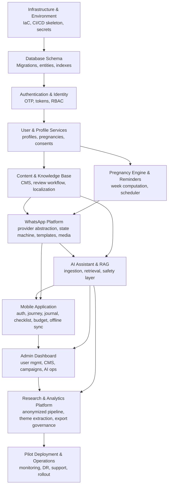

# 02. SRS Requirement Analysis

## 1. Executive Purpose

This document analyzes every requirement series from the SRS (confirmed in `00-requirement-inventory.md`), classifies each area, and produces the implementation dependency map that drives all subsequent planning documents.

## 2. Requirement Series Analysis

### 2.1 Functional Requirements (FR-001…FR-170)

| SRS Functional Area (§4.x) | Requirement IDs | Implementation Owner (Plan Doc) | Notes |
| --- | --- | --- | --- |
| Onboarding, Registration & Consent | FR-001…010 | 06, 11 | Foundation; blocks everything else |
| WhatsApp Channel & Engagement | FR-011…030 | 07 | Depends on auth, user, conversation state |
| Pregnancy Journey & Personalization | FR-031…040 | 06 | Depends on profile/pregnancy schema |
| Reminders & Notifications | FR-041…050 | 06, 12 | Depends on scheduler + notifications table |
| Father Diary / Journal | FR-051…058 | 06, 09 | Depends on journal schema + media pipeline |
| AI Assistant & RAG | FR-059…075 | 08 | Depends on content/KB + AI orchestration |
| Educational Content & CMS | FR-076…085 | 06, 10 | Depends on content schema; feeds RAG |
| Birth Preparation & Budget | FR-086…093 | 06, 09 | Depends on checklist/budget schema |
| Admin Portal & User Mgmt | FR-094…106 | 10 | Depends on RBAC + audit |
| Campaigns & Broadcasts | FR-107…112 | 07, 10 | Depends on WhatsApp templates + consent |
| Analytics, Research & Evidence | FR-113…122 | 08, 10 | Depends on research schema + theme extraction |
| Privacy, Security & Data Protection | FR-123…132 | 11 | Cross-cutting; foundation |
| Accessibility, Offline, Localization | FR-133…142 | 09 | Mobile/web UX |
| Community & Partner (deferred) | FR-143…148 | — | Out of MVP except FR-146 (partner sync) |
| Integration & External Services | FR-149…155 | 12 | Provider abstraction layers |
| Financial/Payment (design only) | FR-156…158 | — | Design-only in MVP |
| Backend, Data, Automation & Observability | FR-159…170 | 06, 12 | Foundation infrastructure |

### 2.2 Non-Functional Requirements (NFR-001…NFR-050)

| Group | IDs | Implementation Owner | Primary Controls |
| --- | --- | --- | --- |
| Performance & Scalability | NFR-001…009 | 12, 06 | Load tests, async processing, autoscaling |
| Availability & Reliability | NFR-010…015 | 12, 19 | Multi-zone, health checks, backups, fallback |
| Security | NFR-016…024 | 11 | ASVS, threat model, encryption, secrets, audit |
| Privacy & Data Protection | NFR-025…029 | 11, 23 | Privacy-by-design, subject rights, DPAs |
| Usability, Accessibility, Localization | NFR-030…035 | 09, 10 | WCAG 2.1 AA, EN/AM, offline-first |
| Operability & Maintainability | NFR-036…040 | 12, 19 | IaC, observability, zero-downtime deploys |
| Compliance & Standards | NFR-041…045 | 23 | Legal review, ethics, WhatsApp policy |
| AI Quality & Safety | NFR-046…050 | 08 | Safety layer, eval set, governance |

### 2.3 Architecture Requirements (AR-001…AR-040)

Owned by `03-system-architecture-plan.md` and `04-technology-stack-analysis.md`. Grouped: core architecture (AR-001…010), data & knowledge (AR-011…020), WhatsApp (AR-021…024), mobile (AR-025…029), web/admin (AR-030…035), DevOps (AR-036…040).

### 2.4 Operational Requirements (OR-001…OR-030)

Owned by `12-devops-and-infrastructure-plan.md` (OR-001…012), `15-team-and-resource-plan.md` (OR-013…016), `23-healthcare-compliance-and-safety-plan.md` (OR-017…026), and `14-development-phase-roadmap.md` (OR-027…030).

### 2.5 Quality/Testing Requirements (QR-001…QR-019)

Owned by `13-testing-and-quality-plan.md` and enforced by `21-quality-gate-checklist.md`. QR-013 is the universal release gate.

### 2.6 User Stories, Use Cases, User Requirements

- **US-001…020:** feature-level requirements; traceability in `22-feature-implementation-matrix.md`.
- **UC-001…005:** end-to-end flows; owned by E2E test suite (`13-testing-and-quality-plan.md`).
- **UR-001…004:** experience-level requirements; owned by `09-mobile-application-development-plan.md` and `10-admin-dashboard-development-plan.md`.

## 3. Dependency Map (Implementation Order)

The SRS is inherently layered. The ordering below is mandatory: each layer depends on the prior layer.

**Narrative form:** Authentication → User Profile → Pregnancy Profile → Content/KB → WhatsApp Engagement → AI Assistant → Mobile Application → Admin Dashboard → Research Platform → Pilot Operations.

## 4. Dependency Detail and Blockers

| Layer | Depends On | Blockers If Absent | First Task |
| --- | --- | --- | --- |
| Infrastructure | Cloud account, secret manager, repo | Nothing can run | Provision dev env + CI skeleton |
| Database | Infra | No persistence; all layers blocked | Migration 001 (users, profiles, consents, pregnancies) |
| Authentication | Database | No identity; nothing authenticated | OTP service + token issuance |
| User & Profile | Auth + DB | No enrollment | Profile CRUD + consent lifecycle |
| Content/KB | Auth, DB, clinical content | AI ungrounded; no content to show | CMS + review workflow + ingestion |
| Pregnancy Engine | User service | No journey personalization | Week computation + milestones |
| Reminders | Pregnancy Engine, notifications | No timely engagement | Scheduler + template engine |
| WhatsApp | Auth, user, reminders, templates | No channel | Provider abstraction + webhook + state machine |
| AI/RAG | Content/KB, WhatsApp | No grounded answers | Ingestion + retrieval + safety layer |
| Mobile | Auth, AI, WhatsApp parity | No app surface | App scaffold + auth + offline store |
| Admin | All services | No operational control | Portal + RBAC + dashboards |
| Research | AI (themes), journal, consent | No evidence generation | Anonymized pipeline + export governance |
| Pilot Ops | Everything | No launch | Monitoring, DR, support, UAT |

## 5. Cross-Cutting Concerns (Apply Everywhere)

1. **Security & privacy** (FR-123…132, NFR-016…029): applied at every layer, never retrofitted.
2. **Auditability** (FR-098, FR-069, AR-020): consent, admin, and AI actions are logged from day one.
3. **Localization** (FR-138, NFR-033): EN/AM from the first template and UI string.
4. **Observability** (FR-166, NFR-037): metrics/logs/traces from the first service.
5. **Idempotency** (FR-161): from the first webhook and queue consumer.
6. **Classification convention:** Confirmed (SRS-mandated) / Recommended (engineering) / Configurable (default value) / Assumption (needs human sign-off). Used throughout all plan documents.

## 6. Missing Decisions Identified (Input to decision-log.md)

| # | Open Item | Recommended Assumption | Human Validation Required |
| --- | --- | --- | --- |
| M-01 | Cloud provider selection | GCP or AWS single-cloud with multi-zone readiness (ADR-006) | Yes — procurement |
| M-02 | WhatsApp provider | Meta WhatsApp Business Cloud API primary; abstraction supports Twilio/WATI/360Dialog | Yes — cost/region |
| M-03 | LLM provider contract | Gemini Flash primary, GPT-4o-mini and Claude 3 Haiku fallback tiers (SRS §9.8) | Yes — DPA/cost |
| M-04 | Mobile framework | React Native (larger hiring pool) or Flutter | Yes — team skills |
| M-05 | Pilot cohort size | SRS §5.9 default 500+ (configurable) | Yes — program |
| M-06 | Object storage + host | Cloud object storage with server-side encryption | Yes — procurement |
| M-07 | Budget cap default | Program-suggested reference amount (configurable) | Yes — program |

## 7. Validation Requirements (Per SRS)

Each layer's acceptance criteria in the SRS (FR tables, AR tables, NFR acceptance criteria) constitute the validation contract. They are consolidated in `22-feature-implementation-matrix.md` and `21-quality-gate-checklist.md`. Nothing in this analysis simplified or removed a requirement.
