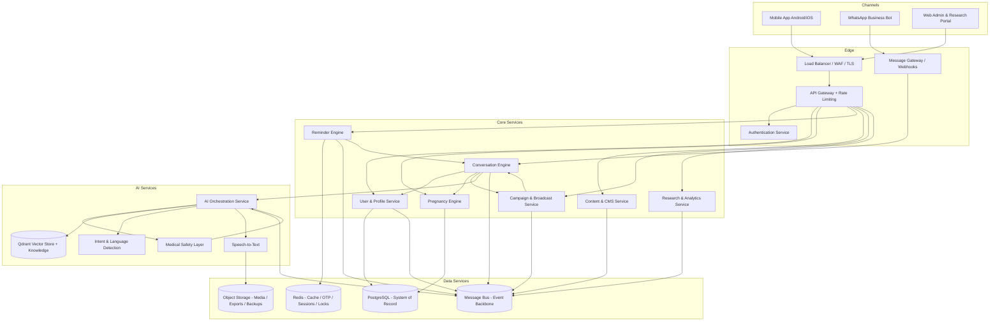
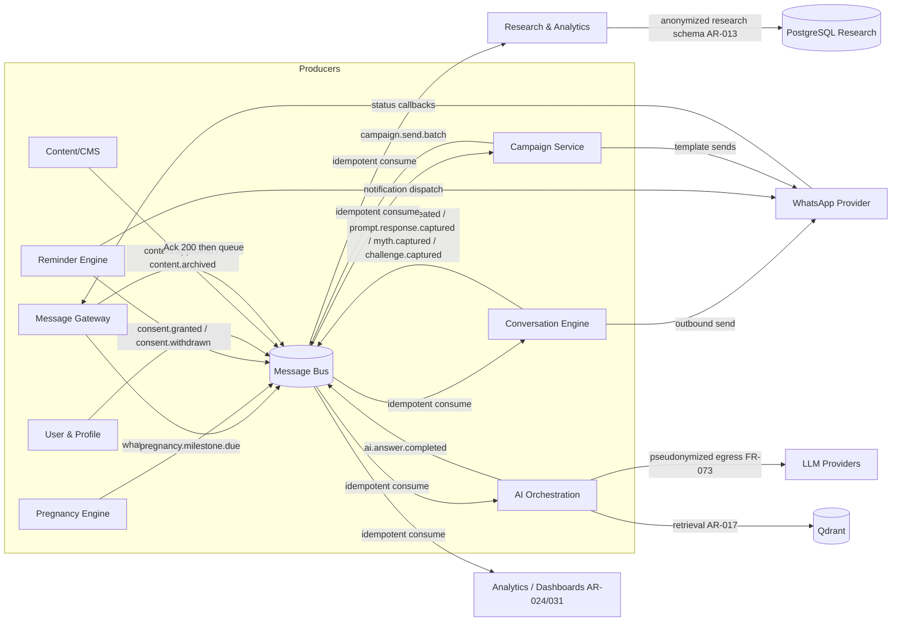
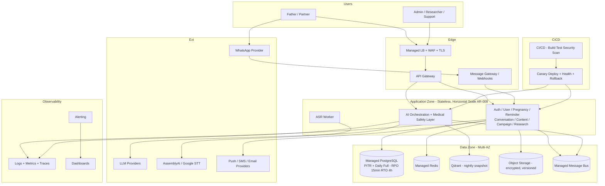
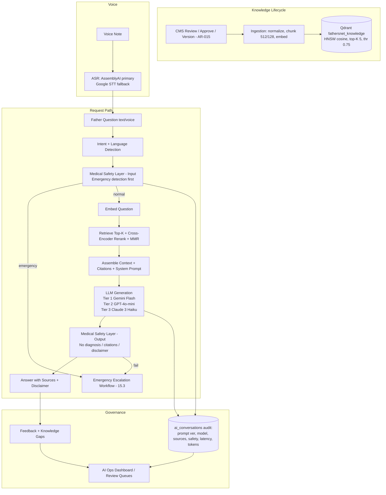

# 03. System Architecture Plan

**Document:** FathersNet (Ayay) — System Architecture Plan
**Source of truth:** `docs/FathersNet-Complete-SRS.md` (FN-SRS-001 v2.0)
**Predecessors:** `00-requirement-inventory.md`, `02-srs-requirement-analysis.md`
**Scope:** Service boundaries, data-flow architecture, communication patterns, external integrations, security boundaries, deployment topology, architecture diagrams, architecture decisions, dependencies/blockers, risks, and verification approach for the greenfield build.
**Classification convention:** **Confirmed** (SRS-stated) · **Recommended** (engineering decision) · **Configurable** (parameter with default) · **Assumption** (needs human validation). Every recommendation below carries Source, Confidence, Reasoning, and Impact-if-changed.

---

## 1. Executive Purpose

This document is the controlling **architecture reference** for the FathersNet (Ayay) platform build. It translates the binding requirements of FN-SRS-001 v2.0 into a concrete, implementable system architecture that a development team can execute against and a security reviewer can audit against. It is the first architecture artifact produced from the requirement inventory (`00`) and requirement analysis (`02`) and is the primary input to the technology-stack analysis (`04`), database implementation plan (`05`), and DevOps/infrastructure plan (`12`).

The architecture is derived from these SRS areas, referenced by name:

- **Architecture Specification §15** — overall system architecture (§15.1), architecture requirements AR-001…AR-040 (§15.2), emergency escalation workflow (§15.3), and architecture decision records ADR-001…ADR-006 (§15.4).
- **WhatsApp Conversational Platform Specification (§7)** — provider abstraction (§7.1), conversation state machine (§7.2), message templates (§7.3), webhook security and media processing (§7.4).
- **AI Assistant and RAG Specification (§9)** — ingestion (§9.2), vector store (§9.3), retrieval (§9.4), system prompt (§9.5), emergency handling (§9.6), voice processing (§9.7), model fallback (§9.8).
- **Research Platform Specification (§10)** — data collection, theme extraction, research schema, governance.
- **Database Specification (§13)** — canonical relational model, ER diagram, 27 tables, retention rules.
- **Security and Privacy Specification (§14)** — STRIDE threat model, encryption, audit, roles/permissions, AI governance.
- **Deployment Specification (§16)** — Docker Compose reference (§16.1), CI/CD (§16.2), scalability (§16.3).
- **Backend, Data, Automation & Observability requirements** (FR-159…FR-170), the WhatsApp channel requirements (FR-011…FR-030), AI/RAG requirements (FR-059…FR-075), and the non-functional groups Performance & Scalability (NFR-001…009) and Availability & Reliability (NFR-010…015).

The system to be architected is a **greenfield** digital fatherhood and family-health platform (repository audit in `01-current-system-analysis.md`) with four channel surfaces — mobile app (Android-first, iOS supported), WhatsApp business channel, web admin/research portal, and an AI assistant with RAG — plus a research/evidence pipeline, all operating in Ethiopia (English + Amharic) at a pilot scale that must scale regionally and nationally without redesign (NFR-001, PD-010).

**What this document deliberately does NOT do:** it does not select final commercial vendors (procurement remains open per `02` §6 missing decisions M-01…M-07), does not define per-table DDL (see `05`), does not define CI/CD job details (see `12`), and does not set guaranteed capacity commitments beyond the SRS's configurable reference defaults (§5.9). Where the SRS states a **Recommended Reference Architecture**, this document confirms it or proposes an engineering alternative with the same requirement satisfaction, always labeled.

**How to read this document:** Sections 2–8 define the architecture (principles, services, flows, patterns, integrations, security, deployment). Section 9 presents the four authoritative diagrams. Section 10 records the confirmed and newly recommended architecture decisions. Sections 11–12 surface what must be true externally (dependencies/blockers) and what could go wrong (risks). Section 13 defines how the architecture is verified as-built.

---

## 2. Architecture Principles

The following principles are derived directly from AR-001…AR-040 (§15.2) and ADR-001…ADR-006 (§15.4). Each principle is binding insofar as the underlying AR is binding (**Confirmed**); the engineering implication is the translation into build practice (**Recommended** or **Configurable**).

### P-01 — WhatsApp-First Channel

| Attribute | Value |
| --- | --- |
| **Statement** | WhatsApp is the primary conversational and engagement channel; the mobile app is a complementary surface; the web portal is an operator/research surface. |
| **Source** | ADR-001 (WhatsApp-First Architecture); AR-001 (microservices/channel support); §7.1; PD-011 |
| **Classification** | Confirmed (SRS decision); Recommended (engineering implication) |
| **Confidence** | High |
| **Reasoning** | ADR-001 records the decision explicitly: WhatsApp maximizes reach among the target demographic, supports voice/photos, and matches existing behavior; the app cannot be assumed to be the primary entry point. The whole conversation engine, template library, and state machine (§7.2) are therefore first-class components, not afterthoughts. |
| **Impact if changed** | If the app became the primary channel, the message gateway and webhook (FR-011, FR-149) would lose priority, the 24-hour-window/template constraints (§7.4.3) would relax, and the RAG/emergency handling would still be shared but driven from app APIs. Significant rework of engagement flows and cost model. |

### P-02 — Microservices with API Gateway and Event-Driven Communication

| Attribute | Value |
| --- | --- |
| **Statement** | The backend is a set of independently deployable services behind a single API gateway, communicating synchronously via REST/OpenAPI and asynchronously via a message bus. |
| **Source** | AR-001; FR-159; FR-160; §15.1; NFR-006 |
| **Classification** | Confirmed |
| **Confidence** | High |
| **Reasoning** | FR-159 lists the mandated service set (API gateway, auth, user, pregnancy engine, reminder engine, WhatsApp service, AI orchestration); FR-160 mandates event-driven decoupling; NFR-006 requires horizontal scaling. Microservices with a bus is the only way to satisfy all three while keeping each component independently deployable and scaleable. |
| **Impact if changed** | A modular monolith could satisfy the requirements at pilot scale and reduce operational load, but would fail FR-159's "independently deployable" acceptance criterion and complicate NFR-006 scale-out. Not recommended; see D-01 in §10 for a disciplined granularity that keeps the mandate without service sprawl. |

### P-03 — Three-Tier Data Architecture

| Attribute | Value |
| --- | --- |
| **Statement** | PostgreSQL is the system of record; a vector store holds knowledge embeddings; object storage holds media, exports, and backups. Redis augments with cache/state. |
| **Source** | AR-002; ADR-003 (Database Selection); FR-162; §13.1; §9.3 |
| **Classification** | Confirmed (PostgreSQL + vector + object); Recommended (Qdrant as the vector store, configurable) |
| **Confidence** | High |
| **Reasoning** | ADR-003 documents the PostgreSQL choice (relational integrity, JSONB flexibility, ecosystem). §9.3 recommends Qdrant with alternatives (Pinecone, Weaviate, pgvector) explicitly allowed. Object storage is mandated by FR-150/§7.4.2 for media with access control and retention. |
| **Impact if changed** | Replacing Qdrant with pgvector is low-impact architecturally (only the retrieval adapter changes; §9.3 already lists it) and is discussed in D-07 (§10). Replacing PostgreSQL would violate the confirmed ADR and §13 canonical model. |

### P-04 — RAG-Grounded AI with a Mandatory Medical Safety Layer

| Attribute | Value |
| --- | --- |
| **Statement** | Every AI answer is grounded in an approved knowledge base via RAG, and every inbound question and outbound answer passes a medical safety layer that cannot be bypassed. |
| **Source** | ADR-002 (RAG Architecture); AR-005; AR-006; AR-015; AR-016; AR-017; AR-018; AR-019; AR-020; FR-059…FR-075; NFR-046…NFR-050; §9 |
| **Classification** | Confirmed |
| **Confidence** | High |
| **Reasoning** | ADR-002 documents RAG-over-approved-knowledge as the decision; AR-005/AR-006 make the pipeline and safety layer mandatory; FR-060/FR-061 require citation and grounding restriction; NFR-046 forbids diagnosis. The safety layer is placed in the request path *before delivery* (§9.4 step 8, AR-006), not as an offline review. |
| **Impact if changed** | Any design that allows ungrounded generation or a bypassable safety layer violates C-01, NFR-046, and AR-006 and is a release blocker, not an architectural option. |

### P-05 — Provider Abstraction for Every Third-Party Dependency

| Attribute | Value |
| --- | --- |
| **Statement** | WhatsApp, LLM/embedding, ASR, and notification providers are each behind an abstraction layer with a defined contract and a fallback path. |
| **Source** | AR-004 (WhatsApp); AR-018 (AI model fallback); FR-149; FR-151; FR-152; §7.1; §9.8; ADR-005 |
| **Classification** | Confirmed |
| **Confidence** | High |
| **Reasoning** | FR-149 requires provider switching with minimal operational disruption; AR-018 requires model fallback; §7.1 lists candidate WhatsApp providers; §9.8 defines the model tier/fallback table; FR-152 requires notification failover. Abstraction is the only way to satisfy the "switching supported" acceptance criteria. |
| **Impact if changed** | Without abstraction, provider outages become platform outages (NFR-015), cost leverage disappears (A-07), and market entry for the Ethiopian WhatsApp context (D-01) is at risk. |

### P-06 — Stateless, Horizontally Scalable Services with Externalized State

| Attribute | Value |
| --- | --- |
| **Statement** | All application services are stateless; session state, OTP state, and coordination state live in Redis/tokens; scale-out never requires session affinity. |
| **Source** | AR-008; NFR-006; §14.6 (token strategy); §16.3 |
| **Classification** | Confirmed (requirement); Recommended (Redis as the externalized-state store) |
| **Confidence** | High |
| **Reasoning** | AR-008 explicitly requires statelessness with session state externalized (Redis/token-based). The §16.1 reference already includes Redis. JWT access tokens (§14.6) are stateless by design; the WhatsApp conversation state (§7.2) is persisted in PostgreSQL `conversations.state` rather than in memory. |
| **Impact if changed** | Stateful services would violate NFR-006's acceptance criterion (scale-out without data inconsistency) and complicate zero-downtime deploys (NFR-038). |

### P-07 — Strict Environment Isolation

| Attribute | Value |
| --- | --- |
| **Statement** | Dev/staging/prod environments are isolated in compute, data, credentials, and traffic; production data never flows to lower environments. |
| **Source** | AR-009; QR-012; FR-170; NFR-036 |
| **Classification** | Confirmed |
| **Confidence** | High |
| **Reasoning** | AR-009 is explicit ("production data never used in lower environments"); QR-012 requires synthetic, no-PII test data. This drives IaC-per-environment, separate databases, separate secret scopes, and a synthetic data pipeline. |
| **Impact if changed** | Cross-environment data reuse would fail AR-009/QR-012, create privacy exposure (FR-124), and corrupt research validity. Non-negotiable. |

### P-08 — Consent as an Immutable, Versioned Event Stream

| Attribute | Value |
| --- | --- |
| **Statement** | Consent records are append-only, versioned, timestamped events per user; withdrawal is honored at every downstream consumer. |
| **Source** | AR-012; FR-003; FR-004; FR-117; FR-125; §13.3.4 |
| **Classification** | Confirmed |
| **Confidence** | High |
| **Reasoning** | AR-012 mandates immutable versioned consent events; FR-004 requires withdrawal to restrict non-essential processing while preserving audit records; FR-117 requires separate independently revocable research/media consents. Every broadcast, research-ingestion, and AI-pseudonymization consumer must evaluate current consent state before acting. |
| **Impact if changed** | Mutable consent would violate AR-012, undermine auditability (NFR-023), and create legal/ethics exposure (NFR-042). |

### P-09 — Research Data Physically/Logically Separated and Anonymized at Collection

| Attribute | Value |
| --- | --- |
| **Statement** | Research data is pseudonymized at the point of collection, stored separately from operational data with restricted access, and never contains direct identifiers. |
| **Source** | AR-013; AR-032; FR-113; FR-116; FR-119; NFR-027; §10.1.3 |
| **Classification** | Confirmed |
| **Confidence** | High |
| **Reasoning** | AR-013 mandates separation with restricted access; FR-119 requires de-identification at collection; §10.1.3 specifies the anonymized schema (anonymized_id, no PII). The linkage key between operational and research identities is stored separately under restricted access. |
| **Impact if changed** | Merging research and operational stores would fail AR-013, FR-116 export governance, and ethics commitments (D-05, NFR-042). |

### P-10 — Knowledge Lifecycle Governs AI Retrievability

| Attribute | Value |
| --- | --- |
| **Statement** | A document is retrievable by RAG only when it is in an approved/published lifecycle state; archive/expiry removes it from retrieval within the defined SLA. |
| **Source** | AR-015; AR-016; FR-070; FR-078; FR-080; FR-081; §9.2; §13.3.16 |
| **Classification** | Confirmed |
| **Confidence** | High |
| **Reasoning** | AR-015 ties retrieval eligibility to lifecycle state; AR-016 requires incremental re-embedding with retirement of old chunks; FR-080 requires removal from retrieval on expiry. This couples the CMS (§13.3.16 content.status) with the vector store's active-chunk set. |
| **Impact if changed** | Retrieving unapproved or expired content violates AR-015/FR-080 and creates a patient-safety hazard (C-01). |

### P-11 — Scheduled/Queued Pipelines with Retry, Idempotency, and Observability

| Attribute | Value |
| --- | --- |
| **Statement** | Prompt, reminder, campaign, transcription, AI, and research pipelines run as scheduled/queued jobs with retry policy, idempotent processing, and full observability. |
| **Source** | AR-007; FR-161; FR-163; FR-021; §7.4.3 (retry strategy); NFR-004 |
| **Classification** | Confirmed |
| **Confidence** | High |
| **Reasoning** | AR-007 mandates the job platform; FR-161 mandates idempotency (no duplicates on retry); FR-163 mandates failure handling and observability; FR-021 mandates delivery retry with alerting. This is why the bus and queue are load-bearing (see §5). |
| **Impact if changed** | Fire-and-forget processing would fail FR-161 acceptance (duplicate messages/records on retry) and create user-facing duplicate prompts/reminders. |

### P-12 — Canonical Data Model with Referential Integrity

| Attribute | Value |
| --- | --- |
| **Statement** | One canonical relational model (§13) is the system of record; services own their tables and expose data through contracts rather than sharing schemas ad hoc. |
| **Source** | AR-011; FR-162; §13.1; ADR-003 |
| **Classification** | Confirmed |
| **Confidence** | High |
| **Reasoning** | AR-011 requires the §13 entities with referential integrity and hot-path indexes; FR-162 requires the canonical model in PostgreSQL with vector and object stores. Single-owner-per-table reduces merge conflicts and maintains integrity. |
| **Impact if changed** | Duplicated or cross-service-owned tables would violate AR-011 and create consistency bugs that are very hard to repair after pilot data accrues. |

### P-13 — Security and Privacy by Design, Enforced Server-Side

| Attribute | Value |
| --- | --- |
| **Statement** | Defense-in-depth, least privilege, encryption at rest/in transit, RBAC+ownership checks on every endpoint, immutable audit, and privacy-by-design are baseline, not retrofit. |
| **Source** | AR-… (all security-aligned); FR-123…FR-132; NFR-016…NFR-029; §14 |
| **Classification** | Confirmed |
| **Confidence** | High |
| **Reasoning** | The STRIDE threat model (§14.1), encryption strategy (§14.2), audit logging (§14.3), OWASP mapping (§14.4), and role/permission matrix (§14.7) are all binding. Server-side enforcement (FR-126) is explicit. |
| **Impact if changed** | Any client-side-only enforcement or encryption gap fails FR-123/FR-126/NFR-021 and is a release blocker under NFR-016 (zero critical/high at release). |

### P-14 — Offline-First Mobile with Local-First Sync

| Attribute | Value |
| --- | --- |
| **Statement** | The mobile app works offline for defined content and features, with SQLite local storage, a queued sync engine, and field-level conflict-safe merges. |
| **Source** | ADR-004 (Offline Mobile Storage); AR-025…AR-028; FR-089; FR-135; FR-136; §8.4; §8.5 |
| **Classification** | Confirmed |
| **Confidence** | High |
| **Reasoning** | ADR-004 selects local-first with SQLite and queued sync; AR-025 requires offline-first with conflict-safe merges; FR-136 guarantees no loss/duplication on sync. Emergency content must always be available offline (FR-135). |
| **Impact if changed** | An online-only app violates C-05, FR-089/FR-135/FR-136, and the persona assumptions (A-02, intermittent connectivity). |

### P-15 — AI Governance and Full Auditability

| Attribute | Value |
| --- | --- |
| **Statement** | Every AI interaction records prompt version, model, provider, timestamps, safety flags, latency, tokens, and cited sources; model and prompt changes require approval. |
| **Source** | AR-019; AR-020; FR-069; FR-068; NFR-049; §14.11; §13.3.20 |
| **Classification** | Confirmed |
| **Confidence** | High |
| **Reasoning** | AR-020 requires auditability of AI conversations, prompts, and model versions; AR-019 requires pseudonymization before external calls; §13.3.20 defines the `ai_conversations` audit table. NFR-049 requires the model registry and prompt versioning. |
| **Impact if changed** | Loss of AI auditability fails FR-069/NFR-049 and the research and medical governance commitments (OR-010, OR-020). |

### P-16 — Infrastructure-as-Code with CI/CD and Progressive Deployment

| Attribute | Value |
| --- | --- |
| **Statement** | All environments are defined as code, deployed via CI/CD with quality gates, canary/rolling strategy, and automated rollback. |
| **Source** | AR-036; AR-037; FR-167; FR-168; ADR-006; NFR-036; NFR-038; §16.2 |
| **Classification** | Confirmed |
| **Confidence** | High |
| **Reasoning** | ADR-006 selects cloud + IaC + containers; AR-036/AR-037 mandate reproducible environments and gated progressive deploys; §16.2 gives the reference CI/CD with approval gates and canary promotion. |
| **Impact if changed** | Manual provisioning violates AR-036/NFR-036 and makes the environment-isolation principle (P-07) unenforceable in practice. |

### P-17 — Pluggable Future Integration

| Attribute | Value |
| --- | --- |
| **Statement** | Future FHIR/HL7, payments, wearables, and telehealth integrate via adapter patterns without core-service changes; not activated in MVP. |
| **Source** | AR-010; FR-154; FR-156; FR-158 |
| **Classification** | Confirmed (design requirement); Recommended (adapter/boundary pattern) |
| **Confidence** | High |
| **Reasoning** | AR-010 explicitly requires pluggable adapters; FR-154 requires FHIR/HL7 design-readiness without MVP activation; §16.1's n8n presence provides an integration/workflow boundary. Payment readiness (FR-156) is design-only. |
| **Impact if changed** | Tight coupling now would force a later re-architecture when phase-3 integrations (Appendix J) arrive. Low cost to keep boundaries today. |

### P-18 — Cost Control as an Architectural Constraint

| Attribute | Value |
| --- | --- |
| **Statement** | AI token cost, messaging volume, and cloud spend are first-class constraints: routing, caching, compression, and budget alerts are architected in. |
| **Source** | AR-040; A-07; C-03; §9.8 (cost-aware routing); §8.5 (cache budget); Appendix C |
| **Classification** | Confirmed (constraint); Recommended (cost-aware routing table, configurable) |
| **Confidence** | High |
| **Reasoning** | C-03/A-07 make cost control binding. §9.8 defines cost-tier routing; §8.5 defines a 100 MB cache budget with LRU; §5.9 defines configurable capacity targets that budget alerts (§16.3, AR-040) monitor against. |
| **Impact if changed** | Without cost routing and caching, daily AI interactions (§5.9 default 5,000) and messaging (~10,000/day) would overshoot the reference cost model (Appendix C) and threaten pilot sustainability. |

### P-19 — Role-Based Admin with MFA and Segregation of Duties

| Attribute | Value |
| --- | --- |
| **Statement** | All staff access is role-scoped (permission matrix §14.7), MFA-protected (FR-101), session-controlled, and enforces segregation of duties (author ≠ medical approver; researcher export requires separate approval). |
| **Source** | AR-030; AR-033; FR-094; FR-101; FR-102; FR-106; §14.7; NFR-018 |
| **Classification** | Confirmed |
| **Confidence** | High |
| **Reasoning** | AR-033 requires MFA + session controls for all staff; FR-106 requires granular RBAC blocking conflicting roles; §14.7 defines the matrix. Admin endpoints require "Bearer + MFA" (§12.10). |
| **Impact if changed** | Weakening SoD or MFA fails FR-101/FR-106/NFR-018 and is a direct target of the insider-access threat (§14.1.7). |

### P-20 — Near-Real-Time Analytics Feed

| Attribute | Value |
| --- | --- |
| **Statement** | WhatsApp and platform events flow to analytics in near-real time so the admin dashboard reflects current engagement. |
| **Source** | AR-024; AR-031; FR-030; §11.1 |
| **Classification** | Confirmed |
| **Confidence** | High |
| **Reasoning** | AR-024 requires a near-real-time analytics feed from WhatsApp events; AR-031 requires the dashboard to reflect current data; FR-030 lists the metrics. This mandates an event-driven analytics path (bus → aggregation → dashboards), not nightly batch only. |
| **Impact if changed** | Batch-only analytics would fail AR-024's latency acceptance and make the operations/emergency monitoring (OR-007) too slow to be useful. |

---

## 3. Service Architecture

This section defines the service boundaries. It follows the Architecture Specification §15.1 topology and the mandated service set of FR-159 (API gateway, authentication, user, pregnancy engine, reminder engine, WhatsApp service, AI orchestration), extended with the Content/CMS, Campaign/Broadcast, and Research & Analytics services that §15.1's Core group also lists, plus the AI sub-services (§15.1 AI group) and data services. D-01 (§10) resolves granularity: these are the *logical* service boundaries, and §10 D-01 maps them to deployable units for the pilot.

### 3.1 Service Boundary Table

| Service | Responsibility (SRS basis) | Owns (primary data) | Publishes (events) | Consumes (events) | Key API groups |
| --- | --- | --- | --- | --- | --- |
| **API Gateway** | Single entry point; TLS termination, routing to services, auth-token verification, rate limiting/quota (FR-169, AR-003), request idempotency-key handling, CORS allow-list, request logging. No business logic. | none (stateless) | `api.request` (observability) | — | all `/v1/*` routes (§12) |
| **Authentication** | OTP request/verify (FR-005, §12.2), JWT issuance + refresh rotation + revocation (FR-102, §14.6), admin MFA (FR-101), OTP rate limiting/lockout, device fingerprinting. | none persistent (Redis OTP/session state; writes `audit_logs` via audit) | `auth.otp.requested`, `auth.session.created`, `auth.session.revoked` | — | `/v1/auth/*` (§12.2) |
| **User & Profile** | Profile CRUD (FR-002), consent lifecycle capture/version/withdraw (FR-003/004/125), preferences (FR-038), referral/cohort tags (FR-010), account export (FR-057), deletion with grace period (FR-007), partner linking (FR-039, §8.4), identity linking across WhatsApp/app (FR-008). | `users`, `profiles`, `consents`, `user_preferences`, partner-link edges | `user.registered`, `user.profile.updated`, `consent.granted`, `consent.withdrawn`, `user.deletion.requested` | — | `/v1/users/*` (§12.3) |
| **Pregnancy Engine** | EDD/LMP → pregnancy week/trimester computation and auto-advance (FR-031, FR-037), milestone computation (FR-033), trimester transitions (FR-036), journey timeline source data (FR-034), support-action recommendations (FR-035). | `pregnancies` (joint with profile context) | `pregnancy.week.advanced`, `pregnancy.milestone.due`, `pregnancy.trimester.changed` | `user.profile.updated` | `/v1/users/me/pregnancy` (§12.3) |
| **Reminder Engine** | Reminder scheduling (FR-041), multi-channel delivery orchestration push/WhatsApp/SMS with failover (FR-042, FR-152), template definition + admin approval (FR-049), recurrence (FR-044), quiet hours + lead time (FR-043), critical bypass (FR-046), duplicate suppression (FR-048), delivery/ack tracking (FR-045), analytics (FR-050). | `appointments`, `notifications`, reminder templates | `notification.due`, `notification.delivered`, `notification.failed` | `pregnancy.milestone.due`, `pregnancy.trimester.changed`, `campaign.optout.registered`, consent events | `/v1/...` appointment/notification endpoints |
| **Conversation Engine (WhatsApp)** | Provider abstraction (FR-149, AR-004), webhook validation (§7.4.1), conversation state machine (§7.2) with persistence (FR-028, AR-022), quick replies/intents (FR-013), welcome/onboarding flow (FR-012), voice/photo intake (FR-018/019, AR-023, §7.4.2), template library + approval (AR-021), fallback handling (FR-020), delivery retry + alerting (FR-021), opt-in/opt-out (FR-017, FR-112), multilingual intent/language handling (FR-024), emergency routing (FR-025), myth/challenge flows (FR-026/027), 24-hour-window and quiet-hours enforcement (FR-029, §7.4.3). | `conversations`, `messages`, `journal_entries` (via journal writes), media pipeline state; outbound send contract | `whatsapp.message.received`, `whatsapp.media.received`, `conversation.intent.detected`, `whatsapp.message.delivered/failed`, `whatsapp.optout.registered` | `notification.due` (send via WhatsApp), `campaign.send` (template sends), consent events | `/v1/whatsapp/*` (§12.4) |
| **Content / CMS** | Content library and types (FR-076/077), review/approval + versioning + scheduling + audit (FR-078), localization workflow (FR-079), expiry/archiving (FR-080), medical-review flagging (FR-081), WhatsApp embedding (FR-082), search (FR-083), consumption analytics (FR-084), quality ratings (FR-085). | `content`, `content_versions` | `content.approved` (→ RAG ingestion), `content.archived` (→ vector retirement), `content.expired` | — | `/v1/content/*` (§12.5) |
| **Campaign / Broadcast** | Campaign definition + segmentation (FR-107), template approval gate incl. platform approval (FR-108, AR-021), monitoring metrics (FR-109), A/B variants (FR-110), throttling/limits (FR-111), opt-out removal (FR-112). | `campaigns`, `campaign_messages` | `campaign.scheduled`, `campaign.send.batch` | `consent.granted/withdrawn` (audience refresh), `whatsapp.optout.registered`, `whatsapp.message.delivered/read` | `/v1/admin/campaigns` (§12.10) |
| **Research & Analytics** | Research-ready schema capture (FR-113), AI theme extraction orchestration (FR-114), research dashboards (FR-115), anonymized export with governance gate (FR-116, FR-122), separate consents (FR-117), KPIs/impact metrics (FR-118), de-identification at collection (FR-119), pre/post assessments (FR-120), publication outputs (FR-121), analytics aggregation for AR-024/AR-031. | `research_responses`, `research_users`, `research_analytics` (separated per AR-013) | `research.record.created`, `research.export.requested` (→ governance) | `journal.entry.created`, `prompt.response.captured`, `myth.captured`, `challenge.captured`, `whatsapp.message.received` (anonymized), consent events | `/v1/admin/research/*`, `/v1/admin/overview`, `/v1/admin/reports` (§12.10) |
| **AI Orchestration** | RAG pipeline orchestration (FR-060): intent+language detection (FR-064), input safety classification handoff, embedding, retrieval (top-K/threshold/rerank/MMR per §9.4), prompt assembly with citations (AR-017), LLM routing + fallback tiers (FR-072, AR-018, §9.8), knowledge-gap capture (FR-074), feedback capture (FR-066), conversation history context (UR-002.3), async job model (NFR-004, §12.8). | `ai_conversations` (audit), `ai_feedback` | `ai.answer.completed`, `ai.safety.flag`, `ai.knowledge.gap`, `ai.model.fallback` | `whatsapp.message.received` (Ask-a-Question intent), `content.approved/archived` (vector lifecycle) | `/v1/ai/*` (§12.8) |
| **Medical Safety Layer** | Input safety classification + emergency detection (FR-062, FR-063, §9.6), output safety validation before delivery (FR-065, AR-006), escalation to human review (FR-097/OR-010), disclaimers (NFR-046), emergency workflow (§15.3) with admin notification + follow-up checks. | safety-event records, escalation queue | `safety.emergency.detected`, `safety.answer.blocked`, `safety.answer.escalated` | every AI in/out payload (in-process boundary; see §4.2) | AI ops views `/v1/ai/safety-events` (§12.8) |

### 3.2 Data Services

| Store | Role (SRS basis) | Placement / Scaling Notes | Classification |
| --- | --- | --- | --- |
| **PostgreSQL** | System of record for the canonical model (§13, ADR-003); all transactional entities, consent immutability (§13.3.4), research schema (§13.3.22-23), audit (§13.3.24). | Managed, multi-AZ for NFR-011; read replicas at scale (§16.3); pgBackRest-style continuous WAL for RPO ≤15 min (§19). | Confirmed (ADR-003); Recommended (managed service) |
| **Redis** | Externalized state per AR-008: OTP/session state (§14.6), rate-limit counters (FR-169), cache (Appendix C caching strategy), pub/sub and job-coordination locks (§5). | Managed with persistence (`appendonly yes` per §16.1); never the system of record. | Confirmed (reference §16.1); Recommended (usage pattern) |
| **Message Bus / Queue** | Event backbone for FR-160: decoupled processing for messaging, notifications, research ingestion; scheduled-job triggers (AR-007); retry + dead-letter. | See D-02 (§10) for provider selection; scales with consumer count per NFR-006. | Confirmed (requirement); Recommended (provider) |
| **Qdrant (vector store)** | `fathersnet_knowledge` collection, HNSW, cosine, payload filtering (§9.3); knowledge-chunk lifecycle (AR-015/016). | Self-hosted or managed; nightly snapshot (§19). pgvector is the documented alternative (§9.3). | Recommended (default per §9.3; Configurable) |
| **Object Storage** | Media (voice/photo per §7.4.2), journal exports, research exports, backups (§16.1 backup service), signed expiring URLs (FR-150). | Server-side encryption (FR-123); versioning; retention/lifecycle policies (FR-105, §13.4). | Confirmed (FR-150) |

### 3.3 Channel and Client Surfaces (not backend services)

- **Mobile App** — Android-first/iOS, SQLite local store, queued sync, encrypted local storage (AR-025…AR-028, §8.5).
- **Web Admin & Research Portal** — role-based modules per AR-030 (§11), real-time analytics (AR-031), research on anonymized data only (AR-032), MFA + session controls (AR-033).
- **WhatsApp Business channel** — external provider; the backend owns the abstraction and webhook.

### 3.4 Cross-Service Contracts Summary

- Every service exposes an OpenAPI 3.x contract (AR-003, FR-153) and documents its published/subscribed events (FR-160) in the event catalog (§4.6).
- Every service enforces server-side RBAC + ownership checks on its endpoints (FR-126, §14.1.2).
- Every service that touches personal/health data writes an audit-log entry for access (FR-127, NFR-023).
- No service reaches into another service's tables (single-owner-per-table, P-12).

---

## 4. Data Flow Architecture

The platform is event-driven (FR-160) with idempotent ingestion (FR-161) and async processing of long-running work (NFR-004). This section specifies the five flows named in the task brief plus the event catalog they share.

### 4.1 Flow F-01 — Inbound WhatsApp Message

**Trigger:** A father sends a text, voice note, photo, or quick reply to the WhatsApp number.

**SRS basis:** WhatsApp Conversational Platform Specification §7 (webhook §7.4.1, state machine §7.2, media §7.4.2), FR-011…FR-030, NFR-003.

| Step | Component | Action | Notes / Idempotency |
| --- | --- | --- | --- |
| 1 | WhatsApp provider | Delivers inbound message to webhook POST `/v1/whatsapp/webhook` | — |
| 2 | Message Gateway (Conversation Engine) | Validates `X-Hub-Signature-256` HMAC with app secret, constant-time comparison; rejects `401` on mismatch and logs a security event (§7.4.1, §14.1.5). GET verification handshake for provider subscription. | Signature validation is a hard security boundary (§7.1 Security, §14.1.5) |
| 3 | Message Gateway | Acknowledges `200` immediately; does **not** process synchronously. | Meets NFR-003 provider-timeout ack |
| 4 | Message Gateway → Bus | Publishes `whatsapp.message.received` with `provider_message_id`, sender, type, media ref, timestamp. | Dedup key = `provider_message_id`; unique index on `messages.provider_message_id` (FR-161, §13.3.11) |
| 5 | Conversation Engine (consumer) | Loads user + conversation state (`conversations.state`); checks consent `whatsapp_opt_in`; executes state-machine transition (§7.2.2); enforces quiet hours/24-hour window for any reply (FR-029, §7.4.3). | — |
| 6a | Media branch (if voice/photo) | Publishes `whatsapp.media.received`; media worker downloads from provider, type/size validates, malware scans (AR-023), compresses (photo) or stores original (voice) in object storage under anonymized path (§7.4.2), then queues transcription (ASR per §7.4.2) or AI tagging. | Storage path `media/<type>/<anonymized_id>/<message_id>.<ext>`; no phone numbers in paths (FR-022) |
| 7 | Intent router | Intent + language detection (FR-064) routes to: ASK_QUESTION → AI flow (F-02), MYTH_REPORT/SHARE_CHALLENGE → capture + `myth.captured`/`challenge.captured`, EMERGENCY → §15.3 workflow (bypasses normal answering, FR-025, §9.6). | Emergency detection runs first (§9.4 step 2) |
| 8 | Response | Reply sent within the 24-hour window (free-form) or as approved template (outside window, §7.4.3); delivery status published as `whatsapp.message.delivered/failed`; failures retried with exponential backoff then alert (FR-021). | — |
| 9 | Journal & research | Prompt responses and journal-eligible content persist to `journal_entries`; `journal.entry.created` published for research ingestion (F-05). | — |

### 4.2 Flow F-02 — AI Question (Ask-a-Question)

**Trigger:** A father asks a question on WhatsApp (F-01 step 7) or in the mobile app (`POST /v1/ai/ask`, §12.8).

**SRS basis:** AI Assistant and RAG Specification §9 (pipeline §9.4, emergency §9.6, voice §9.7, model fallback §9.8), FR-059…FR-075, AR-005/006/017/018/019/020, NFR-009.

| Step | Component | Action |
| --- | --- | --- |
| 1 | AI Orchestration | Receives question (text or transcription). Publishes async job if generation expected to exceed interactive budget (NFR-004; `/v1/ai/ask/:jobId` polling per §12.8). |
| 2 | AI Orchestration | Intent + language detection (FR-064). |
| 3 | Medical Safety Layer (input) | Input safety classification; emergency detection first (§9.6). Emergency → EMERGENCY state, §15.3 workflow; normal → continue. |
| 4 | Embedding + Retrieval | Question embedded; top-K=5 candidates retrieved from Qdrant `fathersnet_knowledge` above similarity threshold 0.75 (§9.3/§9.4); cross-encoder rerank + MMR λ=0.5. |
| 5 | Prompt assembly | System prompt (§9.5) + retrieved chunks with citations (AR-017) + conversation context (UR-002.3). |
| 6 | LLM generation | Route per §9.8 tier table (primary Gemini Flash; fallback GPT-4o-mini, then Claude 3 Haiku); 5 s time-to-first-token threshold; cost-aware routing; all routing decisions logged (model, provider, latency, tokens, cost). |
| 7 | Medical Safety Layer (output) | Validates answer against safety rules (no diagnosis/prescription, grounded-only, citation present); pass → deliver with disclaimer; fail → safe/decline response or escalation (FR-065, AR-006). |
| 8 | Audit + feedback | `ai_conversations` audit record (prompt version, model, sources, safety flags, latency, tokens — AR-020); `ai.answer.completed` published; low-rated answers enter AI ops queue (FR-066); knowledge gaps captured (FR-074). |
| 9 | Delivery | Answer delivered on originating channel (WhatsApp template-safe or app); source citations shown. |

**Pseudonymization boundary:** No personal identifiers leave the platform to AI providers (FR-073, AR-019); the request to the LLM contains the question text with identifiers stripped.

### 4.3 Flow F-03 — Weekly Prompt Scheduler (and Daily Pulse / Legacy)

**Trigger:** The scheduler fires per pregnancy-week segmentation (FR-014, FR-015, FR-016).

**SRS basis:** FR-014…FR-016, FR-053, §7.2 states WEEKLY_PROMPT/DAILY_PULSE, §7.3.3/§7.3.4/§7.3.5, AR-007.

| Step | Component | Action |
| --- | --- | --- |
| 1 | Scheduler (Reminder Engine) | On cadence, selects eligible fathers by pregnancy week, language, consent (`whatsapp_opt_in`), quiet hours, and per-user frequency caps (FR-029, FR-111). |
| 2 | Reminder Engine → Bus | Publishes `prompt.due` per father (or batched) with prompt_id + week. Idempotency: one `prompt.due` per (father, prompt, week-period) — enforced by unique scheduling key. |
| 3 | Conversation Engine (consumer) | For WhatsApp channel: sends weekly/daily/legacy prompt template (approved templates only outside 24-hour window, §7.4.3); sets conversation state WEEKLY_PROMPT/DAILY_PULSE; records `notifications` + `campaign_messages`-style delivery record. For app channel: push notification (FR-042). |
| 4 | Delivery tracking | `notification.delivered/failed`; retry per policy (FR-021); failure surfaces to admin (FR-045). |
| 5 | Response capture | Father replies (text/voice/photo/quick reply). Reply captured as `prompt_responses` + auto-created `journal_entries` linked to prompt (FR-053); category tagged (`myth/challenge/support_act/financial/clinic_experience/legacy`, §10.1.1); `prompt.response.captured` published. |
| 6 | Research + analytics | Response flows to research ingestion (F-05); engagement metrics update (FR-030, AR-024). |
| 7 | Timeout | Per-state timeouts (§7.2.4): weekly 7-day window with 48 h reminder; daily 24 h; legacy Sunday delivery. |

### 4.4 Flow F-04 — Campaign Broadcast

**Trigger:** An administrator schedules a WhatsApp campaign (§11.3, FR-107).

**SRS basis:** FR-107…FR-112, AR-021, §7.4.3 (template approval, throughput), NFR-005.

| Step | Component | Action |
| --- | --- | --- |
| 1 | Admin Portal | Author drafts campaign: message → approved template reference, audience segment (week, region, language, cohort, consent status), schedule (FR-107). |
| 2 | Campaign Service | **Template approval gate:** blocks send unless template has internal approval (FR-108, AR-021) and platform approval (§7.4.3 workflow). |
| 3 | Campaign Service | Resolves audience at send time against current consent/opt-out state (FR-017, FR-112); excluded users never queued. |
| 4 | Campaign Service → Bus | Publishes `campaign.send.batch` (throttled, respecting provider messages/sec limits, §7.4.3). |
| 5 | Conversation Engine (consumer) | Sends approved template messages within configured per-user caps and quiet hours (FR-111, FR-029); writes `campaign_messages` with delivery_status. |
| 6 | Tracking | Provider statuses (delivered/read/failed) update `campaign_messages`; metrics per campaign on dashboard (FR-109); A/B variant comparison when enabled (FR-110). |
| 7 | Opt-out | Any recipient reply that is an opt-out → `whatsapp.optout.registered`; immediate removal from all future audiences (FR-112); consent state updated. |

### 4.5 Flow F-05 — Research Ingestion

**Trigger:** A journal/prompt/myth/challenge/voice-transcription/engagement event completes (FR-113).

**SRS basis:** Research Platform Specification §10, FR-113…FR-122, AR-013, AR-019, NFR-027.

| Step | Component | Action |
| --- | --- | --- |
| 1 | Sources | `journal.entry.created`, `prompt.response.captured`, `myth.captured`, `challenge.captured`, `whatsapp.message.received` (anonymized) events land on the research topic. |
| 2 | Research & Analytics (consumer) | Checks **separate research consent** and media/letter consent per consent model (FR-117). No consent → record excluded from research pipeline. |
| 3 | De-identification | Applies pseudonymization at collection: operational user UUID mapped to non-reversible `anonymized_id` via restricted linkage key (FR-119, NFR-027); strips identifiers. |
| 4 | Theme extraction | Queues AI theme extraction (FR-114, §10.1.2): themes with confidence scores, sentiment score, category, pregnancy week. Extraction is idempotent per source event ID. |
| 5 | Persist | Writes `research_responses`/`research_users` in the separated research schema (AR-013). |
| 6 | Aggregation | Rollups to `research_analytics` for dashboards (AR-032 — anonymized data only); KPI computation (FR-118). |
| 7 | Governance/export | Export requests follow research governance workflow: request → ethics check → approval → de-identification → audited export (FR-116, FR-122, UC-005). |
| 8 | Withdrawal | Consent withdrawal event → research-use restriction and scheduled deletion per policy (FR-004, §13.4). |

### 4.6 Canonical Event Catalog (shared vocabulary, FR-160)

| Event | Producer | Consumers | Payload essentials | Idempotency key |
| --- | --- | --- | --- | --- |
| `auth.otp.requested` / `auth.session.*` | Authentication | Audit/analytics | user_id (if known), channel, purpose | request id |
| `user.registered` / `user.profile.updated` | User & Profile | Pregnancy Engine, Research, Analytics | user_id, language, region, cohort | event id |
| `consent.granted` / `consent.withdrawn` | User & Profile | Campaign, Research, Conversation, Analytics | user_id, consent_type, version | consent event id |
| `pregnancy.week.advanced` / `pregnancy.milestone.due` / `pregnancy.trimester.changed` | Pregnancy Engine | Reminder Engine, Content, Analytics | user_id, week, milestone, dates | per (user, week) |
| `prompt.due` | Reminder Engine | Conversation Engine | user_id, prompt_id, week, channel | (user, prompt, period) |
| `notification.due/delivered/failed` | Reminder Engine | Conversation Engine, Analytics | user_id, type, channel, status | notification id |
| `whatsapp.message.received` | Message Gateway | Conversation Engine, Analytics, Research | provider_message_id, sender, type, media_ref | provider_message_id |
| `whatsapp.media.received` | Message Gateway | Media/ASR worker | media ref, type, size | media id |
| `whatsapp.message.delivered/failed` | Conversation Engine | Campaign, Analytics, Ops alerting | message_id, status, retry_count | provider message id |
| `whatsapp.optout.registered` | Conversation Engine | Campaign, User & Profile, Research | user_id, timestamp | opt-out id |
| `conversation.intent.detected` | Conversation Engine | AI Orchestration, Analytics, Research | user_id, intent, language | intent id |
| `content.approved` | Content/CMS | AI Orchestration (vector lifecycle) | content_id, version, language | content version |
| `content.archived` / `content.expired` | Content/CMS | AI Orchestration (retire chunks) | content_id, version | content version |
| `campaign.scheduled` / `campaign.send.batch` | Campaign | Conversation Engine, Analytics | campaign_id, batch, recipients | batch id |
| `journal.entry.created` | Journal writer (via Conversation Engine / app) | Research, Analytics | entry_id, type, week, consent flags | entry id |
| `prompt.response.captured` | Conversation Engine | Research, Analytics | response_id, category, week | response id |
| `myth.captured` / `challenge.captured` | Conversation Engine | Research, Analytics | id, text hash, category | capture id |
| `ai.answer.completed` | AI Orchestration | Analytics, AI ops, Research (anonymized) | conversation_id, model, latency, safety_status | conversation id |
| `safety.emergency.detected` / `safety.answer.*` | Medical Safety Layer | Ops alerting, AI ops queue, Admin | user_id, severity, state | safety event id |
| `research.record.created` | Research | Analytics | anonymized_id, category, themes | source event id |

**Guarantees applied to every event (FR-161):** at-least-once delivery; consumers are idempotent (unique constraint or idempotency store keyed on the idempotency key column); retries with exponential backoff + jitter (§7.4.3); dead-letter queue after max attempts; alerting on DLQ growth (OR-008).

---

## 5. Communication Patterns

### 5.1 REST / OpenAPI (synchronous)

| Pattern | Specification | Source | Classification |
| --- | --- | --- | --- |
| REST over HTTPS, JSON, version in URL path `/v1/` | API Specification §12.1 | FR-153, AR-003 | Confirmed |
| OpenAPI 3.x as the contract source | §12.1; contract tests QR-005 | AR-003 | Confirmed |
| Standard error codes 400/401/403/404/409/422/429/500/502/503 | §12.1 | FR-129, AR-003 | Confirmed |
| Backward-compatible additive changes; breaking changes require major version; deprecation window configurable default 6 months | §12.1 | FR-040 (API versioning), NFR-040 | Confirmed (policy); Configurable (window) |
| Rate limits: standard 120 req/min, AI 30 req/min, admin export 10 req/min; 429 with Retry-After | §12.1 | FR-169 | Configurable (defaults) |
| Idempotency keys on writes (header) | §12.1 security considerations; FR-161 | FR-161 | Confirmed (requirement); Recommended (mechanism) |
| All endpoints except `/v1/auth/otp/request` and webhook verification require bearer access token; admin endpoints require MFA | §12.1 | FR-101, §14.6 | Confirmed |
| Pagination, sorting, field masking (e.g., phone masked in admin views) | §12.10; FR-022 | FR-022, FR-096 | Recommended |

### 5.2 Message Queue / Event Bus (asynchronous)

| Decision | Value | Source | Classification |
| --- | --- | --- | --- |
| Bus is mandatory for decoupling (FR-160) | All long-running and cross-service work routes through events (§4.6) | FR-160, AR-001, AR-007 | Confirmed |
| Delivery semantics | At-least-once; consumers idempotent (unique keys) to make retries safe | FR-161 | Recommended |
| Ordering | Per-key ordering (per user_id / provider_message_id) where conversational sequence matters; otherwise parallelism | Engineering recommendation (AR-011 integrity, §7.2 state machine) | Recommended |
| Outbox pattern | Producers write domain rows + outbox rows in the same DB transaction; a relay publishes to the bus — prevents lost events | Engineering recommendation (FR-160/FR-161 correctness) | Recommended |
| Dead-letter queue | After max retries, event lands in DLQ; alert + operator intervention | FR-021, FR-163, OR-008 | Recommended |
| Provider selection | Kafka or managed cloud queue (see D-02, §10) | Engineering recommendation | Recommended |
| At-least-once vs exactly-once | Exactly-once is not attempted end-to-end; idempotent consumers yield effective-once | Engineering recommendation | Recommended |

### 5.3 Idempotency

| Element | Specification | Source | Classification |
| --- | --- | --- | --- |
| Unique constraint on `messages.provider_message_id` | Deduplicates webhook redeliveries (§13.3.11 unique nullable) | FR-161, §7.4.1 | Confirmed (schema); Recommended (index) |
| Idempotency keys on API writes | `Idempotency-Key` header; key + resource unique; replay returns original result | FR-161, §12.1 | Recommended |
| Idempotency store | Redis or DB table keyed by (key, resource) with TTL (configurable) | Engineering recommendation | Recommended |
| Scheduled-job idempotency | Scheduling key (father, prompt, period) prevents duplicate prompts; campaign batch ids prevent duplicate sends | FR-161, FR-044, FR-048 | Recommended |
| Outbox relay idempotency | Relayer stores last-published offset per topic | Engineering recommendation | Recommended |

### 5.4 Async Jobs

| Element | Specification | Source | Classification |
| --- | --- | --- | --- |
| Long-running work is queued, not synchronous | AI generation, transcription, theme extraction, research ingestion (NFR-004) | FR-018, FR-060, FR-114, NFR-004 | Confirmed |
| Job lifecycle | `queued → running → succeeded/failed`; user polls (`/v1/ai/ask/:jobId`) or is notified on completion | §12.8, NFR-004 | Confirmed (endpoint); Recommended (state machine) |
| Retry policy | Exponential backoff with jitter; 1→2→4 min, max 5 attempts, then alert (§7.4.3) | FR-021 | Configurable (defaults) |
| AI timeout | 30 s ask timeout (state machine), 5 s time-to-first-token model switch (§9.8) | §7.2.4, §9.8 | Configurable |
| Scheduler | Background scheduler for prompts/reminders/campaigns/data jobs with failure handling and observability | FR-163, AR-007 | Confirmed |

### 5.5 Real-Time Sync (partner + offline)

| Element | Specification | Source | Classification |
| --- | --- | --- | --- |
| WebSocket for partner synchronization | Real-time updates to linked accounts when both online (§8.4) | FR-039, §8.4 | Confirmed |
| Conflict resolution | Field-level last-write-wins with per-field timestamps; server authoritative revision; client merge on reconnect (§8.4/§8.5) | FR-136, §8.5 | Confirmed |
| Offline queue | Monotonic sequence numbers; no loss, no duplicates | §8.5, FR-136 | Confirmed |
| Sync protocol | Client-generated UUIDs + tombstones for deletes + server revision vector (see D-04 §10) | Engineering recommendation | Recommended |

---

## 6. External Integrations

### 6.1 WhatsApp Provider Abstraction (FR-149, AR-004)

| Item | Specification | Source | Classification |
| --- | --- | --- | --- |
| Abstraction contract | A `WhatsAppProvider` interface: send text/template/media, receive webhook (verified), media download, status callbacks, template management. Downstream services see only this contract. | FR-149, AR-004, §7.1 | Confirmed |
| Candidates | Meta WhatsApp Business Cloud API (primary, per §7.1 "first-party"), Twilio, WATI, 360Dialog; selection criteria configurable (cost, scalability, dev flexibility, automation, African-market availability) | §7.1 | Configurable |
| Webhook contract | Stable `/v1/whatsapp/webhook` (GET verify + POST inbound) independent of provider | §7.4.1, §12.4 | Confirmed |
| 24-hour window + templates | Free-form messaging within 24 h of last user message; approved templates only outside; enforced in Conversation Engine | §7.4.3, C-06 | Confirmed |
| Retry/failover | Exponential backoff; failover to backup connection/credential if configured; queue + alert otherwise | §7.4.3 | Configurable/Recommended |
| Provider switching | Zero-code switch via configuration; integration test with a mock provider | FR-149 acceptance | Confirmed |

### 6.2 LLM Providers (§9.8, FR-151, AR-018, ADR-005)

| Tier | Model | Role | Source |
| --- | --- | --- | --- |
| Primary | Google Gemini 2.0 Flash | Default generation (fast, cost-efficient) | §9.8 |
| Fallback 1 | GPT-4o-mini | Primary failure/timeout | §9.8 |
| Fallback 2 | Claude 3 Haiku | Second fallback tier | §9.8 |

| Item | Specification | Source | Classification |
| --- | --- | --- | --- |
| Routing logic | Timeout threshold (5 s to first token) → failover; provider error/rate-limit → retry once then failover; cost-tier routing (simple intents → cheapest capable model; safety-sensitive → upgraded); routing decisions logged | §9.8 | Configurable (thresholds); Confirmed (logging) |
| Embeddings | OpenAI text-embedding-3-small or Gemini embeddings; dim 1536 | §9.2 | Recommended/Configurable |
| Data protection | Pseudonymization before egress (FR-073, AR-019); DPA per provider (NFR-029, FR-151) | FR-073, AR-019 | Confirmed |
| Fallback behavior | No user-visible failure on provider outage (FR-072, NFR-015); graceful message if all tiers degraded | FR-072, NFR-015 | Confirmed |

### 6.3 ASR — Speech-to-Text (§7.4.2, §9.7)

| Item | Specification | Source | Classification |
| --- | --- | --- | --- |
| Primary | AssemblyAI | §9.7 | Recommended |
| Fallback | Google Speech-to-Text | §9.7 | Recommended |
| Languages | English, Amharic | §7.4.2, §9.7 | Confirmed |
| Media limits | Voice max 16 MB (configurable); formats AAC/OGG/MP3; photo JPG/PNG, compressed (max 1600 px, JPEG q80, configurable) | §7.4.2 | Configurable |
| Output | Text + timestamp metadata; persisted with source record | §9.7 | Confirmed |
| Availability dependency | D-06 (voice transcription/translation availability for EN/AM) | §1.9 | Recommended (dependency) |

### 6.4 Push / SMS / Email Notifications (FR-042, FR-152)

| Item | Specification | Source | Classification |
| --- | --- | --- | --- |
| Channels | Push (primary for app), WhatsApp (secondary), SMS fallback; email optional | FR-042, §8.6 | Confirmed |
| Failover | Channel failover chain per FR-152: primary failure → configured fallback channel | FR-152 | Confirmed |
| Provider abstraction | Notification provider abstraction with failover (same principle as FR-149) | FR-152 | Confirmed |
| Critical bypass | Critical/emergency notifications bypass quiet hours (FR-046) | FR-046 | Confirmed |
| Calendar | ICS export/sync to device calendar with permission (§8.6) | §8.6 | Recommended |

### 6.5 Object Storage (FR-150)

| Item | Specification | Source | Classification |
| --- | --- | --- | --- |
| Media storage | Voice/photo paths by anonymized id (§7.4.2); server-side encryption at rest; signed expiring URLs for delivery | FR-150, FR-019, §7.4.2 | Confirmed |
| Access control | Owner-only + authorized roles (support with documented reason); no phone numbers in paths (FR-022) | §7.4.2, FR-022 | Confirmed |
| Retention | Lifecycle policies per data class (FR-105); versioned; backups (FR-150) | FR-105 | Confirmed |
| Malware scanning | Type/size validation + malware scan on upload (AR-023, §14.1.8) | AR-023 | Confirmed |

### 6.6 Workflow Automation (n8n, §16.1)

| Item | Specification | Source | Classification |
| --- | --- | --- | --- |
| Role | Reference deployment includes n8n for scheduled workflows (campaigns/reminders). | §16.1 | Confirmed (reference) |
| Engineering position | n8n is treated as an optional workflow/orchestration layer for content-team automations, NOT as the production scheduler; Reminder/Campaign engines and the job scheduler (FR-163) own deterministic scheduling; n8n is not in the critical path for prompts/reminders/AI. | Engineering recommendation | Recommended |

---

## 7. Security Boundaries

### 7.1 Network Zones

| Zone | Contents | Access rules | SRS basis |
| --- | --- | --- | --- |
| **Edge / DMZ** | Load balancer, WAF (OWASP §14.4), API Gateway, Message Gateway (webhook endpoint), TLS termination (HSTS §14.2) | Public HTTPS 443; webhook endpoint public by necessity but HMAC-validated | FR-169, §14.2, §7.4.1 |
| **Application zone** | All stateless services (§3.1) | Reachable only from Edge (no public ingress); service-to-service via internal network + mTLS or network policy; egress allow-listed | NFR-017, §14.1.10 (SSRF: allow-listed egress) |
| **Data zone** | PostgreSQL, Redis, Qdrant, object storage | Reachable only from Application zone; no direct public exposure; separate subnets; encrypted at rest | FR-123, NFR-021, §14.2 |
| **Egress control** | Allow-listed egress proxy for WhatsApp provider, LLM providers, ASR, push/SMS/email | Only approved destinations; SSRF mitigation (NFR-020, §14.4 A10) | NFR-020 |
| **AI provider boundary** | Pseudonymized egress only; DPA in place; no identifiers in payloads | FR-073, AR-019 | Confirmed |

### 7.2 Trust Boundaries

| Boundary | Between | Control | Source |
| --- | --- | --- | --- |
| B1 Public → Edge | Internet → LB/WAF/Gateway | TLS 1.2+ (1.3 preferred), WAF, rate limiting (FR-169), CORS allow-list (§12.1) | NFR-021, FR-169 |
| B2 Client → Gateway | App/Portal → services | Bearer JWT validation (RS256/ES256 per §14.6); token version claim; short-lived access tokens (default 15 min, configurable) | §14.6, NFR-018 |
| B3 Provider → Message Gateway | WhatsApp provider → webhook | `X-Hub-Signature-256` HMAC-SHA256 constant-time validation; reject 401 + security log (§7.4.1, §14.1.5); dedup via provider_message_id | §7.4.1, FR-161 |
| B4 User → Staff | Father/partner data vs admin/support access | RBAC + ownership checks on every endpoint (FR-126); permission matrix (§14.7); MFA on staff (FR-101); admin sessions with expiry/revocation/concurrency control (FR-102) | FR-126, §14.7, FR-101, FR-102 |
| B5 Operational → Research | Operational data vs anonymized research schema | Physical/logical separation (AR-013); non-reversible anonymized_id; linkage keys stored separately with restricted access (§10.1.3); research dashboards never show identifiers (AR-032) | AR-013, AR-032, NFR-027 |
| B6 Internal service → service | Any two services | Network policy/mTLS; no public exposure; single-owner tables (P-12) | NFR-017 |
| B7 Application → AI providers | Platform → LLM/ASR | Pseudonymization (FR-073); DPA (NFR-029); no tool access from user text (§14.1.4) | FR-073, NFR-029, §14.1.4 |

### 7.3 Webhook Signature Validation (mandatory, per §7.4.1)

1. GET verification handshake: compare `hub.verify_token` with configured token using constant-time comparison; respond `200` with `hub.challenge` or `403`.
2. POST: read `X-Hub-Signature-256` (`sha256=<hex>`); compute HMAC-SHA256 over the raw body with the app secret; constant-time compare.
3. Mismatch → `401` + security event log; match → `200` quickly, then async queue processing.
4. Duplicate message IDs deduplicated via idempotency keys (FR-161).
5. Secret rotation via secret manager (NFR-022).

### 7.4 Admin Security

- **MFA** on all privileged accounts (FR-101, AR-033); admin endpoints require "Bearer + MFA" (§12.10).
- **Session management:** short-lived access tokens, refresh-token rotation, revocation on reuse, concurrent-session policy for admins (FR-102, §14.6).
- **Segregation of duties:** author ≠ medical approver; researcher export requires separate approver (FR-106, §14.7).

### 7.5 Environment Isolation (AR-009)

- Dev/staging/prod have separate compute, databases, secrets, and identity scopes.
- Production data never used in lower environments; synthetic no-PII data only (QR-012).
- CI/CD promotion gates per environment (§16.2).
- Same IaC modules, different parameter sets, drift detection (AR-036).

### 7.6 Threat-Model Coverage (mapped from §14.1)

| Threat (§14.1) | Primary control in architecture |
| --- | --- |
| Authentication attacks (§14.1.1) | OTP + lockout, short-lived tokens, refresh rotation, MFA, device fingerprinting |
| Authorization failures (§14.1.2) | Server-side RBAC + ownership checks, deny-by-default, SoD |
| Data leakage (§14.1.3) | Encryption at rest/in transit, minimization, no-PII logs, signed URLs, DPAs |
| AI prompt injection (§14.1.4) | Input safety classification, prompt hardening, output safety layer, grounding-only, injection test suite |
| Webhook attacks (§14.1.5) | HMAC validation, constant-time compare, idempotency, TLS, secret rotation |
| API abuse (§14.1.6) | Gateway + per-endpoint rate limiting, AI/messaging quotas, WAF |
| Insider access (§14.1.7) | Least privilege, MFA, SoD, read-only audit roles, quarterly access reviews |
| Malware uploads (§14.1.8) | Type/size validation, malware scanning, isolated storage, signed URLs |

### 7.7 Secrets, Encryption, Audit

- **Secrets:** central secret manager, rotation, never in code/images/logs (NFR-022).
- **At rest:** DB/disk encryption, object-storage server-side encryption, app-level encryption for sensitive fields (phone), managed KMS keys (FR-123, §14.2).
- **Audit:** append-only tamper-evident `audit_logs` for admin, consent, export, deletion, sensitive-data access, and security events (FR-098, NFR-023, §14.3); audit retention per policy (configurable).

---

## 8. Deployment Architecture

### 8.1 Mapping the Docker Compose Reference (§16.1) to Production

| §16.1 Compose service | Pilot-reference role | Production topology | Notes |
| --- | --- | --- | --- |
| `nginx` | TLS reverse proxy | Managed load balancer + WAF + API Gateway (edge). Nginx pattern remains valid for TLS termination but production uses a managed LB with health checks (NFR-013). | FR-169 rate limiting at gateway; TLS 1.2+ (NFR-021) |
| `api` (Node.js API service) | Monolithic backend in the reference | Split into the stateless services of §3.1 (auth, user, pregnancy, reminder, conversation, content, campaign, research, AI orchestration, safety) deployed as containers | FR-159 (independent deployability); AR-008 (stateless scaling) |
| `db` (PostgreSQL 16) | System of record | Managed PostgreSQL, multi-AZ, continuous WAL + daily full backups (RPO ≤15 min, RTO ≤4 h, §19); read replicas at scale (§16.3) | ADR-003, NFR-011, NFR-012 |
| `qdrant` | Vector store | Managed or self-hosted Qdrant with nightly snapshots (§19); horizontal sharding guidance per Qdrant docs (§16.3) | §9.3 |
| `redis` | Cache/queue | Managed Redis (cache, OTP/session state, rate-limit counters, pub/sub, job locks); `appendonly yes` (§16.1) but not a system of record | AR-008 |
| `n8n` | Workflow automation | Optional, restricted-access workflow tool; not in the critical path (see §6.6) | §16.1 |
| `backup` (pg_dump loop) | Daily dump + retention | Replaced by managed backup service: continuous PITR + daily fulls retained 14 days / weekly 8 weeks / monthly 12 months (configurable, §19) + automated restore verification (NFR-014) | §19, FR-165 |
| Message bus | (bus implicit in §15.1) | Managed queue (see D-02) replaces ad-hoc queueing | FR-160 |
| Object storage | (referenced §16.1 diagram) | Managed object storage for media, exports, backups (§6.5) | FR-150 |

### 8.2 Production Topology

- **Single cloud, multi-zone readiness** initially (ADR-006); two or more availability zones for the data plane to meet NFR-011 (critical services: auth, WhatsApp gateway, reminder engine, AI safety layer) and NFR-012 (RPO/RTO).
- **Stateless scaling (AR-008, NFR-006):** the gateway and all application services scale horizontally; no session affinity (state in Redis/tokens, conversation state in PostgreSQL). Event consumers scale with queue depth (§16.3). Database read replicas and index review at scale; vector store scaling per Qdrant guidance.
- **Graceful degradation (NFR-008):** overload → throttle/queue/reduce AI usage, never wholesale failure; user-visible graceful messages on third-party outages (NFR-015).
- **Health checks:** liveness/readiness probes on every service; automated restart/replace; routed out of rotation when unhealthy (NFR-013).
- **Zero-downtime deploys:** rolling/canary with automated rollback (FR-168, NFR-038); feature flags for phased rollout (OR-027).
- **Capacity reference defaults (configurable, §5.9):** 500+ fathers, 500 concurrent conversations, 5,000 AI interactions/day, ~50 research records/father/month, ~10,000 outbound messages/day. Autoscaling and budget alerts against these (AR-040).

### 8.3 Environments and CI/CD

| Environment | Purpose | Characteristics |
| --- | --- | --- |
| dev | Local + shared dev | Per-developer DBs; synthetic data; feature flags on |
| staging | Pre-production validation | Prod-equivalent topology at smaller scale; contract/E2E/security/performance gates (QR-013); no production data (AR-009) |
| production | Pilot | Multi-zone; manual approval gate + canary promotion (§16.2); rollback automated; monitoring/alerting verified before promotion (QR-016) |

CI/CD per §16.2 (GitHub Actions reference): build → test (coverage gates per QR-002) → security (dependency scan, SAST, secret scan) → deploy-staging → deploy-production (approval + canary + health checks + rollback). Enforced by AR-036/AR-037/FR-167/FR-168.

---

## 9. Architecture Diagrams (Mermaid)

### 9.1 Diagram 1 — Overall Architecture

Reproduces and refines the Architecture Specification §15.1 diagram: adds the message bus as the explicit backbone (FR-160), Redis (AR-008), the outbound messaging path, and the two-way links from services to the bus.

**Clarifications vs §15.1:** (1) the bus is drawn as the shared backbone that Auth/User/Content also publish to; (2) Redis is explicit; (3) the Conversation Engine is the sole owner of outbound WhatsApp sends (also triggered by Reminder/Campaign via events); (4) the Medical Safety Layer is drawn as an in-path validator around AI Orchestration (AR-006).

### 9.2 Diagram 2 — Data Flow Architecture

Event-driven flows for inbound WhatsApp, AI question, weekly prompt, campaign, and research ingestion (FR-159/160/161). Producers publish once (outbox), consumers are idempotent.

**Cross-cutting guarantees:** every consumer dedups on its idempotency key (unique constraint or idempotency store); retries with exponential backoff + jitter; DLQ + alerting on repeated failure (FR-021, OR-008).

### 9.3 Diagram 3 — Deployment Architecture

Maps the §16.1 Compose reference to a production multi-zone topology with stateless scaling (AR-008), managed data services, CI/CD, and DR.

### 9.4 Diagram 4 — AI Architecture

Refines the AI RAG pipeline diagram (§9.4) with the ingestion path, ASR, model routing tiers (§9.8), the medical safety layer in the request path (AR-006), and the governance/audit outputs (AR-020).

---

## 10. Architecture Decisions Summary

### 10.1 Confirmed SRS Decisions (ADR-001…ADR-006)

| Decision | SRS source | Status | Classification | Confidence |
| --- | --- | --- | --- | --- |
| ADR-001 WhatsApp-First Architecture | §15.4 ADR-001; §7.1; FR-011 | **Confirmed** — WhatsApp is the primary conversational channel; app complementary | Confirmed | High |
| ADR-002 RAG Architecture | §15.4 ADR-002; §9; AR-005/006 | **Confirmed** — RAG over approved knowledge base with medical safety layer | Confirmed | High |
| ADR-003 Database Selection | §15.4 ADR-003; §13; §9.3 | **Confirmed** — PostgreSQL system of record; separate vector store (Qdrant recommended); object storage | Confirmed | High |
| ADR-004 Offline Mobile Storage | §15.4 ADR-004; §8.5; AR-025 | **Confirmed** — local-first mobile with SQLite + queued sync + conflict resolution | Confirmed | High |
| ADR-005 AI Model Selection | §15.4 ADR-005; §9.8 | **Confirmed** — multi-provider abstraction with primary + fallback tiers | Confirmed | High |
| ADR-006 Hosting Approach | §15.4 ADR-006; §16 | **Confirmed** — cloud + IaC + containers; single cloud, multi-zone readiness | Confirmed | High |

**Reasoning (all six):** each ADR is an explicit SRS decision record with alternatives considered and trade-offs documented. They are architectural commitments, not proposals.
**Impact if changed:** each would invalidate the corresponding AR acceptance criteria and require SRS change control (documented §20 change discipline). None are recommended for change at this stage.

### 10.2 Recommended Decisions for Implementation

#### D-01 — Service Granularity (pilot deployable units)

| Attribute | Value |
| --- | --- |
| **Decision** | For the pilot, deploy the 11 logical boundaries (§3.1) as a small set of deployable units to limit operational burden while preserving the mandated service contract: (1) `edge-gateway` (gateway + auth front), (2) `identity-user` (auth core + user/profile/pregnancy), (3) `engagement` (conversation + reminder + campaign), (4) `content` (CMS), (5) `research-analytics`, (6) `ai-orchestration` (AI + safety layer + ASR orchestration). Service *contracts* and table ownership remain per §3; only packaging is consolidated, and units are split along these seams later without contract change. |
| **Source** | Engineering recommendation (justified by AR-001/FR-159 independent deployability + OR-001 operational feasibility; aligned with `01` §10 recommendation) |
| **Confidence** | High |
| **Reasoning** | FR-159 requires each service to be "independently deployable and communicates via defined contracts" — it does not require maximal deployment granularity. §15.1's 7+ core services and AI sub-services, if each became a deployable at pilot scale (500+ cohort), would create deployment/ops overhead disproportionate to load (NFR-001 pilot target). Consolidation along cohesive seams keeps contracts stable, so later splits are additive. |
| **Impact if changed** | Fully independent deployments for every boundary: higher infrastructure + ops cost and slower CI, but simpler to scale specific services early. Fully monolithic: fails FR-159's independent-deployability acceptance and complicates NFR-006. The consolidated split is the balanced path. |

#### D-02 — Message Bus Selection

| Attribute | Value |
| --- | --- |
| **Decision** | Use a managed, Kafka-compatible event bus (e.g., managed Kafka/Confluent, or cloud-native equivalents such as GCP Pub/Sub or AWS MSK) for the event backbone; RabbitMQ-style queues as an alternative if ordering + consumer-group needs are lighter. No queue-agnostic application code; the bus adapter (publish/consume interface) is internal per FR-160. |
| **Source** | Engineering recommendation (FR-160/FR-161/AR-007; §15.1 bus; §16.3 consumer scaling) |
| **Confidence** | Medium |
| **Reasoning** | Requirements: at-least-once with idempotent consumers (FR-161), per-key ordering (conversation sequence, §7.2), consumer-group scaling (NFR-006), retention for replay, DLQ support. Kafka-family and cloud Pub/Sub satisfy these with managed operations. Final choice belongs to `04` and is contingent on cloud provider selection (M-01 in `02` §6). |
| **Impact if changed** | Since all code sits behind a bus adapter, provider swap affects only the adapter and IaC. If the team later needs very low-friction setup, RabbitMQ is a viable drop-in for the pilot with the same adapter. |

#### D-03 — Outbox Pattern for Event Publishing

| Attribute | Value |
| --- | --- |
| **Decision** | Producers write domain rows and outbox rows in one DB transaction; a relay publishes outbox rows to the bus; consumers dedup by event id. |
| **Source** | Engineering recommendation (FR-160/FR-161 correctness; §13 relational integrity) |
| **Confidence** | High |
| **Reasoning** | Dual-write (DB + bus) without outbox risks lost events → missed prompts/reminders/research records. Outbox guarantees publish-on-commit; idempotent consumers make the at-least-once stream behave effectively-once. Low implementation cost, high correctness gain. |
| **Impact if changed** | Without outbox, reliability of every flow in §4 depends on transactional coordination with the bus provider — typically worse, provider-specific, and harder to test. |

#### D-04 — Sync Protocol for Offline + Partner Sync

| Attribute | Value |
| --- | --- |
| **Decision** | REST + WebSocket for live updates; client-generated UUIDs, per-field last-write-wins with timestamps, tombstone-based deletes, and a server revision/version vector for merge ordering; sync endpoint returns authoritative revisions (§8.4/§8.5). |
| **Source** | Engineering recommendation (FR-136/FR-039/AR-025/§8.4/§8.5) |
| **Confidence** | Medium |
| **Reasoning** | SRS mandates field-level LWW with per-field timestamps (§8.5) and WebSocket real-time sync (§8.4) but not the wire protocol. This protocol satisfies both with minimal server complexity and offline tolerance. High-complexity area per `01` §10; flagged for focused design in `09`. |
| **Impact if changed** | A different protocol (e.g., CRDT-based) would reduce conflict merging complexity but adds library/compute weight and is not required by the SRS. Changing later means a client-coordinated migration. |

#### D-05 — Token Strategy

| Attribute | Value |
| --- | --- |
| **Decision** | Signed JWT (RS256/ES256) access tokens (default 15 min, configurable) with claims {sub=user_id, role, token_version}; refresh tokens (default 30 days, configurable) with rotation and revocation on reuse; OTP state and revoked-token checks in Redis. |
| **Source** | §14.6 (Recommended strategy); FR-005/FR-101/FR-102; NFR-018 |
| **Confidence** | High |
| **Reasoning** | §14.6 explicitly recommends RS256/ES256 JWTs with token version and rotation; Redis holds revocable state so stateless services (AR-008) can validate without a shared session store. |
| **Impact if changed** | Using opaque session tokens would require a centralized session store in the data path (heavier, but simpler revocation); using HS256 JWTs would weaken non-repudiation and key management. |

#### D-06 — Runtime Split (Node.js core + Python AI/data)

| Attribute | Value |
| --- | --- |
| **Decision** | Node.js/TypeScript for gateway, auth, user, pregnancy, reminder, conversation, content, campaign, research, admin APIs (matching §16.1 Node.js API and §17.2 Jest guidance); Python for AI/data services (RAG orchestration, ingestion, theme extraction, ASR orchestration — matching §17.2 PyTest guidance). |
| **Source** | §16.1 (Node.js API), §17.2 (Jest/PyTest), `01` §4 |
| **Confidence** | High |
| **Reasoning** | The SRS reference deployment and testing guidance already assume this split; Python dominates AI ecosystem tooling (Qdrant/embedding/reranker SDKs), Node.js matches the API/web stack. Services interoperate via the REST/event contracts, never shared code. |
| **Impact if changed** | All-AI-in-Node would simplify deployment but lose Python ecosystem fit; all-in-Python would complicate the web/admin stack. The split follows SRS guidance and is low-risk. |

#### D-07 — Vector Store: Qdrant Default with pgvector Alternative

| Attribute | Value |
| --- | --- |
| **Decision** | Qdrant as the RAG vector store per §9.3 (HNSW m=16, ef_construct=200, cosine); pgvector retained as a documented fallback for cost/data-residency reasons (Appendix C open-source alternative). |
| **Source** | §9.3 (Recommended, alternatives explicitly listed), ADR-003, Appendix C |
| **Confidence** | High (Qdrant default); Medium (pgvector parity) |
| **Reasoning** | §9.3 recommends Qdrant with payload filtering and self-host/managed options; Appendix C lists pgvector as an open-source alternative. Retrieval adapter abstraction (P-05) makes the swap contained. |
| **Impact if changed** | Switching to pgvector affects only the retrieval adapter + schema migrations; semantic behavior differences must be re-validated against the accuracy eval set (NFR-047, QR-011). |

#### D-08 — Object Storage and Signed-URL Access

| Attribute | Value |
| --- | --- |
| **Decision** | Managed object storage with server-side encryption, versioning, lifecycle retention; all media/export delivery via short-lived signed URLs (no public buckets); malware scanning pipeline on ingest (AR-023). |
| **Source** | Engineering recommendation (FR-150/FR-019/§7.4.2/AR-023) |
| **Confidence** | High |
| **Reasoning** | FR-150 requires access control + retention; §7.4.2 specifies signed expiring URLs; §14.1.8 requires malware scanning. Server-side encryption satisfies FR-123. |
| **Impact if changed** | Self-hosted MinIO could satisfy the same contract at lower cost but shifts encryption/versioning/uptime responsibility to the ops team (OR-007). |

#### D-09 — Observability Stack

| Attribute | Value |
| --- | --- |
| **Decision** | Centralized logs, metrics, and traces (OpenTelemetry) with an error tracker; dashboards for services, AI, and business KPIs (AR-038); alerts with severity + escalation (OR-008); queue/age/depth, DB slow-query, AI latency/cost, and emergency-escalation-failure alerting (§18.3). |
| **Source** | AR-038; FR-155/FR-166; §18; QR-016 |
| **Confidence** | High |
| **Reasoning** | FR-166/AR-038 mandate centralized observability with defined alert rules; §18 specifies monitoring scope and alerting. OpenTelemetry keeps the provider swappable. |
| **Impact if changed** | Provider swap is isolated behind the OTel emitter; the *scope* (services, AI, business KPIs) is mandated and cannot be reduced. |

#### D-10 — Workflow Automation Boundary

| Attribute | Value |
| --- | --- |
| **Decision** | n8n (per §16.1) is deployed as an optional, restricted-access workflow tool for content-team/ops automations; it is NOT the production scheduler for prompts/reminders/campaigns/AI, which live in the Reminder/Campaign engines and the job scheduler (FR-163). |
| **Source** | Engineering recommendation (FR-163 deterministic scheduler; §16.1 n8n presence; §18 ops rigor) |
| **Confidence** | Medium |
| **Reasoning** | FR-163 requires the scheduler to have failure handling + observability — better satisfied by owning scheduling in code. n8n adds value for non-technical automation but belongs outside the critical path and the medical-safety path. |
| **Impact if changed** | If n8n became the scheduler, prompts/reminders would depend on an external workflow engine's reliability and versioning, weakening FR-163/OR-005 change management. |

#### D-11 — Deployment Orchestrator

| Attribute | Value |
| --- | --- |
| **Decision** | Begin pilot on a managed container runtime or orchestration that supports the §3.1 deployable units with health checks, rolling/canary, and autoscaling; Kubernetes is the target if the org already operates it, otherwise a managed service (e.g., GCP Cloud Run/Cloud Run services, AWS ECS/Fargate) that satisfies NFR-006/013/038 with less operational load. IaC regardless (AR-036). |
| **Source** | Engineering recommendation (ADR-006 multi-zone readiness; NFR-006/013/038; `02` M-01 open) |
| **Confidence** | Medium |
| **Reasoning** | ADR-006 commits to cloud + IaC + containers but not to Kubernetes specifically; §16.1's Compose reference explicitly says production should use "managed or orchestrated equivalents." Choosing the least-operational option that still meets multi-zone + zero-downtime targets (NFR-011, NFR-038) is the pragmatic pilot path. Final decision in `12`/`04`. |
| **Impact if changed** | Moving to full Kubernetes later is a packaging change, not a contract change, because services are containerized and stateless from day one. |

#### D-12 — Notification Provider Abstraction

| Attribute | Value |
| --- | --- |
| **Decision** | Implement push (FCM for Android-first), SMS, and email behind one `NotificationProvider` interface with a failover chain (push → WhatsApp → SMS, configurable per user preference, §8.6), mirroring the WhatsApp abstraction. |
| **Source** | Engineering recommendation (FR-042/FR-152/§8.6) |
| **Confidence** | High |
| **Reasoning** | FR-152 requires failover between channels; FR-042 requires at least push/WhatsApp/SMS-optional. A single interface keeps the Reminder Engine channel-agnostic and makes provider swap additive. |
| **Impact if changed** | Provider-specific code in the Reminder Engine would violate FR-152 failover and complicate dual-channel dedup (FR-048). |

---

## 11. Dependencies and Blockers

### 11.1 Confirmed Dependencies (SRS §1.9)

| ID | Dependency | Architecture impact | Status |
| --- | --- | --- | --- |
| D-01 | WhatsApp Business API availability + policy acceptance in Ethiopia | Determines the concrete provider behind FR-149 abstraction; template approval workflow gates campaigns (AR-021) | External, must confirm before Phase 2 (Appendix D) |
| D-02 | LLM + embedding provider availability, cost, compliance | Determines §9.8 routing contract fulfillment; DPA required (FR-073) | External; procurement open (`02` M-03) |
| D-03 | Cloud platform regional availability | Determines data residency, multi-zone topology (ADR-006), DR design (§19) | External; procurement open (`02` M-01, M-06) |
| D-04 | Clinical/medical review of content and AI responses | Gates knowledge-base availability for RAG (AR-015), content publish (FR-078/081), and AI eval set (QR-019) | Program dependency; critical path for AI |
| D-05 | Research ethics approval | Gates research data collection, consent model (FR-117), export governance (FR-122) | Program dependency; pre-pilot milestone |
| D-06 | Voice transcription/translation services (EN/AM) | Determines ASR path (§7.4.2, §9.7) readiness for Amharic | Recommended dependency; validate early |

### 11.2 Blocking Decisions Open (from `02` §6)

| Open item | Recommended assumption | Where it lands | Blocker if not decided |
| --- | --- | --- | --- |
| M-01 Cloud provider | GCP or AWS, single-cloud multi-zone | `04`, `12`; D-02/D-11 depend on it | IaC, bus, DR, observability all blocked |
| M-02 WhatsApp provider | Meta Cloud API primary; Twilio/WATI/360Dialog abstracted | `07` | Message gateway config |
| M-03 LLM contract | Gemini Flash primary; GPT-4o-mini / Claude 3 Haiku fallbacks | `08`; §9.8 | RAG generation tiering |
| M-04 Mobile framework | React Native or Flutter | `09` | Mobile implementation start |
| M-05 Pilot cohort size | §5.9 default 500+ (configurable) | `12` capacity plan | Capacity/load targets |
| M-06 Object storage + host | Cloud object storage, SSE | `12`; D-08 | Media pipeline |
| M-07 Budget cap default | Program-suggested reference (configurable) | `09` budget tracker | Budget UI config |

### 11.3 Hard Blockers (must resolve before the dependent phase)

| Blocker | Blocks | Unblock action |
| --- | --- | --- |
| Clinical content review process (D-04) | AI knowledge base, content publish, AI eval set | Stand up clinical review workflow (OR-021, QR-019) in Phase 0/1 |
| Research ethics approval (D-05) | Research consent model, data collection, export | Ethics submission before Phase 1 data collection (NFR-042) |
| WhatsApp Business account + template policy (D-01) | Campaigns, template sends, opt-in flows | Register business, verify, draft/approve templates early (§7.4.3) |
| Legal/regulatory review (NFR-041) | Launch | Legal review before go-live (Appendix H) |

---

## 12. Risks and Mitigations

| # | Risk | Likelihood / Impact | Mitigation (architecture-level) | SRS basis |
| --- | --- | --- | --- | --- |
| R-01 | Third-party outage (WhatsApp/LLM/ASR) | Medium / High | Provider abstraction + fallback tiers (§6.1-6.3, FR-149/FR-072/FR-152); graceful user-facing degradation (NFR-015); alerting (OR-011) | Appendix G Technical |
| R-02 | AI safety failure (unsafe answer, missed emergency) | Medium / High | Medical safety layer in-path (AR-006), emergency-first detection (§9.6), eval set + safety regression gate (QR-011/014), human escalation (OR-010) | Appendix G AI |
| R-03 | Service sprawl and ops burden | Medium / Medium | D-01 consolidated deployable units; IaC; observability from day one (AR-036/038) | Engineering |
| R-04 | Eventual-consistency bugs (lost/duplicate events) | Medium / High | Outbox (D-03), idempotent consumers (FR-161), unique constraints, DLQ + alerting (OR-008) | FR-160/161 |
| R-05 | Offline sync conflict bugs | High / Medium | D-04 sync protocol, field-level LWW (§8.5), dedicated E2E offline tests (QR-004, §17.4) | AR-025, FR-136 |
| R-06 | Consent/retention misconfiguration causing privacy exposure | Medium / High | Immutable consent events (AR-012), separate research schema (AR-013), automated purge with audit (FR-105), privacy testing (QR-009), DPIA (FR-132) | FR-125, NFR-025-027 |
| R-07 | AI/messaging cost overrun | High / Medium | Cost-aware routing (§9.8), answer caching (Appendix C), per-user messaging caps (FR-111), budget alerts (AR-040) | A-07, C-03 |
| R-08 | Queue backlog under overload | Medium / Medium | Autoscaling consumers (NFR-006), graceful degradation (NFR-008), queue-depth alerting (§18.3) | NFR-008 |
| R-09 | Webhook replay/forgery | Medium / High | HMAC validation (§7.4.1), idempotency keys (FR-161), secret rotation (NFR-022), signature-mismatch alerting (§14.1.5) | §14.1.5 |
| R-10 | WhatsApp template/24-hour-window friction slowing engagement | High / Medium | Template library + early approval (§7.4.3), quiet-hour-safe scheduling (FR-029), campaign throttling (FR-111) | C-06, NFR-044 |
| R-11 | Schema evolution at scale | Medium / Medium | Versioned migrations with rollback (FR-164), canonical model single ownership (P-12), integration tests on migrations (QR-003) | FR-164 |
| R-12 | Vendor/regional dependency (Ethiopian cloud/connectivity) | Medium / Medium | Multi-zone (ADR-006), offline-first mobile (ADR-004), provider abstraction (P-05) | D-03, C-05 |
| R-13 | Research data quality / bias | Medium / Medium | Theme extraction with confidence + sampled review (§10.1.2), governance workflow (FR-122), anonymization at collection (FR-119) | Appendix G Research |
| R-14 | Security vulnerabilities at release | Medium / High | STRIDE model (§14.1), SAST/DAST/pen test (FR-130), zero-critical gate (NFR-016), dependency scanning (FR-129) | QR-007, NFR-016 |

---

## 13. Verification Approach

The architecture is verified at two levels: (a) it *conforms* to the SRS as specified, and (b) it *behaves* correctly under the SRS acceptance criteria. Approach:

### 13.1 Architecture Conformance Verification

| Verification | Method | Gate | SRS basis |
| --- | --- | --- | --- |
| Service-boundary compliance | Repository lint/structure checks + review: each service owns its tables, publishes only documented events, no cross-table access | CI + architecture review | AR-011, FR-159/160 |
| Contract compliance | OpenAPI 3.x contract tests; consumer-driven contract testing (QR-005) for internal/external APIs | CI | AR-003, FR-153 |
| Event-catalog compliance | Outbox relay + event-schema tests; every producer/consumer pair tested for idempotency (replay) | CI | FR-160/161 |
| ADR conformance | Checklist in release gate: ADR-001…006 and D-01…D-12 decisions honored by the implementation | Release review (QR-016) | §15.4 |
| Architecture fitness functions | Automated assertions (e.g., no service-to-service synchronous coupling beyond gateway; no PII in logs; no public buckets) as CI jobs | CI | P-05/P-07/P-09/P-12/P-13 |

### 13.2 Behavioral Verification (mapped to SRS)

| Area | Test | SRS basis |
| --- | --- | --- |
| Load/performance | Load tests at §5.9 reference targets: median ≤500 ms / p95 ≤2 s (NFR-002), WhatsApp ack within provider timeout + 5 s median (NFR-003), AI ≤10 s (NFR-009), broadcast within window (NFR-005) | NFR-001…009, QR-006 |
| Availability/DR | Health-check/self-healing drills (NFR-013); zone-failover drill (NFR-011); restore drills quarterly + annual full failover (NFR-012, §19, OR-012) | NFR-010…015 |
| Security | STRIDE review, SAST/DAST, dependency + secret scans, penetration test; zero critical/high at release (NFR-016) | FR-130, QR-007 |
| Privacy | Consent lifecycle, minimization, export, deletion, pseudonymization tests (QR-009); webhook signature test suite (§14.1.5, QR-010) | FR-123…132 |
| WhatsApp | Mock-provider webhook tests for flows, templates, media, errors, safety (QR-010); state-machine transition tests (§7.2) | QR-010 |
| AI quality | Eval-set accuracy ≥90% (configurable), hallucination, safety regression, bias sampling (QR-011, QR-014, NFR-047) | NFR-046…050 |
| E2E journeys | Registration → Opt-in → Weekly prompt → AI question → Response (QR-004, §17.4); plus emergency, checklist/budget, offline sync, campaign, research export governance | QR-004, UC-001…005 |
| Accessibility | WCAG 2.1 AA automated + manual audit for admin portal (QR-008, FR-140) | FR-140, NFR-031 |

### 13.3 Continuous Verification

- **Monitoring dashboards** for services, AI, and business KPIs validated before every release (QR-016, AR-038).
- **Cost monitoring** with budget alerts (AR-040).
- **Traceability:** every requirement mapped to architecture element and test in `22-feature-implementation-matrix.md`; QR-015 coverage status maintained.
- **Pilot evaluation** (QR-018) feeds architecture refinements after go-live.

---

**End of document — 03. System Architecture Plan.** Inputs: FN-SRS-001 v2.0 (sections cited by name above), `00-requirement-inventory.md`, `02-srs-requirement-analysis.md`. Companion documents: `04-technology-stack-analysis.md`, `05-database-implementation-plan.md`, `12-devops-and-infrastructure-plan.md`, `11-security-and-privacy-plan.md`.
