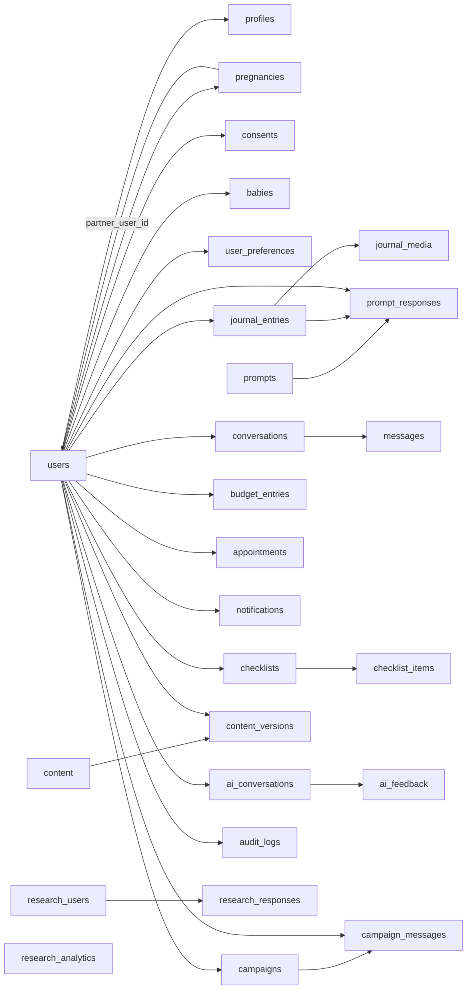
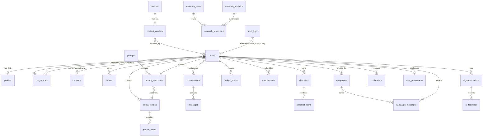

# 05. Database Implementation Plan

**Source of truth:** `docs/FathersNet-Complete-SRS.md` (FN-SRS-001 v2.0) — Database Specification §13, Research Platform §10.1.3, Architecture §15 (ADR-003, AR-011…AR-014), Security & Privacy §14.5–14.8, Deployment §16, Monitoring/Retention §18.1, Disaster Recovery §19.
**Classification convention:** **Confirmed** (SRS-stated) · **Recommended** (engineering decision) · **Configurable** (parameter with default) · **Assumption** (requires human validation). Every major item carries `Source / Confidence / Reasoning / Impact if changed`.
**Scope:** PostgreSQL system of record (ADR-003). All 27 relational tables from SRS §13.3 + §10.1.3, their relationships, indexes, constraints, privacy/retention handling, governance, and verification.

---

## 1. Executive Purpose

This document is the authoritative implementation-level design for the FathersNet (Ayay) PostgreSQL database. It translates the SRS Database Specification into a dependency-safe migration sequence, per-table physical design, index and constraint strategy, and the privacy, retention, and governance controls required by FR-105, FR-125, FR-164, AR-012, AR-013, and AR-014.

The database is the **system of record** (AR-002) and holds every transactional entity from SRS §13: identity (`users`, `profiles`), journey (`pregnancies`, `babies`), consent (`consents`), journaling (`journal_entries`, `journal_media`), prompts (`prompts`, `prompt_responses`), WhatsApp/app conversations (`conversations`, `messages`), birth preparation (`checklists`, `checklist_items`, `budget_entries`, `appointments`), content/CMS (`content`, `content_versions`), campaigns (`campaigns`, `campaign_messages`), AI (`ai_conversations`, `ai_feedback`), research (anonymized `research_users`, `research_responses`, `research_analytics`), and governance (`audit_logs`, `notifications`, `user_preferences`) — **27 tables** (confirmed by the §16.1 deployment diagram reference to a "27-table schema").

Three non-relational stores complement the relational database and are **out of scope** for table definitions but in scope for consistency: a vector store (Qdrant, §9.3) for RAG embeddings and object storage for media (§7.4.2). This document defines the storage-path contract so those stores remain referentially consistent with `journal_media.storage_path`, `budget_entries.receipt_image`, and `research_responses.response_voice_url`.

| Source | Confidence | Reasoning | Impact if changed |
| --- | --- | --- | --- |
| SRS §13.1, ADR-003, AR-002, FR-162 | High | SRS explicitly recommends PostgreSQL as system of record; §16.1 deploys `postgres:16-alpine`; 27-table schema is stated in the deployment diagram | Choosing another RDBMS invalidates ADR-003, §16 reference deployment, and every migration artifact in this plan |

---

## 2. Entity Analysis

Every entity from SRS §13.3 and §10.1.3. Key columns shown; full column sets per the SRS table specifications. Annotations apply to each entity.

### 2.1 `users` — canonical identity

- **Purpose:** canonical identity of each father/partner/staff account (FR-001…FR-010, UC-001).
- **Key columns:** `id` UUID PK (non-guessable, FR-009); `phone_e164` TEXT, unique, **encrypted at rest, never a PK** (§13.3.1, FR-009); `role` (`father`|`partner`|`staff`); `status` (`active`|`suspended`|`deleted`); `created_at`/`updated_at`; `deleted_at` nullable soft-delete.
- **Relationships:** 1:1 `profiles`; 1:0..n `pregnancies`, `babies`, `journal_entries`, `conversations`, `checklists`, `budget_entries`, `appointments`, `ai_conversations`, `notifications`, `campaign_messages`; 1:0..n `consents` (grants); referenced (nullable) by `audit_logs.actor_user_id`, `pregnancies.partner_user_id`, `campaigns.created_by`, `content_versions.reviewed_by`.

| Source | Confidence | Reasoning | Impact if changed |
| --- | --- | --- | --- |
| SRS §13.3.1, §13.4, FR-009, FR-005, FR-022 | High | SRS mandates UUID PK and phone never PK; SQL example provided | Making phone a PK or plaintext breaks FR-009/FR-022 and the privacy baseline |

### 2.2 `profiles` — non-identifying attributes

- **Purpose:** non-identifying profile attributes (FR-002, FR-006).
- **Key columns:** `user_id` UUID PK/FK; `first_name`/`last_name` (optional); `country`/`region`; `age_group` (configurable buckets); `language` (`en`|`am`, FR-138); `cohort` (referral/cohort tagging, FR-010).
- **Relationships:** 1:1 with `users` (PK = FK).

| Source | Confidence | Reasoning | Impact if changed |
| --- | --- | --- | --- |
| SRS §13.3.2, FR-002, FR-010 | High | Table spec explicit; cohort supports FR-010 attribution | Removing `cohort` breaks FR-010 and admin segmentation (FR-095) |

### 2.3 `pregnancies` — journey context

- **Purpose:** pregnancy context and computed journey state (FR-031…FR-037).
- **Key columns:** `id` UUID PK; `user_id` FK; `edd` date; `lmp` date (alternative); `pregnancy_week` int (1–45); `trimester` int; `partner_user_id` nullable self-FK → users (shared journey, FR-039/FR-146).
- **Relationships:** 1:0..n per user; optional self-reference to partner user.

| Source | Confidence | Reasoning | Impact if changed |
| --- | --- | --- | --- |
| SRS §13.3.3, §13.4, FR-031 | High | Table + SQL example given; week 1–45 check confirmed | Removing `partner_user_id` breaks FR-039/FR-146 shared journey; losing `edd`/`lmp` check breaks week computation invariants |

### 2.4 `consents` — immutable, versioned consent events

- **Purpose:** versioned, timestamped, **append-only** consent records (FR-003, FR-004, FR-125, AR-012).
- **Key columns:** `id` UUID PK; `user_id` FK; `consent_type` (`participation`|`research`|`media`|`whatsapp_opt_in`); `version` text (template version); `state` (`granted`|`withdrawn`); `granted_at`; `withdrawn_at`.
- **Relationships:** 1:0..n per user; withdrawal is a **new row** (state=withdrawn), never an UPDATE (append-only). Separate research/media consents independently revocable (FR-117).

| Source | Confidence | Reasoning | Impact if changed |
| --- | --- | --- | --- |
| SRS §13.3.4, §13.4, AR-012, FR-117 | High | "immutable after insert (append-only)" is explicit; SQL example provided | Mutable consents violate AR-012 and destroy proof-of-consent (FR-125) |

### 2.5 `babies` — postnatal records

- **Purpose:** postnatal records activated after the birth event (FR-031/FR-033 transition).
- **Key columns:** `id` UUID PK; `user_id` FK; `birth_date`; `name` (optional); `birth_place` (optional); `notes`.
- **Relationships:** 1:0..n per user.

| Source | Confidence | Reasoning | Impact if changed |
| --- | --- | --- | --- |
| SRS §13.3.5, FR-033 | High | Table spec explicit | Omitting babies breaks the pregnancy→postnatal journey (FR-033, US-002) |

### 2.6 `journal_entries` — father diary

- **Purpose:** father journal/diary entries — text, voice, photo, prompt_response, legacy (FR-051…FR-055).
- **Key columns:** `id` UUID PK; `user_id` FK; `entry_type` (`text`|`voice`|`photo`|`prompt_response`|`legacy`); `content` (text body/transcription); `pregnancy_week`; `shared_with_partner` bool default **false** (private by default, FR-052); `created_at`/`updated_at`.
- **Relationships:** 1:0..n per user; 1:0..n `journal_media`; 0..1 ← `prompt_responses.journal_entry_id`; 1:1 with legacy prompts output (FR-054).
- **Index:** (`user_id`, `created_at DESC`) journal timeline (SRS §13.4).

| Source | Confidence | Reasoning | Impact if changed |
| --- | --- | --- | --- |
| SRS §13.3.6, §13.4, FR-051/052 | High | Table + SQL example; private-by-default confirmed | Public default would violate FR-052/privacy-by-design (FR-123) |

### 2.7 `journal_media` — media attachments

- **Purpose:** media attachments (voice/photo/document) to journal entries with transcription (FR-018, FR-019, FR-055, AR-023).
- **Key columns:** `id` UUID PK; `journal_entry_id` FK; `media_type` (`voice`|`photo`|`document`); `storage_path` (object-storage path, **anonymized** — never phone-based, §7.4.2); `size_bytes` bigint; `transcript` (nullable); `transcript_status` (`pending`|`done`|`failed`).
- **Relationships:** 1:0..n per journal entry.

| Source | Confidence | Reasoning | Impact if changed |
| --- | --- | --- | --- |
| SRS §13.3.7, §7.4.2, FR-018/019/055, AR-023 | High | Table spec + media storage-path rule explicit | Non-anonymized paths would leak identity via object keys (FR-022) |

### 2.8 `prompts` — prompt definitions

- **Purpose:** prompt definitions (weekly, daily pulse, legacy) localized EN/AM (FR-014, FR-015, FR-016).
- **Key columns:** `id` UUID PK; `prompt_type` (`weekly`|`daily_pulse`|`legacy`); `category` (pulse category/week); `body_en`/`body_am`; `active` bool; `version` int.
- **Relationships:** 1:0..n `prompt_responses`. Reference/configuration data; seeded, not user-owned.

| Source | Confidence | Reasoning | Impact if changed |
| --- | --- | --- | --- |
| SRS §13.3.8, FR-014/015/016, §7.3.3 | High | Table spec explicit; weekly prompt content in §7.3.3 is seed source | Missing prompts break UC-002 weekly engagement pipeline |

### 2.9 `prompt_responses` — captured prompt responses

- **Purpose:** captured responses to prompts, each tagged with exactly one research response category (FR-014, FR-015, UC-002).
- **Key columns:** `id` UUID PK; `user_id` FK; `prompt_id` FK; `journal_entry_id` nullable FK (prompt response auto-creates linked journal entry, FR-053); `response_text`; `response_category` (`myth`|`challenge`|`support_act`|`financial`|`clinic_experience`|`legacy`); `created_at`.
- **Relationships:** 1:0..n per user and per prompt; 0..1 journal entry.

| Source | Confidence | Reasoning | Impact if changed |
| --- | --- | --- | --- |
| SRS §13.3.9, §13.4, FR-053, §10.1.1 | High | Table + SQL example; category taxonomy confirmed | Losing the journal link breaks FR-053; losing categories breaks research ingestion (FR-113) |

### 2.10 `conversations` — conversation containers

- **Purpose:** WhatsApp/app conversation containers with state-machine state (FR-028, AR-022).
- **Key columns:** `id` UUID PK; `user_id` FK; `channel` (`whatsapp`|`app`); `state` (state machine states §7.2.1: IDLE, OPT_IN, PROFILE_COLLECTION, WEEKLY_PROMPT, DAILY_PULSE, MYTH_REPORT, SHARE_CHALLENGE, ASK_QUESTION, EMERGENCY, THANK_YOU, GOODBYE); `started_at`/`last_active_at`.
- **Relationships:** 1:0..n per user; 1:0..n `messages`.

| Source | Confidence | Reasoning | Impact if changed |
| --- | --- | --- | --- |
| SRS §13.3.10, §7.2, AR-022 | High | Table spec + state list explicit; persistence across interruption is FR-028 | Dropping `state` breaks flow resume (FR-028) and the state machine contract |

### 2.11 `messages` — individual messages

- **Purpose:** individual messages within a conversation; idempotency/dedup via provider_message_id (FR-023, FR-161).
- **Key columns:** `id` UUID PK; `conversation_id` FK; `direction` (`inbound`|`outbound`); `message_type` (`text`|`audio`|`image`|`template`|`button`); `content` (text/transcript); `media_id` (provider media id, nullable); `provider_message_id` (**unique nullable** — dedup key, FR-161); `created_at`.
- **Relationships:** 1:0..n per conversation.

| Source | Confidence | Reasoning | Impact if changed |
| --- | --- | --- | --- |
| SRS §13.3.11, §13.4, FR-161, §7.4.1 | High | Table + unique provider_message_id explicit; webhook dedup required | Without the unique dedup key, retried webhooks create duplicates (FR-161, §7.4.1) |

### 2.12 `checklists` — checklist definitions/instances

- **Purpose:** per-user checklist instances (hospital bag, birth prep) with computed progress (FR-086, FR-088, UC-004).
- **Key columns:** `id` UUID PK; `user_id` FK; `checklist_type` (`hospital_bag`|`birth_prep`); `title`; `progress` numeric.
- **Relationships:** 1:0..n per user; 1:0..n `checklist_items`.

| Source | Confidence | Reasoning | Impact if changed |
| --- | --- | --- | --- |
| SRS §13.3.12, §13.4, FR-086/088 | High | Table + SQL example; hospital-bag defaults in §8.2 seed content | No checklists → FR-086/US-007 birth-preparedness broken |

### 2.13 `checklist_items` — items within checklists

- **Purpose:** items within a checklist incl. user-added custom items (FR-086, FR-087).
- **Key columns:** `id` UUID PK; `checklist_id` FK; `category` (`Documents`|`Mother`|`Baby`|`Hygiene`|`Extras`); `item_name`; `completed` bool default false; `completed_at` nullable; `custom` bool (user-added, §8.2); `sort_order` int.
- **Relationships:** 1:0..n per checklist.

| Source | Confidence | Reasoning | Impact if changed |
| --- | --- | --- | --- |
| SRS §13.3.13, §13.4, §8.2 | High | Table + SQL example; categories confirmed in §8.2 | Losing `custom` breaks user-added items (API §12.6 POST) |

### 2.14 `budget_entries` — budget tracker records

- **Purpose:** budget tracker planned/actual/variance linked to the shopping list (FR-087, §8.3).
- **Key columns:** `id` UUID PK; `user_id` FK; `category` (`Transport`|`Medical`|`Baby Items`|`Food`|`Clothing`|`Equipment`|`Emergency Fund`|`Other`); `item_name`; `planned_amount` numeric; `actual_amount` nullable; `entry_date`; `notes`; `receipt_image` (object storage ref, nullable).
- **Relationships:** 1:0..n per user.

| Source | Confidence | Reasoning | Impact if changed |
| --- | --- | --- | --- |
| SRS §13.3.14, §13.4, FR-087, §8.3 | High | Table + SQL example; category list from API example §12.7 | Omitting budget breaks FR-087/US-007 shopping-list linkage |

### 2.15 `appointments` — appointments and reminders

- **Purpose:** ANC/vaccination/postnatal appointments and reminders (FR-041…FR-050).
- **Key columns:** `id` UUID PK; `user_id` FK; `appointment_type` (`anc`|`vaccination`|`postnatal`); `scheduled_at`; `reminder_lead` interval (e.g., 7 days); `reminder_channels` jsonb (push/whatsapp/sms); `acknowledged` bool.
- **Relationships:** 1:0..n per user; feeds `notifications` (outbound tracking).

| Source | Confidence | Reasoning | Impact if changed |
| --- | --- | --- | --- |
| SRS §13.3.15, §13.4, FR-041 | High | Table + SQL example explicit | No appointments → reminder engine (FR-041…050, US-006) has no source data |

### 2.16 `content` — content library

- **Purpose:** content library items with lifecycle state controlling AI retrieval (FR-076…FR-083, AR-015).
- **Key columns:** `id` UUID PK; `content_type` (`article`|`video`|`audio`|`infographic`|`checklist`|`faq`); `title_en`/`title_am`; `body_en`/`body_am`; `pregnancy_week` (nullable); `status` (`draft`|`pending_medical_review`|`approved`|`published`|`archived`); `medical_reviewed` bool; `created_at`/`updated_at`.
- **Relationships:** 1:0..n `content_versions`; state machine drives RAG eligibility (AR-015, AR-016).

| Source | Confidence | Reasoning | Impact if changed |
| --- | --- | --- | --- |
| SRS §13.3.16, §13.4, FR-076/078/080/081, AR-015 | High | Table + SQL example; lifecycle confirmed | Breaking lifecycle states lets unapproved content reach users/AI (FR-081, OR-021) |

### 2.17 `content_versions` — version history

- **Purpose:** version history of content with snapshots and reviewer (FR-078, §11.4).
- **Key columns:** `id` UUID PK; `content_id` FK; `version` int; `change_note`; `body_snapshot` jsonb; `reviewed_by` nullable FK → users; `created_at`.
- **Relationships:** 1:0..n per content item; 0..1 reviewer.

| Source | Confidence | Reasoning | Impact if changed |
| --- | --- | --- | --- |
| SRS §13.3.17, FR-078 | High | Table spec explicit; §11.4 requires diff/history/rollback | No versioning breaks CMS rollback and approval audit (FR-078) |

### 2.18 `campaigns` — broadcast campaigns

- **Purpose:** broadcast campaigns with audience segmentation and scheduling (FR-107…FR-112).
- **Key columns:** `id` UUID PK; `name`; `template_id` (approved WhatsApp template); `audience_filter` jsonb; `status` (`draft`|`scheduled`|`sending`|`sent`|`failed`); `scheduled_at`; `created_by` nullable FK → users.
- **Relationships:** 1:0..n `campaign_messages`; created by staff user.

| Source | Confidence | Reasoning | Impact if changed |
| --- | --- | --- | --- |
| SRS §13.3.18, §13.4, FR-107/108 | High | Table + SQL example; template approval gate per AR-021 | No campaign entity → FR-107/US-014 broadcast capability missing |

### 2.19 `campaign_messages` — per-recipient delivery records

- **Purpose:** per-recipient campaign delivery records with status tracking (FR-109, FR-112).
- **Key columns:** `id` UUID PK; `campaign_id` FK; `user_id` FK; `delivery_status` (`queued`|`sent`|`delivered`|`read`|`failed`|`opted_out`); `sent_at`.
- **Relationships:** 1:0..n per campaign; 1:0..n per user; `opted_out` enforces FR-112 immediate removal.
- **Index:** (`campaign_id`, `delivery_status`) (SRS §13.4).

| Source | Confidence | Reasoning | Impact if changed |
| --- | --- | --- | --- |
| SRS §13.3.19, §13.4, FR-109/112 | High | Table + SQL example; status enum confirmed | Losing per-recipient status breaks campaign analytics and opt-out compliance (FR-112) |

### 2.20 `ai_conversations` — AI interaction audit records

- **Purpose:** auditable AI interactions: prompt version, model, provider, question (pseudonymized), answer, sources, safety status (FR-069, AR-019, AR-020).
- **Key columns:** `id` UUID PK; `user_id` FK; `prompt_version` text; `model`/`provider`; `question` (**pseudonymized**); `answer`; `sources` jsonb (cited chunks, FR-060/AR-017); `safety_status` (`normal`|`flagged`|`emergency`); `latency_ms`/`tokens` int; `created_at`.
- **Relationships:** 1:0..n per user; 1:0..n `ai_feedback`.

| Source | Confidence | Reasoning | Impact if changed |
| --- | --- | --- | --- |
| SRS §13.3.20, §9.8, FR-069, AR-019/020 | High | Table spec explicit; pseudonymized question + model/version audit confirmed | Dropping model/version/safety fields breaks AI governance (FR-069, AR-020) |

### 2.21 `ai_feedback` — user feedback on AI answers

- **Purpose:** thumbs up/down feedback loop with low-rated answer review (FR-066, §11.6).
- **Key columns:** `id` UUID PK; `ai_conversation_id` FK; `rating` (`up`|`down`); `comment` nullable; `created_at`.
- **Relationships:** 1:0..n per AI conversation.

| Source | Confidence | Reasoning | Impact if changed |
| --- | --- | --- | --- |
| SRS §13.3.21, FR-066 | High | Table spec explicit; API §12.8 `/v1/ai/feedback` | No feedback → FR-066 loop and AI quality sampling (FR-071) fail |

### 2.22 `research_users` — research-only cohort identity

- **Purpose:** research-only pseudonymous cohort identity; separate research + media consents (FR-113, FR-117, FR-119, §10.1.3).
- **Key columns:** `anonymized_id` text PK (UUID-like, **non-reversible**); `cohort`; `region` (non-identifying); `language`; `consent_research` bool; `consent_media` bool; `created_at`.
- **Relationships:** 1:0..n `research_responses`. **No FK to operational `users`** — deliberate separation (AR-013, §10.1.3 rules). Linkage key stored separately under restricted access.

| Source | Confidence | Reasoning | Impact if changed |
| --- | --- | --- | --- |
| SRS §10.1.3, FR-117, FR-119, AR-013 | High | Research rules confirmed: no PII, separate consents, separate access | Adding operational FKs or PII destroys pseudonymization (FR-119) and violates §10.1.3 rules |

### 2.23 `research_responses` — anonymized research responses

- **Purpose:** anonymized research records from journaling, prompts, myths, challenges, voice transcriptions (FR-113…FR-115, §10.1.3).
- **Key columns:** `anonymized_id` text PK; `response_text`; `response_voice_url` (nullable, anonymized path); `prompt_category` (`weekly`|`daily_pulse`|`legacy`|…); `response_category` (taxonomy §10.1.1); `themes` jsonb (theme array + confidence scores, §10.1.2); `pregnancy_week`; `country`; `sentiment_score` numeric (−1.0…1.0); `created_at`; `is_anonymized` bool default true.
- **Relationships:** many per research user; analytics via `research_analytics`. **Engineering decision (ambiguity resolution):** the SRS §10.1.3 PK column (`anonymized_id`) and the ER-diagram `research_users ||--o{ research_responses : owns` relationship conflict — if `anonymized_id` is a response-level PK, the "owns" relationship has no carrier column. **Resolution:** add `research_user_id` FK column → `research_users.anonymized_id` so each response belongs to one research cohort identity.

| Source | Confidence | Reasoning | Impact if changed |
| --- | --- | --- | --- |
| SRS §10.1.3, FR-113/114/119 | High (schema); Medium (FK resolution is engineering) | Table spec confirmed; FK column resolves the §10.1.3 vs §13.2 diagram ambiguity | Without the FK, cohort-level analysis (FR-115) cannot aggregate responses by research user |

### 2.24 `research_analytics` — aggregated research metrics

- **Purpose:** precomputed research/metric aggregates for dashboards and KPIs (FR-115, FR-118, §10.1.3).
- **Key columns:** `metric` text (themes, sentiment, engagement); `dimension` jsonb (week/region/cohort); `value` numeric; `period_start`/`period_end`; `created_at`.
- **Relationships:** standalone; populated by the analytics pipeline (RS service, FR-160).

| Source | Confidence | Reasoning | Impact if changed |
| --- | --- | --- | --- |
| SRS §10.1.3, FR-115/118 | High | Table spec explicit | No analytics table → research dashboard (AR-032) recomputes or fails at scale |

### 2.25 `audit_logs` — immutable security/operations audit trail

- **Purpose:** immutable, tamper-evident audit trail (FR-098, FR-127, §14.3, NFR-023).
- **Key columns:** `id` bigserial PK; `actor_user_id` nullable FK → users (system actions null); `action` (e.g., `user.update`, `consent.withdraw`, `export.request`); `resource_type`/`resource_id` text; `ip` inet; `user_agent`; `result` (`success`|`denied`|`error`); `created_at`.
- **Relationships:** optional reference to acting user; **append-only — no UPDATE/DELETE** (§13.3.24, §14.3).

| Source | Confidence | Reasoning | Impact if changed |
| --- | --- | --- | --- |
| SRS §13.3.24, §13.4, §14.3, NFR-023 | High | "append-only (no update/delete)" confirmed + SQL example | Mutable audit logs violate FR-098, NFR-023, and compliance review (OR-019) |

### 2.26 `notifications` — outbound notification tracking

- **Purpose:** outbound notification delivery tracking across channels (FR-041…FR-050, FR-152).
- **Key columns:** `id` UUID PK; `user_id` FK; `type` (`reminder`|`prompt`|`campaign`|`critical`); `channel` (`push`|`whatsapp`|`sms`); `status` (`queued`|`sent`|`delivered`|`failed`); `payload` jsonb; `created_at`.
- **Relationships:** 1:0..n per user; duplicates suppressed across channels (FR-048).

| Source | Confidence | Reasoning | Impact if changed |
| --- | --- | --- | --- |
| SRS §13.3.25, FR-041/045/048 | High | Table spec explicit | No notification tracking → FR-045 failure dashboard and FR-048 dedup impossible |

### 2.27 `user_preferences` — per-user settings

- **Purpose:** language, quiet hours, notification channel order, content category subscriptions (FR-038, FR-043).
- **Key columns:** `user_id` UUID PK/FK; `language`; `quiet_hours` jsonb (start/end per day); `notification_channels` jsonb (order/preference); `content_categories` jsonb.
- **Relationships:** 1:1 with `users`.

| Source | Confidence | Reasoning | Impact if changed |
| --- | --- | --- | --- |
| SRS §13.3.26, FR-038 | High | Table spec explicit; API §12.3 preferences endpoint | No preferences → FR-038 personalization and FR-043 quiet hours fail |

---

## 3. Table Dependency Graph

FK dependency order (children listed after all parents). Graph form and ordered form are equivalent.



**Ordered dependency list (parents before children):**

1. `users`
2. `profiles`, `pregnancies` (+ self-FK), `consents`, `babies`, `user_preferences`, `prompts`, `content`, `research_users` (leaf parents, no inter-dependencies)
3. `journal_entries`, `conversations`, `checklists`, `budget_entries`, `appointments`, `ai_conversations`, `notifications`, `campaigns`, `content_versions`, `audit_logs`
4. `journal_media`, `prompt_responses`, `messages`, `checklist_items`, `campaign_messages`, `ai_feedback`, `research_responses`, `research_analytics` (leaf children)

| Source | Confidence | Reasoning | Impact if changed |
| --- | --- | --- | --- |
| SRS §13.2 ER diagram + §13.3 FK columns | High | FK columns are explicit in every table spec | Reordering violates FK constraints and breaks the migration sequence |

---

## 4. Migration Order

### 4.1 Migration tooling recommendation

**Recommendation: `node-pg-migrate` as the primary schema-migration tool.**

| Source | Confidence | Reasoning | Impact if changed |
| --- | --- | --- | --- |
| FR-164, SRS §16.1/§17.2 (Node.js backend) — Engineering recommendation | Medium | Backend is Node.js (Jest, §17.2; Docker reference §16.1), so a single Node toolchain avoids a JVM (Flyway) or ORM-coupling (Prisma) dependency. `node-pg-migrate` provides file-based versioned migrations with reversible `up`/`down`, plain-SQL support, and a tracking table — satisfying FR-164 (versioned, automatic, audited) and AR-011 discipline. It runs in CI as a dedicated migration step and can take a `pg_advisory_lock` to guarantee a single migrator during deploy | A different tool changes CI wiring and migration file syntax, not the schema itself; FR-164 still must be met by the replacement |

**Alternatives (evaluated):** Prisma Migrate (excellent DX but couples every microservice to the Prisma schema/engine), Flyway (mature, reversible, but JVM runtime in a Node repo), dbmate/golang-migrate (lightweight SQL-first, weaker JS data-migration ergonomics). Documented in `decision-log.md`.

### 4.2 Migration sequence (dependency-safe, reversible)

Migrations are numbered, atomic (wrapped in a transaction where PostgreSQL allows), and shipped with `down` scripts. Migration 001 also installs the helper objects referenced later.

| # | Migration | Tables / Objects | Depends on | Purpose |
| --- | --- | --- | --- | --- |
| 001 | `extensions-and-schemas` | `pgcrypto`, `pg_trgm`; `fn_research` schema; research roles | — | Prerequisites: `gen_random_uuid()`, search; AR-013 research separation scaffolding |
| 002 | `users-and-profiles` | `users`, `profiles` | 001 | Identity (FR-001…FR-010); phone encryption columns + HMAC digest column |
| 003 | `pregnancies-and-babies` | `pregnancies`, `babies` | 002 | Journey context (FR-031…FR-037, FR-033) |
| 004 | `consents-and-preferences` | `consents`, `user_preferences` | 002 | Append-only consents (AR-012); preferences (FR-038) |
| 005 | `prompts` | `prompts` | 001 | Prompt definitions (FR-014…016); seed hook |
| 006 | `journal` | `journal_entries`, `journal_media` | 002 | Journal + media (FR-051…055) |
| 007 | `prompt-responses` | `prompt_responses` | 002, 005, 006 | Response capture + journal linkage (FR-053) |
| 008 | `conversations-and-messages` | `conversations`, `messages` | 002 | WhatsApp/app chat + idempotency (FR-023, FR-161) |
| 009 | `checklists` | `checklists`, `checklist_items` | 002 | Birth preparation (FR-086…088); seed hook for §8.2 defaults |
| 010 | `budget-and-appointments` | `budget_entries`, `appointments` | 002 | Budget (FR-087); reminders (FR-041) |
| 011 | `content` | `content`, `content_versions` | 002 | CMS + versioning (FR-076…083) |
| 012 | `campaigns` | `campaigns`, `campaign_messages` | 002 | Broadcasts (FR-107…112) |
| 013 | `ai-audit` | `ai_conversations`, `ai_feedback` | 002 | AI audit + feedback (FR-066, FR-069) |
| 014 | `notifications` | `notifications` | 002 | Outbound tracking (FR-041…050) |
| 015 | `audit-log` | `audit_logs` + append-only trigger + tamper hash | 002 | Immutable audit (FR-098, §14.3) |
| 016 | `research-schema` | `research_users`, `research_responses`, `research_analytics` + grants | 001, (data from 006/007/013 via pipeline) | Anonymized research tables (AR-013, §10.1.3) |
| 017 | `seed-data` | prompts (weekly/daily/legacy from §7.3.3/7.3.4/7.3.5), hospital-bag checklist defaults (§8.2), budget categories, retention-policy configuration | 005, 009, 010 | Reference/config seed (FR-014, FR-086) |
| 018 | `reminders` | `reminder_templates`, `reminder_instances`, `reminder_dispatches` | 002 | Reminder engine (FR-041…050, WP-021) |

**Notes:** Operational tables remain in the default `public` schema to match SRS §13.4 SQL verbatim; research tables live in `fn_research` (see §8). Retention-policy configuration (FR-105) is seeded in migration 017 and referenced by the purge jobs in §9.

| Source | Confidence | Reasoning | Impact if changed |
| --- | --- | --- | --- |
| SRS §13.3 ordering, §16.1 (27-table schema), FR-164 — Engineering recommendation | Medium | Groups co-dependent tables; every migration only references already-created parents; enables incremental rollout and data backfills | Reordering invalidates FK constraints; merging all tables into one migration reduces reviewability and rollback granularity |

### 4.3 Auth-state storage decision (DECIDED 2026-08-06 — Option A, Redis-only)

The four auth tables proposed by `06-backend-development-plan.md` Phase B (`otp_codes`, `refresh_tokens`, `staff_users`, `staff_mfa`) are **not** in the SRS §13.3 table catalog (§13.3.1…§13.3.27) and **not** in the §4.2 migration table above. The approved position in `03-system-architecture-plan.md` (§3.1, D-07) and `11-security-and-privacy-plan.md` (§3.2) is Redis-hosted OTP state and revoked-token checks; `06` Phase B additionally proposes a Postgres record ("OTP store (Redis + Postgres record)"). Storage strategy was an architecture decision deferred to the DB architect; both options are documented below. **DECIDED 2026-08-06 (Project Owner): Option A — Redis-only auth state for WP-016** via a provider-agnostic adapter + test-double (M-08); no auth tables; no auth migration (migration `018` is the WP-021 reminders migration — see §4.2, D-10). Option B remains the documented Phase 3 (WP-025) upgrade path if durable rotation history/audit is required.

| Option | Tables | Mechanics | Pros | Cons |
| --- | --- | --- | --- | --- |
| A. Redis-only | none added | OTP state + revoked-token checks in Redis with TTL; refresh-rotation reuse-detection via a Redis revoked set (`03` §3.1, D-07; `11` §3.2) | Matches the approved `03`/`11` position and the SRS §13.3 catalog; no schema extension; no new migration | OTP/token history not durable beyond Redis TTL; rotation reuse-detection depends on revocation-list retention discipline |
| B. Redis + Postgres record | `otp_codes`, `refresh_tokens`, `staff_users`, `staff_mfa` (`06` Phase B) | Redis for fast checks; Postgres durable record for rotation history/audit | Durable rotation + audit trail; reuse-detection survives Redis flush; staff model (Phase L) needs a persistent table regardless | Extends the schema beyond SRS §13.3 (requires a `decision-log.md` entry + approval); new §4.2 migration (proposed append as `019` — `018` was taken by the WP-021 reminders migration, decision-log D-10) |

**Decision path.** **DECIDED 2026-08-06 (Project Owner): Option A.** Per the §4.3 decision path: `06` Phase B updated to drop the four tables and cite Redis + `audit_logs` (migration 015); recorded in `decision-log.md` (D-09, closure record §3.1). `staff_users`/`staff_mfa` (needed by Phase L regardless) remain deferred and may be decided separately from the OTP/refresh-token store. **Status: DECIDED — Option A (Redis-only); no auth tables; no auth migration. Migration `018` (WP-021 reminders, decision-log D-10) uses the append slot formerly reserved here; if durable rotation/audit is later required, Option B (append `019`) remains the documented upgrade path.**

---

## 5. Relationships

### 5.1 Cardinality map (from SRS §13.2)

| Relationship | Cardinality | Cascade on parent delete |
| --- | --- | --- |
| users → profiles | 1:1 | CASCADE |
| users → pregnancies | 1:0..n | CASCADE (§13.4) |
| users → consents | 1:0..n | CASCADE (§13.4) |
| users → babies | 1:0..n | CASCADE (recommended) |
| users → journal_entries | 1:0..n | CASCADE (§13.4) |
| journal_entries → journal_media | 1:0..n | CASCADE (recommended) |
| users → conversations | 1:0..n | CASCADE (recommended) |
| conversations → messages | 1:0..n | CASCADE (recommended) |
| users → checklists | 1:0..n | CASCADE (§13.4) |
| checklists → checklist_items | 1:0..n | CASCADE (§13.4) |
| users → budget_entries | 1:0..n | CASCADE (§13.4) |
| users → appointments | 1:0..n | CASCADE (§13.4) |
| users → ai_conversations | 1:0..n | CASCADE (recommended; see §8 erasure note) |
| ai_conversations → ai_feedback | 1:0..n | CASCADE (recommended) |
| users → notifications | 1:0..n | CASCADE (recommended) |
| users → user_preferences | 1:1 | CASCADE (recommended) |
| content → content_versions | 1:0..n | CASCADE (recommended) |
| campaigns → campaign_messages | 1:0..n | CASCADE (§13.4) |
| campaign_messages → users (target) | n:1 | CASCADE (§13.4) |
| prompts → prompt_responses | 1:0..n | RESTRICT (reference data must not vanish) |
| users → prompt_responses | 1:0..n | CASCADE (§13.4) |
| journal_entries → prompt_responses | 1:0..1 | SET NULL (response survives journal deletion) |
| users → audit_logs (actor) | 1:0..n | **SET NULL** (audit must survive actor erasure) |
| users → campaigns (created_by) | 1:0..n | SET NULL (recommended) |
| users → content_versions (reviewed_by) | 1:0..n | SET NULL (recommended) |
| users → pregnancies (partner_user_id) | 1:0..n | SET NULL (recommended) |
| research_users → research_responses | 1:0..n | CASCADE (per withdrawal policy; no operational FK) |
| users → research_users (linkage key) | **No FK** | Linkage key stored separately, restricted (recommended) |

### 5.2 Cascade policy

- **User-owned operational data (journal, consent, media, chat, checklists, budget, appointments, notifications):** CASCADE — consistent with SRS §13.4 and required for right-to-erasure (FR-007, FR-128).
- **Reference/audit-adjacent FKs:** SET NULL — `audit_logs.actor_user_id`, `campaigns.created_by`, `content_versions.reviewed_by`, `pregnancies.partner_user_id`, `prompt_responses.journal_entry_id`.
- **Research:** no operational FK; deletion governed by consent/ethics policy (§9).

### 5.3 Many-to-many relationships

There are **no** native junction tables in the SRS model. Effectively-many-to-many behaviors are handled through link columns: `campaign_messages` links campaigns↔users (many-to-many via join rows), `prompt_responses` links users↔prompts, `audit_logs` links users↔actions, `content_versions.reviewed_by` links content↔staff. This matches §13.2 and keeps the model minimal; introduce junction tables only if a feature (e.g., future community groups, FR-143+) demands true M:N with attributes.

| Source | Confidence | Reasoning | Impact if changed |
| --- | --- | --- | --- |
| SRS §13.2, §13.4 | High | ER diagram + SQL define all cardinalities | Adding/removing cascades changes erasure and audit behavior; SET NULL FKs are engineering safeguards |

---

## 6. Index Strategy

Rule: index the hot paths only; every query must be explainable (NFR-008 predictable query performance). The composite indexes below are **mandated**; additional per-table indexes are engineering recommendations for known hot paths and capacity targets (§5.9: ~10k outbound/day, 5k AI/day, 500 concurrent conversations).

| Table | Mandated index (SRS §13.4) | Additional (Recommended) | Hot path served |
| --- | --- | --- | --- |
| users | unique (`phone_e164` or digest), (`status`) | unique index on `phone_e164_digest` (HMAC keyed) | OTP lookup, dedup, admin filter (FR-005, FR-009) |
| profiles | — | (`cohort`), (`language`), (`region`), (`language`,`region`,`cohort`) | Admin segmentation, campaign audience (FR-095, FR-107) |
| pregnancies | (`user_id`), (`edd`) | partial unique (`user_id`) WHERE active-journey marker; (`partner_user_id`) | Week advance scheduler, milestone engine (FR-031/033/037) |
| consents | (`user_id`, `consent_type`) | partial unique (`user_id`,`consent_type`) WHERE `state='granted'`; index (`state`) | Single active grant per type; consent views (FR-100) |
| babies | — | (`user_id`), (`birth_date`) | Postnatal journey (FR-033) |
| journal_entries | **(`user_id`, `created_at DESC`)** | GIN `tsvector` on `content`; (`entry_type`); (`shared_with_partner`) | Timeline (FR-051), searchable transcription (FR-055), admin review (FR-058) |
| journal_media | — | (`journal_entry_id`), unique (`storage_path`) | Media load, retention/cleanup jobs |
| prompts | — | (`prompt_type`, `active`), (`category`) | Weekly/daily scheduler selection (FR-014/015) |
| prompt_responses | (`user_id`), (`prompt_id`) | (`user_id`, `created_at DESC`); (`response_category`, `created_at DESC`) | Response timeline; research ingestion (FR-113) |
| conversations | — | (`user_id`, `last_active_at DESC`), (`user_id`, `channel`) | Resume last conversation (FR-028, AR-022) |
| messages | unique `provider_message_id` (partial) | (`conversation_id`, `created_at`); (`direction`); (`created_at`) | Thread view; dedup (FR-161); analytics (FR-030) |
| checklists | (`user_id`) | partial unique (`user_id`, `checklist_type`); (`checklist_type`) | One instance per type; dashboard progress (FR-088) |
| checklist_items | — | (`checklist_id`, `sort_order`) | Ordered item list (§8.2) |
| budget_entries | (`user_id`) | (`user_id`, `entry_date DESC`), (`category`) | Budget summary/variance (FR-087, §12.7) |
| appointments | — | (`user_id`, `scheduled_at`); (`scheduled_at`) WHERE `acknowledged=false`; (`scheduled_at`) | Reminder engine scans (FR-041/043/045) |
| content | — | (`status`, `pregnancy_week`), (`content_type`, `status`), GIN `tsvector` (`title_en`,`body_en`) | Publishing surfaces (FR-032); search (FR-083); RAG eligibility (AR-015) |
| content_versions | — | unique (`content_id`, `version`) | History diff/rollback (§11.4) |
| campaigns | — | (`status`, `scheduled_at`) | Scheduler (FR-107/111) |
| campaign_messages | **(`campaign_id`, `delivery_status`)** | unique (`campaign_id`, `user_id`); (`user_id`) | Delivery dashboard (FR-109); dup-send prevention; opt-out lookup (FR-112) |
| ai_conversations | — | (`user_id`, `created_at DESC`); (`safety_status`, `created_at DESC`); (`model`, `created_at`); (`created_at`) | User history; AI ops queue (FR-067); cost/latency analytics (FR-071, §9.8); retention |
| ai_feedback | — | unique (`ai_conversation_id`); (`rating`, `created_at`) | One feedback per conversation; low-rated review (FR-066) |
| research_responses | `response_category`, `created_at` (§13.4) | **composite (`response_category`, `created_at DESC`)**; (`pregnancy_week`); GIN (`themes`); (`research_user_id`) | Research dashboards by category/week/theme (FR-114/115) |
| research_users | — | (`cohort`), (`created_at`) | Cohort analysis (FR-115, §11.5) |
| research_analytics | — | (`metric`, `period_start`, `period_end`), GIN (`dimension`) | KPI/time-window queries (FR-118) |
| audit_logs | `created_at`, `action` (§13.4) | (`action`, `created_at DESC`); (`actor_user_id`, `created_at DESC`); (`resource_type`, `resource_id`) | Immutable audit view (FR-098); access-log review (FR-127) |
| notifications | — | (`user_id`, `created_at DESC`); (`status`); (`type`); partial (`status='queued'`) | Delivery worker polling (FR-045); dedup (FR-048) |
| user_preferences | — | (PK only) | 1:1 lookup |

**Amharic caveat (Confirmed limitation):** Amharic word segmentation is not supported by PostgreSQL default tokenizers; Amharic search/theme indexing is handled by the AI/research pipeline (Anonymized, §10.1.2), not DB FTS.

| Source | Confidence | Reasoning | Impact if changed |
| --- | --- | --- | --- |
| SRS §13.4 indexes + FR-014/015/109 + NFR-008 — Engineering recommendation for additions | Medium | Mandated indexes are SRS-confirmed; additions target §5.9 capacity hot paths and §18.2 monitoring (slow-query) | Missing mandated composites degrades timelines/campaign/research dashboards to sequential scans at scale |

---

## 7. Constraints & Data Integrity

### 7.1 Check constraints (enum enforcement — matches SRS §13.4 exactly)

Use `TEXT` + `CHECK` (not native ENUM) so value sets are additive and extendable without `ALTER TYPE` locks (Engineering recommendation). Checks apply to:

- `users.role` IN (`father`,`partner`,`staff`); `users.status` IN (`active`,`suspended`,`deleted`)
- `consents.consent_type` IN (`participation`,`research`,`media`,`whatsapp_opt_in`); `consents.state` IN (`granted`,`withdrawn`)
- `journal_entries.entry_type` IN (`text`,`voice`,`photo`,`prompt_response`,`legacy`)
- `journal_media.media_type` IN (`voice`,`photo`,`document`); `transcript_status` IN (`pending`,`done`,`failed`)
- `prompts.prompt_type` IN (`weekly`,`daily_pulse`,`legacy`)
- `prompt_responses.response_category` IN (`myth`,`challenge`,`support_act`,`financial`,`clinic_experience`,`legacy`)
- `conversations.channel` IN (`whatsapp`,`app`); `state` IN (state machine §7.2.1)
- `messages.direction` IN (`inbound`,`outbound`); `message_type` IN (`text`,`audio`,`image`,`template`,`button`)
- `checklists.checklist_type` IN (`hospital_bag`,`birth_prep`)
- `checklist_items.category` IN (`Documents`,`Mother`,`Baby`,`Hygiene`,`Extras`)
- `budget_entries.category` IN (`Transport`,`Medical`,`Baby Items`,`Food`,`Clothing`,`Equipment`,`Emergency Fund`,`Other`)
- `appointments.appointment_type` IN (`anc`,`vaccination`,`postnatal`)
- `content.content_type` IN (`article`,`video`,`audio`,`infographic`,`checklist`,`faq`); `status` IN (`draft`,`pending_medical_review`,`approved`,`published`,`archived`)
- `campaigns.status` IN (`draft`,`scheduled`,`sending`,`sent`,`failed`)
- `campaign_messages.delivery_status` IN (`queued`,`sent`,`delivered`,`read`,`failed`,`opted_out`)
- `ai_conversations.safety_status` IN (`normal`,`flagged`,`emergency`); `ai_feedback.rating` IN (`up`,`down`)
- `audit_logs.result` IN (`success`,`denied`,`error`)
- `notifications.type` IN (`reminder`,`prompt`,`campaign`,`critical`); `channel` IN (`push`,`whatsapp`,`sms`); `status` IN (`queued`,`sent`,`delivered`,`failed`)
- `profiles.language` IN (`en`,`am`); `users`-adjacent preferences mirror this
- Domain checks: `pregnancies.pregnancy_week` BETWEEN 1 AND 45; `pregnancies` `CHECK (edd IS NOT NULL OR lmp IS NOT NULL)`; `research_responses.sentiment_score` BETWEEN −1.0 AND 1.0; `is_anonymized = TRUE` always.

### 7.2 Unique constraints

- `users.id` PK; unique `phone_e164`-digest (§8).
- `profiles.user_id` PK (1:1).
- `messages.provider_message_id` **partial unique** `WHERE provider_message_id IS NOT NULL` (dedup, FR-161).
- `campaign_messages` unique (`campaign_id`, `user_id`) — one delivery record per recipient per campaign (recommended).
- `content_versions` unique (`content_id`, `version`).
- `consents` partial unique (`user_id`,`consent_type`) `WHERE state='granted'` (recommended).
- `checklists` partial unique (`user_id`,`checklist_type`) (recommended).
- `research_responses.anonymized_id` PK; `research_users.anonymized_id` PK.

### 7.3 Append-only consents (AR-012)

- `consents` is **insert-only**: `withdrawn_at` is set on a **new row** (`state='withdrawn'`), never by UPDATE of a granted row (SRS: "immutable after insert (append-only)"). A trigger (`fn_prevent_consent_mutation`) raises `EXCEPTION` on UPDATE/DELETE of granted consent rows. Partial unique index in §7.2 enforces one active grant per type; re-consent = withdraw-old + grant-new in one transaction.

```sql
-- Specification (FR-125, AR-012)
CREATE TRIGGER trg_consents_append_only
BEFORE UPDATE OR DELETE ON consents
FOR EACH ROW EXECUTE FUNCTION fn_reject_mutation();
```

### 7.4 Immutable audit_logs (§13.3.24, §14.3, NFR-023)

- Append-only enforced by (a) `REVOKE UPDATE, DELETE` on `audit_logs` from all app roles, and (b) a `BEFORE UPDATE OR DELETE` trigger raising an exception (defense-in-depth).
- **Tamper-evidence (Engineering recommendation):** add `prev_hash` + `row_hash` columns forming a SHA-256 hash chain (each row hashes previous row's hash + content). Recalculation is a periodic integrity job. If changed to mutable, NFR-023 and OR-019 compliance fail.

### 7.5 Referential integrity

All FKs `NOT NULL` except those documented as nullable (`partner_user_id`, `journal_entry_id`, `reviewed_by`, `created_by`, `actor_user_id`, `media_id`, `provider_message_id`, monetary `actual_amount`). Cascade policy per §5.2. `ON DELETE` behavior is validated in migration tests (§13).

| Source | Confidence | Reasoning | Impact if changed |
| --- | --- | --- | --- |
| SRS §13.3/§13.4 checks + §7.2 state machine + FR-125/FR-161 + Engineering recommendation | High | All checks mirror SRS SQL verbatim; immutability + partial-unique additions implement AR-012/FR-161 | Weakening checks or immutability breaks consent proof (FR-125), dedup (FR-161), and audit compliance (NFR-023) |

---

## 8. Privacy Considerations

### 8.1 Phone E.164 encryption at rest (§13.3.1, FR-123, §14.2)

`phone_e164` is a first-class PII field and is **never a PK** (FR-009). Design (Engineering recommendation):

- **At-rest encryption (app layer):** `phone_e164` stores AES-256-GCM ciphertext produced by the identity service using a KMS envelope key. `pgcrypto` is **not** used for this (key hygiene: KMS-managed, §14.2).
- **Uniqueness/lookup without decrypting:** add `phone_e164_digest` = keyed HMAC-SHA256 (secret from KMS) with a **unique** index — OTP send (FR-005) and dedup match on the digest, never on ciphertext.
- **Lookup uniqueness nuance:** deterministic encryption would be required for DB-level uniqueness on ciphertext; using the keyed digest avoids that weakness and is the recommended mechanism.
- **Masking:** admin surfaces render masked forms (`+2519••••••`) (§11.2, FR-022); full number never in logs (FR-127, §14.3).

### 8.2 Pseudonymization at collection (FR-119, NFR-027)

- `ai_conversations.question` stores only pseudonymized text; operational→research transformation strips identifiers before writing `research_responses.response_text` (FR-119).
- `journal_media.storage_path` / `budget_entries.receipt_image` / `research_responses.response_voice_url` use anonymized object keys (`s3://…/media/voice/<anonymized_user_id>/<message_id>.<ext>`, §7.4.2) — never phone/name.

### 8.3 Research separation (AR-013, §10.1.3)

- Research tables live in a dedicated `fn_research` schema; operational tables in `public` (logical separation).
- Dedicated roles: `research_writer` (pipeline only) and `research_reader` (researchers, MFA-gated, read-only), granted least privilege; **no** operational write grants.
- **No FKs from research tables to operational `users`.** The linkage key (anonymized_id ↔ user) is stored separately, encrypted, restricted-access (§10.1.3 audit rule), and never exposed to `research_reader`.
- Research access/export is audit-logged (FR-116, FR-122); the research dashboard reads only `fn_research` (AR-032).
- **Production option (recommended for scale):** migrate research tables to a separate physical database/cluster with its own backup cycle; schema/migrations stay in this plan under `fn_research`.

### 8.4 Row-level security (defense-in-depth, Engineering recommendation)

Enable RLS on user-owned tables (`profiles`, `pregnancies`, `journal_entries`, `journal_media`, `prompt_responses`, `conversations`, `messages`, `checklists`, `checklist_items`, `budget_entries`, `appointments`, `notifications`, `ai_conversations`, `user_preferences`) keyed on `current_setting('app.user_id')` set by the API per authenticated request. Primary authorization stays in the service layer (FR-126); RLS is the second line against IDOR/leaked credentials (STRIDE §14.1.2).

| Source | Confidence | Reasoning | Impact if changed |
| --- | --- | --- | --- |
| §13.3.1/§14.2/FR-009/FR-123 + §10.1.3/AR-013 + FR-119/FR-126 — Engineering recommendation for mechanics | High (SRS principles); Medium (mechanisms) | SRS mandates encryption, pseudonymization, separation; the specific column/digest/RLS mechanics are engineering choices | Skipping encryption-at-rest or research separation violates FR-123/AR-013 and the §10.1.3 rules |

---

## 9. Data Retention Considerations

### 9.1 Retention per data class (FR-105, AR-014, §18.1, §13.4)

| Data class | Tables | Retention rule (Configurable) | Mechanism |
| --- | --- | --- | --- |
| Identity & profile | `users`, `profiles`, `user_preferences`, `pregnancies`, `babies` | Active account life + erasure grace period (FR-007) | Soft-delete (`deleted_at`) then hard-purge job |
| Consent records | `consents` | **Indefinite (proof of consent, FR-125)**; never purged | Append-only; exempt from purge |
| Journal & media | `journal_entries`, `journal_media` | Per user retention + erasure; media per object policy (FR-150) | Purge + object-storage lifecycle |
| Conversation/message | `conversations`, `messages` | Configurable window (e.g., 12–24 months) | Time-based purge with audit |
| Notifications | `notifications` | Configurable window (e.g., 12 months) | Time-based purge |
| Appointments/checklists/budget | `appointments`, `checklists`, `checklist_items`, `budget_entries` | Life of user account; erasure on delete | User-scoped purge |
| Content/CMS | `content`, `content_versions` | Indefinite (governed library); archives retained | Never auto-purged; lifecycle states |
| Campaigns | `campaigns`, `campaign_messages` | Configurable (e.g., 24 months); `opted_out` retained for compliance (FR-112) | Time-based purge, audit |
| AI interactions | `ai_conversations`, `ai_feedback` | Per AI governance policy (§18.1); pseudonymized; erasure per §8 tension note | Purge + retention policy |
| Research | `fn_research` tables | Per research consent terms + ethics approval; **withdrawal → restriction + scheduled deletion** (§13.4) | Consent-event-driven purge; governance-approved |
| Audit logs | `audit_logs` | Per compliance policy (§18.1); **immutable, not purged** (except policy-defined archival) | Append-only + archival |
| Application logs | (non-DB) | 30 days (§18.1) | Log platform |

### 9.2 Automated purge jobs (FR-105, AR-014)

- Run on the scheduled/queued job platform (n8n reference, §16.1; AR-007) with idempotency and observability.
- Each purge run: selects rows whose retention deadline passed → deletes in bounded batches → writes an `audit_logs` entry (`action='retention.purge', resource_type=<table>`, count + period) — "purge the purge" (SRS §13.4: "audit the purge").
- Config table seeded in migration 017: `retention_policy(key, table, retention_duration, enabled, purge_batch_size)` (Engineering recommendation; SRS FR-105 "configurable per data class").
- Purge must honor grace period before hard delete (FR-007) and must not touch `consents`/`audit_logs` exempt classes.

### 9.3 Consent withdrawal handling (FR-004, FR-117, FR-125)

1. `consents`: new row `state='withdrawn'`, `withdrawn_at=now()` (append-only; proof preserved).
2. Restrict non-essential processing: stop new broadcasts/campaign targeting (FR-017, FR-112), stop research/theme ingestion for that user.
3. Research: mark `research_users.consent_research=false`; per §13.4 schedule deletion of that user's anonymized records per ethics policy; media consent withdrawal → stop letter/media use.
4. Data subject erasure (FR-007/FR-128): soft-delete → grace period → hard purge with verifiable-deletion record (NFR-024).

| Source | Confidence | Reasoning | Impact if changed |
| --- | --- | --- | --- |
| FR-105, AR-014, §13.4, §18.1, §19, FR-004/007 — Engineering recommendation for config mechanism | High | Retention classes and purge mandate are SRS-confirmed; the config table and job design are engineering | Missing purge jobs or consent-exempt logic violates FR-105 and risks retaining data past policy |

---

## 10. Schema Governance

### 10.1 Versioned migrations (FR-164)

- All schema change via `node-pg-migrate` (or replacement) with a `migrations` tracking table; migrations immutable once applied in any environment.
- **Convention:** additive-first (new columns nullable / with default; new tables; new indexes); destructive changes (drops, type changes, renames) gated by review, shipped as explicit down migrations, and rehearsed on staging (AR-036/AR-037, QR-016).
- Single-migrator advisory lock (`pg_advisory_lock`) so concurrent deploys cannot race (Engineering recommendation).
- Migration files co-located in the repository and CI-verified by applying the full sequence to an ephemeral database on every PR.

### 10.2 Reversibility

- Every migration ships a `down` script. Reversibility is pragmatic (FR-164 "reversible/audited"): additive migrations are trivially reversible; destructive/backfill migrations are reversible where safe and documented otherwise. Rollback runbook in `12-devops-and-infrastructure-plan.md`.

### 10.3 Seed data

- Migration 017 seeds: weekly prompts (§7.3.3), daily pulse categories/questions (§7.3.4), legacy prompt (§7.3.5), hospital-bag checklist defaults (§8.2), budget categories (§12.7), response-category taxonomy (§10.1.1), retention-policy defaults. Content seeding is idempotent (upsert by natural key) to survive re-runs.
- Prompt/content seeds are **configuration**, versioned and re-seeded by release pipeline, not edited in production ad hoc (FR-068 prompt versioning, OR-030).

### 10.4 Environments (AR-009)

- `dev`, `staging`, `prod` each with isolated databases and credentials; **no production data in lower environments** (AR-009, QR-012) — synthetic fixtures only.
- Promotion path: migration sequence runs in CI on ephemeral DB → staging → prod; `staging` mirrors prod schema version for restore drills (§19).
- Data export/import tooling (OR-024) uses the migration-tracked schema plus pg_dump, never hand-edited DDL.

| Source | Confidence | Reasoning | Impact if changed |
| --- | --- | --- | --- |
| FR-164, AR-009, AR-036, QR-012, OR-024 — Engineering recommendation for conventions | Medium | SRS mandates versioned/reversible/audited migrations and env isolation; the specific conventions are engineering | Non-versioned or irreversible migrations block zero-downtime deploys and rollback (NFR-038, FR-164) |

---

## 11. Mermaid ER Diagram

Reproduction of SRS §13.2, refined with resolved/added relationships: `research_responses.research_user_id` (see §2.23), `content_versions.reviewed_by`, `campaigns.created_by`, `pregnancies.partner_user_id`, and the `audit_logs` actor link.



| Source | Confidence | Reasoning | Impact if changed |
| --- | --- | --- | --- |
| SRS §13.2 + §13.3 FK columns — refinements engineering | High | Base diagram reproduced; refinements resolve documented ambiguity (§2.23) and surface nullable staff FKs | Diverging from §13.2 without a decision-log entry will confuse handoff (19-engineering-handoff-package.md) |

---

## 12. Risks and Mitigations

| # | Risk | Source | Impact | Mitigation |
| --- | --- | --- | --- | --- |
| R-01 | Migration tool mismatch with team (JVM vs Node) | Engineering | CI/deploy friction | Lock `node-pg-migrate` decision in `decision-log.md`; document Flyway/dbmate escape hatch |
| R-02 | Phone encryption breaks uniqueness/lookup at scale | Engineering (FR-009) | Duplicate accounts; OTP failures | Keyed HMAC digest column + unique index; load-test OTP path |
| R-03 | Research separation insufficient (schema-only) | AR-013 | PII leakage to research roles | Physical-database option at scale; least-privilege roles; no operational FKs; access audit |
| R-04 | Append-only consents/audit bypassed by privileged roles | AR-012, NFR-023 | Compliance failure | Triggers + revoked DML privileges + hash chain + quarterly integrity check (OR-026) |
| R-05 | Purge jobs over-delete or miss exempt classes | FR-105/AR-014 | Data loss or non-compliance | Exempt-class allowlist (`consents`, `audit_logs`); config table; audit records; restore drills (§19) |
| R-06 | Erasure vs AI-audit tension (FR-007 vs FR-069/AR-020) | Engineering | Legal conflict | Pseudonymize retained AI audit copy or cascade-delete with audit_logs recording the erasure; decision recorded in `decision-log.md` |
| R-07 | Cascade deletes run wide on user erasure | FR-007 | Performance / partial erase | Batched soft→hard purge; test 500-concurrent and cohort-scale erasure |
| R-08 | Amharic FTS unsupported in PostgreSQL | FR-055/FR-083 | Poor search UX | Search via AI/research pipeline on transcriptions; FTS limited to English; documented limitation |
| R-09 | Schema drift between app code and DB | FR-164 | Runtime failures | Migrations in CI gate; contract tests; `staging` restore mirror |
| R-10 | RLS misconfiguration blocks legitimate service access | Engineering | AuthN flakiness | RLS policies tested per role in CI; service-layer auth remains primary (FR-126) |
| R-11 | 27-table single-DB bottleneck at scale | NFR-001/009 | Slow queries | Read replicas, partitioned hot tables (messages, audit_logs, notifications, research_responses) at growth, index review (§18.2) |

| Source | Confidence | Reasoning | Impact if changed |
| --- | --- | --- | --- |
| FR-105/164/007, AR-012/013/014, §19 — engineering synthesis | Medium | Risks derive from SRS constraints and capacity targets (§5.9) | Untreated, any of R-02/R-04/R-05/R-08 blocks pilot compliance gates |

---

## 13. Verification Approach

Mapped to SRS §17 testing + §19 DR. All tests run in CI against an ephemeral PostgreSQL; production verification follows `18-implementation-verification-plan.md`.

### 13.1 Migration tests (FR-164, QR-003, §17.3)

- Apply the full sequence up + down on an empty DB; assert schema reaches base state with zero errors.
- Apply up on a fixture-populated DB (synthetic data, QR-012); assert no orphaned FK, data preserved after reversible data migrations.
- Test idempotency/re-run guard: second apply attempts fail safely (migrations table).
- Assert `fn_research` schema + role grants exist after 001/016; assert research roles cannot DML operational tables.

### 13.2 Integrity tests (§17.3, AR-011)

- Constraint suite: every CHECK enum rejects out-of-band values; `pregnancy_week` 1–45; `edd`/`lmp` presence; sentiment range; `is_anonymized=TRUE` invariant.
- FK/cascade suite: deleting a user cascades journal/chat/budget (with the documented SET NULL exceptions); reference tables (prompts, content) reject deletion while referenced.
- Unique/partial-unique suite: `provider_message_id` dedup; one active granted consent per type; one delivery record per (campaign, user); content version uniqueness.
- Append-only suite: UPDATE/DELETE on `consents` and `audit_logs` raise exceptions; consent withdrawal inserts a `withdrawn` row; hash-chain recompute validates.
- RLS suite: role-scoped SELECT/UPDATE allowed only for `app.user_id`; cross-user access denied (STRIDE A02, §14.1.2).

### 13.3 Retention purge tests (FR-105, AR-014, QR-009)

- Seed expired rows per class; run purge; assert rows deleted in bounded batches and an `audit_logs` entry written (purge is itself audited).
- Assert exempt classes (`consents`, `audit_logs`) never purged; grace-period rows untouched; consent-withdrawal path triggers research restriction + scheduled deletion.

### 13.4 Privacy tests (QR-009, FR-128)

- Encryption-at-rest: `phone_e164` column yields ciphertext only; digest unique-lookup works without decrypt.
- Pseudonymization: research pipeline output contains no operational identifiers; storage paths anonymized.
- Research access: `research_reader` cannot reach `public` tables; export requires governance approval + audit (FR-116/FR-122).

### 13.5 Restore tests (FR-165, §19, OR-012)

- Quarterly restore drill: `pg_restore` to staging, verify row counts and checksums per table; RPO ≤ 15 min / RTO ≤ 4 h (configurable §19).
- Backup verification job (OR automated) restores the daily dump nightly to a scratch DB and runs integrity checks.

### 13.6 Performance tests (NFR-001…009, QR-006)

- Load-test hot paths with §5.9 capacity targets (500 concurrent conversations, ~10k outbound/day, 5k AI/day); assert the §6 composite indexes keep p95 ≤ 2 s (NFR-002); monitor slow queries (§18.2) and confirm no seq-scan regressions on indexed hot paths.

| Source | Confidence | Reasoning | Impact if changed |
| --- | --- | --- | --- |
| SRS §17.3, QR-003/009/012, §19, AR-011 | High | SRS explicitly lists database tests (migrations, indexes, constraints, consent immutability, retention purging) and restore drills | Skipping these tests invalidates QR-013 release gate and §19 RPO/RTO commitments |

---

## 13.7 Plan completeness statement

This document covers all **27 relational tables** from SRS §13.3 and §10.1.3, the §13.2 relationships, mandated + recommended indexes, constraint/integrity rules (including append-only consents and immutable audit logs), privacy controls (encrypted-at-rest phone, pseudonymization, AR-013 research separation), retention and purge behavior (FR-105/AR-014, consent withdrawal), schema governance (FR-164, seed data, environments), the refined ER diagram, risk register, and a full verification strategy. No placeholders remain.
