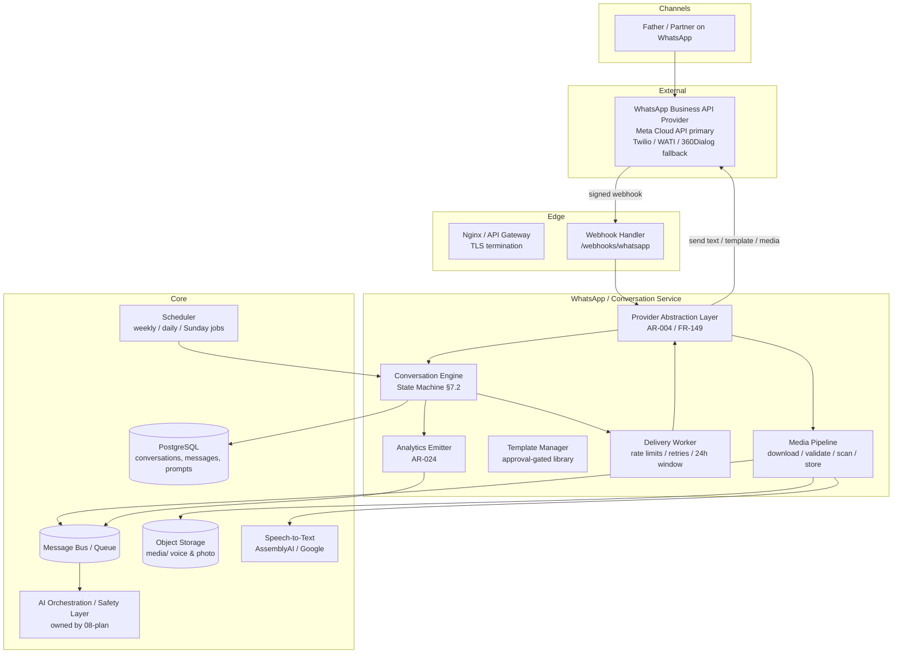
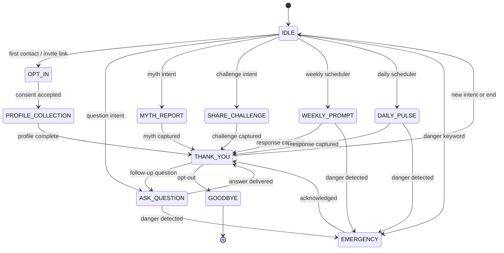
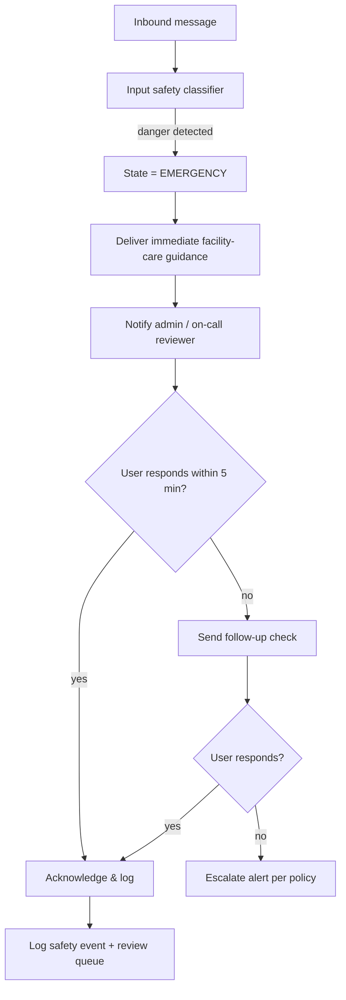

# 07. WhatsApp Platform Implementation Plan

**Source of truth:** `docs/FathersNet-Complete-SRS.md` (FN-SRS-001 v2.0) — WhatsApp Conversational Platform Specification (§7) is the controlling authority for this document, including platform overview (§7.1), conversation state machine (§7.2, all 11 states), message templates (§7.3, incl. Week 1–40 prompts), webhook security and media processing (§7.4). Also binding: WhatsApp channel requirements FR-011…FR-030 (§4.2), architecture requirements AR-004, AR-021…AR-024 (§15.2), API contracts §12.4, non-functional targets NFR-003 and NFR-044 (§5), and the Emergency Escalation Workflow §15.3.
**Inputs:** `00-requirement-inventory.md`, `02-srs-requirement-analysis.md` (dependency map), `03-system-architecture-plan.md`, `04-technology-stack-analysis.md` (provider analysis §13), `06-backend-development-plan.md` (Phase H execution owner).
**Purpose:** Production implementation roadmap for the WhatsApp conversational platform: provider abstraction, webhook, conversation state machine, template library, media pipeline, emergency workflow, messaging controls, analytics feed, testing, dependencies, risks, and verification evidence.
**Classification convention:** **Confirmed** (SRS-mandated) · **Recommended** (engineering decision) · **Configurable** (parameter with default) · **Assumption** (requires human validation). Every major design item carries Source / Confidence / Reasoning / Impact if changed.

---

## 1. Executive Purpose

This document is the controlling engineering roadmap for the **WhatsApp conversational platform** of FathersNet (Ayay) — the primary engagement channel per ADR-001 (WhatsApp-First Architecture) and the top surface for father enrollment, weekly/daily engagement, voice and photo collection, AI-assisted questions, and emergency escalation.

It translates SRS §7 into a buildable, phased sequence that lands the following capabilities, each mapped to its SRS requirements:

| Capability | SRS Requirement | This Document's Section |
| --- | --- | --- |
| Provider-abstraction message gateway | FR-011, FR-149, AR-004, §7.1 | §3 |
| Secure webhook (verification + inbound) | §7.4.1, §12.4, FR-161, FR-025, §14.1.5 | §4 |
| Conversation state machine (11 states) | §7.2, FR-013…020, FR-028, AR-022 | §5 |
| Message template library incl. Week 1–40 | §7.3, FR-012…017, FR-024, FR-138, AR-021 | §6 |
| Media processing (voice + photo) | §7.4.2, FR-018…019, AR-023, FR-150 | §7 |
| Emergency detection & escalation | FR-025, FR-063, §9.6, §15.3 | §8 |
| Messaging controls & compliance | §7.4.3, FR-021, FR-029, FR-107…112, NFR-044 | §9 |
| Near-real-time analytics feed | FR-030, AR-024, §11.1 | §10 |
| Conversational testing | QR-010, §17.3 | §11 |

Scope boundaries: this document owns the WhatsApp service implementation and its integration with the rest of the platform. Database schema (`conversations`, `messages`, `prompts`, `prompt_responses`, `journal_media`, `campaigns`, `campaign_messages`, `ai_conversations`) is specified in `05-database-implementation-plan.md` and §13 of the SRS; AI/RAG answering and the medical safety layer are owned by `08-ai-rag-implementation-plan.md`; backend service sequencing and the event bus are owned by `06-backend-development-plan.md` (Phase H); infrastructure/DevOps by `12-devops-and-infrastructure-plan.md`; security/privacy by `11-security-and-privacy-plan.md`; and quality gates by `13-testing-and-quality-plan.md`.

---

## 2. WhatsApp Architecture

### 2.1 Component Topology

**Attribute** | **Value**
--- | ---
**Source** | §15.1 architecture diagram; FR-159 (WhatsApp service); FR-160 (event bus); FR-011 (managed message gateway); AR-004
**Classification** | Confirmed (components and boundaries); Recommended (worker split)
**Confidence** | High
**Reasoning** | SRS §15.1 places a "Message Gateway / Webhooks" at the edge feeding the Conversation Engine, which talks to User/Pregnancy/Campaign/AI services. The internal split above keeps the provider contract (abstraction), the business rules (state machine), and the delivery mechanics (workers) independently testable and horizontally scalable (NFR-006).
**Impact if changed** | Collapsing the abstraction into the conversation engine re-couples downstream services to provider specifics and violates AR-004's acceptance criterion ("provider swapped in a test → downstream services unaffected"). Merging media into the AI pipeline would block the async transcription contract (NFR-004).

### 2.2 Data Flow — Inbound

1. Provider delivers an inbound webhook POST to `/webhooks/whatsapp` (§4).
2. Webhook handler validates `X-Hub-Signature-256`, acknowledges `200`, and publishes a normalized `message.inbound` event to the bus with the provider message ID as idempotency key (FR-161, §7.4.1).
3. The conversation engine consumer loads the conversation row (`conversations`), applies dedup, classifies language + intent (FR-064), runs the emergency keyword check (FR-025), and transitions the state machine (§5).
4. Media messages are routed to the media pipeline (§7) which downloads, validates, scans, stores, and enqueues transcription.
5. Text and transcribed content are routed to the AI assistant (ASK_QUESTION state) or stored as journal/prompt responses per state.
6. Every exchange is written to `messages` and `conversations.last_active_at` (FR-023); an analytics event is emitted for the AR-024 feed (§10).

### 2.3 Data Flow — Outbound

1. Senders (state machine entry actions, scheduler, campaign service, reminder engine) request outbound delivery with a logical message object and a target user.
2. The delivery worker applies §9 controls: consent/opt-in check (FR-017), 24-hour window check (§7.4.3), per-user daily cap, quiet hours (FR-029), provider throughput throttle.
3. The provider abstraction sends the message (text, template, or media) via the active provider (§3).
4. Delivery status events (`sent`, `delivered`, `read`, `failed`) flow back through the webhook status route (§4.5) into `campaign_messages`/`notifications` and analytics (FR-109).
5. Failures enter the retry policy: exponential backoff 1 → 2 → 4 minutes, max 5 attempts, then alert (FR-021, §7.4.3).

**Attribute** | **Value**
--- | ---
**Source** | §7.4.3 (messaging controls); FR-021 (retry + alerting); §12.4
**Classification** | Confirmed
**Confidence** | High
**Reasoning** | Both flows mirror the SRS-declared async architecture: inbound "acknowledge 200 then queue" (§7.4.1 step 5, NFR-003) and outbound "queue + throttle + retry" (NFR-005, §7.4.3). No synchronous blocking path exists (NFR-004).
**Impact if changed** | A synchronous inbound path would violate NFR-003 (provider timeout + 5 s median) and make transcription/AI (long-running) block the interaction — explicitly forbidden by NFR-004.

### 2.4 Reconciliation of Webhook Paths

SRS §7.4.1 recommends `/webhooks/whatsapp` while §12.4 exposes `/v1/whatsapp/webhook` (GET/POST). These are reconciled by mounting the **public, unauthenticated-by-token provider endpoint at `/webhooks/whatsapp`** (signature-only auth, no bearer) in front of the gateway, and exposing the §12.4 **admin-facing inspection endpoints** (`/v1/whatsapp/users/:id/state`, `/v1/whatsapp/messages`, `/v1/whatsapp/templates`) with bearer + RBAC. Both paths resolve to the same WhatsApp service.

**Attribute** | **Value**
--- | ---
**Source** | §7.4.1; §12.4
**Classification** | Recommended (engineering reconciliation of two SRS-stated paths)
**Confidence** | High
**Reasoning** | §12.1 states all endpoints except OTP request and "WhatsApp webhook verification" require bearer tokens — the webhook must therefore be outside the authenticated surface, matching the §7.4.1 path. Keeping the admin query endpoints under `/v1/` preserves §12.4 and the auth conventions.
**Impact if changed** | Serving the provider handshake under `/v1/` would require exempting it from token auth, complicating gateway rules and contradicting §12.1's explicit exemption list.

---

## 3. Provider Abstraction Layer

### 3.1 Mandate

FR-149 (**Must Have**): integrate with a WhatsApp Business API provider through an abstraction layer that supports provider switching with minimal operational disruption. AR-004 (**Must Have**): given a provider swap in a test, the abstraction isolates downstream services from provider specifics. §7.1 documents the candidate providers and the selection criteria.

### 3.2 Provider Interface Contract

The abstraction exposes a single internal contract consumed by the conversation engine, delivery workers, campaign service, and media pipeline. Every provider is implemented as an adapter behind this contract; no downstream service imports provider SDKs directly.

| Capability | Operation | Request → Response Contract |
| --- | --- | --- |
| **Send text** | `sendText(to, text, options)` | `to` = E.164; `text` = UTF-8 (EN/AM); returns `{ provider_message_id, status: queued|sent }`; errors classified as `temporary` (retryable) vs `permanent` (rejected) |
| **Send template** | `sendTemplate(to, templateName, languageCode, parameters)` | Requires an approved template (AR-021); returns delivery status; rejects unapproved template names |
| **Send media** | `sendMedia(to, mediaType, mediaUrlOrId, caption, options)` | `mediaType` = image|audio|document|video; media referenced by object-storage signed URL or provider media ID |
| **Receive webhook** | `verifyWebhook(query)` + `parseWebhook(payload)` | Handshake echo (GET) and normalized inbound event: `{ provider_message_id, from_e164, type: text|audio|image|button|template, text, media_id, timestamp, status_events[] }` |
| **Download media** | `downloadMedia(media_id)` | Authenticated provider media API fetch → binary stream with content-type and size; media IDs expire, so download must be prompt (see §7.2) |
| **Template management** | `listTemplates()`, `submitTemplate(spec)`, `getTemplateStatus(name)`, `deleteTemplate(name)` | Reflects provider approval lifecycle (approved / in-review / rejected); drives the internal template status table (§6.5) |
| **Webhook registration** | `registerWebhook(config)`, `getWebhookStatus()` | Registers the callback URL + verify token + app secret with the provider's Business Manager |
| **Connection health** | `healthCheck()` | Provider reachability/latency; feeds provider health alerts and failover triggers (§3.4) |

**Attribute** | **Value**
--- | ---
**Source** | §7.1; FR-149; AR-004; §7.4.2 step 2 (authenticated media API); §12.4
**Classification** | Confirmed (abstraction + switching); Recommended (operation set)
**Confidence** | High
**Reasoning** | The operation set covers every provider touchpoint in §7: outbound send (text/template/media), inbound webhook, media download, template workflow (§7.4.3), and Business Manager registration. The normalized event shape preserves the `provider_message_id` dedup key mandated by FR-161/§7.4.1.
**Impact if changed** | Removing any operation (e.g., template management) forces the campaign feature to call the provider directly, breaking isolation and the AR-021 approval gate. Renaming provider-specific payload fields (e.g., `wamid`) into the normalized contract is required for testability with mocks (QR-010).

### 3.3 Candidate Providers (SRS §7.1)

| Provider | Notes (SRS) | Pilot Assessment |
| --- | --- | --- |
| **Meta WhatsApp Business Cloud API** | First-party provider; strong template/policy tooling; per-conversation pricing | **Recommended primary** — first-party policy tooling, the reference workflow in §7.4.3/§12.4, and direct control of number health. Risk: per-conversation pricing and Ethiopia availability (D-01). |
| **Twilio WhatsApp API** | Developer-friendly; good observability; flexible pricing | Strong fallback; SDK maturity and observability align with the Node.js backend (04 §13). |
| **WATI** | Low-code campaign tools; good for non-technical operators | Suits content-team operations but reduces engineering control over the webhook contract. |
| **360Dialog** | Africa-focused Business Solution Provider; strong local support | Strategically important for Ethiopian market access; candidate secondary for regional rollout. |

**Selection criteria (SRS, configurable weights):** cost, scalability, developer flexibility, automation capability, and availability in the African/Ethiopian market. A weighted scoring matrix is maintained in the decision log (`02-srs-requirement-analysis.md` M-02 requires human validation — procurement decides cost/region).

### 3.4 Failover Behavior

- **Connection-level failover (Recommended):** a secondary provider credential/connection is configured per business account. On provider API failure or health-check degradation, outbound traffic fails over to the backup connection; inbound stays on the primary webhook (failover is outbound-first, since the primary's webhook remains authoritative for inbound).
- **Message-level failover:** a message that is `temporary`-failed is retried per §7.4.3 backoff; if the provider is confirmed down, the delivery worker switches providers and re-sends using the message's idempotency key (FR-161) so the duplicate is rejected at the provider/receiver boundary if it eventually lands twice.
- **Graceful degradation (NFR-015):** during a provider outage the platform queues outbound, sends users a graceful "we'll continue shortly" message where appropriate, and alerts the ops runbook (OR-011, OR-003).
- **No message loss:** every outbound request is journaled in `messages` (direction=outbound) with `provider_message_id` filled on success; the delivery worker only marks success on provider ack.

---

## 4. Webhook Implementation

### 4.1 Endpoints

| Endpoint | Method | Purpose | Auth |
| --- | --- | --- | --- |
| `/webhooks/whatsapp` | GET | Provider verification handshake (echo challenge token) | `hub.verify_token` constant-time comparison |
| `/webhooks/whatsapp` | POST | Receive inbound messages, statuses, delivery receipts | `X-Hub-Signature-256` HMAC |
| `/v1/whatsapp/users/:id/state` | GET | Inspect conversation state (§12.4) | Bearer, admin/ops |
| `/v1/whatsapp/messages` | GET | Query message log (§12.4) | Bearer, admin/support |
| `/v1/whatsapp/templates` | GET/POST | List/create templates (§12.4) | Bearer, content/admin |

### 4.2 GET Verification Flow (§7.4.1, Meta Cloud API style)

1. Provider calls `GET /webhooks/whatsapp?hub.mode=subscribe&hub.verify_token=<token>&hub.challenge=<challenge>`.
2. Server compares `hub.verify_token` against the configured token using a **constant-time comparison** (no short-circuit on length).
3. Valid → respond `200` with `hub.challenge` as the plain-text body. Invalid → `403`, log a security event.
4. On success the provider may register/unregister the webhook for the app and phone numbers.

### 4.3 POST Validation Flow (§7.4.1, binding)

1. Read the `X-Hub-Signature-256` header — format `sha256=<hex>`.
2. Compute HMAC-SHA256 over the **raw request body** (byte-for-byte, unparsed) using the configured app secret.
3. Compare using a constant-time comparison function.
4. On mismatch → reject with `401` and **log a security event** (feeds the webhook-attack detection controls of §14.1.5 and security logs §18.1).
5. On match → acknowledge `200` **immediately**, then process asynchronously by publishing to the bus.
6. Parse the payload, extract sender phone (E.164), message type (text/audio/image/template/button), and provider message ID.

**Error handling (§7.4.1, binding):** invalid JSON → `400`; signature mismatch → `401`; unhandled error → log + `500` with retry policy (provider will re-deliver; idempotency prevents duplicates); duplicate provider message IDs are deduplicated via the unique index on `messages.provider_message_id` (FR-161, §13.3.11).

**Security (FR-025, §14.1.5, binding):** HMAC validation, constant-time compare, idempotency keys, TLS 1.2+, app-secret rotation via the secret manager (NFR-022). Signature-mismatch and duplicate-message-ID detections are wired into the security test suite (§11.4).

**Attribute** | **Value**
--- | ---
**Source** | §7.4.1 (steps 1–6); §12.4; §14.1.5; FR-161
**Classification** | Confirmed
**Confidence** | High
**Reasoning** | The exact flow is mandated verbatim by §7.4.1, including the ack-before-async requirement (NFR-003) and the 401/400/500 error contract. Constant-time compare and HMAC of the raw body are the platform's defense against spoofed and forged webhooks (§14.1.5).
**Impact if changed** | Skipping HMAC validation or comparing with a non-constant-time function re-opens the spoofing/replay threat of §14.1.5 and fails FR-025's security posture. Parsing JSON before signature validation breaks the raw-body HMAC and must never be done.

### 4.4 Idempotency via Message IDs (FR-161)

- `messages.provider_message_id` has a **unique nullable index** (§13.3.11); a re-delivered webhook insert violates the constraint and the record is skipped (already-processed).
- Consumer-level idempotency: the inbound event carries the provider message ID as the dedup key; event consumers record processed IDs so bus replays are no-ops (`06` §2.3).
- Idempotency is also applied to outbound delivery (see §3.4) and to status events (a `delivered` status for a message already marked delivered is a no-op).

### 4.5 Status / Receipts Webhook

The same POST endpoint carries `statuses` objects (sent, delivered, read, failed, or webhook errors). These are routed to:
- `campaign_messages.delivery_status` updates (FR-109, §13.3.19);
- `notifications.status` updates for reminders/prompts (FR-045, FR-050);
- analytics counters (delivered/read/reply per campaign, §10);
- retry/failover triggers on `failed` (FR-021).

---

## 5. Conversation State Machine Implementation

### 5.1 Purpose and Persistence

The conversation engine implements the SRS §7.2.1/§7.2.2 state machine across **11 states**: `IDLE`, `OPT_IN`, `PROFILE_COLLECTION`, `WEEKLY_PROMPT`, `DAILY_PULSE`, `MYTH_REPORT`, `SHARE_CHALLENGE`, `ASK_QUESTION`, `EMERGENCY`, `THANK_YOU`, `GOODBYE`.

State is persisted in the `conversations` table (`state`, `channel`, `started_at`, `last_active_at`, §13.3.10), with per-message history in `messages` (§13.3.11). The engine is stateless at runtime (AR-008); the state row is loaded and updated transactionally per event, so flows survive interruptions, restarts, and scale-out (FR-028, AR-022).

**State transition execution model (Recommended):**
1. Load conversation (or create for unknown sender).
2. Load user profile, pregnancy week, consents, and user preferences (language, quiet hours).
3. Classify inbound: language (EN/AM, FR-024) → intent (FR-064) → **emergency check first** (FR-025) → route.
4. Evaluate the current state's entry/exit rules (§7.2.2) and transition, executing entry actions and outbound delivery.
5. Persist state + messages in one transaction; emit analytics event.

### 5.2 State Definitions (SRS §7.2.2 — authoritative)

| State | Purpose | Entry Trigger | Entry Actions | User Interactions | Exit Conditions | Next States | Timeout Behavior | Error Recovery | Logging |
| --- | --- | --- | --- | --- | --- | --- | --- | --- | --- |
| **IDLE** | Default resting state awaiting user input | Any inbound message not matched to an active flow | Load profile + conversation context | Free text, voice note, or quick reply | User sends a recognizable intent | OPT_IN, PROFILE_COLLECTION, WEEKLY_PROMPT, DAILY_PULSE, MYTH_REPORT, SHARE_CHALLENGE, ASK_QUESTION, EMERGENCY | None (remains IDLE) | Fallback message for unrecognized input; log and return to IDLE | Message logged; intent classification logged |
| **OPT_IN** | Obtain explicit WhatsApp opt-in consent | First contact; user taps invitation link; or re-consent request | Send welcome + privacy + consent request; record language selection | Reply consent (yes/accept), choose language, or ask questions | User explicitly accepts consent | PROFILE_COLLECTION | 24h, then close and return to IDLE; user can restart | Re-send consent message with clear options; log failure | Consent version, timestamp, language logged |
| **PROFILE_COLLECTION** | Collect registration profile fields | Consent accepted | Send field-by-field prompts (name, phone, region, age group, EDD/LMP) | Reply with requested field values; edit/back option | All required fields validated | WEEKLY_PROMPT (first prompt scheduled), THANK_YOU | 15 min per-field (gentle nudge); 24h total → IDLE | Validate each field; on invalid input re-ask that field with example | Each field logged; completed-profile event logged |
| **WEEKLY_PROMPT** | Deliver scheduled weekly fatherhood prompt, capture response | Scheduler fires per pregnancy-week segmentation | Send weekly prompt template; enable response options | Reply text, voice note, photo, or quick reply | Response captured and stored | IDLE, THANK_YOU, EMERGENCY | 7-day window; reminder at 48h | Retry per policy; store partial responses | Prompt delivery, response, category logged |
| **DAILY_PULSE** | Deliver daily micro-journaling question | Scheduler fires per daily pulse slot | Rotate category (financial, myth, clinic, support); send question | Reply text, voice note, or skip | Response captured and stored, or user skips | IDLE, THANK_YOU, EMERGENCY | 24h window; no reminder | Retry per policy | Category, response, pregnancy week logged |
| **MYTH_REPORT** | Capture a reported pregnancy myth | User selects "Report a Myth" | Prompt for the myth text | Reply myth text or voice note | Myth captured and categorized by AI | THANK_YOU, IDLE | 15 min → IDLE | Re-ask if empty; log failure | Myth text, category, week logged |
| **SHARE_CHALLENGE** | Capture a challenge the father faces | User selects "Share a Challenge" | Prompt for the challenge | Reply challenge text or voice note | Challenge captured and categorized | THANK_YOU, IDLE | 15 min → IDLE | Re-ask if empty; log failure | Challenge text, category, week logged |
| **ASK_QUESTION** | Route a father question to the AI assistant | User selects "Ask a Question" or sends a question | Detect intent/language; run safety classification | Send question text or voice note | Answer delivered or escalation triggered | IDLE, THANK_YOU, EMERGENCY | 30 s AI timeout; inform user if processing | Fallback model; log AI failure | Question, answer, sources, safety flags logged |
| **EMERGENCY** | Handle a detected emergency with urgency | Danger keyword detected in any state | Send immediate warning + facility-care guidance; notify admin | Reply acknowledgement; ask for status update | User acknowledges, or follow-up completed | THANK_YOU, IDLE | 5-min follow-up if no response; repeated check per policy | Always route to facility guidance; never diagnose | Emergency event, response, admin notification logged |
| **THANK_YOU** | Acknowledge a completed interaction | Any flow completes successfully | Send thank-you/encouragement message; offer next action | Reply, ask next question, or exit | User sends a new intent or ends conversation | IDLE, ASK_QUESTION, MYTH_REPORT, SHARE_CHALLENGE | None | None | Completion event logged |
| **GOODBYE** | Gracefully end conversation / handle opt-out | User opts out, deletes account, or sends goodbye | Send confirmation; update consent/opt-out status | Confirm opt-out | Opt-out recorded | IDLE (no further messages per policy) | None | Confirm opt-out status | Opt-out event, timestamp logged |

**Engine construction (Recommended):** each state is a module exposing `onEnter(ctx)`, `handleMessage(ctx, message)`, `onTimeout(ctx)`, and `onError(ctx, err)`; a transition table (the matrix above) is the single routing source. Quick-reply buttons for the five intents (Report a Myth, Share a Challenge, Ask a Question, Daily Journal, Emergency Help) are rendered from FR-013 and remain available in IDLE/THANK_YOU.

**Intent routing and fallback (FR-020):** unrecognized input produces a helpful clarifying fallback message and returns to IDLE; the event is logged. Intent detection supports EN/AM (FR-024) and maps voice-transcribed text equivalently.

### 5.3 State Machine Diagram (SRS §7.2.3 — authoritative, reproduced)

### 5.4 Conversation Timeouts (SRS §7.2.4 — Configurable)

| Parameter | Default (Configurable) | Enforcement |
| --- | --- | --- |
| IDLE inactivity no-op | None (remains IDLE) | No job; IDLE is passive |
| OPT_IN consent wait | 24 hours | Scheduler marks expired OPT_IN → IDLE (user can restart); nudge at 12 h (Recommended) |
| PROFILE_COLLECTION per-field wait | 15 minutes (nudge), 24 hours (abandon → IDLE) | Per-field nudge job; total-abandon job closes to IDLE |
| MYTH_REPORT / SHARE_CHALLENGE wait | 15 minutes | Timeout job → IDLE |
| ASK_QUESTION AI generation timeout | 30 seconds (then fallback) | AI orchestration timeout → fallback model tier (§9.8); user informed of processing |
| EMERGENCY follow-up | 5 minutes after no user response | Emergency workflow timer (§8.4); then second check per escalation policy |
| WEEKLY_PROMPT answer window | 7 days (reminder at 48 hours) | Reminder job at 48 h; window close marks unanswered |
| DAILY_PULSE answer window | 24 hours | Window close marks unanswered |

**State persistence across interruptions (FR-028, AR-022):** the state row + messages are durable; an interrupted multi-step flow (consent, registration, myth report) resumes at the last completed step on the user's next message, regardless of which instance handled the prior turn (AR-008 stateless scaling).

**Attribute** | **Value**
--- | ---
**Source** | §7.2.1…§7.2.4; FR-028; FR-020; AR-022
**Classification** | Confirmed (states, transitions, timeouts); Recommended (per-field nudge at 12 h, module-per-state pattern)
**Confidence** | High
**Reasoning** | The 11 states, transition table, and timeout table are reproduced verbatim from §7.2.2/§7.2.4; persistence in `conversations` + `messages` is the §13 schema. The engine pattern is a direct translation of the per-state specification fields (entry actions, exit conditions, error recovery, logging).
**Impact if changed** | Adding states or transitions without updating the transition table breaks the QR-010 transition tests and the `conversations.state` CHECK semantics. Extending timeouts changes nudge/reminder scheduling and must be re-validated against §7.2.4 defaults and quiet hours (FR-029).

---

## 6. Message Templates

All templates are **configurable content owned by the content team**, subject to clinical review where health-related (QR-019, OR-021). English and Amharic versions must both be maintained (FR-024, FR-138). Outbound template messages require WhatsApp platform approval before first send (FR-108, AR-021). All health-related templates are stored with a version and review status; usage is versioned and metrics-reported (§7.4.3 step 5).

### 6.1 Welcome Messages (§7.3.1)

**English (verbatim):**
> Welcome to FathersNet (Ayay) 👋 I'm here to walk this journey with you.
> This project supports fathers like you through pregnancy, birth, and early fatherhood.
> You'll get weekly tips, a daily question, and someone to ask when you're unsure.
> Your participation also helps fathers across Ethiopia through research.
> Reply **YES** to accept the Terms & Privacy Policy and join the Founding Fathers project.

**Amharic (reference translation, verbatim):**
> እንኳን ወደ FathersNet (Ayay) በደህና መጡ 👋 በዚህ ጉዞ አብራችሁ እጓዛለሁ።
> ይህ ፕሮጀክት አባቶችን በእርግዝና፣ በወሊድና በአዲስ አባትነት ይደግፋል።
> ሳምንታዊ ምክሮች፣ ዕለታዊ ጥያቄና የሚያጠይቁት ነገር ይኖራል።
> ተሳትፎዎ በኢትዮጵያ ላሉ አባቶች ምርምር ይረዳል።
> ውሎችንና የግላዊነት ፖሊሲን ለመቀበል **አዎ** ብለው ይመልሱ።

### 6.2 Consent / Opt-in and Opt-out Messages (§7.3.2)

| Template | English (verbatim) | Purpose |
| --- | --- | --- |
| Privacy explanation | "Your privacy matters. We collect only what we need to support you: your name, phone number, and pregnancy information. Your journal and voice notes stay private. Data shared for research is anonymized — your name and phone number are removed. You can withdraw consent or delete your account at any time." | Plain-language privacy disclosure before consent (UR-003, FR-003) |
| Terms acceptance prompt | "Do you accept the FathersNet Terms & Privacy Policy? Reply **YES** to accept, or **NO** to decline." | Explicit opt-in capture (FR-017) |
| Confirmation response | "Thank you! ✅ Your consent has been recorded on [date]. You are now part of the Founding Fathers project. Let's begin." | Consent granted → PROFILE_COLLECTION (FR-003) |
| Opt-out confirmation | "We're sorry to see you go. Your opt-out has been recorded and you will no longer receive messages. You can rejoin at any time. Take care of your family. ❤️" | GOODBYE state; broadcast exclusion (FR-112) |

Amharic reference translations are maintained in parallel (SRS §7.3.2 provides the reference); the consent template carries a **version** recorded in `consents` (FR-003, §13.3.4) so proof-of-consent and re-consent are auditable (FR-125).

### 6.3 Weekly Prompts — Week 1–40 (SRS §7.3.3, verbatim content)

Format per week: **Father message** · **Recommended action** · **Response option**. Week numbers refer to pregnancy weeks computed from EDD/LMP. All content is clinically reviewed; English and Amharic versions are both required.

| Week | Father Message | Recommended Action | Response Option |
| --- | --- | --- | --- |
| 1 | "You're the first chapter of your child's story. Welcome to the journey." | Talk with your partner about how she is feeling. | Share one word for how you feel today. |
| 2 | "Small actions matter. A calm presence is a powerful gift." | Help with one household task today. | What is one thing you did today to support her? |
| 3 | "This is the start of your child's first home — her body." | Learn one pregnancy fact from the app. | What surprised you this week? |
| 4 | "Baby is about the size of a poppy seed. Your care grows too." | Plan a quiet evening with your partner. | Reply a heart 💚 if you talked with her today. |
| 5 | "Early pregnancy can be tiring. Your patience is medicine." | Offer rest and reassurance. | Share one way you comforted her this week. |
| 6 | "Myths travel fast. You can be the voice of accurate care." | Ask your partner's clinic about appointments. | Did you hear any pregnancy myth this week? Reply and share it. |
| 7 | "Your words shape the home your baby enters." | Write a short note of encouragement. | Send a voice note of encouragement to your partner. |
| 8 | "Money questions are real. Planning early calms nerves." | Save even a small amount this week. | What is one hidden cost you discovered this week? |
| 9 | "Many fathers feel unsure. You're not alone." | Share a question with the AI assistant. | Ask Ayay any question you've been wondering about. |
| 10 | "First trimester check-ups matter." | Plan to accompany her to the next visit. | How did you help prepare for the clinic visit? |
| 11 | "Support comes in small daily acts." | Make her favorite meal or tea today. | What did you do for her today? |
| 12 | "Your child can hear your voice soon." | Read or talk to the baby belly. | What did you say to your baby today? |
| 13 | "First trimester milestone reached. Well done, father." | Celebrate your journey together. | Reply a celebration emoji 🎉 to mark the milestone. |
| 14 | "Second trimester — energy returns, planning begins." | Discuss birth preferences with your partner. | What is one hope you have for the birth? |
| 15 | "Fathers make great birth partners." | Ask about birth partner roles at the clinic. | What is one question you want to ask at the clinic? |
| 16 | "Your baby is moving — feel and notice together." | Sit with her and notice movement. | Describe a moment you shared this week. |
| 17 | "Nutrition supports both mother and baby." | Help prepare healthy food this week. | What healthy meal did you help make? |
| 18 | "Rest is part of care." | Encourage her to rest; take on her errands. | What one task did you take off her plate? |
| 19 | "Talk about money and plans early." | Review the birth budget together. | What financial step did you take this week? |
| 20 | "Halfway there. Your involvement makes a difference." | Schedule the next antenatal visit. | Did you book the next clinic visit? Yes/No. |
| 21 | "Baby can hear and respond to your voice." | Sing or talk to the belly each evening. | What did your baby seem to "do" this week? |
| 22 | "Learn the danger signs — know when to act fast." | Review emergency guidance in the app. | Which danger sign did you learn today? |
| 23 | "Your partner's comfort is your priority." | Ask what makes her comfortable right now. | What does she need most this week? |
| 24 | "Myth week! Help others by reporting what you hear." | Report any myth you heard this week. | What was the strangest myth you heard this week? |
| 25 | "Preparation is protection." | Start the hospital bag checklist. | Did you start the hospital bag? Yes/No. |
| 26 | "Every visit builds a safer birth." | Plan transport to the clinic. | How will you travel to the clinic? |
| 27 | "Third trimester — the final stretch begins." | Review the birth plan together. | What is one item on your birth plan? |
| 28 | "Your presence at the clinic matters." | Attend the next visit together. | How did you feel during the clinic visit? |
| 29 | "Hospital bags and documents — get them ready." | Check documents: ID, ANC card, birth plan. | What documents have you prepared? |
| 30 | "Rest now so you're strong for birth." | Take time to rest this week. | What did you do to recharge today? |
| 31 | "Talk about the birth plan with her." | Confirm preferences with your partner. | What birth preference did you discuss? |
| 32 | "Know the route, have the plan, pack the bag." | Finalize transport and emergency contacts. | Who is your backup support person? |
| 33 | "Emotions are high — be the calm." | Reassure her and stay near. | How are you supporting her this week? |
| 34 | "Birth could come soon. Keep the bag ready." | Finish the hospital bag checklist. | Which hospital bag items are still missing? |
| 35 | "Learn what happens during labor — you'll be ready." | Read the labor and birth guide. | What did you learn about labor today? |
| 36 | "Your role in labor: advocate, support, reassure." | Practice comfort techniques together. | What comfort technique will you use? |
| 37 | "Full-term weeks are close. Stay prepared and calm." | Confirm the hospital contact and route. | Do you have the hospital number saved? Yes/No. |
| 38 | "Any day now. Keep essentials within reach." | Pack phone chargers and snacks. | What is in your "last-minute" bag? |
| 39 | "You've prepared. Trust your team and your plan." | Review the plan once more, gently. | What is one thing you're ready for? |
| 40 | "Baby's arrival is near. You are ready, father." | Rest, stay close, be present. | Send a message of love to your baby. |

**Implementation mapping:** stored in `prompts` (prompt_type=`weekly`, category=week number, `body_en`/`body_am`, active, version — §13.3.8); delivered by the weekly scheduler segmented by pregnancy week (FR-014); responses create `prompt_responses` + auto-linked `journal_entries` (FR-053, §13.3.9).

### 6.4 Daily Pulse (SRS §7.3.4)

Four rotating categories (one per day, cycling **Financial & Logistics → Myth Collection → Clinic Experience → Support Actions**, with the weekly legacy prompt on Sundays):

| Category | Example Questions |
| --- | --- |
| Financial & Logistics | "What is one hidden cost of pregnancy you discovered today?" · "What financial preparation have you made for the baby?" |
| Myth Collection | "What pregnancy myth have you heard recently?" · "Did someone share traditional advice with you today?" |
| Clinic Experience | "How did you feel during your ANC visit?" · "Did healthcare workers acknowledge your presence?" |
| Support Actions | "What is one thing you did today to support your partner?" |

Responses are stored with their category in `prompt_responses.response_category` (FR-015, §10.1.1 taxonomy: `myth`, `challenge`, `support_act`, `financial`, `clinic_experience`, `legacy`).

### 6.5 Weekly Legacy Prompt (SRS §7.3.5)

**Template (English, verbatim):**
> If your child could read this 20 years from now, what would you want them to know about how you prepared for their arrival this week? Take a moment to write a letter to your future child.

- **Delivery timing (configurable):** every Sunday, during quiet-hour-safe local time (FR-029, FR-016).
- **Storage rules:** responses stored as private journal entries (`entry_type = legacy`, §13.3.6); never published or shared without explicit user consent (FR-054, FR-052).
- **Privacy rules:** legacy letters are excluded from research aggregation unless the user opts into research media/letter use under the separate `media` research consent (FR-117, §10.1.3). Access restricted to the user and authorized support with documented reason (§14.8 data classification — Highly Confidential).

### 6.6 Localization (FR-024, FR-138)

- Every template has a canonical EN body and an AM reference body stored in `prompts`/content tables; rendering selects by `user_preferences.language`.
- Intent/language detection (FR-064) classifies inbound EN/AM; emergency keywords are matched in both languages (§9.6: "case-insensitive and also applied to Amharic equivalents via the localization layer").
- Translation parity checks and review are part of the content workflow (FR-079); the framework supports additional languages (FR-138).

### 6.7 Template Approval Workflow (SRS §7.4.3, Recommended — binding for compliance NFR-044)

1. **Author** drafts the template in the admin campaign tool (`/v1/whatsapp/templates`, §12.4; role: content_manager).
2. **Internal clinical/content review** if health-related (OR-021; segregation of duties FR-106 — author ≠ approver).
3. **Submit to WhatsApp Business Manager** for platform approval.
4. On **approval** the template becomes available for outbound use; on **rejection** it is revised and resubmitted.
5. All template **versions** are tracked; **usage metrics** reported (FR-109).

**Approval gate (AR-021, FR-108):** the delivery worker refuses to send any template whose status is not `approved` both internally and at the platform; campaign scheduling is blocked until approval is recorded.

**Meta Business Manager workflow (SRS §7.4.3, Recommended):**
- Register the WhatsApp Business account, display name, and profile.
- Complete **business verification** and number registration.
- Configure webhook, app secret, and access tokens.
- Manage template library, quality rating, and number health.
- Compliance: maintain opt-in records, honor opt-outs, comply with policy (NFR-044, C-06).

---

## 7. Media Handling

### 7.1 Storage Design (SRS §7.4.2, Recommended)

| Media | Formats (Recommended) | Max Size (Configurable) | Storage Path (Recommended) |
| --- | --- | --- | --- |
| Voice notes | AAC, OGG, MP3 (as delivered by WhatsApp; provider media API may return these or audio/opus) | 16 MB | `s3://<bucket>/media/voice/<anonymized_user_id>/<message_id>.<ext>` |
| Photos | JPG, PNG | (provider/compressed) | `s3://<bucket>/media/photo/<anonymized_user_id>/<message_id>.<ext>` |

- Media is keyed by **internal identifiers** (anonymized user ID + message ID), never by phone number (FR-022, §7.4.2).
- Encrypted **at rest** (managed keys) and **in transit** (TLS 1.2+); access via **signed, expiring URLs** (FR-150, §14.2, §14.1.3).
- Access control: owner and explicitly authorized roles (support with documented reason) only; signed expiring URLs for app delivery (§7.4.2).
- Retention per data class with automated purge and audit (FR-105, AR-014).
- Media is stored in object storage managed by `12-devops-and-infrastructure-plan.md` (M-06 open decision — cloud object storage with server-side encryption).

### 7.2 Voice-Note Processing Pipeline (SRS §7.4.2)

1. Receive message with provider media ID.
2. **Download** media from the provider via the authenticated media API (provider media URLs expire — download promptly, §3.2).
3. **Validate** type (AAC/OGG/MP3 or provider audio/opus) and **size** (≤16 MB; reject above with a helpful message).
4. **Malware scan** the binary (AR-023, §14.1.8); quarantine and alert on findings.
5. **Store** the original audio in object storage under the anonymized path.
6. **Enqueue transcription** (primary: AssemblyAI; fallback: Google Speech-to-Text; languages: English, Amharic) — §9.7 (Recommended).
7. **Persist** transcription + timestamp metadata; **link** to journal/conversation (`journal_media.transcript`, `transcript_status` pending/done/failed, §13.3.7; FR-018, FR-055).
8. Run **AI theme extraction** for research (anonymized) per §10.1.2 (FR-056, FR-114).

Transcription is fully asynchronous (NFR-004): the user receives an immediate acknowledgment; transcription completion signals a follow-up event (e.g., journal entry created with transcript, searchable — FR-055).

### 7.3 Photo Processing Pipeline (SRS §7.4.2)

1. Receive message with media ID; download (step 2 above).
2. Validate type (**JPG/PNG**), size, and **malware scan** (AR-023).
3. **Compress** to a maximum dimension and quality (configurable: max **1600px**, **JPEG quality 80**) before storage to control bandwidth and storage cost (FR-019, NFR-034/FR-137).
4. Store compressed image under the anonymized photo path; keep original only if policy requires (Recommended: store compressed only to minimize footprint — FR-124 data minimization).
5. Access via signed expiring URLs to owner/authorized roles.
6. Optional **AI tagging** (e.g., "hospital bag", "document") — **consent-aware** (§7.4.2; used for journal organization and research only within consent scope, FR-117).
7. Associate with the user record and (for journaling contexts) a `journal_entries`/`journal_media` link (FR-019).

**Attribute** | **Value**
--- | ---
**Source** | §7.4.2 (voice + photo); AR-023; FR-018/019; FR-150; §14.1.8; §9.7
**Classification** | Confirmed (formats, size cap, compression, anonymized paths, scanning); Recommended (AssemblyAI primary / Google fallback)
**Confidence** | High
**Reasoning** | The pipeline steps mirror §7.4.2 exactly, including the type/size/malware gate before storage and the anonymized path contract. AssemblyAI/Google is the SRS-stated ASR pairing (§9.7), also listed as dependency D-06.
**Impact if changed** | Changing the media path schema breaks access control and journal linkage (FR-019/055). Using phone numbers in paths violates FR-022 and §7.4.2. Skipping compression fails FR-137 and inflates the §5.9 media-growth budget (~2 MB/photo post-compression).

---

## 8. Emergency Workflow

### 8.1 Detection (FR-025, FR-063, §9.6)

- **Baseline keyword set (Configurable):** `bleeding`, `fits`, `seizure`, `unconscious`, `fainted`, `severe headache`, `blurred vision`, `baby not moving`, `water breaking`, `premature labor`, `severe pain`, `high fever`.
- Detection operates on **text and transcribed voice**; matching is **case-insensitive** and also applied to **Amharic equivalents** via the localization layer.
- Detection logic: the input safety classifier evaluates every inbound message; a keyword match or classifier score above the emergency threshold sets **state = EMERGENCY**; emergency handling takes priority over all other intents and normal answering (FR-025, FR-062).

### 8.2 Emergency Response Content (Confirmed, FR-063)

- Deliver urgent, plain-language guidance: **go to the nearest healthcare facility immediately**.
- Provide the approved **danger-sign guidance** from the knowledge base.
- **Never diagnose**, never advise waiting, never prescribe (C-01, NFR-046).
- The emergency response **bypasses quiet hours** (FR-046) and **short-circuits RAG answering** (§9.6).

### 8.3 Escalation Flow (SRS §15.3 — authoritative, reproduced)

### 8.4 Follow-up and Monitoring

- **5-minute follow-up** if the user does not respond (Configurable, §7.2.4); then a **second check** per the escalation policy and an **admin alert** (§9.6).
- The emergency event is created, visible in the AI operations dashboard, and routed to the **on-call reviewer** per the alerting policy (§9.6, §11.6, OR-010).
- A **safety event** record is logged (`ai_conversations.safety_status = emergency` / safety-events queue, §13.3.20; `safety.event.raised` bus event, `06` §2.2) and enters the review queue.
- **Alerting coverage:** emergency escalation failures are an explicit alert rule (§18.3) — the on-call path must be monitored and exercised (§11.3).

**Attribute** | **Value**
--- | ---
**Source** | FR-025; FR-063; §9.6; §15.3; §7.2.2 EMERGENCY row; §18.3
**Classification** | Confirmed
**Confidence** | High
**Reasoning** | Every element (keyword set, detection priority, facility guidance, no-diagnosis rule, admin/on-call notification, 5-min follow-up, safety-event logging) is SRS-stated. The §15.3 diagram is reproduced verbatim as the workflow contract.
**Impact if changed** | Weakening detection (e.g., keyword-only without classifier) increases false-negative emergency risk — a health-safety failure with direct user harm potential. Delaying the follow-up beyond 5 min violates §7.2.4 and the escalation policy.

---

## 9. Messaging Controls

### 9.1 Rate Limits (SRS §7.4.3 — Configurable)

| Control | Default (Configurable) | Enforcement Point |
| --- | --- | --- |
| Per-user outbound messages | **3–5 non-interactive messages/day** | Delivery worker cap per user/day; avoids fatigue (FR-111) |
| Broadcast throughput | Respect provider throughput limits (e.g., messages/second) with a **queue + throttle** | Campaign dispatcher rate-limiter (FR-111, NFR-005) |
| OTP attempts | **Max 5 per phone number per 15 minutes** | Auth service rate limit (§12.2) |

### 9.2 Retry Strategy (SRS §7.4.3 — Recommended)

| Case | Policy |
| --- | --- |
| Delivery failures | **Exponential backoff with jitter: 1 min → 2 min → 4 min, max 5 attempts**, then operator alert (FR-021) |
| 24-hour window expiry | If the user session window closes, outbound messages require an **approved template** (§9.3) |
| Provider API failures | Failover to a backup connection/credential if configured; otherwise **queue and alert** (§3.4) |

### 9.3 24-Hour Messaging Window (SRS §7.4.3 — binding)

Standard WhatsApp business conversations allow **free-form messaging within 24 hours of the user's last message**. Outside the window, only **approved templates** may be sent. The conversation engine must enforce this rule at the delivery worker: free-form messages targeted at a user whose last inbound was >24 h ago are converted to the equivalent approved template or suppressed with an operator alert.

### 9.4 Quiet Hours (FR-029)

- Per-region, configurable scheduling windows; a scheduled message whose local delivery time falls outside allowed hours is **deferred to the next allowed slot** (FR-029).
- **Critical/emergency notifications bypass quiet hours** (FR-046) — the emergency workflow (§8) always delivers immediately.
- Quiet hours are stored per user in `user_preferences.quiet_hours` (FR-043, §13.3.26) and applied by the delivery worker before send.

### 9.5 Broadcast Throttling and Segmentation (FR-107…112)

- Campaign audience segmentation: pregnancy week, region, language, cohort, consent status (FR-107).
- **Opt-in enforcement (FR-017):** broadcasts reach only explicitly opted-in users; a user without recorded consent is excluded from audience evaluation (FR-017 acceptance criterion).
- **Opt-out handling (FR-112, GOODBYE state):** an opt-out message transitions to GOODBYE, records the opt-out event + timestamp, removes the user from all broadcast audiences **immediately**, and blocks future sends (no further messages per §7.2.2 policy).
- Delivery, read, reply, and opt-out metrics are tracked per campaign (FR-109).

### 9.6 Consent and Compliance Controls (NFR-044, C-06)

- Opt-in records are maintained in `consents` (`whatsapp_opt_in` type, §13.3.4); broadcasts honor them (FR-017).
- Number health and quality rating are monitored via Business Manager (§7.4.3).
- No phone numbers are exposed in any broadcast, group, or report (FR-022).
- Template policy, opt-in/opt-out, and no-spam behavior are audited under NFR-044.

---

## 10. Analytics

### 10.1 Required Metrics (FR-030)

| Metric | Definition | Source Events |
| --- | --- | --- |
| Enrollment | Opted-in, activated fathers by cohort/region/week | `user.enrolled`, consent events |
| Active fathers | DAU/WAU engaged via WhatsApp | inbound/outbound message events (§11.7 engagement) |
| Response rate | Replies ÷ prompts delivered | prompt delivery + response events (FR-014/015/109) |
| Prompt engagement | Per-week/per-category prompt participation | `prompt_responses` + `campaign_messages` |
| Voice submissions | Count and transcript status of voice notes | `media.processed` events (FR-018) |
| Question categories | Intent/category distribution of questions | intent classification events (FR-030, §10.1.1 taxonomy) |

**Attribute** | **Value**
--- | ---
**Source** | FR-030; AR-024; §11.1; §11.7; FR-113
**Classification** | Confirmed
**Confidence** | High
**Reasoning** | FR-030 names the metric set; AR-024 requires near-real-time feeding of the admin dashboard; §11.1/§11.7 define the dashboard views (total users, active users, response rate, enrollment trends, DAU/WAU, cohort retention, campaign metrics).
**Impact if changed** | Dropping any metric removes a §11.1 dashboard element and fails FR-030's acceptance criterion ("dashboard reflects near-real-time enrollment and engagement figures").

### 10.2 Near-Real-Time Feed (AR-024)

- Every WhatsApp event (message in/out, media processed, prompt delivered/responded, emergency, opt-out) is emitted to the bus as it happens.
- The analytics pipeline consumes events and updates aggregate counters/rollups (Redis counters → PostgreSQL aggregates); the admin dashboard reads aggregates within the defined latency (configurable, near-real-time) (FR-030, AR-024, §11.7).
- Research analytics (themes, sentiment, engagement by week) run on the anonymized pipeline per §10.1/§11.5 and are out of scope for the operational dashboard's PII surface (AR-032).

---

## 11. Testing Approach

### 11.1 Conversational Testing Mandate (QR-010, §17.3)

WhatsApp conversational testing covers **flows, templates, media, error handling, and safety responses** (QR-010). Integration tests use **mocked provider webhooks** for messages, media, statuses, and signatures; verify **state-machine transitions** and error handling (§17.3).

### 11.2 Test Layers

| Layer | Coverage | Approach |
| --- | --- | --- |
| Unit (QR-002) | State transition table, timeout logic, intent classification, template rendering, provider-adapter normalization, rate-limit/backoff calculators, HMAC comparison | Framework per `06`/`13` (Jest for Node services; ≥80% core) |
| Integration (QR-003) | Webhook validation→bus→engine→delivery with mocked provider; media download→scan→store→transcription queue; template approval gate; 24-h window enforcement; campaign throttling | Mocked provider adapters + test containers (PostgreSQL/Redis/object storage) |
| Contract (QR-005) | Provider adapter interface vs each provider shape; OpenAPI for §12.4 endpoints | Contract suites per adapter; schema-compat CI |
| E2E (QR-004, §17.4) | Registration → Opt-in → Weekly prompt → AI question → Response; emergency detection and escalation; campaign delivery | Full-stack journey tests against a staging WhatsApp test number |
| Security (§14.1.5, QR-007) | Signature validation (valid/forged/replay), webhook tampering, media malware fixtures, constant-time comparison | SAST + dedicated webhook security tests |
| Performance (QR-006, NFR-003) | Inbound ack latency (< provider timeout), 5 s median processing (AI/transcription async), broadcast at pilot scale | Load test with synthetic inbound volume |
| Privacy (QR-009) | No PII in paths/logs, signed-URL scoping, opt-out propagation, anonymized research path | Privacy test suite per §14 |

### 11.3 State Machine Transition Tests

- A matrix-driven test runs every row of the §7.2.2 transition table: entry trigger → entry actions executed → exit conditions → next state, plus timeout and error-recovery behaviors.
- Interruption-resume tests (FR-028): begin PROFILE_COLLECTION, drop mid-flow, send a new message from a different worker/instance, assert resume at last completed field.
- Emergency pre-emption tests (FR-025): danger keyword inside WEEKLY_PROMPT/DAILY_PULSE/ASK_QUESTION → EMERGENCY before normal answering; no diagnosis in the response (FR-063).

### 11.4 Signature Validation Tests

- Valid HMAC → 200 + async processing.
- Forged signature → 401 + security event logged (no processing).
- Invalid JSON → 400. Unhandled error → 500 + retry.
- Replayed message ID → deduplicated (no duplicate message row, FR-161).
- GET handshake: valid verify token → echo challenge; invalid → 403.

### 11.5 Template, Media, and Safety Tests

- Template rendering in EN/AM for all Week 1–40 prompts, daily pulse categories, consent, opt-out (parity check FR-079).
- Unapproved template send attempt → blocked (AR-021/FR-108).
- Media: oversize voice (>16 MB) rejected with helpful message; wrong type rejected; malware fixture quarantined (AR-023); photos compressed to ≤1600px JPEG q80; signed URLs expire.
- Safety responses: emergency template wording, no-diagnosis assertions, admin/on-call notification assertion, 5-min follow-up timer, second-check escalation (§15.3).

---

## 12. Dependencies and Blockers

| # | Dependency | SRS Ref | Blocks | Action |
| --- | --- | --- | --- | --- |
| D-01 | WhatsApp Business API availability and policy acceptance in Ethiopia | §1.9 D-01, C-06 | Go-live inbound/outbound | Secure a Meta Cloud API test account early; engage an Africa-focused BSP (e.g., 360Dialog) as regional contingency; abstraction keeps options open (FR-149) |
| M-02 | WhatsApp provider selection (cost/region) | `02` §6, §7.1 | Adapter implementation | Program procurement decision; default Meta Cloud API primary, Twilio/WATI/360Dialog adapters per §3.3 |
| D-06 | Transcription services for EN/AM | §1.9 D-06, §9.7 | Voice-note transcription | Onboard AssemblyAI (primary) + Google Speech-to-Text (fallback) with DPAs (FR-151/FR-073) |
| Meta Business Manager | Business account, display name, profile, number registration, business verification | §7.4.3 | Template sends, number health | Begin verification immediately — lead time is external and uncompressible (§12 blockers below) |
| Template platform approval | WhatsApp template review cycle | FR-108, AR-021, NFR-044 | Weekly/daily/campaign outbound | Batch-submit templates early; treat rejection→revise→resubmit as expected; track status per template (§6.7) |
| 24-hour window | Free-form messaging limited to 24 h from last user message | §7.4.3 | Non-template outbound | Enforce at delivery worker; design all outbound to use approved templates for reliability |
| Object storage + host | Cloud object storage with SSE | §1.9, M-06, FR-150 | Media pipeline | Provision early; signed-URL capability required (§7.1) |
| Clinical review of template content | QR-019, OR-021 | All health-related templates | Content review workflow before publish (§6.7) |
| Ops on-call + runbooks | OR-001…003, OR-010/011 | Emergency escalation, alerting | On-call rota and WhatsApp-outage runbook before pilot |
| Provider API outage resilience | NFR-015, §3.4 | Message continuity | Backup connection + failover + graceful-degradation messages |

Hard sequencing constraint from `02-srs-requirement-analysis.md` §3: the WhatsApp platform (Phase H in `06`) requires authentication, user/profile, pregnancy engine, reminders, and content/knowledge base to exist first; the AI assistant (Phase J) requires WhatsApp + content. The **Meta Business Manager verification and template approval lead times are external and must start in parallel with Phase H**, not after it.

---

## 13. Risks and Mitigations

| Risk | SRS Basis | Impact | Mitigation | Owner |
| --- | --- | --- | --- | --- |
| Template approval delays block outbound (welcome, weekly, pulse, campaigns) | FR-108, C-06, NFR-044 | No scheduled engagement; enrollment stall | Begin Business Manager + verification immediately; batch-submit all Week 1–40 + pulse + legacy templates early; internal approval gate built before send; provider abstraction allows BSP with faster review | Program + WhatsApp service |
| 24-hour window breaks free-form flows | §7.4.3 | Follow-ups and nudges fail | All outbound uses approved templates; window state tracked per user; delivery worker converts free-form to template | Delivery worker |
| Provider outage / rate-limit storms | NFR-015, §7.4.3 | Message loss or delay | Backup connection failover; queue+throttle; backoff 1→2→4 min max 5; alert (§18.3); graceful-degradation copy | Provider layer |
| Forged/spoofed webhooks | §14.1.5, FR-025 | False emergencies, data pollution | HMAC constant-time validation; secret rotation; duplicate-ID detection; security tests in CI | Webhook handler |
| Duplicate processing (double prompts/messages) | FR-161 | Fatigued users, corrupted metrics | Unique `provider_message_id`; consumer dedup; outbox pattern; replay tests | Bus/consumers |
| Emergency false negatives (danger missed) | FR-025/063, NFR-050 | User harm; program risk | Keyword + classifier dual detection; Amharic equivalents; safety-event alerting; 5-min follow-up; on-call escalation tests | Safety classifier |
| Voice transcription failure (ASR outage) | D-06, §9.7 | Voice notes unusable for AI/journal | AssemblyAI primary → Google fallback; retry per policy; transcript_status tracking; user notified asynchronously (NFR-004) | Media pipeline |
| Malware/media abuse | AR-023, §14.1.8 | Storage compromise | Type/size gate + malware scan before store; isolated storage; quarantine alerts | Media pipeline |
| Per-user messaging fatigue / spam flagging | FR-111, C-06, NFR-044 | Opt-outs, number health decline | 3–5 non-interactive/day cap; quiet hours; opt-out immediacy (FR-112); quality-rating monitoring | Delivery worker |
| Cost overrun on media storage/bandwidth | A-07, FR-137, §5.9 | Budget breach | Photo compression (1600px/q80); voice size cap 16 MB; retention purge (FR-105); CDN for delivery | Media pipeline + DevOps |
| Provider lock-in | FR-149, AR-004 | Inability to switch on cost/region | Abstraction contract + adapter tests for all four §7.1 candidates; failover path exercised in staging | Provider layer |
| State-machine bugs (lost flows) | FR-028, AR-022 | Interrupted registrations/prompts lost | Transactional state persistence; transition-matrix tests; interruption-resume tests; timeout jobs observable (FR-163) | Conversation engine |

---

## 14. Verification Approach

Each capability has concrete evidence that proves it satisfies its SRS requirements. Verification is continuous (per merge and per release) and consolidated by the gates in `13-testing-and-quality-plan.md` and `21-quality-gate-checklist.md`.

| Capability | Requirement(s) | Evidence that Proves It |
| --- | --- | --- |
| Provider abstraction | FR-149, AR-004 | Integration test swaps the active adapter (Meta↔Twilio mock) with **zero downstream changes**; delivery continues with no user-visible failure |
| Webhook security | §7.4.1, §14.1.5, FR-161 | Signature test suite green (valid/forged/replay); security log shows `401` events on mismatch; duplicate provider message ID produces no second record |
| State machine | §7.2.2/§7.2.3, FR-028, AR-022 | Transition-matrix tests pass for all 11 states; interruption-resume test passes; `conversations.state` values match the state list |
| Timeouts | §7.2.4, FR-029 | Timer tests: 24 h OPT_IN→IDLE, 15 min field nudge/abandon, 30 s AI timeout→fallback, 5 min emergency follow-up, 7-day/48 h weekly, 24 h pulse |
| Templates (all) | §7.3, FR-012…017, FR-024, FR-138 | Rendering parity tests EN/AM for welcome, consent, opt-out, Week 1–40, daily pulse 4 categories, legacy; unapproved-template send blocked |
| Template approval gate | FR-108, AR-021, NFR-044 | Campaign scheduled against unapproved template is blocked; approved template sends with delivery-status tracking (FR-109) |
| Voice pipeline | FR-018, AR-023, §9.7 | Media fixture tests: valid AAC/OGG/MP3 stored under anonymized path, >16 MB rejected with helpful message, malware quarantined, transcript persisted and linked (pending/done/failed) |
| Photo pipeline | FR-019, AR-023 | JPG/PNG compressed to ≤1600px/q80, stored under anonymized path, signed-URL access scoped to owner/authorized roles, AI tagging consent-aware |
| Emergency workflow | FR-025/063, §15.3, §9.6 | Danger-keyword message in any state → EMERGENCY before normal answering; response contains facility guidance and no diagnosis; admin/on-call notified; 5-min follow-up and escalation timers verified; safety event logged to review queue |
| Messaging controls | §7.4.3, FR-021/029/111/112 | Rate-cap, backoff-sequence, 24-h-window, quiet-hour-deferral, opt-out-immediacy tests pass; delivery-failure alert fires after max attempts |
| Analytics feed | FR-030, AR-024 | End-to-end: inbound event → bus → aggregate → dashboard shows enrollment/active/response/voice/category within defined latency |
| Compliance | NFR-044, FR-022 | Audit: opt-in records present, opt-outs honored, template policy enforced, no phone numbers in broadcast/report artifacts |
| Release gate | QR-013, QR-016 | Full gate report: unit+integration+E2E+security+performance+clinical review; alerting/rollback verified |

The WhatsApp platform phase concludes only when: the provider adapter and its failover are exercised in staging against a real test number, the QR-010 suite passes, all §12.4 endpoints are live and contract-verified, template approval status is tracked for every outbound template, and the safety/emergency paths are drill-verified with the on-call team (OR-010/011, §18.3).

---

**END OF DOCUMENT — 07. WhatsApp Platform Implementation Plan**
