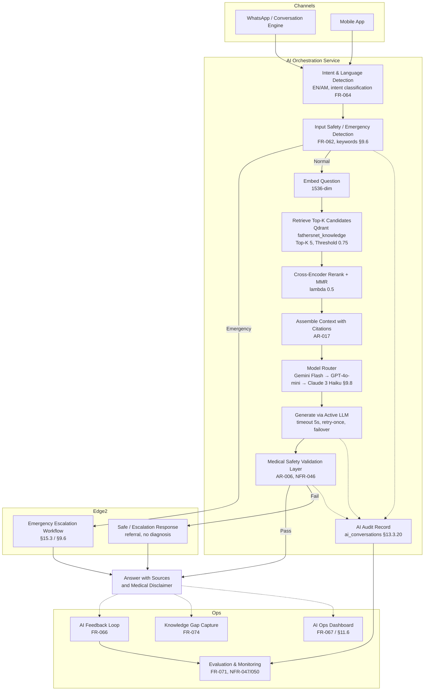

# 08. AI Assistant & RAG Implementation Plan

**Document:** FathersNet (Ayay) — AI Assistant and Retrieval-Augmented Generation (RAG) Implementation Plan
**Source of truth:** `docs/FathersNet-Complete-SRS.md` (FN-SRS-001 v2.0) — **§9 AI Assistant and RAG Specification** is the controlling authority: §9.2 ingestion pipeline, §9.3 vector database, §9.4 retrieval pipeline, §9.5 AI system prompt, §9.6 emergency AI handling, §9.7 AI voice processing, §9.8 AI model fallback strategy. Supporting authority: FR-059…FR-075 (§4.6), AR-005/006/015/016/017/018/019/020 (§15.2), NFR-046…050 (§5.8), AI governance §14.11, healthcare safety §14.10, threat model §14.1.4 (prompt injection), audit logging §14.3, AI APIs §12.8, AI audit tables §13.3.20–21, disaster recovery §19 (vector snapshot), and the RAG pipeline diagram in §9.4.
**Predecessors:** `00-requirement-inventory.md`, `02-srs-requirement-analysis.md`, `03-system-architecture-plan.md`, `04-technology-stack-analysis.md`, `05-database-implementation-plan.md`, `06-backend-development-plan.md`.
**Scope:** Complete production implementation flow for the AI assistant platform — architecture, ingestion, extraction/normalization, chunking, embedding, vector database, retrieval, reranking, LLM generation, safety validation, governance, prompt management, evaluation, cost optimization, safety testing, voice processing, dependencies, risks, and verification. This document plans only; it does not contain application code.
**Classification convention:** **Confirmed** (SRS-stated) · **Recommended** (engineering decision) · **Configurable** (parameter with default) · **Assumption** (requires human validation). Every decision carries **Source / Confidence / Reasoning / Impact-if-changed** annotations.

---

## 1. Executive Purpose

This document is the controlling engineering and operations roadmap for the **AI Assistant** of the FathersNet (Ayay) platform. It translates the binding requirements of FN-SRS-001 v2.0 into a complete, executable, verifiable implementation flow for the RAG pipeline: ingestion of an approved, clinician-reviewed knowledge base; chunking and embedding; vector storage; retrieval with reranking; grounded generation; a mandatory medical safety layer; voice processing; and the governance, evaluation, and cost-control scaffolding that make the AI safe enough for healthcare-adjacent use.

The AI platform is defined by these SRS anchors:

| Anchor | SRS Reference | Binding Content |
| --- | --- | --- |
| AI Assistant scope | §9.1; FR-059 | AI assistant on WhatsApp and mobile app, grounded exclusively in the approved knowledge base |
| Ingestion pipeline | §9.2 | DOCX/PDF/Markdown/HTML/TXT; RecursiveCharacterTextSplitter; 512-token chunks; 128-token overlap; 1536-dim embeddings; batch 100; six-step confirmed workflow |
| Vector database | §9.3 | Qdrant; collection `fathersnet_knowledge`; cosine; HNSW m=16, ef_construct=200 |
| Retrieval | §9.4 | Top-K 5; threshold 0.75; cross-encoder rerank; MMR lambda 0.5; nine-step confirmed pipeline |
| System prompt | §9.5 | Full "Ayay" prompt; EN/AM parallel; versioned approved prompt management |
| Emergency handling | §9.6 | Danger keyword set; EMERGENCY state priority; facility referral; admin notification; 5-minute follow-up |
| Voice processing | §9.7 | AssemblyAI primary; Google Speech-to-Text fallback; EN/AM; timestamped text output |
| Model fallback | §9.8 | Gemini 2.0 Flash → GPT-4o-mini → Claude 3 Haiku; 5 s timeout; retry-once; cost-aware routing |
| Safety | FR-062/063/065; NFR-046; §14.10 | Safety classification in/out; never diagnose/prescribe; escalate uncertain cases |
| Governance | FR-067…069; NFR-049; §14.11 | Model registry; prompt versioning + approval; audit trail; bias review; human oversight |
| Evaluation | FR-071/074; NFR-047/050; QR-011/014 | ≥90% accuracy eval set; hallucination monitoring; safety regression suite; knowledge-gap capture |
| Data protection | FR-073; AR-019; §1.9 C-07 | No PII to providers without DPA; pseudonymization; consent-governed |

**What this document deliberately does NOT do:** it does not write application code, does not select final commercial LLM/embedding/ASR vendors (procurement is open per `02` §6 M-02/M-03), does not define per-table DDL (see `05`), and does not set guaranteed capacity or cost commitments beyond the SRS's configurable reference defaults (§5.9, Appendix C). Where the SRS states a **Recommended Reference Architecture**, this plan confirms it or proposes an engineering alternative with the same requirement satisfaction, always labeled.

**How to read this document:** Sections 2–10 define the runtime pipeline in execution order (architecture → ingestion → extraction → chunking → embedding → vector DB → retrieval → reranking → generation → safety). Sections 11–17 define the operational scaffolding (governance, prompt management, evaluation, cost, safety testing, voice processing). Sections 18–20 close with dependencies/blockers, risks/mitigations, and the per-stage verification approach that maps to QR-011/QR-014 and the SRS acceptance criteria.

---

## 2. AI Architecture Overview

### 2.1 System Context

**Confirmed.** Per SRS §15.1, the AI capability is delivered by the **AI Orchestration Service** within the platform's core AI sub-system, alongside the **Medical Safety Layer**, the **Vector Store + Knowledge** (RAG), **Speech-to-Text** (ASR), and **Intent & Language Detection** (NLU). The AI Orchestration Service is invoked by the Conversation Engine (WhatsApp) and by the mobile app via the API gateway (§15.1; §12.8). It emits events consumed by the Research & Analytics Service (`ai.answer.completed`, `safety.event.raised` per `06` §2.2) and persists audit records to `ai_conversations` and `ai_feedback` (§13.3.20–21).

| Component | SRS Reference | Responsibility |
| --- | --- | --- |
| AI Orchestration Service | §15.1; FR-159 | Owns `/v1/ai/*` APIs (§12.8); orchestrates NLU → safety → retrieval → rerank → generation → output safety; routes across model tiers (§9.8) |
| Medical Safety Layer | §15.1; AR-006; FR-062/063/065 | Inspects every inbound question and outbound answer; enforces no-diagnosis (NFR-046); intercepts before user delivery |
| Vector Store + Knowledge | §15.1; AR-002; §9.3 | Qdrant collection `fathersnet_knowledge`; holds chunk embeddings + payload metadata for retrieval |
| Speech-to-Text (ASR) | §15.1; §9.7; FR-018/055 | AssemblyAI primary, Google Speech-to-Text fallback; EN/AM; feeds journal, AI answering, theme extraction |
| Intent & Language Detection | §15.1; FR-064 | Classifies language (EN/AM) and intent (question/emergency/myth/challenge/journal) before routing |

### 2.2 AI Architecture / RAG Pipeline Diagram

The following diagram is the operational blueprint. It preserves the SRS §9.4 pipeline (steps 1–9) and §9.6 emergency short-circuit, and adds the model-fallback decision (§9.8) and governance/audit sinks (FR-069, AR-020). **Source:** SRS §9.4 pipeline diagram, §15.1 AI sub-system, §15.3 emergency escalation workflow, §9.8 routing logic. **Classification:** Confirmed structure; Recommended presentation. **Confidence:** High.

### 2.3 Runtime Ordering and SLOs

**Recommended.** The AI request path executes the §9.4 pipeline stages in order; stages that can be cached or degraded are annotated in §15. The following latency targets apply (SRS NFR-009, configurable): typical answer completes within 10 s median; primary generation must begin streaming within 5 s (§9.8); the WhatsApp `ASK_QUESTION` state enforces a 30-second AI generation timeout before fallback (§7.2.4). Long generations are queued asynchronously (NFR-004); `/v1/ai/ask` returns a job id for polling (§12.8).

| Stage | Type | Latency Budget (Configurable) | SRS Basis |
| --- | --- | --- | --- |
| NLU + input safety | sync | < 300 ms | FR-064, FR-062 |
| Embedding of question | sync | < 300 ms | §9.4 step 3 |
| Retrieval (Qdrant) | sync | < 200 ms | §9.4 step 4, NFR-007 |
| Cross-encoder rerank + MMR | sync | < 500 ms | §9.4 step 5 |
| LLM generation | sync/async | start ≤ 5 s; complete ≤ 10 s median | §9.8, NFR-009 |
| Output safety validation | sync | < 300 ms | §9.4 step 8, AR-006 |
| Audit persistence | async | non-blocking | FR-069, NFR-004 |

---

## 3. Document Ingestion

### 3.1 Formats and Entry

**Confirmed.** Supported source formats: **DOCX, PDF, Markdown, HTML, TXT** (§9.2). Documents enter exclusively through the **CMS** (Content & CMS Service, `content` / `content_versions` tables §13.3.16–17) and must pass the review/approval workflow before any ingestion can occur (FR-070, FR-078, AR-015). Ingestion is triggered by the `content.published` event (publisher: Content Service; consumer: AI Orchestration) and `content.retired` on retirement (§9.2 step 5; `06` §2.2 event map).

**Lifecycle control (AR-015, Confirmed):** the knowledge-content lifecycle `draft → review → approved → published → archived` controls retrieval eligibility. Only chunks whose source document is in `published` state are retrievable; `archived` documents are excluded from retrieval; `draft`/`pending_medical_review` documents never enter the vector store.

| Attribute | Value | Source | Classification | Confidence |
| --- | --- | --- | --- | --- |
| Formats | DOCX, PDF, Markdown, HTML, TXT | §9.2 | Confirmed | High |
| Entry path | CMS review/approval → `content.published` event | FR-070, FR-078, §9.2 step 1 | Confirmed | High |
| Retrieval eligibility | Lifecycle state = `published` only | AR-015 | Confirmed | High |
| Batch size | 100 documents per batch | §9.2 | Configurable | High |

### 3.2 Incremental Updates (AR-016)

**Confirmed.** The ingestion pipeline supports **incremental updates**: an approved content revision re-chunks and re-embeds only the affected chunks, and old versions retire — no full rebuild is required (AR-016). Implementation approach (Recommended): content versions carry a `version` integer (§13.3.17); each chunk is upserted with the content version in its payload (see §7 payload design); on `content.retired` or version supersession, chunks of prior versions are set to `deactivated` in the payload and removed from active retrieval (matching §9.2 step 5). A chunk-checksum on the source text segment detects unchanged chunks and skips re-embedding for them, keeping re-embedding strictly incremental.

| Attribute | Value | Source | Classification |
| --- | --- | --- | --- |
| Update granularity | Re-chunk/re-embed only affected chunks | AR-016 | Confirmed |
| Old-version handling | Chunks deactivated on retirement/supersession | §9.2 step 5 | Confirmed |
| Change detection | Source-segment checksum to skip unchanged chunks | Recommended | Recommended |
| Full rebuild | Not required; reserved for schema/embedding-model migration only | Recommended | Recommended |

### 3.3 Ingestion Workflow (SRS §9.2, Confirmed)

1. Documents are uploaded through the CMS and pass review/approval (FR-070, FR-078).
2. Approved documents are normalized to text (Extraction & Normalization, §4).
3. Chunks are produced with the §9.2 parameters (§5).
4. Chunks are embedded (§6) and upserted into the vector store with document/version metadata (§7).
5. On retirement or revision, old chunks are deactivated (§3.2).
6. Ingestion runs are logged and audited (FR-069; §11 audit trail).

### 3.4 Ingestion Orchestration (Recommended)

| Concern | Approach | Source | Classification |
| --- | --- | --- | --- |
| Trigger | `content.published` / `content.retired` events consumed by AI Orchestration | `06` §2.2; §9.2 step 1 | Confirmed/Recommended |
| Concurrency | One document-batch job per event burst; batch of 100 docs; idempotent by content-version key (FR-161) | §9.2 batch 100 | Configurable |
| Failure handling | Retry with backoff per `06` §2.3; failed batches surface in ingestion-run logs and AI ops dashboard | §9.2 step 6; FR-163 | Recommended |
| Language handling | EN and AM content ingested in parallel; chunks carry `language` payload; AM embedding uses the same embedding endpoint (cross-lingual model behavior validated in §14) | FR-138, FR-079 | Recommended |
| QA threshold | An ingestion run aborts publishing its chunks to retrieval if QA metrics (embedding failure rate, malformed chunk rate) exceed configured thresholds | QR-011 | Recommended |

---

## 4. Extraction & Normalization

### 4.1 Text Extraction per Format

**Confirmed.** Approved documents are "normalized to text" (§9.2 step 2). Format-specific extraction (Recommended, no placeholders):

| Format | Extraction Approach (Recommended) | Key Pitfall Addressed | Source |
| --- | --- | --- | --- |
| DOCX | Parse the OOXML package; extract paragraph runs and tables in reading order; preserve heading levels for structure | Tables and text boxes otherwise fragment content order | §9.2 |
| PDF | Extract per-page text with layout-aware extraction (text-layer first; OCR fallback for scanned content is an explicit exception requiring review before ingestion — scanned/clinically sensitive PDFs are flagged, not silently OCR'd) | Multi-column layouts and headers/footers pollute chunk context | §9.2 |
| Markdown | Strip markup to plain text while retaining heading hierarchy for section boundaries | Code fences/markdown tables distort tokenization | §9.2 |
| HTML | Use a defined main-content extractor; drop navigation, scripts, styles, ads | Boilerplate inflates chunking and retrieval noise | §9.2 |
| TXT | Direct text normalization | Encoding issues (UTF-8 enforcement) | §9.2 |

### 4.2 Cleaning and Normalization Rules (Recommended)

| Rule | Detail | Classification |
| --- | --- | --- |
| Unicode normalization | Normalize to NFC; enforce UTF-8; preserve Amharic Ge'ez script integrity | Recommended |
| Whitespace normalization | Collapse repeated whitespace; normalize line endings; strip page headers/footers where detectable | Recommended |
| Non-content removal | Remove boilerplate, navigation, watermark artifacts, repeated footers | Recommended |
| Language tagging | Tag extracted text `en` / `am`; mixed-language documents split per-language segments at extraction | Recommended |
| Sensitive content flag | Flag PII-like artifacts (phone numbers, IDs) in source before ingestion; approved sources are clinical content, so such artifacts should be absent — if present, block ingestion and raise a review ticket | Recommended (protects AR-019/FR-073) |
| Provenance | Attach source document id, version, title, language, publish date, and medical-review status to every extracted artifact | Recommended (required by AR-017 citations) |

| Attribute | Value | Source | Classification |
| --- | --- | --- | --- |
| Normalization requirement | "Approved documents are normalized to text" | §9.2 step 2 | Confirmed |
| Amharic preservation | Ge'ez script preserved; Amharic segments kept whole at chunk boundaries where practical | FR-138 | Recommended |
| Scanned PDF handling | OCR is an exception path with mandatory human review before ingestion | Recommended | Recommended |

---

## 5. Chunking

### 5.1 Exact Parameters (SRS §9.2)

| Parameter | Value | Source | Classification | Confidence |
| --- | --- | --- | --- | --- |
| Algorithm | RecursiveCharacterTextSplitter | §9.2 | Recommended | High |
| Chunk size | 512 tokens | §9.2 | Configurable | High |
| Chunk overlap | 128 tokens | §9.2 | Configurable | High |
| Separators | `["\n\n", "\n", ".", " ", ""]` | §9.2 | Configurable | High |
| Language-aware length | Token count measured by the embedding model's tokenizer so 512 tokens ≈ one embedding unit | Recommended | Recommended | Medium |

### 5.2 Separator Strategy

**Confirmed (values) / Recommended (behavior).** The separator cascade `["\n\n", "\n", ".", " ", ""]` splits on paragraph breaks first, then line breaks, then sentence boundaries, then word boundaries, then characters as the final fallback — this preserves paragraph and sentence structure for semantic coherence. Overlap of 128 tokens (25% of chunk size) carries sentence context across chunk boundaries so that answers requiring cross-boundary information remain grounded.

**Impact if changed:** altering chunk size changes retrieval granularity — smaller chunks improve precision of citation-to-claim mapping but reduce contextual coherence; larger chunks inflate the prompt context (cost) and can lower the similarity threshold's selectivity. Changing the overlap below ~128 tokens raises the risk of answers citing chunks that miss half of a straddled sentence. Any change requires re-running the §14 evaluation set before deployment (QR-014).

### 5.3 Overlap and Boundary Strategy (Recommended)

| Rule | Detail | Classification |
| --- | --- | --- |
| Hard cap enforcement | Splitter enforces 512-token ceiling; a single oversized paragraph is split at the hard cap via the "" separator rather than silently exceeding 512 | Configurable |
| Paragraph preservation | Where a paragraph fits within the budget, it is not split mid-paragraph | Recommended |
| Amharic boundary handling | Sentence detection for AM uses Amharic punctuation (።) in addition to `.`; Ge'ez text is not split on Latin `.` abbreviations | Recommended |
| Stride sizing | Effective stride = 512 − 128 = 384 tokens between consecutive chunk starts | Recommended |
| Citation anchor | Each chunk stores its own stable `chunk_id` and its byte/token span in the source document, enabling exact citation to a retrievable chunk (AR-017) | Recommended |

---

## 6. Embedding

### 6.1 Model Choice

**Recommended (with two allowed providers).** SRS §9.2 lists **OpenAI `text-embedding-3-small`** or **Google Gemini embeddings**; embedding **dimension = 1536**. Final provider selection is open (M-03 in `02` §6); this plan requires that the selected embedding endpoint support English and Amharic sufficiently (validated against a bilingual evaluation set in §14) and that it be reachable under a DPA with pseudonymized payloads (FR-073, AR-019).

| Attribute | Value | Source | Classification |
| --- | --- | --- | --- |
| Candidate models | OpenAI text-embedding-3-small; Google Gemini embeddings | §9.2 | Recommended |
| Dimension | 1536 | §9.2 | Configurable (must match vector store config) |
| Batch | 100 documents per batch (§3); embedding calls are batched within a document batch | §9.2 | Configurable |
| Abstraction | Embedding behind a provider adapter so the two candidates are swappable | FR-151; ADR-005 | Recommended |

**Impact if changed:** changing the embedding model changes the vector space and therefore the cosine similarity distribution. Every retrieval threshold (0.75), MMR behavior, and evaluation-set score must be re-validated; the vector store must be rebuilt or migrated with a re-embedding job (AR-016 allows incremental re-embedding of affected chunks — here, all chunks are affected).

### 6.2 Batching, Caching, and Quality (Recommended)

| Concern | Approach | Classification |
| --- | --- | --- |
| Batch size | Embedding requests issued at ≤ 100 texts per API call (provider batch limits respected); document batch of 100 (§9.2) | Configurable |
| Retry/idempotency | Embedding failures retried with backoff; chunk-level idempotency key prevents duplicate vectors on retry (FR-161) | Recommended |
| Embedding cache | Question-embedding results cached in Redis by normalized-question hash (TTL configurable) to cut cost and latency (§15, C.4); document embeddings are not cached at runtime (they are the store itself) | Recommended |
| Dimension guard | A runtime assertion rejects provider responses whose dimension ≠ 1536 to prevent silent vector-space corruption | Recommended |
| Language parity | A bilingual QA probe set (EN/AM) is embedded and scored for retrieval recall before the embedding endpoint is enabled in production | Recommended (feeds QR-011) |

---

## 7. Vector Database

### 7.1 Qdrant Configuration (SRS §9.3)

| Parameter | Value | Source | Classification | Confidence |
| --- | --- | --- | --- | --- |
| Engine | Qdrant | §9.3 | Recommended | High |
| Collection | `fathersnet_knowledge` | §9.3 | Recommended | High |
| Distance metric | Cosine similarity | §9.3 | Recommended | High |
| Index type | HNSW | §9.3 | Recommended | High |
| HNSW `m` | 16 | §9.3 | Configurable | High |
| HNSW `ef_construct` | 200 | §9.3 | Configurable | High |
| Vector dimension | 1536 | §9.2 | Configurable | High |
| Hosting | Self-hosted (Docker Compose reference §16.1, `qdrant/qdrant:v1.9`) or managed; cost/data-residency control is the stated rationale | §9.3 | Recommended | High |

Alternatives explicitly permitted by SRS §9.3: Pinecone, Weaviate, **pgvector**. The adapter pattern (P-05 in `03`) isolates the vector store behind a retrieval contract so a swap is a contained change; pgvector additionally offers consolidation with PostgreSQL at pilot scale (Appendix C.4 notes this as a cost lever).

### 7.2 Payload / Metadata Schema (Recommended)

Every point (chunk) carries a payload that powers retrieval-time filtering (language, lifecycle status) and citation (AR-017):

| Field | Type | Purpose | SRS Basis |
| --- | --- | --- | --- |
| `chunk_id` | string | Stable citation identifier returned in `sources[].chunk_id` (§12.8 response) | AR-017 |
| `document_id` | string | FK to `content.id` (§13.3.16) | AR-015 |
| `content_version` | int | Version at ingestion (§13.3.17); drives incremental update/retirement | AR-016 |
| `title` | string | Human-readable source title for citation display | AR-017; §12.8 |
| `language` | enum `en`/`am` | Retrieval-time language filter (§8) | FR-138 |
| `lifecycle_status` | enum `active`/`deactivated` | `deactivated` = excluded from retrieval (retired/superseded) | AR-015; §9.2 step 5 |
| `pregnancy_week` | int (nullable) | Week-range filter for the journey context (chunks tagged with applicable week) | FR-032/083 |
| `medical_reviewed` | bool | Always true for ingested content (ingestion requires review) | FR-081; OR-021 |
| `published_at` | datetime | Provenance/audit | §9.2 step 4 |
| `chunk_span` | json | Byte/token span in the source document | AR-017 (Recommended) |

**Indexing note (Recommended):** payload filtering on `lifecycle_status` and `language` is backed by Qdrant payload indexes so the §8 retrieval filter does not degrade HNSW query performance (NFR-007).

### 7.3 Snapshot Backup for DR (SRS §19)

**Confirmed (specification) / Recommended (implementation).** §19: "vector store: snapshot nightly." Retention: daily fulls retained 14 days, weekly 8 weeks, monthly 12 months (configurable). RPO ≤ 15 min / RTO ≤ 4 h. Restore procedures: documented runbooks; restore to staging first; verify checksums and row counts. Quarterly restore drill; annual full failover drill.

| Item | Value | Source | Classification |
| --- | --- | --- | --- |
| Vector store backup | Qdrant snapshot nightly (plus snapshot before any migration/rebuild job) | §19 | Confirmed |
| Restore target | Staging first, checksum + point-count verification, then promote | §19 | Confirmed |
| RPO / RTO | RPO ≤ 15 min / RTO ≤ 4 h (configurable) | §19 | Configurable |
| Point-in-time consistency | Qdrant snapshot is an instant consistent snapshot; re-ingestion from PostgreSQL `content` tables is the RPO fallback if a snapshot is corrupted (content is the source of truth; vectors are derivable) | §19; AR-002 | Recommended |
| Rebuild path | Full re-ingest from the relational content store restores the collection to a defined version — documented runbook for the "vector store lost" scenario | §19; AR-016 | Recommended |

---

## 8. Retrieval

### 8.1 Retrieval Parameters (SRS §9.4)

| Parameter | Value | Source | Classification | Confidence |
| --- | --- | --- | --- | --- |
| Top-K | 5 | §9.4 | Configurable | High |
| Similarity threshold | 0.75 (cosine) | §9.4 | Configurable | High |
| Reranking | Cross-encoder relevance scoring | §9.4 | Recommended | High |
| Diversity | Maximum Marginal Relevance (MMR) | §9.4 | Recommended | High |
| MMR lambda | 0.5 | §9.4 | Configurable | High |
| Pre-filter | `lifecycle_status = active` AND `language = user_language` | AR-015, FR-138 | Recommended | High |

### 8.2 Retrieval Flow (Confirmed pipeline, §9.4 steps with this plan's operational detail)

1. **NLU (FR-064):** classify intent and language of the inbound question (EN/AM; question/emergency/myth/challenge/journal) before any retrieval.
2. **Input safety classification (FR-062):** run the safety classifier; emergency detection (§9.6) executes first and short-circuits the pipeline if EMERGENCY (§9.6 step 3).
3. **Embed the question** using the §6 embedding service.
4. **Retrieve candidates:** query Qdrant `fathersnet_knowledge` with cosine distance, **Top-K 5**, similarity **threshold 0.75**, payload filter `lifecycle_status=active` and `language=<detected>`. Results below the threshold are discarded even if the candidate count is below K (this is the grounding boundary for FR-061).
5. **Rerank with cross-encoder; apply MMR lambda 0.5** (§9).
6. **Assemble the prompt** with retrieved context and citations (AR-017) — see §10.2.
7. **Generate** via the active LLM under §9.8 routing (§10).
8. **Medical safety validation** (§11).
9. **Deliver** the answer with source references and medical disclaimer (NFR-048).

### 8.3 Language and Lifecycle Filtering (Recommended)

| Filter | Behavior | SRS Basis | Impact if changed |
| --- | --- | --- | --- |
| Language filter | Retrieval restricted to the user's detected/preferred language (`en`/`am`); a fallback cross-language query is permitted only when the primary-language recall is below a configured floor, and answers to such queries are labeled as translated/adapted | FR-138, FR-064 | Disabling the filter surfaces cross-language chunks that may lower Amharic-speaker comprehension and citations in the wrong language |
| Lifecycle filter | Only `active` chunks retrievable | AR-015 | Retired content would re-enter grounding, violating AR-015 and FR-080 |
| Consent filter | Research-derived content (anonymized user insights, Appendix I) is retrievable only if the source content is approved for AI use; no personal content is ever ingested | Appendix I; FR-070 | Violates consent and privacy constraints (C-07) |

---

## 9. Reranking

### 9.1 Cross-Encoder Relevance Scoring (SRS §9.4, Recommended)

After candidate retrieval, a **cross-encoder** scores each of the Top-K 5 candidates against the question jointly (question + candidate passed to the model together), producing a relevance score per candidate. The cross-encoder provides finer relevance discrimination than the bi-encoder cosine score, which ranks chunks by embedding similarity alone.

| Attribute | Value | Classification |
| --- | --- | --- |
| Model class | Cross-encoder (sentence-pair relevance) | Recommended |
| Candidates in | Top-K 5 from §8 (above 0.75) | Configurable |
| Output | Per-candidate relevance score 0.0–1.0 | Recommended |
| Language coverage | EN/AM cross-encoder checkpoint validated on the §14 bilingual set | Recommended |
| Failure handling | Reranker unavailable → fall back to bi-encoder ordering (degraded mode, NFR-008) with a latency/log marker | Recommended |

### 9.2 MMR Diversity Pass (SRS §9.4, lambda 0.5)

Maximum Marginal Relevance balances relevance against redundancy: the top candidate is selected by relevance; each subsequent candidate is scored by `λ·relevance − (1−λ)·max_similarity_to_already_selected`, with **lambda 0.5** giving equal weight to relevance and diversity. MMR reduces the chance that 4 of the 5 citations come from the same document section and increases the chance the answer assembles complementary facts (e.g., a transport question also surfacing the emergency-contacts chunk).

**Impact if changed:** raising lambda toward 1 favors pure relevance (more redundancy, higher risk of repeating one document); lowering it toward 0 favors diversity (risk of including marginal chunks). Both changes must be re-validated on the §14 evaluation set.

### 9.3 Final Context Selection (Recommended)

- Final context = up to 5 reranked, MMR-selected chunks, in rerank order.
- Each selected chunk retains its `chunk_id`, `title`, `content_version`, and `language` for the citation block (§10.2) and the `sources[]` array (§12.8).
- Zero chunks above threshold → **decline path** (FR-061, NFR-048): no retrieval support, so the assistant states it does not have that information and encourages a visit to the healthcare provider; the question is recorded as a **knowledge gap** (FR-074).

---

## 10. LLM Generation

### 10.1 Model Routing and Fallback (SRS §9.8)

| Tier | Model | Role | Classification |
| --- | --- | --- | --- |
| Primary | Google Gemini 2.0 Flash | Default generation (fast, cost-efficient) | Recommended |
| Fallback 1 | GPT-4o-mini | Used on primary failure or timeout | Recommended |
| Fallback 2 | Claude 3 Haiku | Second fallback tier | Recommended |

**Routing logic (SRS §9.8, configurable):**
- **Timeout threshold:** primary must start producing output within **5 s**; otherwise switch to fallback.
- **Error handling:** on provider error/rate-limit, **retry once** on the primary, then fail over.
- **Cost-optimization routing:** high-volume simple intents route to the cheapest capable model; complex or safety-sensitive intents may be upgraded; a **cost/quality routing table** is maintained (see §15).
- **Audit:** every routing decision is logged (model, provider, latency, tokens, cost) — this is the model-registry evidence for FR-069/AR-020.

**Impact if changed:** replacing Gemini Flash with a different primary changes the latency/cost/quality envelope and the evaluation baseline; QR-014 requires the eval set and safety regression to pass on the new primary before routing changes.

### 10.2 Context Assembly with Citations (AR-017)

The generation call receives: the **active system prompt** (§9.5, current approved version), the **retrieved context** (up to 5 chunks with their metadata), the user question, and — where applicable — journey context (pregnancy week, language) for personalization (UR-002.3). The prompt instructs the model to cite chunks by their `chunk_id`/`title`; the response's `sources[]` array (§12.8) is populated **from the actual retrieved chunks**, not from model-generated claims, so citations always resolve to retrievable approved content (AR-017, NFR-048). If the model references content absent from the context, the safety layer strips or flags it (FR-061).

### 10.3 Generation Controls (Recommended)

| Control | Value | SRS Basis | Classification |
| --- | --- | --- | --- |
| Max output tokens | Configurable cap (e.g., 800 tokens) to bound cost and message length | NFR-034; A-07 | Configurable |
| Temperature | Conservative default for factual grounding; tuned per intent tier (FAQ vs. conversational) | Recommended | Configurable |
| Streaming | Supported for app; WhatsApp responses delivered as complete messages per template rules | §7.4.3 | Recommended |
| No-tool execution | The model has no tool/function access from user text (prompt-injection mitigation, §14.1.4) | §14.1.4 | Confirmed |
| Response language | Generation constrained to the user's language; AM prompt variant used for Amharic (§13) | §9.5; FR-138 | Confirmed |

---

## 11. Safety Validation

### 11.1 Medical Safety Layer (FR-065, AR-006, NFR-046)

**Confirmed.** The safety layer inspects **every inbound question and every outbound answer** and applies safety rules before user delivery (§9.4 step 8; §14.1.4 "output safety layer"). It cannot be bypassed (§9.4 pipeline position; AR-006). Rules:

| Rule | Behavior | SRS Basis |
| --- | --- | --- |
| No diagnosis | Outputs containing diagnostic statements are rejected/revised to referral language | NFR-046; C-01 |
| No prescription | No medication or dosage recommendations; refer to provider | NFR-046; C-01 |
| No medical clearance | Never clears or "signs off" a medical concern | NFR-046; §9.5 |
| Grounded-only | Claims must trace to retrieved approved chunks; unsupported claims removed and replaced with decline/referral | FR-061; NFR-048 |
| Disclaimer | Medical disclaimer appended where relevant; emergency responses always advise facility care | §14.10; FR-063 |
| Escalation | Uncertain/flagged cases route to the AI ops review queue; emergencies route to the on-call reviewer | FR-065; §14.10; §9.6 |

### 11.2 Input Classification (FR-062) and Emergency Detection (§9.6)

**Confirmed.** Every inbound message passes input safety classification. Emergency detection runs first:

- **Detection keywords (Configurable baseline):** `bleeding`, `fits`, `seizure`, `unconscious`, `fainted`, `severe headache`, `blurred vision`, `baby not moving`, `water breaking`, `premature labor`, `severe pain`, `high fever`. Matching is case-insensitive and applied to Amharic equivalents via the localization layer.
- **Detection logic (Confirmed):** keyword match **or** classifier score above the emergency threshold → state = `EMERGENCY`. Emergency handling takes priority over all other intents and normal answering.
- **Priority handling:** immediate delivery, bypasses quiet hours, **short-circuits RAG answering** (§9.6; §15.3 flowchart).

### 11.3 Emergency Response (FR-063, §9.6)

| Response element | Content | SRS Basis |
| --- | --- | --- |
| Urgent guidance | Plain-language: go to the nearest healthcare facility immediately | §9.6 |
| Approved danger-sign guidance | From the approved knowledge base | §9.6 |
| Prohibited | Never diagnose; never advise waiting; never prescribe | §9.6 |
| Admin notification | Emergency safety event created, visible in AI ops dashboard, routed to on-call reviewer per alerting policy | §9.6; §18.3 |
| Follow-up | If no response within 5 minutes → follow-up check; if still none → second check per escalation policy and admin alert | §9.6 (configurable) |

### 11.4 Output Rules and Disclaimer (FR-062, §14.10)

- Every AI health response may carry a medical disclaimer; emergency responses always do (FR-063).
- The assistant discloses it is not a healthcare provider and cannot diagnose (NFR-046).
- Failure modes: output fails safety → safe/escalation response replaces it (§9.4 step 8, `SAFEG` in §2.2 diagram); the original is preserved in the audit record for review (FR-069, OR-010).

---

## 12. AI Governance

### 12.1 Model Registry (FR-069, NFR-049, §14.11)

**Confirmed.** A model registry records every model configuration eligible for routing (tier, provider, model name, version, dimension, licensing/DPA status, approval date, approving role). **Model change requires an approval workflow before routing** (NFR-049 "model update approval"). Every AI interaction's audit record captures the exact model/provider/version used (FR-069; §13.3.20 `model`/`provider` columns), enabling reproducibility (AR-020).

| Registry entry | Content | Source | Classification |
| --- | --- | --- | --- |
| Model identity | provider, model name, version/checkpoint | §9.8; AR-020 | Confirmed |
| Approval | DPA status, approval date, approver, eval-set score before enablement | NFR-049; FR-073 | Confirmed |
| Routing tier | primary/fallback1/fallback2; intent tier mapping | §9.8 | Confirmed |

### 12.2 Prompt Versioning + Approval (FR-068, §14.11)

**Confirmed.** The prompt library is versioned and approved; prompt changes are auditable and reversible; the previous version is recoverable. Prompts are configuration/content owned by the AI operations team under change management (OR-005). See §13 for the full prompt-management design.

### 12.3 Audit Trail (FR-069, AR-020, §14.3)

**Confirmed.** Every AI interaction persists a governance audit record: prompt version, model, provider, question (pseudonymized), answer, sources, safety flags, latency, tokens, timestamps (§13.3.20 `ai_conversations`). AI interaction logs are retained per governance policy (§18.1). Audit logging is append-only and tamper-evident (§14.3). User feedback is linked via `ai_feedback` (§13.3.21).

### 12.4 Bias/Fairness Review (§14.11)

**Confirmed.** Fairness review on themes and responses with **sampled reviews** — the AI ops/research team samples conversations and theme extractions for cultural/linguistic bias, and the eval set includes EN/AM parity cases (see §14). Bias findings feed the review queue and the accuracy/hallucination metrics (FR-071).

### 12.5 Human Oversight — AI Ops Dashboard (FR-067, §11.6, §14.11)

**Confirmed.** The AI operations dashboard (§11.6) provides: conversation review (browse AI conversations with filters and safety flags), safety alerts (emergency events and flagged responses queue), and prompt management (versioned prompt library with approval workflow). Human oversight is the final backstop for uncertain/flagged outputs (FR-065) and emergency events (§9.6).

| Governance control | Evidence artifact | SRS Basis |
| --- | --- | --- |
| Model registry + update approval | Registry with approval records; routing audit in `ai_conversations` | NFR-049; FR-069 |
| Prompt versioning | Versioned prompt library; diff history; rollback | FR-068 |
| Audit trail | `ai_conversations` + `audit_logs` (§13.3.20, §13.3.24) | FR-069; AR-020 |
| Bias review | Sampled fairness reviews; EN/AM eval parity | §14.11 |
| Human oversight | AI ops dashboard; review queues; on-call reviewer for emergencies | FR-067; §14.11 |

---

## 13. Prompt Management

### 13.1 Versioned Prompt Library (FR-068, §9.5)

**Confirmed.** The system prompt in §9.5 ("Ayay") is the **recommended baseline**, is **configurable content**, and is managed under **versioned, approved prompt management** by the AI operations team. An **Amharic variant is maintained in parallel** (§9.5; FR-138). The prompt library holds multiple prompt types beyond the system prompt: the emergency-response prompt (§9.6), the decline/referral prompt (FR-061), the disclaimer block (§14.10), and intent-tier follow-up prompts — each versioned independently.

### 13.2 Approval Workflow

| Step | Actor | Detail |
| --- | --- | --- |
| Edit | AI operations admin | Create draft prompt version with change note |
| Review | Medical/content reviewer | Clinical safety review of health-language changes (OR-021, FR-106 segregation of duties — prompt author ≠ medical approver) |
| Approve | Authorized approver | Approval recorded; version becomes active candidate |
| Publish | AI ops admin | Active version switch; previous version retained and recoverable (FR-068) |
| Rollback | AI ops admin | One-click revert to prior approved version; audited |

### 13.3 EN/AM Parallelism and Rollback

| Concern | Approach | Classification |
| --- | --- | --- |
| Parallel variants | EN and AM prompt versions advance in lockstep version numbers; a version is published only when both locales are approved | Recommended |
| Parity check | Automated prompt-parity diff (structure + placeholders) as part of the approval workflow | Recommended |
| Rollback | Per-locale rollback retains prior pair; a mismatch (EN rolled back, AM not) blocks publication until resolved | Recommended |
| Usage binding | Every generated answer records `prompt_version` (§13.3.20) so a rollback can be proven post-hoc (AR-020) | Recommended |

**Impact if changed:** unversioned prompts break FR-068 acceptance ("previous version recoverable") and make the FR-069 audit trail non-reproducible (AR-020); a missing Amharic variant violates FR-138 and the §9.5 parallelism requirement.

---

## 14. Evaluation Strategy

### 14.1 Accuracy Target (NFR-047, configurable)

**Confirmed.** A documented **answer-accuracy target ≥ 90% on an approved evaluation set**, with drift monitoring. The eval set is:

| Attribute | Value | Classification |
| --- | --- | --- |
| Scope | Approved Q&A pairs derived from the knowledge base (grounded in retrievable chunks) | Recommended |
| Bilingual | EN and AM question/answer pairs with parity scoring | Recommended |
| Ground truth | Approved answer + expected source chunks per question | Recommended |
| Scoring | Retrieval recall (is the right chunk retrieved at Top-K 5?) + answer faithfulness (claims trace to context) + citation correctness (AR-017) | Recommended |
| Cadence | Run on every AI release (QR-014) and on schedule for drift (NFR-047/050) | Recommended |

### 14.2 Hallucination Monitoring (FR-071, NFR-050)

**Confirmed.** Sampling + scoring of answers against ground truth; hallucination/accuracy metrics and safety-event counts with **alerting on defined thresholds** to the AI operations team (§18.3). Operational metrics: answer accuracy, unsafe-response rate, emergency false-negative rate, knowledge coverage, citation validity, feedback ratio (thumbs up/down from `ai_feedback`).

| Metric | Threshold (Configurable) | SRS Basis |
| --- | --- | --- |
| Eval-set accuracy | ≥ 90% | NFR-047 |
| Unsafe response rate | Alert above defined floor | NFR-050; Appendix F AI safety KPIs |
| Emergency false-negative rate | Alert above defined floor (see §16) | Appendix F AI safety KPIs |
| Citation validity | Sampled citations resolve to active retrievable chunks | AR-017, NFR-048 |
| Unsupported-answer rate | Declines/ungrounded answers sampled and reviewed | FR-061, NFR-048 |

### 14.3 Safety Regression Suite (QR-011, QR-014)

**Confirmed.** AI releases must pass the **AI evaluation set and safety regression suite** (QR-014); AI quality evaluation covers accuracy, hallucination, safety, bias, and response-quality sampling with defined thresholds (QR-011). The safety regression suite is a fixed, versioned battery of tests — emergency keywords (§9.6), no-diagnosis cases, jailbreak/prompt-injection cases (§16), decline-path cases (FR-061), and disclaimer presence (§14.10) — that must pass before any prompt/model/routing change ships. Safety regression failures are release blockers.

### 14.4 Sampling + Scoring Loop (FR-071)

**Recommended.** A stratified daily sample (by intent tier, language, week, channel) is scored by human reviewers on: safety, faithfulness, citation correctness, clarity, cultural appropriateness. Scores feed the §14.2 metrics and the AI ops review queue; low-rated answers (and all `down` feedback from FR-066) are routed for review.

### 14.5 Knowledge Gap Capture (FR-074)

**Confirmed.** Unanswerable questions (no chunk above threshold, or decline path exercised) are logged as **knowledge gaps** and surfaced in admin views for the content team, who may author/approve new content that flows through §3 ingestion. Gap volume and topic clustering are reported to content planning (FR-074; Appendix I content cycle).

---

## 15. Cost Optimization

### 15.1 Intent-Based Routing (SRS §9.8, Appendix C.4)

**Confirmed strategy / Configurable parameters.** High-volume simple intents (FAQ, greetings, routine reminders) route to the cheapest capable model; complex or safety-sensitive intents (multi-hop questions, emergency-adjacent, sensitive topics) route to a higher-quality tier. A **cost/quality routing table** is maintained and audited per call (model, provider, latency, tokens, cost — §9.8). This is the primary cost lever given A-07 (cost control priority) and Appendix C reference ranges ($50–$300/month AI API at 5k daily interactions).

| Intent tier (Configurable) | Model tier | Example intents |
| --- | --- | --- |
| Simple/high-volume | Cheapest capable (e.g., Gemini Flash) | FAQ, greetings, quick replies |
| Standard | Primary | Routine pregnancy guidance |
| Complex/safety-sensitive | Upgraded tier (e.g., GPT-4o-mini fallback or configured upgrade) | Multi-hop, ambiguous, sensitive, emergency-adjacent |

### 15.2 Caching and Batching

| Lever | Approach | SRS Basis |
| --- | --- | --- |
| Answer caching | Frequent answers cached in Redis keyed by (language, intent, question-hash, prompt-version, KB-version); cache key invalidated on prompt or content version change | Appendix C.4 |
| Embedding caching | Question-embedding cache (§6.2) avoids repeated embedding cost | Appendix C.4 |
| Context budget | Max output tokens cap and Top-K 5 cap prompt size; MMR limits redundant context | §9.4; §10.3 |
| Ingestion batching | Document batch 100 and chunk-level skip-on-checksum avoids re-embedding unchanged content | §9.2; AR-016 |

### 15.3 Fallback Tiers as a Cost/Resilience Control

The §9.8 fallback tiers simultaneously bound cost (primary is cheapest-fast) and resilience (NFR-015 third-party outage resilience). Failover to a higher-priced tier is expected to be transient; a per-day failover-cost budget flag alerts ops when fallback usage exceeds the configured ceiling.

### 15.4 Budget Alerts (AR-040)

**Confirmed.** Cloud architecture is cost-monitored with **budget alerts and optimization review** (AR-040). For the AI platform specifically: per-provider spend dashboards, per-call token/cost audit rows (§9.8 logging), daily projected-spend alerts, and a hard monthly cap that triggers graceful degradation (NFR-008: throttling, queueing, reduced AI usage) rather than service failure. Reference figures are configurable (Appendix C).

---

## 16. Safety Testing

### 16.1 Prompt Injection (SRS §14.1.4)

**Confirmed threat / Mitigations.** Threat: prompt injection/jailbreak via user messages, media, or ingested content → unsafe responses or system-instruction override (likelihood Medium–High). Mitigations per §14.1.4: input safety classification; system-prompt hardening with delimiters; output safety layer; **RAG grounding to approved chunks only**; **no tool access from user text**; prompt-injection test suite. Detection: safety-layer violations logged; injected-content regression tests; AI ops review queue.

| Test class | Cases | Gate |
| --- | --- | --- |
| Instruction-override attempts | "Ignore your instructions…", "act as…", delimiter-injection in user text | Safety regression (QR-014) |
| Context-prompting attempts | Attempts to inject content into the retrieval context via question text | Safety regression (QR-014) |
| Media-borne injection | Voice transcript containing injection text (§9.7 transcript path) | Input classification tests |
| Ingested-content injection | Malicious content in uploaded KB documents blocked at CMS review gate (FR-070) + ingestion flagging (§4.2) | Content workflow tests (FR-078) |

### 16.2 Jailbreak Tests

**Recommended.** A maintained jailbreak battery (role-play, translation/obfuscation, indirect instruction, multilingual obfuscation in Amharic) is run through the full pipeline (NLU → safety → RAG → generation → output safety). Pass criterion: the safety layer blocks or sanitizes the output; any jailbreak that produces a diagnosis/prescription/unsafe recommendation is a critical finding and release blocker (QR-013).

### 16.3 Unsafe-Content Regression

**Recommended.** A fixed set of unsafe prompts (diagnosis-seeking, prescription-seeking, self-harm-adjacent, dangerous-advice bait) with expected safe responses (referral + disclaimer, or emergency escalation). Run on every AI release with the §14.3 safety regression suite. Metric: **unsafe-response rate** reported per Appendix F AI safety KPIs with alerting (NFR-050).

### 16.4 Emergency False-Negative Tests

**Recommended.** A corpus of EMERGENCY cases in EN and AM — exact keyword hits, paraphrases, transliterated Amharic, mixed-script, and edge-case phrasing ("blood", "my wife fainted", "the baby hasn't moved") — verified to trigger the EMERGENCY path (state = EMERGENCY, facility guidance, admin notification). Metric: **emergency false-negative rate** (Appendix F AI safety KPI) with alerting; any false negative on the corpus blocks release. False-positive behavior is also tested (routine messages must not raise false emergencies, which would erode trust and spam the ops queue).

### 16.5 Test Data Rules (QR-012)

All safety tests run on **synthetic, realistic data with no production PII** (QR-012); eval and regression suites live in the repo, versioned with the prompt/model registry so test results are reproducible per release (AR-020).

---

## 17. Voice Processing

### 17.1 ASR Pipeline (SRS §9.7, FR-018, FR-055)

**Recommended reference architecture:**

| Item | Value | Source | Classification |
| --- | --- | --- | --- |
| Primary transcription | AssemblyAI | §9.7 | Recommended |
| Fallback | Google Speech-to-Text | §9.7 | Recommended |
| Languages | English, Amharic | §9.7 | Confirmed |
| Output | Text + timestamp metadata | §9.7 | Confirmed |

**Workflow (Confirmed, §9.7):** audio received → validated and stored → queued for transcription → transcription with timestamps → text used for journaling, AI answering, and theme extraction → transcription attached to the source record.

### 17.2 Operational Detail (Recommended)

| Stage | Approach | SRS Basis |
| --- | --- | --- |
| Receive/validate | WhatsApp voice-note intake: format AAC/OGG/MP3, ≤ 16 MB (§7.4.2); malware scan + type check (AR-023) | §7.4.2 |
| Store | Original audio in object storage under anonymized path `media/voice/<anonymized_user_id>/<message_id>.<ext>`; encrypted at rest (AR-027; §14.2) | §7.4.2 |
| Queue | Transcription is asynchronous (NFR-004); `media.processed` event publishes to AI/Research consumers (`06` §2.2) | §9.7; NFR-004 |
| Transcribe | AssemblyAI primary; on error/rate-limit/timeout fail over to Google Speech-to-Text; EN/AM language detection drives the transcription language | §9.7 |
| Output | Text + timestamps persisted; transcription attached to journal entry (`journal_media`) or conversation (FR-018, FR-055) | §9.7 |
| Downstream | Transcription feeds AI answering (voice question), journal search (FR-055), and research theme extraction (FR-114, §10.1.2) | §9.7; §10 |

### 17.3 Error Handling

| Failure | Handling | SRS Basis |
| --- | --- | --- |
| Primary provider failure | Failover to Google Speech-to-Text; log provider/latency/cost per §9.8 routing-audit discipline | §9.7, §9.8 |
| Both providers fail | Retry with backoff per delivery policy; alert ops (FR-021 pattern); user informed the note is queued | NFR-004, FR-021 |
| Undeliverable/untranscribable audio | Store original audio; mark transcription failed in admin; manual review path | FR-021, §18.4 |

**Impact if changed:** removing the Google fallback violates NFR-015 (third-party outage resilience) for the ASR path; dropping timestamp metadata breaks FR-018's acceptance criterion ("persist both transcription and audio metadata").

---

## 18. Dependencies and Blockers

| # | Dependency/Blocker | Detail | SRS Basis | Classification |
| --- | --- | --- | --- | --- |
| DB-01 | Approved knowledge-base content readiness | The clinician-reviewed authoritative guide and subsequently approved content (A-04) must exist, be versioned, and be clinically reviewed **before** RAG can ground any answer. Empty or unapproved KB = AI cannot launch (FR-061 grounds answers only in approved KB). | A-04, D-04, OR-021, QR-019 | Confirmed |
| DB-02 | LLM/embedding provider availability + DPAs | Approved LLM and embedding providers must be reachable in-region and under executed data-processing agreements before any data flows (FR-073, NFR-029). M-03 procurement open. | FR-073, NFR-029, D-02, M-03 | Confirmed |
| DB-03 | Pseudonymization enforcement (AR-019) | The pseudonymization layer (strip direct identifiers, use internal user references, no phone numbers in payloads) must be implemented and verified before the first production AI call; audit evidence required (QR-009). | AR-019, FR-073 | Confirmed |
| DB-04 | ASR provider availability (EN/AM) | AssemblyAI primary + Google Speech-to-Text fallback must support Amharic with acceptable quality; validate via bilingual transcription probes before voice features ship. | D-06, §9.7 | Recommended |
| DB-05 | Vector store provisioning | Qdrant (or approved alternative) provisioned with §7 config, snapshots enabled (§19), reachable from AI Orchestration in all environments. | §9.3, §19, AR-002 | Confirmed |
| DB-06 | CMS review workflow live | Ingestion depends on the CMS review/approval workflow (content statuses, versioning, medical-review tagging) being live; without it no document reaches `published`. | FR-070, FR-078, AR-015 | Confirmed |
| DB-07 | Bilingual eval set + safety regression suite | The ≥90% eval set (EN/AM) and safety regression battery must exist and pass before any AI release (QR-011/QR-014). Authoring this is on the critical path. | NFR-047, QR-011, QR-014 | Confirmed |
| DB-08 | Clinical reviewer capacity | Medical review of content changes and prompt changes requires clinical reviewer availability (segregation of duties, FR-106; OR-021). | FR-106, OR-021 | Confirmed |

**Blocker summary:** DB-01, DB-02, DB-03, and DB-07 are hard gates — AI cannot launch without approved content, executed DPAs, verified pseudonymization, and a passing eval set. All four are reflected in the SRS release gate QR-013/QR-014.

---

## 19. Risks and Mitigations

| # | Risk | SRS Anchor | Mitigation | Residual |
| --- | --- | --- | --- | --- |
| RK-01 | Hallucination / ungrounded health claims | Appendix G (AI: hallucination); FR-061 | RAG grounding with threshold 0.75; decline path; output safety layer; §14 evaluation + §14.2 monitoring with alerting | Low (grounded + monitored) |
| RK-02 | Unsafe recommendation (diagnosis/prescription slip) | NFR-046, C-01, Appendix G | Medical safety layer on all outputs; no-diagnosis rules; safety regression suite (QR-014); human review queue | Low |
| RK-03 | Emergency false negative (missed danger sign) | §9.6, Appendix F AI safety KPIs | Keyword set + classifier dual path; EN/AM corpus tests (§16.4); false-negative alerting; emergency bypasses all normal flow | Low–Medium (mitigated by tests) |
| RK-04 | Prompt injection / jailbreak | §14.1.4, Appendix G | Input classification; prompt hardening; no tool access; output layer; §16.1/16.2 test suites | Medium (continual threat) |
| RK-05 | Provider outage (LLM/embedding/ASR) | NFR-015, §9.8, Appendix G | Fallback tiers; retry-once; failover to alternate provider; graceful degradation (NFR-008); ops alerting | Low |
| RK-06 | Model drift / degraded accuracy over time | NFR-047/050, Appendix G (model drift) | Scheduled eval-set scoring; hallucination/accuracy monitoring; alerting on threshold breach; model update approval (NFR-049) | Low (if monitored) |
| RK-07 | Bias / cultural inappropriateness in responses | §14.11, Appendix G (bias) | EN/AM eval parity; sampled fairness reviews; culturally reviewed content and prompts; AI ops review | Medium (ongoing review) |
| RK-08 | Retrieval quality failure (threshold too high/low, poor chunks) | §9.4, QR-011 | Eval-set retrieval recall scoring; threshold tuning under change control; cross-encoder rerank; §8.3 fallback query only when primary recall is low | Low–Medium |
| RK-09 | Cost overrun from AI token usage | A-07, AR-040, Appendix C | Intent-based routing; caching; token caps; budget alerts; hard cap with graceful degradation | Medium (managed) |
| RK-10 | Data leakage to AI provider | FR-073, AR-019, §14.1.3 | Pseudonymization before transmission; DPA executed; audit rows verify payload contents; privacy tests (QR-009) | Low |
| RK-11 | Knowledge base staleness / retired content retrieved | AR-015, FR-080 | Lifecycle filter on retrieval; `content.retired` → chunk deactivation; scheduled coverage review | Low |
| RK-12 | Vector store data loss | §19, Appendix G (data loss) | Nightly snapshots; content store as source of truth for rebuild; restore drills (quarterly restore, annual failover) | Low |

---

## 20. Verification Approach

Each stage of this plan produces evidence that maps to the SRS acceptance criteria and the QR-011/QR-014 AI release gates. The table below defines what is verified, how, and against which SRS criterion.

| Stage | Evidence / Verification | SRS Acceptance Criterion | Artifact |
| --- | --- | --- | --- |
| §2 Architecture | AI orchestration service present and wired per §15.1 (NLU, safety, vector, ASR, orchestration); `ai.answer.completed`/`safety.event.raised` events observable | AR-005, AR-006, FR-159/160 | Integration test + architecture review record |
| §3 Ingestion | Given an approved document, chunks are produced, embedded, upserted with doc/version metadata; old versions deactivate on retire/revision; ingestion runs logged/audited | AR-015, AR-016, FR-070; §9.2 workflow | Ingestion pipeline integration tests (QR-003, §17.3 "AI pipeline tests") |
| §4 Extraction/Normalization | Each of DOCX/PDF/MD/HTML/TXT normalizes to clean text; AM preserved; artifacts carry provenance | §9.2 step 2 | Per-format fixture tests |
| §5 Chunking | Chunks ≤ 512 tokens, overlap 128, separators honored; chunk_id/span anchors present | §9.2 parameters | Chunking unit tests + token-count audit |
| §6 Embedding | 1536-dim vectors; batch ≤ 100; dimension guard; bilingual retrieval probes pass | §9.2 (dimension/batch); QR-011 | Embedding integration tests + bilingual probe report |
| §7 Vector DB | Qdrant collection config verified (cosine, HNSW m=16, ef_construct=200); payload indexes; nightly snapshot present; restore-to-staging drill passes; point-in-time RPO fallback exercised | §9.3; §19; AR-002/039 | Config check + DR drill report (OR-012) |
| §8 Retrieval | Top-K 5, threshold 0.75 enforced; language/lifecycle filters verified; below-threshold candidates discarded; decline path on zero recall | §9.4; AR-015; FR-061; NFR-048 | Retrieval unit/integration tests + eval recall scoring |
| §9 Reranking | Cross-encoder reorders candidates; MMR lambda 0.5 applied; fallback ordering on reranker failure | §9.4 | Rerank tests + eval-set fidelity score |
| §10 Generation | Citation array populated from retrieved chunks only; routing log records model/provider/latency/tokens/cost; 5 s start-timeout and retry-once behavior verified | AR-017, AR-018, FR-072; §9.8 | Generation contract tests + routing audit rows |
| §11 Safety | Every input/output passes safety rules; no-diagnosis regression passes; emergency short-circuit verified; escalation queue receives flagged/uncertain items | FR-062/063/065; NFR-046; §14.10 | Safety regression suite (QR-014) + safety-event audit |
| §12 Governance | Model registry with approval records; prompt version + model in every audit record; AI ops dashboard views live | NFR-049; FR-067/069; §14.11 | Governance review + audit-row sampling (OR-020) |
| §13 Prompt Management | Versioned library; approval workflow enforces author ≠ approver; EN/AM parallel publish; rollback recovers prior version | FR-068; §9.5; FR-106 | Prompt-management integration tests |
| §14 Evaluation | Eval-set accuracy ≥ 90%; hallucination/accuracy/safety metrics generated; alerts fire on threshold breach; gaps logged and surfaced | NFR-047/050; FR-071/074; QR-011 | Eval runs + monitoring dashboards + gap report |
| §15 Cost | Routing table active; caches validated; per-call cost audit rows; budget alerts armed; hard-cap degradation verified | A-07; AR-040; §9.8; NFR-008 | Cost dashboard + alert drill |
| §16 Safety Testing | Prompt-injection/jailbreak/unsafe/emergency corpora pass; false-negative rate ≤ floor; no PII in test data | §14.1.4; QR-011/014; QR-012 | Safety regression suite runs + results |
| §17 Voice | EN/AM voice transcribed with timestamps; fallback path exercised; transcription attached to journal/conversation; both-provider failure degrades gracefully | §9.7; FR-018/055; NFR-004 | ASR integration tests + failover drill |
| §18 Dependencies | KB approved+versioned; DPAs executed; pseudonymization verified on audit rows; eval set authored and passing | A-04; FR-073; NFR-029; QR-014 | Readiness checklist (release gate QR-013) |
| §19 Risks | Each risk's mitigation demonstrated in tests/drills; residual risk accepted in writing | Appendix G; OR-012 | Risk register review |

**Release gate (Confirmed):** no AI-related release to production without the AI evaluation set and safety regression suite passing (QR-014) plus the universal QR-013 gate (unit + integration + E2E + security + accessibility + performance + clinical review of content changes).

---

**End of document — 08. AI Assistant & RAG Implementation Plan.** Controlled by FN-SRS-001 v2.0 §9 and governed by §14.10/§14.11.
