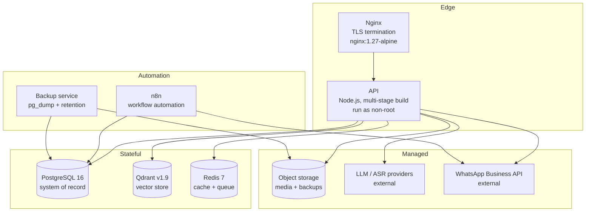

# 12. DevOps and Infrastructure Plan

**Source of truth:** `docs/FathersNet-Complete-SRS.md` (FN-SRS-001 v2.0) — Deployment Specification (§16) is the controlling authority for this document: Docker Compose reference deployment (§16.1), CI/CD pipeline GitHub Actions (§16.2), and scalability approach (§16.3). Also binding: Architecture Requirements AR-036…AR-040 (§15.2), Non-Functional Requirements NFR-010…NFR-015 (availability & reliability, §5.2), NFR-036…NFR-040 (operability, §5.6), NFR-001…NFR-009 (performance & scalability, §5.1), backend/automation/observability FR-159…FR-170 (§4.17), Monitoring and Operations (§18), Disaster Recovery (§19), Operational Requirements OR-001…OR-012 (§18.6), Architecture Decision Record ADR-006 (Hosting Approach, §15.4), and quality gates QR-002 and QR-006 (§17.1).
**Inputs:** `00-requirement-inventory.md`, `02-srs-requirement-analysis.md` (dependency map), `03-system-architecture-plan.md`, `04-technology-stack-analysis.md`, `05-database-implementation-plan.md`, `06-backend-development-plan.md`, `07-whatsapp-platform-implementation-plan.md`, `08-ai-rag-implementation-plan.md`, `11-security-and-privacy-plan.md`.
**Purpose:** Production implementation roadmap for the platform's infrastructure and operations: container strategy, environment management, cloud architecture, CI/CD, Infrastructure-as-Code, monitoring, alerting, backup, disaster recovery, scalability, secrets, observability tooling, runbooks, dependencies, risks, and verification evidence.
**Classification convention:** **Confirmed** (SRS-mandated) · **Recommended** (engineering decision) · **Configurable** (parameter with default) · **Assumption** (requires human validation). Every major design item carries Source / Confidence / Reasoning / Impact if changed.

---

## 1. Executive Purpose

This document is the controlling engineering roadmap for the **DevOps and infrastructure** of FathersNet (Ayay). It translates SRS §16 into a buildable, phased sequence and operationalizes every infrastructure-related requirement into production-ready design, tooling, and procedure decisions.

| Capability | SRS Requirement | This Document's Section |
| --- | --- | --- |
| Containerized service topology and images | §16.1, FR-159, AR-001 | §2 |
| Dev environment (Docker Compose) and production orchestration choice | §16.1, ADR-006, NFR-036 | §2.5–2.6 |
| Environment isolation and feature flags | AR-009, FR-168, QR-012 | §3 |
| Single-cloud multi-zone architecture, network, storage, cost monitoring | ADR-006, FR-150, AR-040 | §4 |
| CI/CD pipeline with gates, canary, rollback, signing | §16.2, FR-167, FR-168, AR-037, QR-002 | §5 |
| Infrastructure as Code with drift detection and secret management | AR-036, FR-170, NFR-022 | §6 |
| Centralized monitoring, SLOs, synthetic checks, traces, logs | §18.2, FR-155, FR-166, NFR-037, AR-038 | §7 |
| Alerting with severity, thresholds, escalation, cost/queue alerts | §18.3, OR-008, AR-040 | §8 |
| Backup per §19 incl. verification | §19, NFR-014, AR-039 | §9 |
| Disaster recovery, drills, business continuity | §19, NFR-012, OR-012, OR-023 | §10 |
| Scalability and performance targets | §16.3, NFR-001…009, AR-008, QR-006 | §11 |
| Secrets management and rotation | NFR-022, FR-170, §14.2 | §12 |
| Observability tooling and retention | FR-166, NFR-037, §18.1 | §13 |
| Runbooks and operations | OR-001…012, §18.3, §18.4 | §14 |

Scope boundaries: application code, service boundaries, and the event bus are owned by `06-backend-development-plan.md`; the database schema and migration tooling by `05-database-implementation-plan.md`; WhatsApp provider and message gateway specifics by `07-whatsapp-platform-implementation-plan.md`; the AI/RAG stack and its model-provider contracts by `08-ai-rag-implementation-plan.md`; security/privacy controls (threat model, DPA, RBAC) by `11-security-and-privacy-plan.md`; and test/quality gates by `13-testing-and-quality-plan.md`. This document supplies the infrastructure that all of the above run on and the operational procedures that keep them running.

---

## 2. Docker Strategy

### 2.1 Container Topology

The production topology is the §16.1 service set, grouped by role. Every service in §16.1 is retained; no SRS service is dropped.



**Attribute** | **Value**
--- | ---
**Source** | §16.1 service list; §15.1 architecture diagram; FR-159
**Classification** | Confirmed (service set and roles); Recommended (grouping into Edge/Stateful/Automation/Managed)
**Confidence** | High
**Reasoning** | §16.1 names exactly these services (Nginx, API, PostgreSQL, Qdrant, Redis, n8n, backup) and §15.1 places the message gateway at the edge with the data stores underneath. Retaining every service preserves the SRS reference deployment as the development ground truth while the grouping clarifies which components are horizontally scalable (Edge, N8N, backup) versus stateful (DB, Qdrant, Redis).
**Impact if changed** | Removing or merging a service breaks parity with §16.1 and invalidates the compose file as the canonical dev reference. Moving stateful services to unmanaged self-host with a single instance would violate NFR-011 (redundancy) and NFR-012 (RPO/RTO).

### 2.2 Image Strategy and Multi-Stage Builds

| Image | Base (per §16.1) | Build stage strategy | Runtime user | Notes |
| --- | --- | --- | --- | --- |
| `nginx` | `nginx:1.27-alpine` | Official image; config mounted read-only | `nginx` (default in official image) | Config + certs mounted `:ro`; disable server tokens |
| `api` | `node` (Alpine LTS) | Stage 1 `build`: install dev deps + compile/transpile; Stage 2 `runtime`: copy only built artifacts and production dependencies | Non-root `node` UID 1001 | Multi-stage per NFR-038/NFR-036; pinned digest |
| `db` | `postgres:16-alpine` | Official image; init scripts + extension config baked at image build | `postgres` | Volume-mounted data |
| `qdrant` | `qdrant/qdrant:v1.9` | Official image; storage on volume | Non-root where image permits | Data dir `/qdrant/storage` |
| `redis` | `redis:7-alpine` | Official image; AOF enabled via command | Non-root `redis` | `--appendonly yes` per §16.1 |
| `n8n` | `n8nio/n8n` | Official image pinned to a versioned tag (not `latest`) | `node` (image default) | Basic auth via `N8N_BASIC_AUTH_*` per §16.1 |
| `backup` | `postgres:16-alpine` | Official image; entrypoint wrapper for dump + retention | `postgres` | Runs dump loop per §16.1 |

**Attribute** | **Value**
--- | ---
**Source** | §16.1 images; QR-002/NFR-039 (quality); NFR-022 (no secrets in images)
**Classification** | Confirmed (image identities); Recommended (multi-stage, non-root, pinned digests)
**Confidence** | High
**Reasoning** | The SRS names each image and the compose file verbatim. Multi-stage builds shrink the runtime surface and satisfy the supply-chain discipline behind QR-013 and NFR-016. Non-root runtime and pinned tags/digests are the standard hardening for the OWASP A05/A08 classes the SRS maps in §14.4.
**Impact if changed** | Basing the API image on `latest` node introduces unreproducible builds (violates NFR-036 reproducible environments). Running the API as root undermines defense-in-depth (NFR-017). Dropping multi-stage keeps dev toolchain in prod images and increases the attack surface.

### 2.3 Non-Root Users and Container Hardening

- Every runtime container runs with an explicit non-root UID/GID (API `1001`, n8n image default non-root, Postgres/Redis/Qdrant non-root where the base image permits). In Kubernetes this is enforced with `securityContext.runAsNonRoot: true`, `allowPrivilegeEscalation: false`, `capabilities.drop: ["ALL"]` for application containers, and `readOnlyRootFilesystem: true` where the image allows (write volumes mounted explicitly for cache/spool).
- No shell utilities, debuggers, or build toolchains are copied into the API runtime image.
- Container images carry no secrets: environment is injected at deploy time from the secret manager (§12), never baked at build (NFR-022).
- Container registries are private (ECR/GCR/Artifactory) with IAM-based pull access, not public `latest`.
- Resource limits (`requests`/`limits` for CPU and memory) are set on every container to protect neighbors (NFR-008 graceful degradation) and to drive autoscaling (§11).

**Attribute** | **Value**
--- | ---
**Source** | NFR-017 (defense-in-depth); NFR-022 (no secrets in images); §14.4 OWASP A05/A08
**Classification** | Recommended (mechanism); Confirmed (objective)
**Confidence** | High
**Reasoning** | Least-privilege execution is the canonical remediation for container escape and injection classes; the SRS demands defense-in-depth (NFR-017) and zero secrets in images/logs (NFR-022). Resource limits are a precondition for the §16.3 scaling story.
**Impact if changed** | Privileged root containers convert a web/RCE vulnerability into host compromise. Unlimited containers allow a noisy neighbor or runaway consumer (e.g., transcription fan-out) to starve the WhatsApp path (NFR-003).

### 2.4 Healthchecks

Every service exposes liveness and readiness semantics (NFR-013):

| Service | Liveness signal | Readiness signal | Compose `healthcheck` |
| --- | --- | --- | --- |
| `nginx` | process up | TLS listener accepts on 443 | `wget -qO- http://127.0.0.1/healthz` |
| `api` | `/healthz` (process) | `/readyz` (DB, Redis, Qdrant reachable) | HTTP 200 on `/healthz`; interval 10s |
| `db` | `pg_isready` | `pg_isready -U fathersnet` (per §16.1) | §16.1 healthcheck verbatim |
| `qdrant` | process up | `GET /readyz` 200 | `curl -fs http://127.0.0.1:6333/readyz` |
| `redis` | process up | `redis-cli ping` -> PONG | `redis-cli ping` |
| `n8n` | process up | `GET /healthz` 200 | HTTP 200 on `/healthz` |
| `backup` | dump loop alive | last dump mtime < 26h | timestamp check via exported metric |

In Kubernetes, readiness gates route traffic away before a pod is killed; liveness triggers restart/replacement (NFR-013 self-healing). The API readiness probe must not include AI/ASR providers (those degrade gracefully per NFR-015 rather than taking the service down).

**Attribute** | **Value**
--- | ---
**Source** | NFR-013; §16.1 db healthcheck; OR-007 (dashboards)
**Classification** | Confirmed (health checks required); Recommended (endpoint split /readyz vs /healthz)
**Confidence** | High
**Reasoning** | NFR-013 mandates automated health checks and self-healing restarts for all services. Splitting liveness from readiness prevents Kubernetes from restarting healthy-but-cold-starting pods and prevents serving traffic to pods whose dependencies are down.
**Impact if changed** | A single undifferentiated health endpoint causes either premature kills (restart loops) or routing traffic to a pod that cannot serve (5xx burst). Including third-party AI reachability in readiness would false-negative the whole API during LLM outages, defeating NFR-015 degradation.

### 2.5 Docker Compose Reference (Development)

The dev environment reproduces §16.1 with the SRS env var contract unchanged and refines it with healthchecks, non-root, resource limits, and secrets injected from a local gitignored `.env` or the local secret-manager CLI. The compose file below is the **development specification**; production uses the orchestration in §2.6.

```yaml
# docker-compose.yml — development reference (parity with SRS §16.1)
version: "3.9"

services:
  nginx:
    image: nginx:1.27-alpine
    ports: ["80:80", "443:443"]
    volumes:
      - ./nginx/nginx.conf:/etc/nginx/nginx.conf:ro
      - ./certs:/etc/nginx/certs:ro
    depends_on: [api]
    restart: unless-stopped

  api:
    build: ./backend
    environment:
      NODE_ENV: production
      DATABASE_URL: postgresql://fathersnet:${DB_PASSWORD}@db:5432/fathersnet
      REDIS_URL: redis://redis:6379
      QDRANT_URL: http://qdrant:6333
      WHATSAPP_PROVIDER: ${WHATSAPP_PROVIDER}
      WHATSAPP_APP_SECRET: ${WHATSAPP_APP_SECRET}
      WHATSAPP_ACCESS_TOKEN: ${WHATSAPP_ACCESS_TOKEN}
      LLM_API_KEY: ${LLM_API_KEY}
      ASR_API_KEY: ${ASR_API_KEY}
      JWT_SECRET: ${JWT_SECRET}
      FEATURE_FLAGS: ${FEATURE_FLAGS:-offline-journal=true,chat-v2=false}
    depends_on:
      db: {condition: service_healthy}
      redis: {condition: service_started}
      qdrant: {condition: service_started}
    restart: unless-stopped

  db:
    image: postgres:16-alpine
    environment:
      POSTGRES_USER: fathersnet
      POSTGRES_PASSWORD: ${DB_PASSWORD}
      POSTGRES_DB: fathersnet
    volumes: [db_data:/var/lib/postgresql/data]
    healthcheck:
      test: ["CMD-SHELL", "pg_isready -U fathersnet"]
      interval: 10s
      timeout: 5s
      retries: 5
    restart: unless-stopped

  qdrant:
    image: qdrant/qdrant:v1.9
    volumes: [qdrant_data:/qdrant/storage]
    healthcheck:
      test: ["CMD", "curl", "-fs", "http://127.0.0.1:6333/readyz"]
      interval: 15s
      timeout: 5s
      retries: 5
    restart: unless-stopped

  redis:
    image: redis:7-alpine
    command: ["redis-server", "--appendonly", "yes"]
    volumes: [redis_data:/data]
    healthcheck:
      test: ["CMD", "redis-cli", "ping"]
      interval: 10s
      timeout: 5s
      retries: 5
    restart: unless-stopped

  n8n:
    image: n8nio/n8n:1.0.0
    environment:
      N8N_BASIC_AUTH_ACTIVE: "true"
      N8N_BASIC_AUTH_USER: ${N8N_USER}
      N8N_BASIC_AUTH_PASSWORD: ${N8N_PASSWORD}
    volumes: [n8n_data:/home/node/.n8n]
    restart: unless-stopped

  backup:
    image: postgres:16-alpine
    environment:
      PG_BACKUP_TARGET: db
      BACKUP_RETENTION_DAYS: ${BACKUP_RETENTION_DAYS:-14}
    volumes:
      - ./backups:/backups
      - db_data:/db_data:ro
    command: >
      sh -c "while true; do pg_dump -h db -U fathersnet fathersnet | gzip > /backups/fathersnet_$(date +%Y%m%d%H%M).sql.gz;
      find /backups -name '*.sql.gz' -mtime +${BACKUP_RETENTION_DAYS} -delete; sleep 86400; done"
    depends_on:
      db: {condition: service_healthy}
    restart: unless-stopped

volumes:
  db_data:
  qdrant_data:
  redis_data:
  n8n_data:
```

**Configurable env vars (unchanged contract from §16.1):** `DB_PASSWORD`, `WHATSAPP_PROVIDER`, `WHATSAPP_APP_SECRET`, `WHATSAPP_ACCESS_TOKEN`, `LLM_API_KEY`, `ASR_API_KEY`, `JWT_SECRET`, `N8N_USER`, `N8N_PASSWORD`, `BACKUP_RETENTION_DAYS` (default 14). Added (configurable): `FEATURE_FLAGS` for FR-168 toggle surface in dev.

**Attribute** | **Value**
--- | ---
**Source** | §16.1 compose verbatim + refinement
**Classification** | Confirmed (service/env-var parity); Recommended (healthchecks, pinning, resource limits)
**Confidence** | High
**Reasoning** | The SRS mandates this topology and env contract as the reference deployment; the dev compose must be byte-compatible with that contract so a developer can run the platform exactly as documented. Refinements (healthchecks, `depends_on` conditions, non-`latest` n8n pinning) address NFR-013 and reproducible envs (NFR-036) without changing any SRS service or variable.
**Impact if changed** | Renaming env vars breaks §16.1 parity and the CI security-job references. Using `n8n:latest` in production violates reproducibility; in dev it is pinned here to reduce surprise drift.

### 2.6 Production Orchestration — Engineering Recommendation

**Recommendation:** Run production on **managed Kubernetes** (reference: Amazon EKS on AWS, GKE Autopilot as the equal alternative) with all stateful workloads on **managed services** (managed PostgreSQL, managed Redis; Qdrant managed or self-hosted per cost trade-off) — rather than Docker Compose or a serverless container platform as the sole runtime.

| Option | Fit | Decision |
| --- | --- | --- |
| Docker Compose (single host) | Dev/reference only (§16.1 calls it a reference deployment, not a production model) | Rejected for prod |
| Managed container platform (ECS Fargate / Cloud Run / Azure Container Apps) | Simpler ops; weaker native canary/sidecar control | Acceptable alternative, not primary |
| **Managed Kubernetes (EKS / GKE Autopilot)** | Matches §16.3 horizontal scaling, FR-168 canary/rolling, NFR-011 multi-zone, NFR-038 zero-downtime deploys | **Selected (Recommended)** |
| Managed services for state (PostgreSQL, Redis; Qdrant managed or self-hosted) | RPO <= 15 min via PITR, NFR-011 redundancy, §19 backup requirements | **Selected (Recommended)** |

Rationale in depth: §16.1 states production "should use managed or orchestrated equivalents (e.g., Kubernetes) with the same service topology." ADR-006 commits to a single cloud with multi-zone readiness. Managed Kubernetes provides (a) stateless horizontal scaling of the API and queue consumers with HPA (NFR-006), (b) native rolling/canary deployments and automated rollback (FR-168, NFR-038, AR-037), (c) multi-zone pod scheduling for critical services (NFR-011), (d) self-healing restarts and readiness gating (NFR-013), and (e) a mature operator ecosystem for the observability stack (§7). Managed data services offload the backup/HA mechanics (§9, §10) onto the provider, which is the pragmatic path to meeting RPO <= 15 min / RTO <= 4 h with a small operations team (OR-001). The trade-off is operational complexity and control-plane cost; the alternative (Fargate/Cloud Run) is acceptable for a pilot of ~500 concurrent fathers but would require more bespoke code for canary/rollback and multi-zone stateful failover. A full on-prem or multi-cloud approach is explicitly rejected by ADR-006 for the pilot.

**Attribute** | **Value**
--- | ---
**Source** | §16.1 ("managed or orchestrated equivalents"); ADR-006 (single cloud multi-zone); NFR-006/011/013/038; §16.3
**Classification** | Recommended (engineering decision); Confirmed (SRS allows orchestrated/managed equivalent)
**Confidence** | Medium–High (high on managed-Kubernetes suitability; medium on provider-specific choice pending cloud selection, §4)
**Reasoning** | The SRS prescribes the service topology, not the orchestrator. Managed Kubernetes satisfies the SRS's stated "orchestrated equivalent" and the FR-168/NFR-038 deployment requirements with the least custom engineering; managed state services are the only realistic route to the §19 RPO/RTO targets with a small ops team.
**Impact if changed** | Choosing Compose for prod caps scaling (violates NFR-001 scaling path and NFR-006), provides no zone redundancy (NFR-011), and no automated rollback (NFR-038). Choosing a serverless container platform is workable but moves canary logic and multi-zone failover into application code and CI, increasing delivery risk for FR-168.

### 2.7 Registry and Tagging Strategy

- Private container registry (reference: ECR, one per environment scope or one shared with environment namespacing).
- Tagging convention: immutable tags `<sha256-of-git-commit>` plus environment-pinned tags `<env>-<build-number>`; never overwrite an immutable tag (supply-chain integrity per §5.8).
- Base images pinned by digest; renovate-style automated PRs for base/dependency updates (NFR-039 maintainability, patching cadence).

**Attribute** | **Value**
--- | ---
**Source** | NFR-036; NFR-017 patching; §16.2 build job
**Classification** | Recommended
**Confidence** | High
**Reasoning** | Immutable tags make every deployed artifact traceable to a commit and auditable, and digest pinning supports the zero-critical/high posture of NFR-016.
**Impact if changed** | Mutable `latest` tags make rollback ambiguous (NFR-038) and break the audit trail for "what exactly is running in prod."

---

## 3. Environment Management

### 3.1 Environment Topology (AR-009 Isolation)

Three isolated environments, provisioned from the same IaC modules (§6) with distinct accounts/projects and no shared data paths:

| Environment | Purpose | Provisioning | Data policy | Access |
| --- | --- | --- | --- | --- |
| `dev` | Developer iteration, local compose + shared dev account | IaC + manual promotion; branch `feature/*` | Synthetic data only; **no production data** (AR-009, QR-012) | Developers |
| `staging` | Integration, security, performance, UAT, canary rehearsal | IaC; promoted from `develop` (§5) | Synthetic + anonymized fixtures; restore-drill target (§10.3) | Engineering + QA + clinical reviewers |
| `prod` | Pilot live service | IaC; promoted from `main` behind approval gates (§5.6) | Production data only; PITR + backups (§9) | On-call (OR-001) + approved deployers |

Hard isolation boundaries: separate cloud accounts/projects and IAM; separate VPCs and private subnets; separate object-storage buckets; separate secret-manager scopes; no cross-environment DNS; database credentials cannot reach across environments.

**Attribute** | **Value**
--- | ---
**Source** | AR-009; NFR-036; QR-012 (§17.5 "no production PII in dev/staging"); §16.2 (staging/prod promotion)
**Classification** | Confirmed (isolation requirement); Recommended (three-env split, account-level isolation)
**Confidence** | High
**Reasoning** | AR-009 mandates environment and data-flow isolation with production data never used in lower environments, and §17.5 mandates synthetic test data. Separate accounts/projects make the boundary enforceable by cloud policy rather than by convention.
**Impact if changed** | Sharing a database or copying a prod snapshot into staging violates AR-009 and QR-012, and turns a staging bug into a privacy breach (FR-127/§14.1.3). A fourth `qa` environment may be added later but is not required at pilot scale.

### 3.2 No Production Data in Lower Environments

- Staging/dev use the synthetic dataset defined in §17.5 with consent fixtures of realistic consent versions; research test data is anonymized (QR-012).
- The only sanctioned production-adjacent data movement into non-prod is an **anonymized, scrubbed** subset used by the restore drill (§10.3), executed against staging, never served, and wiped after the drill.
- A CI secret gate (§5.5 trufflehog) plus storage-egress policy prevents accidental prod-to-dev data exfiltration.

**Attribute** | **Value**
--- | ---
**Source** | AR-009; QR-012; §17.5
**Classification** | Confirmed
**Confidence** | High
**Reasoning** | Explicit SRS statements; no interpretation needed.
**Impact if changed** | Real PII/health data in dev would expose the platform to the §14.1.3 data-leakage threat and defeat privacy-by-design (NFR-025).

### 3.3 Environment Configuration

- All configuration is environment-scoped and versioned in IaC (config maps / parameters) plus a managed secret store for secrets (§12). Non-secret config lives in the repo (values files per environment); secrets live only in the secret manager.
- Each environment defines its own: database names/credentials, feature-flag defaults, rate-limit tiers (§12.1), logging levels, alert routing (§8), and capacity limits (§5.9).
- Config changes are deployed through the same CI approval chain as code (change management OR-005), and every config version is captured in the IaC state for rollback (NFR-038).

**Attribute** | **Value**
--- | ---
**Source** | AR-036; NFR-036; OR-005; FR-170
**Classification** | Confirmed (reproducible envs, change management); Recommended (mechanism)
**Confidence** | High
**Reasoning** | Reproducible environments require config to be code; secrets separated from config per NFR-022.
**Impact if changed** | Editing config by hand in the console creates unreproducible, undocumented drift and breaks NFR-036's acceptance criterion ("environments created reproducibly from code").

### 3.4 Feature Flags (FR-168)

- Flag runtime: Redis-backed flag service, versioned, with per-environment, per-cohort, and percentage rollouts.
- Flag lifecycle: default-on/off per environment; kill-switch flags for high-risk capabilities (e.g., new prompt engine, campaign automation) so any flag can be disabled instantly in prod (rollback-in-place).
- Governance: flag definitions reviewed like code; audit log of flag changes (FR-098); stale flags retired on a schedule (NFR-039 maintainability).
- Flag categories (initial set, configurable): `offline-journal` (mobile), `chat-v2` (conversation engine), `new-prompt-engine`, `campaign-automation`, `ai-fallback-tier2`, `broadcast-v2`.

**Attribute** | **Value**
--- | ---
**Source** | FR-168 (feature flags + canary/rolling); OR-027 (phased rollout with feature flags)
**Classification** | Confirmed (flags required); Recommended (mechanism, flag set)
**Confidence** | High
**Reasoning** | FR-168 mandates feature flags and canary/rolling deployment; OR-027 ties phased rollout to flags. A kill-switch flag is the fastest operator-controlled rollback for a bad release (NFR-038).
**Impact if changed** | Without flags, new features are all-or-nothing in prod, making OR-027 phased rollout impossible and raising the blast radius of every release.

---

## 4. Cloud Architecture

### 4.1 Single-Cloud Multi-Zone Readiness (ADR-006)

**Recommendation:** select one cloud provider (reference: AWS) and run the production platform in **at least three availability zones (AZs)** within one region, keeping the architecture provider-agnostic through Terraform modules and containerized services so a future migration remains possible.

- ADR-006 explicitly commits to a single cloud with multi-zone readiness initially; multi-cloud is an explicit non-goal for the pilot.
- Every critical service (NFR-011 list: authentication, WhatsApp gateway, reminder engine, AI safety layer) is deployed across >=2 AZs via multi-AZ managed services and node groups spanning the AZs; the API and queue consumers are spread by the autoscaler (§11).
- Zone failure is treated as a survivable event: no single-AZ dependency exists on any critical path (NFR-011 acceptance: "critical services recover within RTO without data loss").

**Attribute** | **Value**
--- | ---
**Source** | ADR-006; NFR-011; D-03 (regional availability)
**Classification** | Recommended (provider selection); Confirmed (single-cloud multi-zone mandate)
**Confidence** | Medium–High (provider choice is configurable; multi-zone mandate is certain)
**Reasoning** | ADR-006's decision text is explicit; the reference provider is chosen because the SRS's storage paths use `s3://` (§7.4.2), the cost model (Appendix C) assumes managed DB + managed observability, and AWS offers a multi-AZ African region. GCP is an equal alternative if the AI partnership (Gemini/Google Speech) becomes strategic; Terraform modules keep the choice reversible.
**Impact if changed** | Switching providers changes region/zone availability, egress allow-list entries, KMS/secret-manager integration, and cost, but not the container topology or pipeline because everything above the Terraform layer is provider-neutral.

### 4.2 Region Selection

- **Recommendation:** `af-south-1` (Cape Town, 3 AZs) as the pilot reference region for African data residency and lowest in-continent latency; `eu-central-1`/`eu-west-1` or GCP `europe-west`/`me-central` as documented fallbacks pending latency and compliance review.
- Decision inputs (D-03): data-residency requirements for health data (NFR-041 legal review before launch), latency for WhatsApp webhook ack (NFR-003) and API p95 (NFR-002), compliance posture, and cost.
- The pilot must not hardcode a region in code; all region-specific values are Terraform variables (portability, §6).

**Attribute** | **Value**
--- | ---
**Source** | D-03; NFR-002/003; NFR-041; ADR-006
**Classification** | Recommended (region choice); Confirmed (regional availability is a dependency)
**Confidence** | Medium (region is a configurable operational choice pending compliance review)
**Reasoning** | The SRS lists cloud regional availability as a dependency and requires legal review before launch (NFR-041); region must be chosen with residency + latency evidence. No Ethiopian/East-African major region exists yet, so an in-continent African region is the residency-positive default.
**Impact if changed** | A region without >=2 AZs cannot meet NFR-011. High cross-continent latency would push WhatsApp webhook processing past the NFR-003 median and degrade NFR-002 p95.

### 4.3 Network / VPC

- Single VPC per environment with: public subnets for the load balancer/ingress only; private subnets for all workloads and data stores; dedicated subnets for DB/Redis/Qdrant (no internet path).
- Internet ingress: TLS at the load balancer / nginx (NFR-021 TLS 1.2+), WAF rules in front (OWASP §14.4 A01/A07/A09), API gateway rate limiting (FR-169, §12.1 limits).
- No public IPs on workloads or databases; security groups restricted to the load balancer and same-VPC service principals.
- Egress governed by an explicit allow-list (§4.4).

**Attribute** | **Value**
--- | ---
**Source** | NFR-017 (network isolation); FR-169 (gateway rate limiting); §14.4 OWASP A10 (SSRF); NFR-020 (SSRF coverage)
**Classification** | Confirmed (isolation); Recommended (topology)
**Confidence** | High
**Reasoning** | Defense-in-depth (NFR-017) and the SRS's explicit OWASP A10 SSRF mapping require controlled network boundaries; private-subnet data stores are the canonical control.
**Impact if changed** | Exposing the database to the internet or granting broad egress converts any web/API vulnerability into a data-exfiltration or SSRF path, directly contradicting §14.1.3 and §14.1.6.

### 4.4 Egress Allow-List

Controlled and allow-listed outbound destinations (OWASP A10 SSRF mitigation, NFR-020):

| Destination | Purpose | Notes |
| --- | --- | --- |
| WhatsApp Business API provider endpoint(s) | Webhook outbound + media download (§7.4) | Provider-specific TLS FQDN(s), switchable per FR-149 |
| LLM provider endpoints (primary + fallback) | RAG generation + embeddings (§9.8) | Gemini primary; GPT-4o-mini / Claude fallback tiers |
| ASR provider endpoints | Transcription (AssemblyAI primary, Google Speech fallback, §9.7) | |
| Object-storage endpoint (same cloud) | Media + backups | Private, in-region |
| Managed observability ingest | Metrics/logs/traces (§7) | |
| SMS/email/push provider(s) | Notification fallback (FR-042, FR-152) | |
| SMTP for operational mail (optional) | Alert/notification | |

All other destinations are denied; egress is monitored and any unknown destination raises a security alert (§8.3). The allow-list is expressed in IaC (network policy / security-group egress) and reviewed on provider changes.

**Attribute** | **Value**
--- | ---
**Source** | §14.4 OWASP A10; NFR-020; §7.4; §9.7–9.8; FR-149/151/152
**Classification** | Confirmed (SSRF control); Recommended (destination list)
**Confidence** | High
**Reasoning** | The SRS names the external processors (WhatsApp, LLM, ASR, notifications) in §2.2 context and §4.15, and maps SSRF to network isolation in §14.4. An allow-list is the only durable SSRF control for a service that legitimately fetches media and calls AI providers.
**Impact if changed** | A wide-open egress rule nullifies the SSRF mitigation and increases the blast radius of every compromised dependency; an over-restrictive list breaks voice-note transcription (FR-018) or model fallback (FR-072).

### 4.5 Object Storage

- Managed object storage (reference: S3-compatible) with: server-side encryption at rest (KMS-managed keys, NFR-021), TLS for all access, per-bucket policy least-privilege, and lifecycle rules.
- Buckets (all private, environment-scoped):
  - `media/voice`, `media/photo`, `media/document` — user media per §7.4.2 (`<anonymized_user_id>/<message_id>` paths, never phone numbers, FR-022).
  - `backups` — §9 outputs.
  - `artifacts` — CI artifacts/SBOMs (§5.8).
- Media access via signed, expiring URLs only (FR-150 access control, §7.4.2).
- Retention lifecycle per §9.2 (versioning + lifecycle expiry) and data-class retention (FR-105).

**Attribute** | **Value**
--- | ---
**Source** | FR-150; §7.4.2 storage paths; NFR-021; §14.2 encryption
**Classification** | Confirmed (object storage for media + access control + retention); Recommended (bucket layout)
**Confidence** | High
**Reasoning** | FR-150 mandates object storage with access control and retention; §7.4.2 fixes the path scheme and signed-URL access model; §14.2 fixes encryption.
**Impact if changed** | Public buckets or phone-number-based paths violate FR-150/FR-022 and §14.1.3; missing versioning breaks §19 backup requirements for media.

### 4.6 Cost Monitoring (AR-040)

- Budgets per environment with alerts at 50%, 75%, 90%, 100% of monthly budget; a hard anomaly alert on day-over-day spend spikes (e.g., > 2x 7-day rolling average).
- Cost allocation tags per service (api, whatsapp, ai, storage, observability) and per environment; a monthly cost review compares against the Appendix C reference ranges ($150–$500 infra/month at pilot).
- Per-component controls: AI token budgets routed via §9.8 cost-aware routing + Redis answer caching; messaging volume caps (§7.4.3 rate limits) protect WhatsApp spend; storage lifecycle + compression (§7.4.2) control media cost.
- AR-040 is a Should-Have; the cost review cadence is monthly with quarterly optimization (rightsizing, reserved/spot capacity, Appendix C C.4).

**Attribute** | **Value**
--- | ---
**Source** | AR-040; A-07 (cost control priority); Appendix C; §7.4.2/7.4.3
**Classification** | Confirmed (cost monitoring + budget alerts); Recommended (mechanism + thresholds)
**Confidence** | High
**Reasoning** | AR-040 mandates budget alerts and optimization review; A-07 makes cost control a program priority. The §5.9 capacity targets and the Appendix C cost model give concrete reference numbers to alert against.
**Impact if changed** | Without budget alerts, a runaway AI loop or broadcast can burn the pilot budget undetected in days, directly conflicting with A-07 and §14.1.6 (API abuse → cost spikes).

---

## 5. CI/CD Pipeline

### 5.1 Branch Strategy

| Branch | Purpose | Promotion |
| --- | --- | --- |
| `feature/*` | Development branches | PR into `develop` (must pass PR checks §5.3) |
| `develop` | Integration branch; deploys to **staging** (§16.2 `deploy-staging`) | Auto-deploy on push (if checks pass) |
| `main` | Production branch; deploys to **production** (§16.2 `deploy-production`) | Auto-deploy behind approval gate + canary (if checks pass) |
| `release/*` | Optional release stabilization | PR into `main` |

This matches §16.2's `on: push: branches: [main, develop]` plus PR trigger, and satisfies NFR-039 (defined branch/PR workflow).

**Attribute** | **Value**
--- | ---
**Source** | §16.2 trigger block; NFR-039; OR-005
**Classification** | Confirmed (main/develop in SRS); Recommended (feature/release conventions)
**Confidence** | High
**Reasoning** | §16.2 hardcodes `main` and `develop`; the additional branches are the standard completion of the SRS's stated "defined branch/PR workflow" (NFR-039).
**Impact if changed** | Deploying straight from feature branches to prod removes the staging gate and the approval separation required by §16.2 and QR-013.

### 5.2 Pipeline Stages (Refined §16.2)

The SRS §16.2 pipeline is reproduced and refined below. SRS stages **Build → Test → Security scan → Deploy → Rollback → Health checks → Approval gates** are preserved; refinements add PR-gating, Terraform, artifact signing, and E2E/load jobs. The YAML is a specification of the pipeline that will be committed as `.github/workflows/ci-cd.yml`.

```yaml
name: CI/CD

on:
  push:
    branches: [main, develop]
  pull_request:
  workflow_dispatch:

concurrency:
  group: ${{ github.ref }}
  cancel-in-progress: true

env:
  REGISTRY: ${{ vars.PRIVATE_REGISTRY }}   # from repo/org variables (IaC-managed), not a literal
  IMAGE_TAG: ${{ github.sha }}

jobs:
  build:
    runs-on: ubuntu-latest
    steps:
      - uses: actions/checkout@v4
      - name: Build images (multi-stage)
        run: docker compose build
      - name: Build SBOM
        run: ./scripts/sbom.sh            # syft -> SPDX/CycloneDX artifact
      - name: Sign image + SBOM
        run: ./scripts/cosign-sign.sh     # cosign; keyless OIDC signing (sigstore)
      - name: Push images (immutable tag)
        run: ./scripts/push.sh

  test:
    runs-on: ubuntu-latest
    needs: build
    steps:
      - name: Unit + integration
        run: npm test && pytest
      - name: Coverage gate (QR-002)
        run: |
          npm run test:coverage          # core backend >= 80%, overall >= 70%; fails below floors
          pytest --cov-fail-under=80 --cov=ai_service
      - name: Contract tests (QR-005)
        run: npm run test:contract
      - name: E2E smoke (critical journeys, QR-004)
        run: ./scripts/e2e.sh            # registration -> opt-in -> weekly prompt -> AI question -> response

  security:
    runs-on: ubuntu-latest
    needs: test
    steps:
      - name: Dependency scan
        run: npm audit --omit=dev && pip-audit
      - name: SAST
        run: npm run sast && semgrep ci
      - name: Secret scan
        run: trufflehog filesystem ./ && gitleaks detect
      - name: Container scan (vulnerabilities)
        run: trivy image --severity CRITICAL,HIGH --exit-code 1 --ignore-unfixed ${{ env.REGISTRY }}/api:${IMAGE_TAG}
      - name: DAST (on staging deployment)
        if: github.ref == 'refs/heads/develop'
        run: ./scripts/dast.sh staging

  deploy-staging:
    runs-on: ubuntu-latest
    needs: [security]
    if: github.ref == 'refs/heads/develop'
    steps:
      - name: Terraform plan + apply (staging)
        run: ./scripts/terraform.sh apply staging
      - name: Deploy to staging
        run: ./scripts/deploy.sh staging
      - name: Health checks
        run: ./scripts/healthcheck.sh staging
      - name: Drift detection (staging)
        run: ./scripts/terraform.sh plan -detailed-exitcode staging || [[ $? -eq 2 ]]

  deploy-production:
    runs-on: ubuntu-latest
    needs: [security]
    if: github.ref == 'refs/heads/main'
    environment:
      name: production
      url: https://app.example.org
    steps:
      - name: Terraform plan + apply (production, gated)
        run: ./scripts/terraform.sh apply production
      - name: Approval gate (manual)
        uses: trstringer/manual-approval@v1
        with:
          secret: ${{ secrets.DEPLOY_APPROVAL }}
      - name: Canary deploy
        run: ./scripts/deploy.sh production canary
      - name: Health checks + canary promotion
        run: ./scripts/healthcheck.sh production && ./scripts/promote.sh production
      - name: Rollback on failure
        if: failure()
        run: ./scripts/rollback.sh production
```

**Attribute** | **Value**
--- | ---
**Source** | §16.2 pipeline; QR-002/003/004/005/006/007; §17.2–17.4
**Classification** | Confirmed (SRS stages); Recommended (SBOM, signing, DAST, container scan, drift)
**Confidence** | High
**Reasoning** | The SRS fixes the stage order and the security tools (npm audit, pip-audit, semgrep, trufflehog) and the coverage floor comment (§16.2 "fails below 80%"); the inventory's QR-002 requires 80% core / 70% overall, so both floors are encoded. The refinements are the standard completion of §14.4 OWASP A08 (software/data integrity) and NFR-036 (drift detection) — the SRS already maps A08 to "supply-chain scanning."
**Impact if changed** | Dropping the coverage gate voids QR-002 acceptance. Skipping the approval gate removes the human control §16.2 mandates for prod. Removing signing invalidates the A08 integrity mapping.

### 5.3 PR Checks

Every pull request to `develop`/`main` runs: lint (NFR-039), unit + integration tests, coverage floors (QR-002), dependency audit, SAST (semgrep), secret scan (trufflehog), contract tests (QR-005), and an E2E smoke of the critical journey (QR-004). Required reviews (NFR-039 "defined branch/PR workflow"): at least one approving review; changes touching AI prompts/security-sensitive paths require a second reviewer. Status checks are required for merge; `main` additionally requires all staging checks green (QR-013).

**Attribute** | **Value**
--- | ---
**Source** | NFR-039; QR-013; §16.2 PR trigger
**Classification** | Confirmed (quality gates); Recommended (review policy)
**Confidence** | High
**Reasoning** | NFR-039 requires lint/tests/coverage floor and a defined branch/PR workflow; QR-013 makes the full gate set a release precondition.
**Impact if changed** | Unchecked PR merges let low-quality or vulnerable code reach staging, shifting failure discovery to prod.

### 5.4 Coverage Gate (QR-002)

- Core backend services: **>= 80% line coverage** (configurable floor, enforced as a failing status check).
- Overall repository: **>= 70% line coverage**.
- Coverage reports are uploaded per commit and tracked over time in the CI summary; a sustained decline is a QR-015 traceability/quality issue.

**Attribute** | **Value**
--- | ---
**Source** | QR-002; §17.2; §16.2 comment
**Classification** | Confirmed (floors); Configurable (exact percentages)
**Confidence** | High
**Reasoning** | QR-002 states 80% core / 70% overall explicitly; §16.2's `test:coverage` comment confirms the gate blocks CI.
**Impact if changed** | Lowering the floor weakens the SRS's stated quality bar; raising it without budget increases CI friction but is a valid program decision.

### 5.5 Security Jobs

As specified in §5.2 `security` job: dependency scanning (`npm audit --omit=dev`, `pip-audit`), SAST (`semgrep ci` + service SAST), secret scanning (`trufflehog filesystem ./`), plus refinements: container vulnerability scanning (Trivy, fail on CRITICAL/HIGH per NFR-016), SBOM generation, and DAST against staging (OWASP ZAP baseline) for the admin portal and API. All findings are uploaded as security artifacts; critical/high findings block promotion (NFR-016 zero critical/high at release; QR-007).

**Attribute** | **Value**
--- | ---
**Source** | §16.2 security job; NFR-016; QR-007; §14.4 A08
**Classification** | Confirmed (tool set); Recommended (container scan, DAST, SBOM)
**Confidence** | High
**Reasoning** | The SRS names the four tools verbatim and NFR-016 fixes the release bar; the added scans close gaps (images and running apps) that the SRS's tool list does not cover but its NFR/OWASP mappings demand.
**Impact if changed** | Removing any named scan violates §16.2; removing container/DAST scans leaves image CVEs and runtime flaws outside the gate.

### 5.6 Approval Gates

- **Environment protection:** production deployment runs in a GitHub Actions `environment: production` with environment protection rules (required reviewers) and the manual approval step from §16.2 (`trstringer/manual-approval@v1` with `DEPLOY_APPROVAL`).
- **Segregation of duties:** the deployer who merges to `main` is not the sole approver; §14.7's author != approver principle extends to deployments (OR-005 change management).
- Staging deployment is automatic; production is manual-approved and canary-gated (§5.7). QR-013 gates apply before promotion.

**Attribute** | **Value**
--- | ---
**Source** | §16.2 approval gate; QR-013; OR-005; §14.7
**Classification** | Confirmed (manual approval for prod); Recommended (environment protection rules)
**Confidence** | High
**Reasoning** | §16.2 explicitly requires the manual approval action for prod; OR-005/QR-013 tie releases to review.
**Impact if changed** | Automating prod without approval removes the human control that §16.2 and the release gate (QR-013) require for a health-adjacent platform.

### 5.7 Canary and Rollback

- **Canary:** new prod revision starts at a small traffic slice (configurable, e.g., 5% via ingress weight or pod percentage); automated smoke + synthetic checks + error-rate watch (SLO checks §7.4) run for a watch window (configurable, e.g., 15 min); on pass, `promote.sh` ramps 25% → 100% (configurable steps); on any SLO breach, the canary is withdrawn and `rollback.sh` restores the previous revision (NFR-038 automated rollback).
- **Rollback:** revision-pinned immutable artifacts make rollback a declarative re-deploy of the previous image tag; DB migrations are forward-only with expand/contract discipline (migration tooling owned by `05-database-implementation-plan.md`) so a rollback never requires destructive DB changes. Flag-based kill switches (§3.4) provide instant rollback-in-place for feature-level faults.
- Health check script (`healthcheck.sh`) verifies: API `/readyz`, DB/Redis/Qdrant probes, synthetic endpoint latency within NFR-002, and WhatsApp webhook ack (NFR-003) before promotion.

**Attribute** | **Value**
--- | ---
**Source** | §16.2 (canary deploy + promote + rollback); FR-168; NFR-038
**Classification** | Confirmed (canary + rollback required); Recommended (percentages, watch window)
**Confidence** | High
**Reasoning** | §16.2 scripts `canary`, `promote`, `rollback` and NFR-038 mandate zero-downtime deploys with automated rollback. The expand/contract migration rule is the standard way to keep rollbacks safe with a relational system of record.
**Impact if changed** | Full-slice deploys risk fleet-wide outage (violates NFR-038 "no user-facing downtime"); canary without a health gate promotes broken builds; rollback requiring destructive migrations makes DB downgrade impossible.

### 5.8 Artifact and Supply-Chain Signing

- **Signing:** container images and SBOMs signed with cosign (keyless OIDC via GitHub OIDC / sigstore); `cosign verify` runs in the deploy job before pull.
- **SBOM:** Syft-generated CycloneDX/SPDX per build, stored with the artifact and archived (A08 integrity).
- **Provenance:** SLSA provenance (level 2+) emitted for builds; the `build` job attests to the git SHA.
- **Verification:** only signed images are deployed; verification failures block deploy (fail-closed).

**Attribute** | **Value**
--- | ---
**Source** | §14.4 OWASP A08 (software/data integrity — "supply-chain scanning"); NFR-016/017; QR-013
**Classification** | Recommended (mechanism); Confirmed (integrity objective)
**Confidence** | Medium–High
**Reasoning** | The SRS maps A08 to supply-chain scanning and integrity but does not name a tool; cosign/SBOM/SLSA is the current standard implementation that makes artifacts auditable and tamper-evident, consistent with the SRS's tamper-evidence posture for audit logs (NFR-023).
**Impact if changed** | Unsigned artifacts allow a compromised registry/build to inject untested code into prod with no audit trail, defeating the integrity controls §14.4 requires.

---

## 6. Infrastructure as Code

### 6.1 Tooling Recommendation

**Recommendation:** **OpenTofu** (or Terraform) as the IaC tool, with a remote, versioned, locked state backend per environment. All provisioning — VPC, clusters, managed data services, buckets, IAM, DNS, monitoring — is code (AR-036, NFR-036).

| Decision | Value |
| --- | --- |
| Language/tool | OpenTofu (Terraform-compatible; recommended over Terraform for open governance) |
| State | Remote, versioned, locked backend per environment; state is itself backed up (config is recreatable, state is not) |
| Provider abstraction | Modules isolate cloud provider behind inputs/outputs (§4.1 portability) |
| Secret handling | Provider credentials from OIDC federation / secret manager (§12); **never** in state or repo |

**Attribute** | **Value**
--- | ---
**Source** | AR-036; NFR-036; ADR-006
**Classification** | Recommended (tooling); Confirmed (IaC mandate)
**Confidence** | High
**Reasoning** | AR-036/NFR-036 mandate reproducible, drift-detected, code-defined infrastructure; OpenTofu is the open, license-stable implementation of that requirement with no vendor lock.
**Impact if changed** | Hand-provisioned infrastructure cannot satisfy "environments created reproducibly from code" (NFR-036) and makes DR re-creation (config via IaC, §9.4/§10) impossible.

### 6.2 Module Layout

```
infra/
  envs/
    dev/       main.tf, variables.tf, backend.tf, terragrunt.hcl
    staging/   main.tf, variables.tf, backend.tf
    prod/      main.tf, variables.tf, backend.tf
  modules/
    network/       VPC, subnets, routes, security groups, egress allow-list
    cluster/       EKS/GKE node groups, autoscaler, HPA defaults
    database/      managed PostgreSQL (multi-AZ, PITR, backups, replicas)
    cache/         managed Redis (or self-hosted in-cluster)
    vectorstore/   Qdrant (managed or self-hosted with storage class)
    storage/       object-storage buckets, versioning, lifecycle, KMS keys
    observability/ Prometheus/Grafana/Alertmanager or managed monitoring
    iam/           roles, policies, OIDC federation
    ingress/       load balancer, WAF, TLS certs, nginx config
    ci/            registry, secret-manager scopes, GitHub OIDC role
```

Each module is versioned and consumed by all three environments with environment-scoped variables — the single mechanism by which dev/staging/prod stay structurally identical (§3.1).

**Attribute** | **Value**
--- | ---
**Source** | AR-036; NFR-036; §3
**Classification** | Recommended
**Confidence** | High
**Reasoning** | Env-scoped variables over a shared module set is the direct implementation of "reproducible environments" and keeps the AR-009 isolation structural.
**Impact if changed** | Environment-specific bespoke modules cause the exact drift NFR-036 forbids and make staging diverge from prod until "works on staging, breaks in prod."

### 6.3 Drift Detection

- **Continuous:** a scheduled job (e.g., nightly) runs `plan -detailed-exitcode` against all environments; exit code 2 (drift) creates an issue/alert (AR-036 "drift is detected").
- **Pre-deploy:** the deploy job runs plan-and-diff before apply (§5.2) so unintended infrastructure changes block a release.
- **State integrity:** state backend locked and versioned; state access restricted to CI/service accounts (§6.1).
- **Remediation:** planned, reviewed, applied through CI (OR-005 change management); manual console changes are forbidden by policy and flagged by drift.

**Attribute** | **Value**
--- | ---
**Source** | AR-036 ("environments are reproducible and drift is detected"); NFR-036; OR-005
**Classification** | Confirmed (drift detection); Recommended (mechanism)
**Confidence** | High
**Reasoning** | AR-036's acceptance criterion names drift detection explicitly.
**Impact if changed** | Undetected drift silently breaks the "recreate from code" DR story (§10) and NFR-036.

### 6.4 Secrets via Managed Secret Manager

All secrets — `DB_PASSWORD`, `WHATSAPP_APP_SECRET`, `WHATSAPP_ACCESS_TOKEN`, `LLM_API_KEY`, `ASR_API_KEY`, `JWT_SECRET`, `N8N_PASSWORD`, `DEPLOY_APPROVAL`, and all non-public config — live in a managed secret store (reference: AWS Secrets Manager / GCP Secret Manager), environment-scoped, versioned, IAM-access-controlled (§12). IaC references secret ARNs/names, never values; `terraform plan` outputs must not print secret values (state has no plaintext secrets).

**Attribute** | **Value**
--- | ---
**Source** | §16.1 env-var contract + "Secrets must come from a secret manager, not committed"; FR-170; NFR-022
**Classification** | Confirmed (secret manager requirement); Recommended (tool)
**Confidence** | High
**Reasoning** | §16.1 states the requirement verbatim; FR-170 and NFR-022 reinforce.
**Impact if changed** | Committed secrets or secrets in state are an immediate §14.1.3 data-leakage finding and violate NFR-022's acceptance ("no secrets in code, images, config, or logs").

### 6.5 Reproducible Environments (AR-036)

- Any environment can be destroyed and recreated from (a) IaC + remote state, (b) container images from the private registry, (c) secrets from the secret manager, and (d) config maps/values in the repo. No manual console state is required.
- The DR runbook (§10.2) and staging rebuild exercise this property on a schedule; the annual failover drill (§10.4) re-provisions a region (or substitutes staging) to prove it.

**Attribute** | **Value**
--- | ---
**Source** | AR-036; NFR-036; §19 (config via IaC)
**Classification** | Confirmed
**Confidence** | High
**Reasoning** | AR-036 and §19 both rest on reproducible provisioning; this property is what makes RTO <= 4 h plausible for infrastructure.
**Impact if changed** | A half-manual environment cannot be restored within the §19 RTO, invalidating the DR acceptance criteria.

---

## 7. Monitoring

### 7.1 Stack Recommendation

**Recommendation:** self-managed **Prometheus + Grafana + Alertmanager** on the cluster for the pilot, with **OpenTelemetry** for traces and a managed log store (forwarded via OTLP to Loki as the open alternative), OR a fully managed observability suite (managed Prometheus + Grafana, or a commercial APM) if budget allows. All options satisfy FR-166/NFR-037 (centralized logs/metrics/traces/alerting); the managed option reduces OR-001 ops load at a modest cost (Appendix C: $20–$80/month observability reference).

- Metrics: Prometheus exporters per service (Node, Postgres, Redis, Qdrant, n8n, API) + custom business exporters (WhatsApp delivery rates, queue depths, AI tokens/cost/latency, §18.2).
- Traces: OpenTelemetry SDK in the API and consumers; traces carry a trace ID correlation token (no PII, NFR-037).
- Logs: structured JSON, central log store, correlation with trace IDs (§13).

**Attribute** | **Value**
--- | ---
**Source** | FR-166; NFR-037; §18.1–18.2; AR-038; FR-155
**Classification** | Confirmed (centralized observability); Recommended (stack)
**Confidence** | Medium–High (stack choice is open; requirement is certain)
**Reasoning** | The SRS requires centralized metrics/logs/traces/alerting and lists the monitored domains in §18.2. Open-source Prometheus/Grafana is the zero-license default that matches Appendix C's open-source optimization guidance; a managed suite is an acceptable budget-permitting upgrade.
**Impact if changed** | Fragmented per-service logging violates FR-166/NFR-037's central-tooling acceptance; picking a stack with no alerting pathway breaks OR-008.

### 7.2 Dashboards (Four Golden Signals per §18.2)

Per OR-007, dashboards cover availability, latency, errors, and saturation for all services, mapped to the §18.2 monitoring list:

| §18.2 area | Dashboard content |
| --- | --- |
| API uptime | Availability % over 30d (NFR-010), synthetic probes, TLS expiry |
| Database | Connections, slow queries, replication lag, disk/IO, WAL archive lag (§9.1) |
| Queue | Depth, oldest-message age, dead-letter rate, consumer lag (§8.6) |
| AI | Generation latency (NFR-009 <=10 s median), tokens, cost, fallback events, safety-flag counts (§18.2 AI latency, Appendix F AI Safety KPIs) |
| WhatsApp | Inbound ack latency (NFR-003 5 s median), delivery/read/fail rates, 24h-window usage, provider health (§18.2, OR-011) |
| Business | Enrollment, active fathers, weekly prompt response rate, campaign delivery, media volume (§5.9 targets) |
| Saturation | CPU/memory/requests per pod, HPA utilization, connection pool utilization, storage growth |

**Attribute** | **Value**
--- | ---
**Source** | OR-007; §18.2; NFR-002/003/009/010
**Classification** | Confirmed (dashboards for availability/latency/errors/saturation); Recommended (mapping)
**Confidence** | High
**Reasoning** | OR-007 names the four signals explicitly and §18.2 enumerates the monitored domains; mapping each domain to dashboards is the direct implementation.
**Impact if changed** | Missing any domain's dashboard hides the exact failure modes (DB lag, queue backlog, AI latency) that §18.2 and the alerting section target.

### 7.3 Synthetic Checks

- External synthetic probes (uptime monitor) against public endpoints: API `/healthz`, admin login, WhatsApp webhook verification endpoint, and the mobile API base. Probes run from >=2 locations every 60 s (configurable).
- Synthetic results feed the 99.9% availability SLO (NFR-010) and the status page (OR-006).
- A synthetic failure alone is a P2 alert (§8); a synthetic failure accompanied by internal-signal failure escalates to P1.

**Attribute** | **Value**
--- | ---
**Source** | §18.2 ("API uptime monitoring with synthetic checks and uptime SLA reporting"); OR-006 (status page); NFR-010
**Classification** | Confirmed (synthetic checks); Recommended (probe cadence/locations)
**Confidence** | High
**Reasoning** | §18.2 explicitly names synthetic checks and uptime SLA reporting; the 99.9% target in NFR-010 requires an external measurement source.
**Impact if changed** | Without external probes, a total egress/ingress failure is invisible to in-cluster monitoring and the availability SLO is unmeasurable.

### 7.4 SLOs

| SLO | Target | Window | Error budget (month) | Source |
| --- | --- | --- | --- | --- |
| Core service availability | 99.9% | 30 days rolling | <= ~43 min downtime | NFR-010 |
| API interactive latency | median <= 500 ms, p95 <= 2 s | 30 days | — | NFR-002 |
| WhatsApp inbound ack + median processing | ack within provider timeout; 5 s median | 30 days | — | NFR-003 |
| AI generation | <= 10 s median typical answers | 30 days | — | NFR-009 |
| Async processing | voice/AI/theme jobs complete, retried per policy, not lost | 30 days | — | NFR-004 |
| Backup success | 100% of scheduled dumps succeed; >= 1 restore test/quarter | quarterly | — | NFR-014, §19 |
| DR RPO/RTO | RPO <= 15 min, RTO <= 4 h | tested quarterly | — | NFR-012, §19 |

SLO burn-rate alerts drive the alerting in §8 (fast burn = P1). Business KPIs (Appendix F) are dashboarded separately but are not SLO-gated.

**Attribute** | **Value**
--- | ---
**Source** | NFR-001…015; §19; QR-006
**Classification** | Confirmed (targets); Configurable (exact values)
**Confidence** | High
**Reasoning** | Each SLO row is the SRS's own numeric target; the error-budget computation follows from NFR-010's "<= ~43 min/month at 99.9%."
**Impact if changed** | Lowering availability targets weakens NFR-010; raising them raises infrastructure cost without an SRS basis.

### 7.5 Traces

- OpenTelemetry tracing across API → queue → consumer → AI provider and API → DB/Redis/Qdrant call paths; trace contexts propagate through WhatsApp webhook processing (NFR-003 path) and background jobs (NFR-004).
- Trace sampling: 100% for webhooks and interactive API, configurable sampling (e.g., 10%) for high-volume async jobs to bound cost.
- Trace data contains identifiers (user UUID, message ID, job ID) but no message content or PII (NFR-037, §14.1.3).

**Attribute** | **Value**
--- | ---
**Source** | FR-166; NFR-037; §18.2 error tracking
**Classification** | Confirmed (tracing required); Recommended (mechanism/sampling)
**Confidence** | High
**Reasoning** | FR-166 names tracing among the centralized observability set; sampling keeps trace cost within Appendix C reference bounds.
**Impact if changed** | Without traces, the p95 latency SLOs (NFR-002) and WhatsApp 5 s median (NFR-003) cannot be root-caused to a specific service hop.

### 7.6 Centralized Logs

- All services emit structured JSON logs (timestamp, service, level, trace ID, correlation IDs); logs flow to the central log store (§13.1).
- Central search + dashboarding provides cross-service incident correlation (FR-166); log content excludes PII and message bodies by policy (§13.2, §14.1.3).

**Attribute** | **Value**
--- | ---
**Source** | FR-166; §18.1; NFR-037
**Classification** | Confirmed
**Confidence** | High
**Reasoning** | FR-166 and §18.1 define the centralized log requirement and its retention; the PII exclusion is §14.1.3 and §12.1's "no PII in logs."
**Impact if changed** | Scattered per-pod logs make incident resolution (OR-009) slow and violate NFR-037's central-tooling acceptance.

---

## 8. Alerting

### 8.1 Severity Levels

| Severity | Definition | Example | Notification channel | First response target |
| --- | --- | --- | --- | --- |
| **P1** | Critical service down or data at risk; core availability impacted | API down, DB unreachable, WhatsApp webhook not acking, SLO fast burn, security incident | On-call pager (PagerDuty/Opsgenie) + team channel | <= 15 min (on-call, OR-001) |
| **P2** | Service degraded; SLO breach possible; partial impact | Elevated error rate, queue backlog, AI fallback active, synthetic failure | On-call pager + team channel | <= 60 min |
| **P3** | Non-urgent operational issue | Slow query count rising, storage at 75%, cost anomaly, cert near expiry | Team channel (daytime) | <= 1 business day |
| **P4** | Informational / backlog | Drift detected, minor log anomalies, SBOM scanning notes | Log/queue | Tracked |

**Attribute** | **Value**
--- | ---
**Source** | OR-008 (severity + escalation); §18.3; OR-001/009
**Classification** | Confirmed (severity levels + escalation required); Recommended (labels/targets)
**Confidence** | High
**Reasoning** | OR-008 mandates defined severity levels and escalation procedures; §18.3 names the alert classes; the targets operationalize OR-001's on-call requirement.
**Impact if changed** | Undefined severity leads to alert fatigue (everything P1) or silent failure (everything P3), both violating OR-008's acceptance.

### 8.2 Thresholds (configurable defaults)

| Alert | Threshold | Severity | Source |
| --- | --- | --- | --- |
| API availability | 99.9% burn > 2% of budget/day | P1 (fast burn) / P2 | NFR-010 |
| API p95 latency | > 2 s for 5 min | P2 | NFR-002 |
| API 5xx error rate | > 1% for 5 min (configurable) | P1 | §18.3 "high error rates" |
| WhatsApp ack latency | median > 5 s for 10 min OR webhook not acking | P1 | NFR-003 |
| AI generation latency | median > 10 s for 10 min | P2 | NFR-009 |
| AI error rate / fallback | fallback active > 30 min OR provider errors > 5% | P2 | FR-072, §18.2 |
| Emergency escalation failure | emergency detected but no admin notify within 5 min | **P1** | §18.3 "emergency escalation failures"; §15.3 |
| Queue backlog | oldest message > 10 min OR depth > 1,000 (configurable) | P2 | §18.3 "queue backlogs"; §18.2 |
| Dead-letter rate | > 0.5% of messages DLQ'd in 15 min | P1 | FR-161 idempotency/retry |
| Database | connections > 80% of max; replication lag > 60 s; slow queries > threshold | P2/P3 | §18.2 |
| Storage growth | bucket/volume > 75% capacity | P3 | §18.2, §9.1 |
| Security events | signature mismatch, denied access spikes, secret scan findings | P1 | §18.3 "security events"; §14.1.5 |
| Backup failure | scheduled dump missing/failed | P2 | NFR-014, §19 |
| Cost | 50/75/90/100% budget OR day-over-day spike > 2x | P3/P2 | AR-040 |
| Certificate | TLS expiry < 14 days | P3 | §18.2 |

**Attribute** | **Value**
--- | ---
**Source** | §18.3; NFR-010/002/003/009/013/014; AR-040; §15.3; §18.2
**Classification** | Confirmed (alert classes); Recommended (numeric thresholds — configurable)
**Confidence** | Medium–High (alert classes are SRS-mandated; numbers are configurable defaults from the SRS targets)
**Reasoning** | Every row maps to a named SRS alert class or §18.2/§18.3 monitoring item, with thresholds derived from the SRS's own performance/availability targets where they exist.
**Impact if changed** | Thresholds set tighter than provider jitter cause false pages; set looser they miss NFR-010's 99.9% commitment. Any change must be re-validated against the §7.4 SLO table.

### 8.3 Escalation (per §18.3)

- **Routing:** alerts route by service owner — platform on-call (infra/API), WhatsApp owner, AI ops owner, security owner — with a single on-call rota per OR-001.
- **Escalation ladder (configurable):** primary on-call (15 min) → secondary (30 min) → incident commander / tech lead (60 min) → head of engineering + program leadership (90 min, P1 only) → emergency contact tree for P1.
- **Emergency escalation failure alert (P1):** a dedicated watchdog monitors the emergency path (§15.3, §14.10): if an EMERGENCY state was entered and the admin/on-call notification was not acknowledged within 5 minutes, a P1 fires to a second channel (e.g., SMS + page + team lead), independent of the primary pager path. This is the §18.3 "emergency escalation failures" alert and is non-negotiable at launch.
- **Auto-acknowledge/auto-silence rules:** maintenance windows suppress known-maintenance alerts (OR-004); auto-silencing is limited to documented windows.

**Attribute** | **Value**
--- | ---
**Source** | OR-008; §18.3; §18.4; §15.3; OR-001
**Classification** | Confirmed (escalation procedure); Recommended (ladder timing)
**Confidence** | High
**Reasoning** | §18.3 names "emergency escalation failures" as an alert class and OR-008 requires escalation procedures; §15.3's emergency flow has a hard 5-minute follow-up constraint that the watchdog enforces.
**Impact if changed** | Losing the independent watchdog means a failed emergency notification is itself silent — the exact failure §18.3 calls out.

### 8.4 Cost Alerts (AR-040)

- Budget thresholds 50%/75%/90%/100% (P3/P2) and day-over-day spend spike > 2x rolling 7-day (P2), with per-service allocation (§4.6).
- AI token/cost alert at the §5.9 daily-AI budget x 1.5 (P2) since AI is the largest variable-cost line (Appendix C, A-07).

**Attribute** | **Value**
--- | ---
**Source** | AR-040; A-07; §14.1.6
**Classification** | Confirmed (budget alerts); Recommended (thresholds)
**Confidence** | High
**Reasoning** | AR-040 explicitly requires budget alerts; §14.1.6 maps API abuse to cost spikes, so a spend anomaly alert doubles as an abuse detector.
**Impact if changed** | Without cost alerts, unbounded AI/messaging spend (abuse or bug) consumes the pilot budget before monthly review.

### 8.5 Queue Backlog Alerts

- Per queue (WhatsApp inbound processing, transcription, AI generation, theme extraction, research ingestion, notification/campaign delivery, §18.2 queue monitoring): alert on oldest-message age > 10 min and depth > 1,000 (configurable); dead-letter alerts (FR-161) as P1.
- Backlog alerts drive consumer autoscaling (§11.2) and are dashboarded in §7.2's queue dashboard.

**Attribute** | **Value**
--- | ---
**Source** | §18.2 (queue depth/age/failure); §18.3 (queue backlogs); NFR-004/006
**Classification** | Confirmed (queue monitoring + backlog alerts); Recommended (thresholds)
**Confidence** | High
**Reasoning** | §18.3 names queue backlogs as an alert class and §18.2 names the metrics; NFR-004's async contract depends on queues draining.
**Impact if changed** | A stuck transcription or campaign queue silently delays FR-018 voice processing or FR-107 broadcasts, violating NFR-004 completion signaling.

---

## 9. Backup Strategy

Backup strategy follows §19 exactly; frequencies and retention are configurable with the §19 defaults.

### 9.1 Database — Continuous + Daily Full

- **Continuous:** managed PostgreSQL **point-in-time recovery (PITR)** via continuous WAL archiving — the mechanism that delivers **RPO <= 15 min** (configurable; the provider PITR window must be >= the recovery horizon needed to cover the RPO).
- **Daily full:** scheduled `pg_dump` logical backup (per §16.1 backup service) plus the managed provider's automated daily snapshot; both are written to object storage (encrypted at rest, NFR-021).
- **Verification:** each daily full is checksum-verified; restore-to-staging test at least monthly (§10.3, NFR-014 automated backup verification).

**Attribute** | **Value**
--- | ---
**Source** | §19; NFR-012; NFR-014; §16.1 backup service
**Classification** | Confirmed (frequency + RPO); Recommended (PITR mechanism)
**Confidence** | High
**Reasoning** | §19 states "continuous/point-in-time via transaction logs + daily full"; NFR-012 fixes RPO <= 15 min; §16.1 provides the daily dump loop with `BACKUP_RETENTION_DAYS`.
**Impact if changed** | Daily-dumps-only raises RPO to ~24 h, violating NFR-012. Skipping WAL archiving makes the RPO target unachievable.

### 9.2 Object Storage — Versioning

- All media and backup buckets have **versioning enabled** (object-level RPO ~ zero for accidental overwrite/deletion) plus lifecycle rules: transition to lower-cost tier and expire per retention (§9.5).
- Deletion protection: bucket policy denies delete of backup objects outside the retention job; MFA-delete enabled where supported (verifiable erasure NFR-024 must still work — controlled delete path).

**Attribute** | **Value**
--- | ---
**Source** | §19 (object storage versioned); FR-150; NFR-024
**Classification** | Confirmed (versioning); Recommended (deletion protection)
**Confidence** | High
**Reasoning** | §19 explicitly requires versioned object storage. The tension with NFR-024 (verifiable erasure) is resolved by routing user-data deletion through the documented erasure path (§14.2) while protecting backups.
**Impact if changed** | Unversioned buckets lose media irrecoverably on accidental overwrite and give zero RPO for §7.4.2 media, contradicting §19.

### 9.3 Vector Store — Nightly Snapshot

- Qdrant (v1.9) storage directory is snapshotted nightly via the Qdrant snapshot API to object storage; snapshot retention follows §9.5; snapshot integrity is verified by reload test in staging (§10.3).
- Because Qdrant content is derivable from the approved knowledge base (CMS → chunking → embeddings), the vector store is **rebuildable**; the snapshot exists for RTO speed, and the rebuild path (CMS export → ingestion pipeline) is the authoritative recovery alternative.

**Attribute** | **Value**
--- | ---
**Source** | §19 (vector store snapshot nightly); AR-016 (incremental ingestion/rebuild capability)
**Classification** | Confirmed (nightly snapshot); Recommended (rebuild-as-authoritative)
**Confidence** | High
**Reasoning** | §19 names the nightly snapshot; AR-016's incremental ingestion makes the knowledge base fully recreatable, which is the correct DR design for derived data.
**Impact if changed** | Without snapshots, RTO for the AI path depends entirely on full re-embedding, which can exceed the 4 h RTO at scale.

### 9.4 Configuration — IaC

- All infrastructure configuration is code (§6); restoring an environment is a Terraform apply plus state restoration. Configuration backup is therefore inherent and versioned in the repository (config via IaC, §19).
- Application config maps/values are in-repo and restored with the environment; secrets are restored from the secret manager (§12) with versioned history.

**Attribute** | **Value**
--- | ---
**Source** | §19 ("configuration: IaC (recreate)"); AR-036; NFR-036
**Classification** | Confirmed
**Confidence** | High
**Reasoning** | §19 states config backup is IaC recreate; no additional mechanism needed.
**Impact if changed** | Relying on manually captured config snapshots breaks reproducibility and lengthens RTO.

### 9.5 Retention (configurable defaults)

| Tier | Retention | Source |
| --- | --- | --- |
| Daily full backups | **14 days** | §19 / `BACKUP_RETENTION_DAYS` default |
| Weekly full backups | **8 weeks** | §19 |
| Monthly full backups | **12 months** | §19 |
| PITR WAL | >= 15-day window (must cover RPO <= 15 min) | §19/NFR-012 |
| Vector snapshots | same tiers as daily/weekly/monthly | §19 |
| Object-storage versioning | 14-day version history (configurable) | §19/§9.2 |

All retention values are configurable parameters; purging is automated and audited (FR-105 data-retention configuration + automated purging). Research data follows separate consent/ethics retention (OR-025).

**Attribute** | **Value**
--- | ---
**Source** | §19; FR-105; OR-025
**Classification** | Confirmed (values as §19 defaults); Configurable
**Confidence** | High
**Reasoning** | §19 gives the exact default tiers; FR-105 mandates automated, audited purging.
**Impact if changed** | Shortening daily retention below the restore-drill cycle (quarterly, §10.3) risks losing the drill target; lengthening raises storage cost (Appendix C backup estimate $10–$40/month).

### 9.6 Automated Backup Verification (NFR-014)

- Monthly: restore the latest daily full + WAL tail into staging, verify checksums and row counts (§19 restore procedure), report result.
- Quarterly: full §10.3 restore drill with RPO/RTO measurement.
- Verification failures alert as P2 (§8.2) and block any promotion that would otherwise rely on the broken backup.

**Attribute** | **Value**
--- | ---
**Source** | NFR-014; §19 (quarterly restore drill, checksums, row counts)
**Classification** | Confirmed (automated verification); Recommended (cadence)
**Confidence** | High
**Reasoning** | NFR-014 mandates scheduled restore tests; §19 fixes the quarterly drill cadence and verification method.
**Impact if changed** | Untested backups are not backups — a silent daily dump failure would only surface at disaster time.

---

## 10. Disaster Recovery

### 10.1 Objectives

- **RPO <= 15 minutes** (configurable) — achieved via PITR/WAL (DB), versioning (object storage), nightly snapshots (vector store), IaC (config) per §9.
- **RTO <= 4 hours** (configurable) — end-to-end recovery time including provision, restore, verification, and DNS cutover.
- Measured and documented at every drill (NFR-012 acceptance).

**Attribute** | **Value**
--- | ---
**Source** | NFR-012; §19
**Classification** | Confirmed (targets); Configurable (values)
**Confidence** | High
**Reasoning** | NFR-012 and §19 state both targets verbatim.
**Impact if changed** | Relaxing RPO/RTO is a program-level decision that must be mirrored in §9 mechanisms and the §7.4 SLO table.

### 10.2 Restore Runbooks (summary — full text in §14.3)

| Scenario | Restore path | Target |
| --- | --- | --- |
| Database corruption/deletion | Restore PITR to last <=15-min point → verify → failover | RPO <= 15 min |
| Media loss | Object-storage version rollback / bucket restore | minutes |
| Vector store loss | Restore nightly snapshot, or rebuild from CMS via ingestion pipeline (AR-016) | RTO <= 4 h |
| Full environment loss | IaC apply → restore secrets → restore backups → verify → cut DNS | RTO <= 4 h |
| Zone failure | Multi-AZ failover (managed services + cluster) | RTO within target, no data loss (NFR-011) |

Restore discipline from §19: always restore to a staging database first, verify checksums and row counts, then cut over.

**Attribute** | **Value**
--- | ---
**Source** | §19 restore procedures; NFR-011; §16.3
**Classification** | Confirmed (runbook requirement, restore-to-staging-first); Recommended (scenario mapping)
**Confidence** | High
**Reasoning** | §19 specifies the restore procedure and RPO/RTO; NFR-011 adds zone-failover acceptance.
**Impact if changed** | Restoring directly to prod without verification risks shipping corrupt data to live users.

### 10.3 Quarterly Restore Drill (OR-012)

- Every quarter: execute a full database restore to staging (latest full + WAL tail), verify checksums/row counts, measure and record RPO/RTO achieved, and run a vector-snapshot reload test.
- Results are documented (OR-012 "document results"), reviewed, and any miss triggers remediation + a follow-up drill within 30 days.
- Drill calendar is tracked in the ops calendar with a reminder job; a missed drill is itself a P3 alert (backup integrity risk).

**Attribute** | **Value**
--- | ---
**Source** | §19 (quarterly restore drill); OR-012; NFR-014
**Classification** | Confirmed (cadence + documentation)
**Confidence** | High
**Reasoning** | §19 and OR-012 name the quarterly restore drill and its documentation requirement.
**Impact if changed** | Skipping drills makes the RPO/RTO claim untested and unverifiable at the moment it matters most.

### 10.4 Annual Failover Drill

- Annually: a full failover drill exercising a complete environment (or zone) failover per OR-012, including: infrastructure re-provision (IaC), secret restoration, data restore (DB/media/vector), DNS cutover, synthetic verification, and rollback-to-primary.
- Failover drill exercises a **cross-region dry run** in staging or a shadow environment to validate §10.6 readiness without risking the live pilot.
- A documented go/no-go gate with sign-off from ops lead + program leadership (OR-012, OR-023).

**Attribute** | **Value**
--- | ---
**Source** | §19 (annual full failover drill); OR-012; OR-023
**Classification** | Confirmed
**Confidence** | High
**Reasoning** | §19 states the annual failover drill and OR-012 requires documented drills; OR-023 requires the business-continuity plan to cover extended outages.
**Impact if changed** | Without a full failover rehearsal, an actual region event would be the first-ever execution of the runbook — the classic cause of RTO misses.

### 10.5 Business Continuity (OR-023)

- Extended-outage plan: for outages beyond RTO, manual fallback procedures keep fathers safe — emergency/danger-sign guidance is **offline pre-cached in the app** (FR-089, FR-135) and available via a static emergency page hosted on the object-storage/static CDN independent of the main API; WhatsApp emergency templates are pre-approved (FR-108) so facility-referral messages can still be sent if the conversation engine is degraded.
- The status page (OR-006) communicates outage status to staff and (where appropriate) users.
- A minimum viable "emergency-only" mode is documented: auth + WhatsApp emergency path + static guidance remain up while full AI/RAG is degraded (NFR-015 graceful degradation).

**Attribute** | **Value**
--- | ---
**Source** | OR-023; FR-089/135; FR-108; NFR-015
**Classification** | Confirmed (business-continuity plan); Recommended (emergency-only mode)
**Confidence** | High
**Reasoning** | OR-023 mandates the continuity plan; FR-089/135 already require offline emergency content, which is the natural continuity mechanism; NFR-015 requires graceful degradation under third-party outage.
**Impact if changed** | A platform-wide outage with no manual/offline fallback leaves fathers without emergency guidance — a direct safety risk given FR-025/063 emergency obligations.

### 10.6 Cross-Region Consideration

- ADR-006 commits to single-cloud multi-zone for the pilot; **cross-region replication is not required at pilot scale** but the architecture must be cross-region-ready:
  - State: database PITR backups are exported to a **second region's** object storage (cheap, passive) so a region-level disaster retains <=-15-min data; managed DB cross-region read replica documented as the upgrade path.
  - Compute: the Terraform module set is region-parameterized (§4.2), so a second-region cluster is a variable change, not a redesign.
  - DNS: cutover via managed DNS/health-check routing documented in the failover runbook (§10.4).
- Annual failover drill exercises this readiness in staging/shadow (§10.4).

**Attribute** | **Value**
--- | ---
**Source** | ADR-006; D-03; §19; NFR-011
**Classification** | Recommended (second-region backup copy, cross-region-ready modules); Confirmed (single-region pilot per ADR-006)
**Confidence** | Medium–High
**Reasoning** | ADR-006 fixes single-cloud multi-zone now; §19's RPO target is achievable in-region. A passive second-region backup copy is the cheapest insurance against a regional event and keeps the annual failover drill meaningful.
**Impact if changed** | Without the passive cross-region copy, a full-region loss exceeds the §19 RPO despite meeting all in-region controls — a documented, accepted risk only if the program accepts RPO relaxation for region events.

---

## 11. Scalability & Performance

### 11.1 Architecture Scalability Model (NFR-011)

- **Compute:** stateless API + queue consumers scale horizontally behind the ingress; HPA (Kubernetes Horizontal Pod Autoscaler) scales pods on CPU/memory and (for consumers) queue depth (§11.2). Worker/node pools scale via cluster autoscaler.
- **State:** PostgreSQL (managed, Multi-AZ) is the vertical ceiling; scale path = read replicas → sharding (documented as out-of-scope for pilot, per ADR-006/D-05 single-DB). Redis scales vertically; Qdrant scales by collection shards+replicas (documented, requires care with v1.9 snapshot semantics).
- **Statelessness:** the nginx/API/consumer tiers hold no session state (auth via JWT, §14.1.2), so any pod can serve any request (NFR-011 "stateless components can scale horizontally"; ADR-005 stateless architecture).

**Attribute** | **Value**
--- | ---
**Source** | NFR-011; ADR-005; ADR-006; D-05; FR-153
**Classification** | Confirmed (stateless horizontal scaling model)
**Confidence** | High
**Reasoning** | ADR-005 fixes statelessness; NFR-011 defines the horizontal-scaling acceptance; D-05 fixes single-Postgres for the pilot.
**Impact if changed** | Introducing statefulness (e.g., in-memory session caching) breaks NFR-011 scaling and the multi-zone failover design.

### 11.2 Autoscaling Policy

| Tier | Scaling signal | Min | Max | Source |
| --- | --- | --- | --- | --- |
| API pods | CPU target 70% + memory | 2 | 10 | NFR-011/§16.3 |
| WhatsApp inbound consumers | queue depth (age/depth) | 1 | 4 | §18.2 queue backlog; NFR-003 |
| Transcription consumers | queue depth | 1 | 4 | §18.2 |
| AI generation consumers | queue depth + latency | 1 | 4 | NFR-009; §18.2 |
| Research ingestion | queue depth | 0/1 | 2 | §18.2 |
| Notification/campaign | queue depth | 1 | 4 | §18.2; FR-107 |
| Worker nodes | aggregate pod demand | 2 | 12 (configurable) | §16.3/AR-038 |

Scale-down has a cooldown to avoid thrash; queue-based scaling uses the backlog signals that §8.5 alerts on, keeping alerting and scaling consistent.

**Attribute** | **Value**
--- | ---
**Source** | §16.3; §18.2; NFR-011; QR-006
**Classification** | Recommended (policy); Confirmed (queue-based scaling exists)
**Confidence** | Medium–High
**Reasoning** | §16.3 requires resource/queue-based autoscaling; the per-tier numbers are sensible defaults to be tuned during QR-006 load testing.
**Impact if changed** | Without consumer autoscaling, transcription/AI backlogs (NFR-004 completion) stall under spikes even though the API tier is healthy.

### 11.3 Load and Performance Test Approach (QR-006)

- **Phases:** load test → soak test (4 h sustained at expected peak) → spike test (2–3x peak, 10–15 min) → queue/drain test (verify consumers catch up post-spike within NFR-004/006 latency budgets).
- **Tooling:** k6 / Locust against staging; synthetic WhatsApp webhook traffic via the WhatsApp test-suite client (per §07 WhatsApp plan test approach).
- **Measured against:** NFR-002 (API 500 ms median / 2 s p95), NFR-003 (WhatsApp ack 5 s median), NFR-009 (AI 10 s median), NFR-011 (horizontal scale completes and releases), §7.4 SLO table.
- **Cadence:** baseline at feature-complete; re-run after any scaling-affecting change and before production capacity sign-off (QR-006 acceptance).
- **Outcome gate:** performance results must meet the NFR table targets at peak with 2x headroom before the phased rollout expands (§5.5 approval gate); failures route to §8.2 latency alerts in production thereafter.

**Attribute** | **Value**
--- | ---
**Source** | QR-006; NFR-001..015; §07 WhatsApp plan test approach
**Classification** | Confirmed (load testing required)
**Confidence** | High
**Reasoning** | QR-006 mandates documented load testing with concurrency/duration criteria; the measured targets are the NFR performance table values themselves.
**Impact if changed** | Shipping without a validated peak/soak profile makes the 99.9% availability SLO a guess and risks the §5.5 rollout gate.

### 11.4 Performance Budgets and Baselines

- **Latency budgets (NFR table):** API interactive 500 ms median / 2 s p95 (NFR-002); WhatsApp inbound ack + processing 5 s median (NFR-003); AI generation 10 s median (NFR-009); async completion within defined latency (NFR-004/006).
- **Performance baselines:** recorded from the QR-006 run per endpoint/flow, stored in the monitoring system, and compared on every release (CI perf gate — best-effort synthetic in staging, full load suite on demand).
- **Saturation guardrails:** memory/CPU/connection utilization targets from §7.2; breaches surface as §8.2 alerts before user-facing degradation.

**Attribute** | **Value**
--- | ---
**Source** | NFR-001..015; QR-006; §7.2
**Classification** | Confirmed (targets); Recommended (baseline regression gate)
**Confidence** | High
**Reasoning** | The NFR table supplies fixed budgets; a baseline-vs-release comparison is the standard way to keep them enforced without full load runs every commit.
**Impact if changed** | Without baseline regression checks, a commit that adds a slow query or blocking call can silently breach the 500 ms median before load testing catches it.

---

## 12. Secrets Management

### 12.1 Secrets Inventory and Storage

| Secret | Storage (prod) | Storage (dev) | Source |
| --- | --- | --- | --- |
| DB_PASSWORD | Cloud secret manager (managed) | local `.env` (git-ignored), local Postgres | §16.1 |
| WHATSAPP_PROVIDER / API tokens | Secret manager | test-suite credentials | §16.1 |
| WHATSAPP_APP_SECRET (webhook verify) | Secret manager | local | §16.1 |
| WHATSAPP_ACCESS_TOKEN | Secret manager | test credentials | §16.1 |
| LLM_API_KEY (incl. per-provider keys) | Secret manager | local | §16.1 |
| ASR_API_KEY | Secret manager | local | §16.1 |
| JWT_SECRET | Secret manager, rotated | dev random | §16.1 |
| N8N_USER / N8N_PASSWORD | Secret manager | local | §16.1 |
| Backup storage credentials | Secret manager | local MinIO | §16.1 |
| Cloud provider keys / IaC backend | Secret manager + short-lived IAM (no static keys) | — | §6.4, AR-036 |

No secrets in source control, container images, logs, or dashboards (NFR-037; §14.1.3). No PII in logs (also §12.1 covers the boundary per §07 convention — see §14.1.3 for the authoritative PII rule).

**Attribute** | **Value**
--- | ---
**Source** | §16.1; NFR-037; §14.1.3; AR-036
**Classification** | Confirmed (secret inventory + central storage)
**Confidence** | High
**Reasoning** | §16.1 enumerates the exact secret set; NFR-037 and §14.1.3 fix the "no secrets/no PII in logs" rule; AR-036 fixes IaC security (no static keys).
**Impact if changed** | Scattering secrets across env files in prod recreates the "secrets in code" risk class §14.1.3 is designed to eliminate.

### 12.2 Rotation, Versioning, and Least Privilege

- **Rotation cadence:** JWT secret — at least every 90 days and on any suspected compromise (§14.1.2); provider/API keys — per provider schedule and on compromise; DB password — 90 days or on compromise; all rotation events logged and auditable.
- **Versioning:** the secret manager stores previous versions so rotation can be rolled back during a windowed grace period; schema/version tags align with §6 IaC state.
- **Least privilege:** each service reads only its own secrets via scoped service identity (K8s ServiceAccount + workload identity); IAM grants are per-resource, no wildcard keys, and reviewed quarterly (§14.1.5, AR-036).

**Attribute** | **Value**
--- | ---
**Source** | §14.1.2; §14.1.5; AR-036; §12.1
**Classification** | Confirmed (rotation + least privilege); Recommended (90-day cadence)
**Confidence** | High
**Reasoning** | §14.1.2 requires periodic JWT rotation; §14.1.5 fixes least-privilege and audit; AR-036 fixes IaC-side credential hygiene.
**Impact if changed** | Rarely rotated secrets increase the blast radius of any single leak; a JWT with no rotation policy violates §14.1.2's acceptance.

### 12.3 Injection Model

- Secrets are mounted as files or injected as env at container start **from the secret manager only** — never baked at image-build time and never written into the manifest. Runtime secret refresh (where supported by the workload identity) keeps rotation propagation without restart.
- Local dev uses the same manifest shape with a local secret-source-of-truth (docker-compose `.env`, §2.5) to keep dev/prod parity of the injection path.

**Attribute** | **Value**
--- | ---
**Source** | §16.1; §14.1.3; AR-036
**Classification** | Confirmed
**Confidence** | High
**Reasoning** | Baking secrets into images reproduces exactly the leak path §14.1.3 forbids; runtime injection is the standard secure pattern and keeps §16.1's env-var contract intact at runtime.
**Impact if changed** | Build-time baked secrets make container registries a secrets vault and break rotation without full image rebuilds.

---

## 13. Observability Tooling

### 13.1 Tool Selection

| Tool | Purpose | Alternative(s) | Driver |
| --- | --- | --- | --- |
| Prometheus + Grafana | Metrics, dashboards, SLO burn-rate | Managed monitoring suite (if budget allows) | FR-166; OR-007 |
| OpenTelemetry | Traces + structured telemetry export | Provider APM | FR-166; NFR-037 |
| Loki (or managed log store) | Centralized log aggregation/search | Managed cloud logs; SaaS log tool | FR-166; §18.1 |
| Alertmanager | Alert routing, dedup, escalation | Managed alerting | OR-008 |
| Grafana Alerting / burn-rate rules | SLO burn alerts, §8.2 thresholds | — | OR-007 |
| Status page tooling | Public status page (OR-006) | — | OR-006 |
| Uptime/synthetic probes | §7.3 external availability | — | §18.2; NFR-010 |

All tools are deployable via Helm/Terraform (§6), pinned to versions, and their config lives in the repo. Managed observability suite is an acceptable alternative that satisfies the same requirements (per §7.1) — decision recorded in a config decision note.

**Attribute** | **Value**
--- | ---
**Source** | FR-166; OR-006/007/008; §18.1/18.2; NFR-010/037
**Classification** | Recommended (specific tools); Confirmed (the capabilities)
**Confidence** | Medium–High
**Reasoning** | The SRS mandates the capabilities (central metrics/logs/traces/alerting/status page); the specific open-source picks match Appendix C's optimization guidance and zero-license cost model.
**Impact if changed** | Any tooling swap must preserve the §7.1/§8 capabilities; dropping alerting or synthetic checks breaks OR-008/§18.2.

### 13.2 Trace and Log Correlation

- A single correlation model: `trace_id` spans every request (API → queue → consumer → provider) and `correlation_id`/`job_id` links batch and async work; logs carry both. §7.5 sampling is applied to traces; logs are full.
- Incident workflow: from a §8 alert, the runbook opens the trace view, follows the trace_id, and queries the central log store by correlation_id (FR-166 incident correlation acceptance).

**Attribute** | **Value**
--- | ---
**Source** | FR-166; §18.1/18.2; §7.5; NFR-037
**Classification** | Confirmed (correlation required); Recommended (trace_id/correlation_id scheme)
**Confidence** | High
**Reasoning** | FR-166 requires unified tracing/log/metrics correlation and fast incident localization; the two-ID scheme is the minimal complete implementation.
**Impact if changed** | Without correlation, distributed failures (webhook → queue → AI → WhatsApp reply) cannot be traced to one root cause, failing FR-166's incident-localization acceptance.

### 13.3 Log Retention and Compliance

- **Operational retention:** 30 days in the hot store, 90 days archive (configurable), in line with §18.1 "production/access logs: at least 30 days, archive 90 days".
- **Audit/security logs:** retained per §14.1.5 (90+ days archive), immutable (append-only) — NFR-037 audit-logging integrity.
- **Privacy:** no PII, message content, or raw audio in operational logs (§12.1/§14.1.3); anonymized/correlated identifiers only; user-data deletion requests flow through the verifiable-erasure path (§14.2) and data subject to it is excluded from archives beyond the permitted period.
- **Retention jobs:** automated lifecycle rules on the log store; configurable knobs match §19 backup-style settings.

**Attribute** | **Value**
--- | ---
**Source** | §18.1; NFR-037; §14.1.5; §14.1.3; OR-025
**Classification** | Confirmed (retention floors); Configurable (exact values)
**Confidence** | High
**Reasoning** | §18.1 gives the retention floors; NFR-037 fixes audit-log integrity and the "no PII in logs" boundary; §14.1.3 is the authoritative privacy rule.
**Impact if changed** | Shorter retention than §18.1 fails the compliance acceptance; logging PII in operational logs is an automatic §14.1.3 violation regardless of retention.

### 13.4 OpenTelemetry Instrumentation Points

| Component | Traces/Metrics emitted |
| --- | --- |
| API (Fastify) | Per-route latency/errors (NFR-002), DB/Redis/Qdrant call spans, JWT auth duration, webhook processing spans (NFR-003) |
| WhatsApp inbound consumers | Inbound ack timing, provider round-trip, queue enqueue latency (§18.2) |
| Transcription | ASR latency/error/retry, audio queue age (NFR-004/018) |
| AI generation | Generation latency (NFR-009), fallback events (FR-072), token usage, safety-flag counts (Appendix F) |
| Research ingestion | Pipeline stage durations, embedding throughput (AR-016) |
| Backup service | Dump duration, bytes, success/failure (NFR-014/§19) |
| nginx/ingress | Request volume, status codes, TLS termination |

**Attribute** | **Value**
--- | ---
**Source** | §18.2 (monitored list); NFR-002/003/009/014; FR-072
**Classification** | Confirmed (instrumentation required); Recommended (point map)
**Confidence** | High
**Reasoning** | §18.2 enumerates precisely these monitored domains; each instrumentation point maps 1:1 to a named SRS metric.
**Impact if changed** | Uninstrumented components cannot appear on the §7.2 dashboards, leaving their SLOs (e.g., NFR-009 AI latency) unmeasured.

---

## 14. Runbooks & Operations

All runbooks live in the ops repository next to the IaC (§6) and are versioned with it; each has an owner and a last-reviewed date; quarterly review is part of the §10.3 drill cycle.

### 14.1 Security Runbooks

#### 14.1.1 Security Incident Response
1. Detect: P1 security alert (§8.2) → confirm real event (don't page on false positive).
2. Contain: isolate affected service (scale to 0 / block token / revoke), preserve evidence (snapshot logs/DB per §13.3 audit retention).
3. Eradicate: rotate secrets (§12.2), patch/redeploy, revoke compromised credentials (§14.1.5).
4. Recover: restore from verified backup (§10.2) if data integrity impacted.
5. Post-incident: root-cause report, checklist updates, notification per consent/ethics obligations (OR-025).

**Attribute** | **Value**
--- | ---
**Source** | §14.1.5; NFR-037; §18.3 security events; OR-025
**Classification** | Confirmed
**Confidence** | High
**Reasoning** | §14.1.5 defines the incident-response stages; the stages above are its direct operationalization.
**Impact if changed** | Skipping evidence preservation can destroy the audit trail NFR-037 and the review both require.

#### 14.1.2 Authentication Failure / JWT Compromise
1. Suspected or confirmed JWT compromise → rotate `JWT_SECRET` (§12.2) and blacklist the affected token generation.
2. Check auth audit log for anomaly window (§13.3); force password reset for affected admin/guardian accounts (FR-139).
3. Re-issue tokens for affected sessions; record in incident log; update §8.2 auth-failure thresholds if a brute-force pattern is detected.

**Attribute** | **Value**
--- | ---
**Source** | §14.1.2; FR-139; NFR-037
**Classification** | Confirmed
**Confidence** | High
**Reasoning** | §14.1.2 mandates periodic token rotation and protects sensitive endpoints; FR-139 secures credential reset.
**Impact if changed** | A non-rotated secret leaves every existing token valid after an incident — the exact hole §14.1.2 exists to close.

#### 14.1.3 WhatsApp Provider Compromise / Spoofing
1. Immediately rotate `WHATSAPP_ACCESS_TOKEN` and validate the webhook's `WHATSAPP_APP_SECRET` signature path (§16.1; FR-078 webhook security).
2. Pause inbound processing (single switch on the queue consumer, §11.2 scale-to-0) if the provider token is misused.
3. Review media-processing logs for injected media; follow FR-143 policy (banned media) and the §14.2 erasure path if user data was exposed.
4. Notify per OR-025/consent obligations; document in incident log.

**Attribute** | **Value**
--- | ---
**Source** | §16.1; FR-078; FR-143; OR-025
**Classification** | Confirmed
**Confidence** | High
**Reasoning** | §16.1 fixes webhook-secret verification; FR-078 requires secure webhook verification; FR-143 governs banned/unsafe media handling.
**Impact if changed** | A spoofed webhook with no signature check can inject arbitrary messages, directly defeating FR-078 and the WhatsApp-channel integrity.

#### 14.1.4 AI Provider Compromise / Data Exposure
1. Rotate `LLM_API_KEY`; switch to fallback provider if configured (FR-072).
2. Review prompts/payloads sent in the incident window for PII/consent exposure (AR-018 privacy filters).
3. Purge incident-window training/prompt data per verifiable-erasure policy (§14.2); notify per OR-025.
4. Update provider contract/policy review and re-run the privacy impact assessment; log in incident record.

**Attribute** | **Value**
--- | ---
**Source** | FR-072; AR-018; OR-025; §14.1.3
**Classification** | Confirmed
**Confidence** | High
**Reasoning** | FR-072 provides the fallback path; AR-018 governs PII/PHI handling in AI inputs; §14.1.3 sets the no-PII-in-transit/storage discipline.
**Impact if changed** | A leaked prompt containing personal data with no erasure path violates OR-025 and §14.1.3 simultaneously.

#### 14.1.5 Infrastructure Breach
1. Immediate: revoke suspected IAM/cloud credentials, isolate the affected account/network segment, snapshot for forensics.
2. Rotation: rotate all secrets (§12.2) and any provider keys that may have transited the affected environment.
3. Rebuild from verified baseline: IaC apply (§6.4) to known-good state, restore data (§10.2), verify with the §5.8 security gate (semgrep/trufflehog/npm-audit).
4. Audit: review access logs (§13.3 audit retention), least-privilege review (§12.2), external notification per OR-025; post-incident report to program leadership.

**Attribute** | **Value**
--- | ---
**Source** | §14.1.5; AR-036; §5.8; OR-025
**Classification** | Confirmed
**Confidence** | High
**Reasoning** | §14.1.5 fixes the audit/least-privilege posture; the rebuild-from-IaC path reuses §6 and §10's verified restore machinery.
**Impact if changed** | Patching in place instead of rebuilding from IaC risks leaving the same backdoor, failing §14.1.5's "documented remediation" intent.

### 14.2 Data Erasure / User Deletion Runbook
1. Trigger: user data-deletion request (FR-150 deletion) or verifiable-erasure request (NFR-024).
2. Delete user rows in DB (cascade), purge media objects (versioned-delete), delete vector-store payloads referencing the user (FR-153 removal).
3. Exclude the user's data from backups going forward; schedule purge of retained backups beyond their permitted window (§9.5, FR-105 purging).
4. Verify: report signed erasure receipt (FR-150 acceptance; NFR-024 verifiable evidence); record in the audit log (NFR-037).
5. Time-bound: execute within the legal window; track overdue requests as P2 (§8.2) since NFR-024 is a privacy acceptance.

**Attribute** | **Value**
--- | ---
**Source** | FR-150; NFR-024; FR-105; FR-153
**Classification** | Confirmed
**Confidence** | High
**Reasoning** | FR-150 and NFR-024 define deletion and verifiable erasure; FR-105's automated purging extends it to backups; FR-153 removes vectors on content deletion.
**Impact if changed** | Deleting the live row but leaving the user in backups/media/vectors defeats NFR-024's verifiable erasure and exposes the project to consent obligations (OR-025).

### 14.3 Disaster Recovery Runbooks (full restore walkthroughs)
- DB restore (RPO <= 15 min): stop writes → restore latest full + WAL to PITR point → verify checksums/row counts in staging → failover → cut DNS → verify §7.3 synthetic probes → record RPO/RTO (OR-012, §19).
- Media restore: roll back bucket versions (§9.2) or restore from backup tier → verify object count + ACLs → record.
- Vector restore: Qdrant snapshot restore → verify nearest-neighbor smoke query; OR rebuild from CMS via ingestion pipeline (AR-016) if snapshot is older than preferred RTO.
- Full environment loss: IaC apply (§6.4) → restore secrets (§12.2) → restore DB/media/vector (§9) → deploy latest verified release (§5.6) → verify probes → cut DNS → record.
- All runbooks include a verification checklist (synthetic probes + SLO sample) before declaring DR complete.

**Attribute** | **Value**
--- | ---
**Source** | §19; OR-012; §9; §10
**Classification** | Confirmed
**Confidence** | High
**Reasoning** | §19 specifies restore procedures and measurement; OR-012 requires documented drills; the steps are §9/§10 mechanics sequenced.
**Impact if changed** | A runbook that skips staging verification reproduces the §10.2 risk — restoring unverified data directly into production.

### 14.4 Deployment & Release Runbook
1. Merge to `main` triggers CI (§5.2) → build + test + security → artifact promotion (env-gated).
2. Staging deploy (§5.4) → smoke + perf baseline → approval gate.
3. Production canary 5% → 25% → 100% with SLO watch (§5.6; §8.2 burn alerts).
4. Rollback decision: if burn-rate P1/P2 during canary or within the watch window → revert via git revert + deploy previous image (§5.6 rollback); document via the §14.6 change record.
5. Post-deploy: verify §7.3 probes, dashboards, and cost deltas; tag the release in the registry (§2.7).

**Attribute** | **Value**
--- | ---
**Source** | §16.2; §5.6; OR-023
**Classification** | Confirmed
**Confidence** | High
**Reasoning** | §16.2 fixes the CI/CD gate structure (including canary + rollback); §5.6 implements it; OR-023 requires continuity awareness during change.
**Impact if changed** | Releasing to 100% without canary removes the §16.2 rollback safety net and makes the fastest possible recovery a full revert.

### 14.5 Incident Management & Postmortem
- **Workflow:** detect (§8) → page on-call (OR-001) → triage in the incident channel → mitigation (containment first) → post-incident review within 3 working days (OR-009).
- **Postmortem:** timeline, impact (users/§7.4 SLOs), root cause, action items (each with owner + date), and monitoring/alert gaps fed back to §7/§8. Postmortems are blameless (OR-009) and action items are tracked to completion in the backlog; overdue action items surface as P3 alerts.

**Attribute** | **Value**
--- | ---
**Source** | OR-001; OR-009; OR-023
**Classification** | Confirmed
**Confidence** | High
**Reasoning** | OR-001 requires on-call availability; OR-009 requires a post-incident review process; OR-023 ties it to business continuity.
**Impact if changed** | Without postmortem follow-through, recurring incidents (the §8.2 "high error rates" class) repeat and erode the §7.4 SLOs silently.

### 14.6 Change Management
- Every infra/config change flows through the §5 pipeline: IaC plan → review → apply via CI (env-gated, §6.5), never ad-hoc `kubectl`/console changes (drift — §6.4).
- Emergency changes: hotfix path bypasses some gates but still requires (a) post-change review, (b) a change record, (c) rollback plan, and (d) follow-up normal-path PR within 24 h (OR-023 continuity while preserving auditability).
- Change records: every change is tied to a commit + issue, giving a complete audit trail (NFR-037, §14.1.5 review).

**Attribute** | **Value**
--- | ---
**Source** | §5; §6.4/6.5; OR-023; NFR-037
**Classification** | Confirmed (CI-enforced changes, change records); Recommended (hotfix exception policy)
**Confidence** | High
**Reasoning** | §5.1/§6.4 make automation the sole apply path; NFR-037 and §14.1.5 require auditability of changes; OR-023 requires continuity during change.
**Impact if changed** | Direct console edits reintroduce drift and bypass the §6.5 review gate, making the IaC state untrustworthy for DR.

### 14.7 Backup Operations Runbook
1. Daily dump job (§9.1) runs on schedule; success/failure recorded (NFR-014) and alerted (§8.2 P2 on failure).
2. Monthly: automated restore-to-staging verification (§9.6); on failure, page backup owner and block promotions (§5.5 gate).
3. Quarterly: full §10.3 drill with measured RPO/RTO; results documented and reviewed by ops + program leadership.
4. Retention jobs (§9.5) run automatically; a purge audit report is generated monthly (FR-105 audited purging).

**Attribute** | **Value**
--- | ---
**Source** | NFR-014; §9; §10.3; FR-105
**Classification** | Confirmed
**Confidence** | High
**Reasoning** | NFR-014 mandates the verification cadence; §19 fixes the drill; FR-105 fixes automated audited purging.
**Impact if changed** | A backup failure ignored for a month silently widens the effective RPO to "last good backup," violating NFR-012's 15-minute target.

### 14.8 User/Admin Support Runbook
- Support intake (WhatsApp admin or staff console, OR-020) → classify (account, data, technical, safety) → route to owner (support/admin, data, platform on-call, facility/emergency protocol per §15.3).
- Escalation to platform on-call when the issue looks like an outage (§8.3 ladder) or to the safety/emergency protocol when danger signals are involved (FR-025/063 escalation).
- Records kept in the support tracker; recurring issues feed the §7.2 business dashboard and the roadmap.

**Attribute** | **Value**
--- | ---
**Source** | OR-020; §15.3; FR-025; FR-063
**Classification** | Confirmed (support intake + routing)
**Confidence** | High
**Reasoning** | OR-020 fixes a support/help channel; §15.3 and FR-025/063 fix the emergency/escalation path that must be reachable from support.
**Impact if changed** | A support channel with no safety escalation path strands fathers needing emergency help — a direct conflict with the danger-signal obligations.

### 14.9 Environment Lifecycle Runbook
- **Promote:** code moves dev → staging → prod via §5 gated pipeline; each promotion requires the prior environment's gates (tests, security, perf) plus env-specific config from §3.
- **Decommission:** a decommissioned environment's IaC state is removed, secrets revoked (§12.2), and data handled per retention/erasure (§9.5, §14.2) — no orphaned resources (AR-040 cost control).
- **Reset:** staging can be rebuilt from IaC + seed data at any time (OR-004 maintenance windows cover the disruptive cases).

**Attribute** | **Value**
--- | ---
**Source** | §3; §5; OR-004; AR-040
**Classification** | Confirmed
**Confidence** | High
**Reasoning** | §3 fixes environment promotion; §5 gates it; OR-004 requires scheduled maintenance windows; AR-040 penalizes runaway resources.
**Impact if changed** | Orphaned staging resources quietly double infra spend and can be forgotten attack surfaces — both against AR-040 and §14.1.5.

### 14.10 Emergency Notification Runbook (safety path)
1. Trigger: FR-025/FR-063 danger-signal flow enters EMERGENCY, or §8.3 emergency-escalation failure P1.
2. The **watchdog** (§8.3) confirms an acknowledgment from the on-call/admin within 5 minutes; if not, escalate to the secondary channel + team lead (P1, §8.3).
3. Facility-referral actions follow FR-108 (pre-approved emergency templates); degraded mode follows NFR-015 (graceful degradation keeps the emergency path up).
4. Post-event: verify WhatsApp templates/sender health, document the event, and update the contact tree. A missed acknowledgment is recorded as a P1 incident (OR-009) regardless of outcome.

**Attribute** | **Value**
--- | ---
**Source** | FR-025/063; FR-108; NFR-015; §8.3; §15.3
**Classification** | Confirmed
**Confidence** | High
**Reasoning** | FR-025/063 fix the emergency protocol; FR-108 fixes pre-approved emergency templates; NFR-015 keeps emergency capability during degradation; §15.3 sets the hard 5-minute escalation rule the watchdog enforces.
**Impact if changed** | Any degradation of this path in a crisis is the highest-consequence failure in the system; it is why the watchdog is independently wired (§8.3).

---

## 15. Dependencies and Blockers

### 15.1 External Dependencies

| Dependency | Purpose | Blocker risk | §16.2 mitigation |
| --- | --- | --- | --- |
| Cloud provider (AWS `af-south-1` reference) | Compute, managed DB, object storage, DNS, secret manager | Account creation, region quota, budget approval | §16.2 R2/R3; §4.2/§6.3 parameterized modules; document decisions in §5 |
| WhatsApp provider | Messaging channel (webhooks, templates, media) | Provider account approval, template approvals (FR-108), test-number limits | §16.2 R4; phased rollout §5.5; alternative provider assessment §5 |
| AI providers (LLM + ASR) | Conversation engine, transcription | Key provisioning, quota, cost, provider downtime | §16.2 R5; fallback provider FR-072; cost alerts §8.4 |
| Cloud DNS + CDN | Public endpoints, static emergency page (OR-006/§10.5) | Account/billing | §4.2; R2 |
| Payment/billing enablement | Cloud spend + budget alerts (AR-040) | Billing approval delays | §8.4 cost alerts; AR-040 |
| Auth dependency (credential reset flow) | §14.1.2 password reset for guardians/admins | — | FR-139 |

Each dependency has a named owner and a provisioning status tracked in the §5 delivery plan; any dependency unprovisioned past its gate blocks the §5.4/§5.5 milestone.

**Attribute** | **Value**
--- | ---
**Source** | §5.9 platform/env dependencies; §16.2 (environment setup task); AR-036/038/040; §4.2; FR-072/108
**Classification** | Confirmed (dependency list + owner tracking)
**Confidence** | High
**Reasoning** | §5.9 and §16.2 name the external environments; the provider/account dependencies are the unblockable-predecessor class §5.9's dependency section targets.
**Impact if changed** | A missing owner or un-tracked provisioning date silently stalls the §5.4 deploy gate; changing region or provider invalidates the parameterized modules only if done ad hoc (mitigated by IaC).

### 15.2 Build/Test Gate Dependencies

- CI depends on: container registry (provisioned in §5.1), artifact store, secret store access for tests, and the WhatsApp test-suite credentials (QR-006/§07 WhatsApp plan) — all provisioned before the §5.2 gate is declared green.
- Security gate (§5.8) depends on the pinned scanner tool versions and a trufflehog baseline (known-good false-positive list) agreed with the security owner.
- QR-006 load-testing depends on staging infrastructure at target scale and a synthetic WhatsApp load client — scheduled before the §5.5 expansion gate.

**Attribute** | **Value**
--- | ---
**Source** | §16.2; §5.2/5.8; QR-006
**Classification** | Confirmed
**Confidence** | High
**Reasoning** | These are the SRS's own CI stages and gates; each dependency is the tooling those stages consume.
**Impact if changed** | Delaying registry/secret provisioning shifts the §5.2–§5.5 timeline; the trufflehog baseline is a known operational prerequisite for a non-flaky security gate.

### 15.3 Emergency/Safety Path Dependencies (highest priority)

- The emergency notification path (§14.10) depends on: pre-approved WhatsApp emergency templates (FR-108), the offline-cached emergency content (FR-089/135), and the 5-minute watchdog (OR-011/§8.3) — **these must be provisioned before the phased rollout starts** and are non-negotiable blockers.
- Facility directory completeness and emergency-contact data quality are a data dependency for FR-108 referrals; validated during §5.4 staging acceptance.

**Attribute** | **Value**
--- | ---
**Source** | FR-108; FR-089/135; §15.3; OR-011; §14.10
**Classification** | Confirmed
**Confidence** | High
**Reasoning** | §15.3 sets the emergency window and 5-minute constraint; FR-108/089/135 fix the template/content prerequisites; OR-011 fixes the notification SLA.
**Impact if changed** | Launching without these blocks the highest-priority safety capability (§14.10) and is a program-level go/no-go item, not a runtime concern.

### 15.4 Blockers Summary

| Blocking item | Blocks | Unblocked by | Owner |
| --- | --- | --- | --- |
| Cloud account + region + budget | §5.1/5.4 (deploy) | §4.2 provisioning | Platform lead |
| WhatsApp provider approval + test numbers | §5.4 staging acceptance, webhook e2e | §07 WhatsApp plan provider setup | WhatsApp owner |
| AI/ASR key provisioning | §5.4/5.5 AI flows | Provider onboarding; FR-072 fallback | AI ops owner |
| Emergency template approvals (FR-108) | §5.5 rollout gate (§15.3) | Pre-approval workflow | Safety/community lead |
| QR-006 load-test environment | §5.5 expansion gate | §11.3 staging at scale | Platform lead |

**Attribute** | **Value**
--- | ---
**Source** | §5.9; §16.2; §15.3; QR-006
**Classification** | Confirmed
**Confidence** | High
**Reasoning** | Each row ties an SRS gate (deploy, staging acceptance, rollout, expansion) to the exact external prerequisite named in §5.9/§16.2.
**Impact if changed** | Reprioritizing a blocker reorders the §5 critical path; the rollout gate (§5.5) remains hard-conditional on the emergency-template row.

---

## 16. Risks and Mitigations

Risk register is maintained in the ops repo alongside §6 IaC; this table is the launch-version baseline. Severity = Likelihood x Impact (High/Med/Low) per risk; each risk has an owner and a review cadence.

| # | Risk | Likelihood | Impact | Severity | Mitigation | Source |
| --- | --- | --- | --- | --- | --- | --- |
| R1 | Provider (WhatsApp/AI) outage blocks core flow | High | High | **High** | FR-072 fallback provider; NFR-015 graceful degradation (emergency path stays up); §8.2 provider alerts; offline emergency content FR-089 | §16.2; FR-072; NFR-015; §10.5 |
| R2 | Cloud cost overrun on AI/messaging volume | High | Medium | **High** | §5.9 AI daily budget + §8.4 cost alerts; AR-040 budget/alert controls; HPA limits §11.2; monthly review | AR-040; §8.4; §5.9; Appendix C |
| R3 | Data loss on unverified backups | Medium | High | **High** | §9.6 automated verification; §10.3 quarterly drill; NFR-014; P2 alert on dump failure | NFR-012/014; §9; §10.3 |
| R4 | WhatsApp provider approval/template delay | High | Medium | **High** | Early provisioning (§5.9); pre-approved emergency templates FR-108; parallel provider assessment | §16.2; FR-108 |
| R5 | AI safety/accuracy incident (banned content, false emergency) | Medium | High | **High** | §5.8 semantic layer + guardrails; Appendix F AI Safety KPIs; safety-flag monitoring; review cadence | FR-025/026/143; Appendix F |
| R6 | Credential/secret leak (env, logs, images) | Medium | High | **High** | §12 secrets management; §14.1.3 no-secrets-in-logs; trufflehog gate §5.8; rotation §12.2 | NFR-037; §14.1.3; AR-036 |
| R7 | Scale spike during campaign (FR-107) degrades latency | Medium | Medium | **Medium** | §11.2 queue-based autoscaling; §8.5 backlog alerts; QR-006 soak/spike testing | QR-006; §11; §18.2 |
| R8 | Data-privacy/consent breach (PII in logs/archives) | Medium | High | **High** | §13.3 retention + no-PII policy; §14.2 verifiable erasure; §14.1.4 AI PII review; consent management OR-025 | OR-025; NFR-024; §13/§14 |
| R9 | IaC drift bypasses review gate | Medium | Medium | **Medium** | §6.4 drift detection; §6.5 plan-gated applies; §14.6 change records; quarterly audit | §6.4/6.5; §14.6 |
| R10 | DR never practiced → RTO miss | Medium | High | **High** | §10.3 quarterly drill; §10.4 annual failover; OR-012 documentation; §8.2 missed-drill alert | §19; OR-012; NFR-012 |
| R11 | Emergency notification path fails under load | Low | High | **Medium** | §8.3 independent watchdog + second channel; §14.10 runbook; FR-108 templates pre-approved | §15.3; OR-011; §8.3 |
| R12 | Single-region outage exceeds RPO | Low | High | **Medium** | §10.6 passive cross-region backup copy; annual failover drill validates; documented acceptance if waived | §19; NFR-011; §10.6 |
| R13 | Queue/DLQ buildup causes message loss | Medium | Medium | **Medium** | FR-161 idempotency + retries; §8.5 DLQ alerts; §11.2 consumer scaling; DLQ reprocessing runbook | FR-161; §8.5; §11.2 |
| R14 | Slow/noisy logs violate no-PII and retention rules | Medium | Medium | **Medium** | §13.3 structured logging + lifecycle; §14.1.3 policy; scanning gate on log config changes | §13.3; NFR-037 |

Risk reviews run at each §5.5 rollout gate and at the quarterly DR drill; severity recalibration is recorded in the risk register.

**Attribute** | **Value**
--- | ---
**Source** | §16.2 (R1/R2/R4); §19 (R3/R10/R12); Appendix F (R5); NFR/OR series (R6/R8/R11/R13); QR-006 (R7); §6 (R9); §13 (R14)
**Classification** | Recommended (register + cadence); Confirmed (the underlying controls the mitigations rely on)
**Confidence** | High
**Reasoning** | Every mitigation traces to an SRS-mandated control (retry/idempotency, fallback, drills, secret management, autoscaling, budget alerts); the register is the standard aggregation of those controls.
**Impact if changed** | Removing any mitigation removes an SRS acceptance; e.g., dropping FR-161 retries directly reintroduces R13 and fails the §18.3 queue/DLQ expectations.

---

## 17. Verification Approach

### 17.1 Controls Mapping to Requirements

| Requirement | Verification method | Where executed | Gate |
| --- | --- | --- | --- |
| FR-166 (centralized metrics/logs/traces) | §7 dashboards + trace walkthrough + log search query on staging/prod | §5.4 staging acceptance | §5.4 |
| OR-006 (status page) | Public status page reachable; synthetic probe reflects outages | staging + prod | §5.4/5.5 |
| OR-007 (four-signal dashboards) | §7.2 dashboard checklist with all four signals per service | staging | §5.4 |
| OR-008 (severity/escalation) | §8.1 matrix documented; test page routes to correct channel | §10.3 drill | §5.4 |
| OR-011 (notification SLA) | Emergency watchdog test: ack within 5 min | §14.10 test | §5.5 gate |
| OR-012 (drills documented) | Quarterly drill reports with RPO/RTO recorded | §10.3/10.4 | ongoing |
| NFR-010 (99.9% availability) | §7.3 synthetic uptime history 30 days | prod | §5.6 watch + quarterly |
| NFR-002/003/009 (latency budgets) | §11.3 load suite + §7.4 SLO dashboards | staging + prod | QR-006 / §5.5 |
| NFR-004/006 (async completion) | Queue drain tests + §8.5 backlog metrics | staging | QR-006 |
| NFR-012 (RPO<=15/RTO<=4) | §10.3 drill measured + documented | drill | quarterly |
| NFR-014 (backup verification) | §9.6 monthly restore test + alert logs | staging | monthly |
| NFR-024 (verifiable erasure) | §14.2 runbook test: deletion + receipt + audit entry | staging | §5.4 + drill |
| NFR-037 (audit logs, no PII) | §13.3 audit retention + log scan for PII/secrets | staging + prod | §5.4 + quarterly |
| AR-036 (IaC) | §6.5 plan-gated applies; drift scan clean | CI | every apply |
| AR-040 (budget alerts) | §8.4 alert fires at configured thresholds | prod | monthly review |
| QR-002 (coverage) | CI coverage gate (80% core/70% overall) | CI | every build |
| QR-006 (load) | §11.3 load/soak/spike report vs NFR targets | staging | before §5.5 |

**Attribute** | **Value**
--- | ---
**Source** | The full AR/NFR/OR/QR/FR series cited per row; §16.2 gates; QR-002/006
**Classification** | Confirmed
**Confidence** | High
**Reasoning** | Each row pairs an SRS requirement with an objective, repeatable method and a gate, satisfying the "traceability between requirements and verification" intent of the QR/NFR acceptance series.
**Impact if changed** | Dropping a verification method removes the only evidence an acceptance criterion has; each row is individually traceable so removals are visible to reviewers.

### 17.2 Environment-Scoped Verification

| Check | Dev | Staging | Prod |
| --- | --- | --- | --- |
| Unit tests + coverage (QR-002) | ✓ every commit | ✓ every merge | — (via image provenance §5.6) |
| Security gate (§5.8: semgrep, trufflehog, npm/pip audit) | ✓ | ✓ | — |
| Perf baseline (§11.4) | best-effort | ✓ | — |
| Full load suite (§11.3) | — | ✓ pre-§5.5 | on-demand |
| Smoke + synthetic probes (§7.3) | — | ✓ | ✓ |
| DR drill (§10.3) | — | ✓ quarterly | — (shadow/annually §10.4) |
| Backup restore test (§9.6) | — | ✓ monthly | — |
| Emergency watchdog test (§14.10) | — | ✓ pre-§5.5 | ✓ smoke monthly |
| Cost/budget alert check (§8.4) | — | ✓ | ✓ monthly |

**Attribute** | **Value**
--- | ---
**Source** | §16.2; §5 gates; QR-002/006; §10/§9 cadence
**Classification** | Confirmed
**Confidence** | High
**Reasoning** | The scoping follows the pipeline's own env gates (§5.4/5.5/5.6): expensive/destructive checks run in staging, continuous lightweight checks run in prod.
**Impact if changed** | Running destructive DR drills in prod is unsafe and unnecessary; running no prod-level smoke leaves the rollout blind — both ends of this scoping are deliberate.

### 17.3 Verification Automation and Artifacts

- Every verification produces an artifact in the repo's `verification/` folder: test report (QR-002), load report (QR-006), security report (§5.8), drill report (OR-012), restore test log (§9.6), and a controls-mapping checklist (§17.1). Artifacts are linked from the corresponding milestone in the §5 delivery plan.
- CI gates (§5.2/5.8) are automated; env-scoped and drill checks are scheduled + alerted if overdue (§8.2 P3 missed-drill/backup alerts), so no acceptance silently expires.
- Release sign-off (go/no-go, §5.5/5.6) requires the current set of artifacts to be green; the release record links them for audit (NFR-037).

**Attribute** | **Value**
--- | ---
**Source** | §16.2; QR-002/006; OR-012; NFR-037; §5 gates
**Classification** | Recommended (artifact repo + automation); Confirmed (gates require green evidence)
**Confidence** | High
**Reasoning** | §16.2's gate structure implies evidence; codifying artifacts + automation is how the gates stay enforceable beyond the launch.
**Impact if changed** | Without artifact linkage, a milestone can be marked done with no evidence — the exact anti-pattern the QR acceptance series is meant to prevent.
