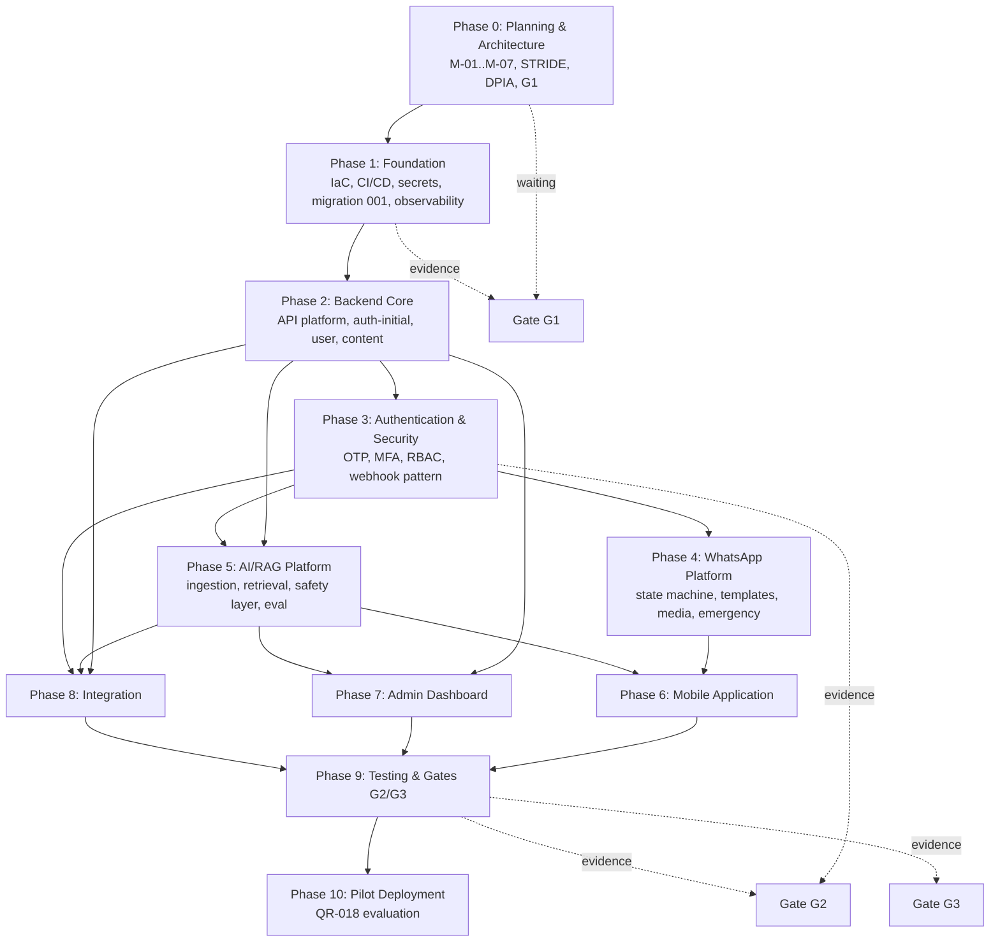

# 19. Engineering Handoff Package

**Document:** FathersNet (Ayay) — Engineering Handoff Package for Implementation Agents
**Source of truth:** `docs/FathersNet-Complete-SRS.md` (FN-SRS-001 v2.0) — the controlling requirements baseline. This package is the agent-facing entry point that names, in order, **what to read, what to build, in what sequence, to what conventions, and what artifact proves each step**.
**Inputs:** `00-requirement-inventory.md` (349-requirement baseline), `02-srs-requirement-analysis.md` (dependency map, decisions M-01…M-07, cross-cutting controls), `03-system-architecture-plan.md` (target topology), `04-technology-stack-analysis.md` (stack lockdown), `05-database-implementation-plan.md` (schema and migration order), `06-backend-development-plan.md` (backend build phases), `07-whatsapp-platform-implementation-plan.md`, `08-ai-rag-implementation-plan.md`, `09-mobile-application-development-plan.md`, `10-admin-dashboard-development-plan.md`, `11-security-and-privacy-plan.md`, `12-devops-and-infrastructure-plan.md`, `13-testing-and-quality-plan.md`, `14-development-phase-roadmap.md` (phase contract), `17-final-execution-roadmap.md` (ordering, gates, approvals, WPs), `18-implementation-verification-plan.md` (evidence model).
**Sibling documents:** `21-quality-gate-checklist.md` (gate checklists), `22-feature-implementation-matrix.md` (traceability), `implementation-status.md` (live tracker), `decision-log.md` (M-01…M-07 approvals).
**Purpose:** The single entry point a coding agent uses to begin work correctly: reading order, guardrails, conventions, per-domain build references, evidence requirements, and the first ten actions. It contains no application code; it is the instruction set for agents that will write application code.
**Classification convention:** **Confirmed** (SRS-stated) · **Recommended** (engineering decision) · **Configurable** (parameter with default) · **Assumption** (requires human validation). Every major item carries **Source / Confidence / Reasoning / Impact-if-changed** annotations.

---

## 1. Executive Purpose

This package exists because the program is **greenfield**: there is no application code today, and the SRS is the only source of truth. The first coding agent to touch the repository will do more than write features — it will set conventions that every later agent inherits. This document makes those conventions explicit so the first agent and every subsequent agent follow the same contract.

The package answers four questions for an agent at any point:

| Question | Answer location |
| --- | --- |
| **What do I read first?** | Section 3 — required reading order |
| **What must never be done?** | Section 4 — non-negotiable guardrails |
| **How is code structured and built?** | Sections 5–17 — conventions by domain |
| **What proves I am done?** | Sections 18–21 — evidence and Definition of Done |

**Source:** `17` §12 (handoff section); `14` §18 (verification); `18` §2 (evidence model). **Classification:** Confirmed (guardrails and evidence obligations are SRS/plan-stated); Recommended (package structure). **Confidence:** High. **Reasoning:** `17` §12 already specifies the reading order, guardrails, and first ten actions; this package expands those into full conventions and points every convention at its owning plan section so an agent never has to guess. **Impact-if-changed:** If the SRS or `14` changes, this package is updated in the same change set and its Section 27 verification re-run before the next phase.

---

## 2. How to Use This Package (Agent Workflow)

1. **Read in order (Section 3).** Do not write code until all Section 3 documents are read. This is mandatory, not advisory.
2. **Load the decision log.** Check `decision-log.md` (after WP-002 creates it) for the status of M-01…M-07. No provider-dependent code before the relevant decision is closed.
3. **Follow the phase contract.** Work package IDs (WP-XXX from `17`) and phase definitions (`14` §3–§13) tell you what to build now. Do not jump phases; gate discipline is absolute.
4. **Apply domain conventions (Sections 5–17).** The conventions sections point to the owning plan's exact section for every rule (monorepo layout, OpenAPI, idempotency, EN/AM localization, no-PII logs, etc.).
5. **Produce evidence (Section 18).** Every completed work package writes its named evidence artifact to the `implementation-status.md` registry path with requirement IDs, environment, and commit SHA.
6. **Update the tracker.** Close WPs in `implementation-status.md`; never close a WP without its evidence.
7. **Escalate, don't stall.** On a blocker (missing decision, provider policy, clinical/ethics gate), record it as an open risk in the register and escalate per `17` §9 rather than improvising around the guardrail.

**Source:** `17` §12.1/§12.3; `18` §2.1. **Classification:** Recommended workflow implementing Confirmed obligations. **Confidence:** High. **Reasoning:** The workflow is the operationalization of `17` §12; each step maps to an existing plan control so the agent is executing the plan, not inventing a process. **Impact-if-changed:** An agent that skips step 1 or 4 reproduces the exact failure modes (R-06 decisions, R-08 security retrofit, PM-01 boundary drift) the plan exists to prevent.

---

## 3. Required Reading Order (before any code)

| # | Document | Why an agent must read it |
| --- | --- | --- |
| 1 | `00-requirement-inventory.md` | The 349-requirement baseline; the traceability spine (QR-015). |
| 2 | `02-srs-requirement-analysis.md` | Dependency map (§3), blocking decisions M-01…M-07 (§6), cross-cutting controls (§5). |
| 3 | `03-system-architecture-plan.md` | Target topology (service boundaries, data flows, security zones) the code must reproduce. |
| 4 | `04-technology-stack-analysis.md` | Stack lockdown: required-by-SRS vs recommended vs configurable (§18). |
| 5 | `05-database-implementation-plan.md` | Canonical schema, migration order, invariants, retention. |
| 6 | `06-backend-development-plan.md` | Backend service build phases A–L and platform conventions. |
| 7 | `14-development-phase-roadmap.md` | Phase contract, acceptance criteria, gates G1/G2/G3, milestones M0–M9. |
| 8 | `17-final-execution-roadmap.md` | Ordering, work packages WP-001…WP-120, approvals A-01…A-22, cadence, escalation. |
| 9 | `18-implementation-verification-plan.md` | Evidence model: what artifact proves each completion, who signs. |
| 10 | Domain plans as your phase requires | `07` (WhatsApp), `08` (AI/RAG), `09` (mobile), `10` (admin), `11` (security), `12` (DevOps), `13` (testing). |

**Source:** `17` §12.2. **Classification:** Confirmed. **Confidence:** High. **Impact-if-changed:** Reading order protects the agent from building against assumptions the architecture already resolved; skipping `03`/`05` is the classic source of PM-01/PM-05.

---

## 4. Non-Negotiable Execution Guardrails

1. **No application code before Phase 0 artifacts are signed** — decision log (M-01…M-07), architecture review, stack sign-off, STRIDE, DPIA. Foundation tooling may begin only after WP-001…WP-005 are evidenced. (`17` §12.3)
2. **`decision-log.md` is created and closed (WP-002) before any provider-dependent build.** Record M-01…M-07 with approver + ADR reference.
3. **Cross-cutting controls are never retrofitted** (`02` §5): security/privacy, auditability, EN/AM localization from the first string, observability, idempotency, testing discipline — from Phase 1.
4. **No production data in lower environments** (AR-009); secrets only via the secret manager (NFR-022); no secrets in code, logs, or images (NFR-037).
5. **A phase is done only when its named evidence artifacts exist and pass** (`18` §2.1 rule: Produced → Passed → Signed). Update traceability at every milestone (QR-015).
6. **Gate discipline:** do not begin Phase 2 until Gate G1 accepted; do not begin Phase 4 until Gate G2 accepted; do not onboard the founding cohort until Gate G3 granted. (`14` §1)
7. **Provider abstraction is never bypassed** (FR-149): all third-party calls through adapters; provider-swap tests in staging (AR-004). Code-review rule, PM-08.
8. **Consent is immutable and append-only** (AR-012); never mutate or delete a consent row; withdrawal is a new event.
9. **Escalate, don't stall:** use `17` §9; every deviation carries a decision-log entry.

**Source:** `17` §12.3; `02` §5; SRS AR-009/AR-012, NFR-022/NFR-037, FR-149. **Classification:** Confirmed. **Confidence:** High — each guardrail traces to a named SRS/plan rule. **Reasoning:** These are the rules that, if violated, produce the highest-severity failures (PM-21, PM-26, PM-18, PM-62). **Impact-if-changed:** Any relaxation must be a decision-log entry approved at the affected gate; silent relaxation voids the QR-013 evidence chain.

---

## 5. Repository & Monorepo Conventions

- **Layout:** npm workspaces + Turborepo monorepo exactly as `06` §7 (package/services/infra/scripts/docs); each service independently deployable and versioned (FR-159).
- **Per-service template:** `src/{app,config,index}.ts`, `src/{routes,middleware,services,repositories,events}`, `test/{unit,integration,contract,security,privacy,eval}`, `openapi.yaml`, `Dockerfile` (`06` §7).
- **Contract-first:** every API change starts with the OpenAPI spec in `packages/api-spec`; code implements the spec, never the reverse (AR-003, QR-005).
- **Shared packages:** config, logger, errors, events, idempotency, i18n, audit, test-utils — reuse, do not duplicate (`06` §2).
- **IaC:** all infrastructure under `infra/terraform` as code (AR-011, OR-024); environments defined in code, plan-gated applies (`12` §6).
- **Docs live with code:** architecture, API, runbooks, data-dictionary, admin guides under `docs/` — co-located documentation obligation (OR-015).

**Source:** `06` §7; `12` §6; SRS OR-015, OR-024, AR-003/AR-011. **Classification:** Recommended (layout), Confirmed (obligations). **Confidence:** High. **Impact-if-changed:** Deviating from the monorepo layout breaks the shared-platform assumptions in `14` §16.1 effort estimates and the CI/CD model in `12`.

---

## 6. Stack Lockdown (Required-by-SRS vs Recommended vs Configurable)

Reference `04` §18 for the full matrix. The working baseline for agents:

| Layer | Baseline | Status |
| --- | --- | --- |
| Backend | Node.js + TypeScript | Required-by-SRS (FR-164, §17.2) |
| AI/data services | Python | Recommended (`04` §3.2) |
| Mobile | React Native | Recommended (M-04 pending) |
| Frontend/admin | React (web) | Recommended |
| Relational DB | PostgreSQL | Required-by-SRS (§16.1) |
| Vector DB | Qdrant | Required-by-SRS (§9.3) |
| Queue | Redis + BullMQ | Recommended (§16.1) |
| Object storage | Cloud-native (M-06 pending) | Configurable |
| LLM/embedding | Provider tiers per `04` §12, M-03 pending | Configurable |
| WhatsApp | Meta Cloud API primary (M-02 pending) | Configurable |
| Cloud | GCP reference (M-01 pending) | Configurable |
| CI/CD | GitHub Actions | Recommended |
| Observability | OTel + Grafana + Loki | Recommended (§16.1) |

**Rule:** "Required-by-SRS" rows are not negotiable. "Configurable" rows follow the decision log only (M-01…M-07); never substitute a configurable stack element before its decision is closed. **Source:** `04` §18. **Classification:** Confirmed/Recommended/Configurable as marked. **Confidence:** High. **Impact-if-changed:** An agent substituting a stack element before its M-decision closes recreates PM-49 (decisions late) and voids the architecture's DR/cost/residency analysis.

---

## 7. Environment & Secrets Baseline

- **Environments:** dev, staging, prod — strictly isolated (AR-009). No prod data in lower environments (QR-012). E2E never runs against prod.
- **Secrets:** managed secret manager only (NFR-022); injected at runtime; never in repo, env examples with real values, logs, or container images (NFR-037).
- **Rotation:** dual-active rotation for webhook secrets; emergency rotation path; secret scanning (TruffleHog) in CI (`11` §14.1.5, `12` §12).
- **Logging:** structured JSON; no PII in logs (`12` §13.3); log classes and retention per SRS §18.1.

**Source:** AR-009, NFR-022, NFR-037, QR-012, SRS §18.1. **Classification:** Confirmed. **Confidence:** High. **Impact-if-changed:** Any breach of these rules is a PM-15/PM-16 event and a QR-009/QR-013 failure at the release gate.

---

## 8. Database Baseline

- **Tooling:** `node-pg-migrate` (recommended, `05` §4.1); versioned, reversible, audited migrations (FR-164); `pg_advisory_lock` for single-migrator during deploy.
- **Migration order:** dependency-safe per `05` §4.2; migration 001 is the Phase 1 foundation scope (`17` WP-011).
- **Invariants:** check constraints match SRS §13.4 enums exactly; unique constraints per `05` §7.2; append-only consents (AR-012); immutable `audit_logs` (NFR-023); referential integrity enforced (AR-011).
- **Privacy at rest:** phone E.164 encrypted at rest (FR-123); pseudonymization at collection (FR-119, NFR-027); research tables separated (AR-013); row-level security as defense-in-depth (`05` §8.4).
- **Retention:** per-class retention config (FR-105, AR-014); automated purge jobs with audit; consent-exempt logic (`05` §9).
- **Indexes:** follow `05` §6; slow-query monitoring from Phase 1 (PM-05).

**Source:** `05` §1–§10; SRS §13, FR-105/119/123/164, AR-011/012/013/014, NFR-023/027. **Classification:** Confirmed (invariants), Recommended (tooling). **Confidence:** High. **Impact-if-changed:** Schema deviations break the migration-001 gate (WP-011) and the `05`/`13` test suites that assume these invariants.

---

## 9. Backend Platform Conventions

From `06` §2–§3 (cross-cutting) and §4 (build phases A–L):

- **Service topology:** gateway + auth, users, content, pregnancy, reminders, checklists, budget, journal, whatsapp, campaign, ai, research, admin, scheduler (`06` §2.1).
- **Event-driven:** canonical event catalog (`03` §4.6); async via Redis/BullMQ; idempotency keys on every consumer (FR-160, FR-161).
- **API conventions:** OpenAPI 3.x contract-first; error codes, pagination, versioning, rate limiting (120/30/10 per minute) per SRS §12.1; idempotency at the platform (`06` §3.6).
- **Observability plumbing:** tracing, metrics, logs wired in every service from day one (FR-166, `06` §3.7).
- **Build phases:** Phase A scaffolding → B auth → C users → D content → E pregnancy/reminders → F checklists/budget → G journal → H WhatsApp → I campaigns → J AI orchestration → K research → L admin (`06` §4). These map to plan Phases 1–7.
- **Cross-cutting:** authn/authz (FR-126), audit logging (FR-098/127, NFR-023), EN/AM localization from first string (FR-138), config/secrets (`06` §5).

**Source:** `06`; `03` §3/§5. **Classification:** Confirmed (SRS anchors), Recommended (phase lettering). **Confidence:** High. **Impact-if-changed:** Skipping a platform convention (e.g., idempotency) reintroduces PM-06 (message loss) and fails SRS §18.3 expectations.

---

## 10. Service Build Reference (Phase A–L map)

| Backend Phase (`06` §4) | Service | Builds In Plan Phase | Key Evidence at Completion |
| --- | --- | --- | --- |
| A | Scaffolding + gateway | 1 | OpenAPI specs, CI green, service skeleton |
| B | Auth (OTP/MFA/token) | 2–3 | Auth lifecycle tests, RBAC tests (`13` §8) |
| C | Users & profiles | 2 | UC-001 journey tests |
| D | Content & CMS | 2 | CMS review workflow, RAG publish hook |
| E | Pregnancy + reminders | 2 | Pregnancy engine tests, reminder E2E |
| F | Checklists & budget | 2 | Feature tests |
| G | Journal | 2 | Voice-note pipeline (with H) |
| H | WhatsApp/conversation | 4 | QR-010 conversational suite, webhook signature tests |
| I | Campaigns | 4 | Broadcast soak, throttling verification |
| J | AI orchestration | 5 | QR-011/014 eval gates, safety suite |
| K | Research & analytics | 8 | Research pipeline, pseudonymization tests |
| L | Admin | 7 | Role/MFA tests, audit coverage |

**Source:** `06` §4; `14` phases; `13` §14 evidence. **Classification:** Recommended mapping. **Confidence:** High. **Impact-if-changed:** Reordering services outside this map breaks the dependency chain (e.g., J needs D published content; K needs B auth and G journal).

---

## 11. Mobile Conventions (`09`)

- **Framework:** React Native (per M-04); **offline-first** — sync protocol with monotonic sequence numbers and server-authoritative revisions (`09` §8.5); local-first flush.
- **Data:** SQLCipher local encryption (AR-027); design tokens/shared design system (AR-029/034).
- **Journeys:** auth OTP, pregnancy journey, journal (text + voice), checklists, budget, notifications, emergency content (FR-135 offline danger-sign content).
- **Notifications:** FCM (D-03); push abstraction per `09` §12.
- **Quality:** device matrix incl. low/mid-range Android (US-009, NFR-030); accessibility WCAG 2.1 AA (QR-008); E2E offline journeys mandatory (`09` §17.4).

**Source:** `09`; SRS AR-025/027/029/034, FR-136, QR-008. **Classification:** Recommended (implementation), Confirmed (requirements). **Confidence:** High. **Impact-if-changed:** Dropping offline-first is a Must-Have violation (FR-136, US-009) and a PM-03 re-exposure.

---

## 12. Admin Dashboard Conventions (`10`)

- **Identity:** staff users + MFA (FR-101); token model per `10` §3; role gates backed by server-side RBAC (FR-126).
- **Modules:** user management, CMS, campaigns, analytics, AI ops (FR-067), research data governance (FR-116).
- **Audit:** every privileged action audit-logged (FR-098/127); segregation of duties (FR-106).
- **Accessibility:** WCAG 2.1 AA conformance plan and verification (`10` §12).

**Source:** `10`; SRS FR-098/101/106/116/126/127. **Classification:** Confirmed (requirements), Recommended (module split). **Confidence:** High. **Impact-if-changed:** Admin gaps directly drive PM-14 (insider misuse) and fail the Phase 7 role tests.

---

## 13. WhatsApp Conventions (`07`)

- **Abstraction:** provider adapter interface behind FR-149; Meta Cloud API primary, 360Dialog/Twilio drop-in alternates (M-02).
- **Webhook:** HMAC constant-time signature validation, idempotency, replay dedup (PM-12; `07` §4, `11` §11).
- **Conversation state machine:** per `07` §5; transition tests mandatory (QR-010).
- **Templates:** pre-approval workflow, opt-in records retained (FR-017), per-user messaging caps (NFR-044), emergency templates pre-approved (FR-108).
- **Emergency workflow:** danger-sign detection, no flag-disable, offline emergency content (`07` §8, `11` §15.3).

**Source:** `07`; SRS FR-011…030, FR-108, FR-149, NFR-044, QR-010. **Classification:** Confirmed (requirements), Recommended (pattern). **Confidence:** High. **Impact-if-changed:** Bypassing the abstraction or webhook validation is PM-55/PM-12 and a QR-010/QR-013 failure.

---

## 14. AI/RAG Conventions (`08`)

- **Grounding:** answers only from the approved, clinically reviewed knowledge base (FR-061, A-04); empty/unapproved KB = AI cannot launch (DB-01).
- **Pipeline:** ingestion → extraction → chunking → embedding → Qdrant → retrieval → rerank → safety layer → LLM (`08` §3–§10); parameters are SRS-stated where given (§9.2–§9.4).
- **Safety:** medical safety layer (AR-006); input classification and emergency detection (FR-062/063); output rules + disclaimer (FR-062, §14.10); no-diagnosis policy (C-01).
- **Governance:** model registry (FR-069, NFR-049), prompt versioning + approval (FR-068), audit trail (AR-020), bias/fairness review (`08` §12.4).
- **Eval gates:** ≥90% eval set EN/AM (NFR-047); safety regression suite (QR-011/014); every model/prompt change re-runs both (NFR-049) — PM-24/PM-25.
- **Pseudonymization:** no phone/direct identifiers in any provider payload; verified before first prod call (AR-019, FR-073) — DB-03.

**Source:** `08`; SRS §9, FR-059…075, AR-006/015/016/018/019/020, NFR-046…050. **Classification:** Confirmed (SRS parameters), Recommended (operational detail). **Confidence:** High. **Impact-if-changed:** Any shortcut in the safety layer is a PM-21/PM-26 Critical event; grounding violations void QR-011/QR-014.

---

## 15. Security Conventions (`11`)

- **Auth:** OTP lifecycle with rate limits (5/15 min), expiry, lockout, device fingerprint; admin MFA (FR-101); token model per `11` §3.
- **RBAC:** deny-by-default, ownership predicates, negative authorization tests in CI (PM-17).
- **Encryption:** TLS 1.2+/1.3 + HSTS everywhere; KMS-managed keys; phone E.164 at-rest encryption; dual-active rotation (`11` §6/§7).
- **AI security:** injection/jailbreak regression suite (§14.1.4); no tool access from user text (`11` §10).
- **Media:** type/size validation, malware scan on upload (AR-023), isolated bucket, no execution (`11` §12).
- **Incident response:** severity/escalation model per `11` §14 and OR-009/OR-010; Level-4 escalation path; runbooks.
- **Privacy:** DPIA (FR-132, NFR-041); data-processing register (OR-022); no-PII-in-logs; pseudonymization at collection; verifiable deletion (NFR-024).

**Source:** `11`; SRS §14, FR-123…132, NFR-016…029, AR-023. **Classification:** Confirmed. **Confidence:** High. **Impact-if-changed:** These conventions are the Gate G2 evidence; a gap is a PM-10…PM-19 row and a zero-critical/high-findings violation.

---

## 16. Testing & Evidence Conventions (`13`, `18`)

- **Test layers:** L1 CI (lint/unit/coverage/SAST/deps/secrets/contracts) → L2 phase exit → L3 component → L4 program gate (`18` §2.2).
- **Test pyramid:** unit, integration (4 groups per §17.3), E2E (critical + 5 journeys + mobile/dashboard per §17.4); coverage floors (QR-002).
- **Full-system sweeps in Phase 9:** performance (QR-006), security (QR-007), accessibility (QR-008), privacy (QR-009), WhatsApp (QR-010), AI evaluation (QR-011), test data hygiene (QR-012).
- **Test data:** synthetic only (QR-012); consent fixtures; no production PII in any test environment.
- **Evidence rule:** a completion claim needs Produced + Passed + Signed (`18` §2.1); artifacts registered with env + commit SHA + requirement IDs; E2E never against prod (AR-009).

**Source:** `13` §3–§15; `18` §2–§10; SRS §17. **Classification:** Confirmed. **Confidence:** High. **Impact-if-changed:** Relaxing evidence is exactly the QR-013 failure mode; artifacts with missing metadata are rejected per `18` §11 V-01.

---

## 17. CI/CD & Deployment (`12`)

- **Pipelines:** GitHub Actions `ci.yml` / `cd.yml` per SRS §16.2; security stage with TruffleHog, `npm audit`, `pip-audit`; pinned actions (supply-chain, PM-17 of `04`).
- **Deploy gates:** `secrets.DEPLOY_APPROVAL` environment gate; manual approval before production promotion; canary health-check promotion (§16.2).
- **IaC:** Terraform modules per environment (AR-009); plan-gated applies; drift detection (`12` §6).
- **Observability:** OTel + Grafana; dashboards mandated by SRS §18.3 (AI latency/token/cost, queue depth, error rates); severity/escalation per OR-008.
- **Backup/DR:** PITR + daily fulls; automated backup verification; quarterly restore drill; RPO ≤ 15 min / RTO ≤ 4 h (`12` §9–§10, §19).
- **Rollback:** scripts per SRS §16.2; release review includes rollback readiness (QR-016).

**Source:** `12`; SRS §16, §18, §19. **Classification:** Confirmed (SRS requirements), Recommended (tooling). **Confidence:** High. **Impact-if-changed:** A CI/CD shortcut (unpinned actions, no approval gate) is a PM-16/PM-49 event and a QR-016 failure.

---

## 18. Evidence Requirements (What Proves Done)

For every work package and phase, the agent records evidence in `implementation-status.md` per `18` §9 naming/location scheme:

| Evidence Type | Example Artifact | Reviewer |
| --- | --- | --- |
| Automated test report | CI run log + coverage report (unit/integration/E2E) | QA Lead |
| Scan report | SAST/DAST/dependency/secret scan output | Security |
| Contract test | OpenAPI contract test pass | Backend + QA |
| Security review | STRIDE/DPIA/pen-test signed findings | Security |
| Clinical review | OR-021 approval record | Healthcare & Content |
| Eval report | QR-011/QR-014 eval set + safety regression | AI + QA |
| Performance report | QR-006 load/soak measurements vs NFR-001…009 | QA + DevOps |
| Accessibility report | axe-core scan + manual audit (QR-008) | QA |
| Privacy test report | QR-009 privacy suite result | QA + Security |
| UAT sign-off | QR-017 sign-off record | Program |
| Pilot evaluation | QR-018 report vs Appendix F KPIs | Research + M&E |
| DR drill record | Restore/failover drill measurements (RPO/RTO) | DevOps |

**Source:** `18` §3/§7; `13` §14. **Classification:** Confirmed. **Confidence:** High. **Impact-if-changed:** Missing evidence types at a gate is a gate failure, not a documentation gap.

---

## 19. Definition of Done (per artifact and per WP)

**Per artifact:** Produced at the assigned path → Passed (green / zero critical-high / measured target / signed human review) → Signed by the named approver (`18` §2.1).

**Per work package:** all its evidence artifacts exist and pass; `implementation-status.md` shows the WP closed with artifact links; affected requirement IDs show a verification status in `22`; no open High/Critical PM risks for the WP's scope (`16` §7 indicators).

**Per phase:** all WPs closed; phase acceptance criteria from `14` §3–§13 met with evidence; cross-cutting controls (security/privacy/localization/observability/idempotency/auditability) present from the phase's first WP (`02` §5); gate package assembled if this phase ends a gate.

**Source:** `18` §2.1; `14` §3–§13; `16` §7. **Classification:** Confirmed. **Confidence:** High. **Impact-if-changed:** Weakening DoD (e.g., accepting "works on my machine") is the narrative-closure failure QR-013 forbids.

---

## 20. First 10 Actions for the First Implementation Agent

1. Read all Section 3 documents (reading order is mandatory).
2. Freeze the SRS baseline and stand up the traceability framework (WP-001): `00`, `22` stub, `implementation-status.md`.
3. Create `decision-log.md`; drive M-01…M-07 to closure with named approvers (WP-002).
4. Run architecture review + stack sign-off (WP-003, WP-004).
5. Produce STRIDE threat model + DPIA (WP-005).
6. Kick off procurement: WhatsApp Business Manager, LLM/embedding, ASR, cloud, object storage (WP-006).
7. Stand up research ethics groundwork (WP-007).
8. Assemble Gate G1 package; begin Phase 1 Foundation (WP-008…WP-014).
9. Prove the foundation chain in order: CI/CD → IaC → secrets → migration 001 → observability; capture Gate 1 evidence.
10. Hold the phase-exit review and request Gate G1 acceptance before any Phase 2 work.

**Source:** `17` §12.4 (verbatim sequence), mapped to WP IDs. **Classification:** Confirmed. **Confidence:** High. **Impact-if-changed:** An agent that starts coding before actions 2–7 completes re-creates R-06/R-08 (decision delay, security retrofit).

---

## 21. Handoff Exit Criteria

This package is considered successfully consumed when the agent can answer all four of these questions from the repository alone (no plan docs open):

1. **What are we building, to what requirements?** (traceability: every code artifact links to a requirement ID)
2. **What is the correct order?** (WP list in `implementation-status.md` matches `17`; no phase started before its gate)
3. **How is done proven?** (every closed WP has its evidence artifact, registered and signed per `18`)
4. **What must never be done?** (Section 4 guardrails visible in CI config and repo policy)
5. **Who owns it and what does done mean?** (Section 24 names the owner, Section 25 the acceptance criteria for every feature an agent touches)

**Source:** This document's purpose; `18` §2.1; QR-015. **Classification:** Recommended. **Confidence:** Medium-High. **Reasoning:** If the repository cannot answer these four questions unaided, the handoff is incomplete regardless of build progress. **Impact-if-changed:** Accepting a handoff that fails these criteria passes on the failure modes the package exists to prevent.

---

## 22. Implementation Principles

The consolidated "how to write the code" rules. Every principle cites its owning plan so the implementer never codes on assumption. These are binding within this package unless changed through `decision-log.md` (OR-005).

### 22.1 Coding Standards

- Backend in TypeScript (Node) per `06` §2; AI services in Python per `08` §2; mobile in React Native per `09` §2; admin in React per `10` §2.
- Lint + format floors enforced in CI from Phase 1 (NFR-036/037; `12` §6.4); pre-commit hooks per `12` §6.3.
- OpenAPI contract-first at every service boundary (AR-002/003; `06` §3.4); no endpoint without a contract artifact.
- Requirement-ID references in PR descriptions so every change is traceable (QR-015); code stays self-documenting.

### 22.2 Architecture Rules

- Services reproduce `03` §3 topology exactly; do not invent new boundaries or merge existing ones (AR-001, PM-01).
- Every third-party call goes through an adapter (AR-004, FR-149); no direct provider SDK calls in business logic (PM-08).
- Cross-service flows use the event bus (AR-005; `03` §5); async patterns where NFR-005 broadcast volume requires.
- Dependency direction strictly per `03` §7; cyclic service dependencies are a merge conflict, not a refactor.

### 22.3 Security Rules

- OWASP ASVS + defense-in-depth baseline (`11` §3; NFR-016…024); deny-by-default authorization on every endpoint (AR-018, PM-17).
- Secrets only via managed secret manager (NFR-022); never in code, logs, or images (NFR-037).
- Input validation + rate limits at every public edge — webhook HMAC (§14.1.5), OTP (§14.1.3), media (AR-023).
- No PII in logs (NFR-022/023); pseudonymize at collection (§9.5).

### 22.4 Database Rules

- Schema changes only through the migration sequence (`05` §4.1, node-pg-migrate); no ad-hoc DDL.
- Canonical model and invariants from `05` §2; consent events are immutable (AR-012); research data separated (AR-011).
- Ownership predicates on every query (AR-018, PM-17); retention + verifiable deletion jobs per `05` §9.

### 22.5 API Design Rules

- Versioned REST + OpenAPI (NFR-040, AR-003); consistent error envelope (`06` §3.5).
- Idempotency keys on all state-changing endpoints (NFR-005/006; `06` §3.6); replay dedup on webhooks (§14.1.5).
- Pagination/filtering standards (`06` §3.7); no unbounded queries.

### 22.6 Testing Expectations

- Tests are written with the feature, never retrofitted (QR-002 floors; `13` §4); coverage gates in CI from Phase 1.
- Unit → integration → contract → E2E ladder per `13` §3–§6; CI gate definitions per `12` §6.4.
- Safety-critical suites (emergency false-negative, webhook signature, AI eval, privacy) are release-blocking (QR-014; G2/G3).
- Evidence registered in `18` format with environment + commit SHA (QR-015, PM-39).

**Source:** `03`, `05`, `06`, `08`, `11`, `12`, `13` as cited; QR-015; NFR-016…040. **Classification:** Recommended (grouping) over Confirmed (named SRS obligations). **Confidence:** High. **Impact-if-changed:** Relaxing any rule is a decision-log entry with re-rated PM rows (PM-01/08/15/17/39); silent relaxation voids QR-013 evidence.

---

## 23. Development Order Dependency Graph

The phase-order dependencies that gate every build decision. Phase content is `14` §3–§13; work packages WP-001…WP-120 are `17`; gates G1/G2/G3 are `14` §1. This graph is the answer to "what must exist before I build X".

| Dependent work | Requires (must exist first) | Blocked-by gate | Evidence due |
| --- | --- | --- | --- |
| Migration 001 (schema baseline) | Phase 0 decision log (M-01…M-07), STRIDE, DPIA | G1 | G1 package |
| Backend services (A–L) | `03` topology + OpenAPI contracts; migration 00x | G1 | contract tests, QR-003/005 |
| Webhook pattern (Phase 3) | Auth + secret manager; provider abstraction (`07` §3) | — | webhook signature tests |
| WhatsApp flows (Phase 4) | Backend core + auth; WhatsApp Business API account (M-02) | G2 | QR-010 suite |
| AI/RAG pipeline (Phase 5) | Content pipeline (Phase 2) + knowledge schema (`05` §7); eval set | G2 | QR-011/QR-014 eval ≥ 90% |
| Mobile app (Phase 6) | Auth API, AI answers, offline sync contract (`09` §8.5) | — | offline E2E, AR-025 |
| Admin dashboard (Phase 7) | Backend core + RBAC (Phase 3) + AI ops API | — | role tests, QR-008 |
| Research pipeline (Phase 8) | Consent model (FR-117) + ethics approval (M/D-05) + pseudonymization | — | UC-005, QR-009 |
| Release (Phase 9→10) | All High/Critical PM rows closed or controlled; G2/G3 bundles | G2, G3 | `21` checklists, QR-013 |

**Source:** `14` §3–§13, `17` §5/§10, `05` §4.1, `07` §3, `08` §16, `09` §8.5. **Classification:** Confirmed (phase contract from `14`); Recommended (graph rendering). **Confidence:** High. **Impact-if-changed:** Re-sequencing a phase in `14` re-derives this graph; an implementer who builds a dependent phase before its prerequisite voids the gate evidence chain (QR-013).

---

## 24. Component Ownership Map

Who owns what at build time. Roles are Appendix E names (`15` §2.2); "Boundary" distinguishes owns (design + acceptance) from contributes.

| Component / Area | Owning Role | Primary Plan | Boundary |
| --- | --- | --- | --- |
| Service boundaries + OpenAPI contracts | Backend Lead | `03` §3/§7, `06` §2/§3 | Owns contracts; reviews all service code |
| API platform (auth, user, content, journal, reminders) | Backend engineers | `06` §4 | Owns implementation per contract |
| WhatsApp channel + state machine | Messaging engineer | `07` §4–§10 | Owns flow logic; provider via abstraction |
| AI/RAG pipeline + evaluation | AI/ML engineer | `08` §3–§16 | Owns grounding, safety layer, eval |
| Vector DB + knowledge lifecycle | AI/ML + DB architect | `08` §3, `05` §7 | Joint ownership of knowledge schema |
| Mobile applications | Mobile engineer | `09` | Owns app code, offline/sync |
| Admin dashboard | Frontend engineer | `10` | Owns admin UI, role modules |
| Database schema + migrations | Database architect | `05` | Owns migrations, invariants, retention |
| Security controls + incident response | Security engineer | `11` | Owns security baseline; reviews every public edge |
| IaC, CI/CD, observability | DevOps engineer | `12` | Owns pipelines, environments, dashboards |
| Testing + evidence | QA lead | `13`, `18` | Owns test strategy, evidence registry |
| Clinical safety gate | Clinical advisor | `08` §12, `23`, OR-021 | Owns medical review + QR-019 sign-off |
| Research + ethics | Research & Community | `08` §12, OR-017 | Owns ethics approval, research separation |
| Program control + gates | Program Manager | `17`, `21` | Owns gate evidence, escalation (L1–L4) |

**Source:** `15` §2.2 (role map), `17` §3 (WP ownership), `18` §4 (sign-off model). **Classification:** Confirmed (role names), Recommended (ownership assignments). **Confidence:** High. **Impact-if-changed:** Unassigned ownership re-creates PM-46/PM-47 (enabler-role gaps, on-call gaps); the acceptance role in Section 25 must match this map.

---

## 25. Feature Acceptance Matrix

The per-feature contract the implementer codes against. Priority is from `02`/`14`; full per-requirement verification lives in `22-feature-implementation-matrix.md`; evidence model is `18`.

| Feature | SRS Requirement IDs | Priority | Acceptance Criteria | Evidence | Accepting Role |
| --- | --- | --- | --- | --- | --- |
| Onboarding, registration, consent | FR-001…010 | P0 | QR-009 privacy suite + UC-001 E2E pass; consent lifecycle incl. withdrawal | E2E + privacy suite reports | Product + Privacy |
| WhatsApp flows & state machine | FR-011…030 | P0 | QR-010 conversational suite; webhook signature tests; template approval | QR-010 suite | Integration lead |
| Pregnancy journey & personalization | FR-031…040 | P0 | Pregnancy engine tests; UC-002 E2E | Feature + E2E reports | Product |
| Reminders & notifications | FR-041…050 | P1 | Reminder E2E; NFR-005 broadcast/soak tests | Soak + E2E reports | Product |
| Father diary & voice notes | FR-051…058 | P1 | Voice pipeline tests; QR-009 privacy | Voice + privacy suite | Product |
| AI assistant, RAG, AI ops | FR-059…075 | P0 | QR-011/QR-014 eval ≥ 90%; safety regression; no-diagnosis bound | Eval + safety reports | AI + Clinical |
| Educational content & CMS | FR-076…085 | P1 | CMS review workflow tests; QR-019 clinical sign-off; EN/AM parity | CMS + review reports | Content + Clinical |
| Birth preparation, checklists, budget | FR-086…093 | P1 | Feature tests; UC-004 E2E | Feature + E2E reports | Product |
| Admin portal & user management | FR-094…106 | P0 | Role/MFA tests; audit coverage; QR-008 | Role + audit reports | Security + Product |
| Campaigns & broadcast | FR-107…112 | P1 | Broadcast soak; throttling tests (QR-006) | QR-006 report | Product |
| Analytics, research & evidence | FR-113…122 | P0 | Research pipeline tests; UC-005; QR-009 pseudonymization | Research + privacy reports | Research + Privacy |
| Privacy, security & data protection | FR-123…132 | P0 | QR-007/QR-009 suites; STRIDE re-validation | QR-007/009 reports | Security |
| Accessibility, offline, localization | FR-133…142 | P1 | QR-008; offline E2E; EN/AM tests | QR-008 + E2E reports | QA + Product |
| Community & partner features | FR-143…148 | Deferred | Phase 10 backlog only (`14` §17 R-07) | n/a | Program |
| Integration & external services | FR-149…155 | P0 | Provider-swap tests (AR-004); contract tests | Contract + swap reports | Integration lead |
| Financial / payment readiness | FR-156…158 | Design-only | Design review; schema notes only | Design review record | Program |
| Backend, data, automation, observability | FR-159…170 | P0 | QR-003/QR-005; observability verification | CI + observability reports | Backend lead + DevOps |

**Source:** `00`, `02`, `22` §3; QR-001…019; `18` §2. **Classification:** Confirmed (requirement grouping), Recommended (criteria wording). **Confidence:** Medium-High — criteria are drawn from the QR suites and `13` §6 journeys. **Impact-if-changed:** Acceptance is granted only on evidence, per QR-013; a feature without an accepting role (Section 24) is not shippable.

---

## 26. AI Coding Agent Instructions

Operating rules for the coding agent (human or LLM-assisted) executing from this package. These bind alongside Section 4 guardrails.

1. **Traceability first** — every artifact, PR, and test links to a requirement ID (QR-015). If a requirement ID is missing, stop and ask rather than invent one.
2. **Read before writing** — follow the Section 3 reading order; never code against an unread plan document.
3. **Contract-first** — confirm the OpenAPI contract and the migration 00x number before implementation (AR-002; `05` §4.1); do not emit ad-hoc DDL or new endpoints off-contract.
4. **No shortcuts** — no inline secrets, no direct third-party SDK calls outside adapters, no unbounded queries (Sections 22.2–22.5).
5. **Tests with code** — unit/integration/contract tests land in the same change as the feature (QR-002); no "test later" work items.
6. **Evidence capture** — for each closed work package, produce the `18` evidence artifact (what, environment, commit SHA, command) and update `implementation-status.md`.
7. **Guardrails are absolute** — Section 4 rules; deviation requires a `decision-log.md` entry with approver, never silent relaxation.
8. **Commit discipline** — small single-purpose commits; no secrets in history; lint/test pass before PR (CI gates per `12` §6.4); never force-push shared branches.
9. **Uncertainty rule** — prefer asking (decision log) over guessing; never invent requirement IDs, phase numbers, or SRS section numbers.
10. **Safety suites are sacred** — emergency false-negative, webhook signature, AI eval, and privacy suites are release-blocking; a failing suite blocks the PR regardless of other green tests.
11. **Scope discipline** — build only what the acceptance matrix (Section 25) and `22` define; pulling Could-Have features (FR-075/090/093/110/121) into an active phase is scope creep (PM-50).

**Source:** This package's Sections 4/22–25; `12` §6; `18` §2; QR-013/015. **Classification:** Recommended (procedure) over Confirmed obligations. **Confidence:** High. **Impact-if-changed:** These instructions define the agent's contract of work; relaxing them recreates PM-18 (security retrofit) and PM-38 (traceability drift).

---

## 27. Verification Approach

This package is itself verified:

1. **Section coverage scan** — every Section 3 item and every convention section resolves to a named plan section and requirement IDs; no orphaned instruction.
2. **Cross-plan consistency** — Sections 4–19 match their owning plans (`06`–`13`, `17`, `18`) exactly; re-checked at the Phase 0 QA sync and whenever any owning plan is amended.
3. **No placeholders** — scan for "TBD", "TODO", "to be defined", empty cells at authoring.
4. **Classification labels present** — every major item carries Source / Confidence / Reasoning / Impact-if-changed.
5. **Executable** — the First 10 Actions (Section 20) map one-to-one to WP-001…WP-014 in `17`; the reading order (Section 3) exists and is complete.

**Source:** QR-015; `14` §18; `18` §12 pattern. **Classification:** Confirmed (obligations), Recommended (method). **Confidence:** High. **Reasoning:** A handoff package that cannot be verified is itself a risk; the five checks keep it aligned with the plan set it coordinates. **Impact-if-changed:** If the SRS or any owning plan changes, re-run checks 1–2 before the next gate.

---

**END OF DOCUMENT — 19. Engineering Handoff Package.** Entry point for implementation agents: reading order (`17` §12.2), guardrails (`17` §12.3), domain conventions (`06`–`13`), implementation principles (§22), development-order dependency graph (§23), component ownership map (§24), feature acceptance matrix (§25), AI coding-agent instructions (§26), evidence model (`18`), and first ten actions (WP-001…WP-014). Companion to `21-quality-gate-checklist.md` and `22-feature-implementation-matrix.md`.
